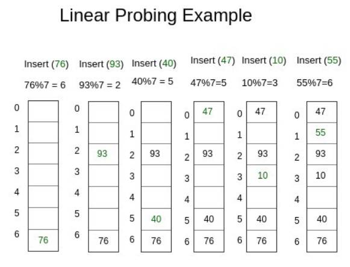

##### 출처

```
https://k39335.tistory.com/18

https://velog.io/@cyranocoding/Hash-Hashing-Hash-Table%ED%95%B4%EC%8B%9C-%ED%95%B4%EC%8B%B1-%ED%95%B4%EC%8B%9C%ED%85%8C%EC%9D%B4%EB%B8%94-%EC%9E%90%EB%A3%8C%EA%B5%AC%EC%A1%B0%EC%9D%98-%EC%9D%B4%ED%95%B4-6ijyonph6o
```


### 해시 테이블 (Hash Table)

------

##### 해시 테이블과 연관 배열 구조

> 해시 테이블은 **연관 배열 구조**를 이용하여 키에 결과 값을 저장하는 자료구조이다. 여기서 연관 배열 구조(Associative Array)란 키와 값이 **1:1**로 연관되어 있는 자료구조를 말한다. 따라서 키를 이용하여 값을 도출하는 것이 가능하다.
>
> 연관 배열 구조는 다음의 명령을 지원한다.

* 키와 값이 주어졌을 때, 연관 배열에 키와 값을 저장하는 명령
* 키가 주어졌을 때, 연관되는 값을 얻는 명령
* 키와 새로운 값이 주어졌을 때, 원래 키에 연관된 값을 새로운 값으로 교체하는 명령
* 키가 주어졌을 때, 그 키에 연관된 값을 제거하는 명령

> 연관 배열 구조에 속하는 해시 테이블 역시 위의 명령을 지원한다.


##### 특징

> Hash는 내부적으로 배열을 사용하여 데이터를 저장하므로 빠른 검색속도를 갖는다. 특정한 값을 Search하는데 데이터 고유의 키로 접근하게 되므로 average case에 대하여 Time Complexity가 O(1)이 된다.
>
> 항상 O(1)이 아니고 average case에 대해 O(1)인 이유는 해쉬 충돌 때문이다. 문제는 인덱스로 저장되는 키 값이 불규칙하기 때문이다. 그래서 **특별한 알고리즘**을 이용하여 저장할 **데이터와 연관된 고유한 숫자**를 만들어 낸 뒤 이를 인덱스로 사용한다. 특정 데이터가 저장되는 인덱스는 그 데이터만의 고유한 위치이므로, 삽입 연산 시 다른 데이터의 사이에 끼어들거나 삭제 시 다른 데이터로 채울 필요가 없어 연산에서 추가적인 비용이 없도록 만들어진 구조이다.
>
> 이러한 특징으로 인해 해시 테이블에 저장된 데이터는 키를 통해 빠르게 조회할 수 있다. 따라서 해시 테이블은 주소록에 사용된다. 주소록에서는 데이터를 저장할 때 이름 - 전화번호의 매칭을 이용하여 데이터를 처리한다.


#### 구성 요소

------

> 해시 테이블을 구성하는 요소로는 키(Key), 해시 함수(Hash Function), 해시(Hash), 값(Value), 저장소(Bucket, Slot)으로 이루어져 있다. 각 구성 요소에 대한 설명은 다음과 같다.


##### 구성 요소

> ##### 키 (Key)
>
> 고유한 값이며, 해시 함수의 input이 된다. 다양한 길이의 값이 될 수 있다. 이 상태로 최종 저장소에 저장이 되면 다양한 길이 만큼의 저장소를 구성해 두어야 하기 때문에 해시 함수로 값을 바꾸어 저장이 되어야 공간의 효율성을 추구할 수 있다.

> ##### 해시 함수 (Hash Function)
>
> 키를 해시로 바꾸어주는 역할을 한다. 다양한 길이를 가지고 있는 키를 일정한 길이를 가지는 해시로 변경하여 저장소를 효율적으로 운영할 수 있도록 도와준다. 다만, 서로 다른 키가 같은 해시가 되는 경우를 해시 충돌이라고 하는데, 해시 충돌을 일으키는 확률을 최대한 줄이는 함수를 만드는 것이 중요하다.

> ##### 해시 (Hash)
>
> 해시 함수의 결과물이며, 저장소에서 값과 매칭되어 저장된다.

> ##### 값 (Value)
>
> 저장소에 최종적으로 저장되는 값으로 키와 매칭되어 저장, 탐색, 삭제 등의 연산에 대해 접근이 가능해야 한다.


##### 해시 함수 (Hash Function)

> 해시 테이블, 혹은 해시의 핵심은 위에서 언급하였던 **특별한 알고리즘**을 통해 데이터와 연관된 고유한 숫자를 만들어 내는 것이다. 이 특별한 기능을 담당하는 알고리즘을 **해시 함수**라 한다. 해시 함수는 해시 테이블의 핵심 요소로, 키를 input으로 받아 데이터와 연관된 고유한 숫자 값을 반환하는 역할을 한다. 그리고 이 때 반환되는 숫자 값을 **해시코드(HashCode)**라 한다.
>
> 이 해시코드는 입력에 사용되는 키 값보다 **작은 범위의 값**이다. 이러한 특징은 해시 테이블의 공간 효율성과 관련이 있다.

> ##### 좋은 해시 함수란?
>
> 일반적으로 좋은 해시 함수는 키의 일부분을 참조하여 해시 값을 만들지 않고 키 전체를 참조하여 해시 값을 만들어낸다. 그런데 좋은 해시 함수는 키의 어떤 특성을 가지고 있느냐에 따라 달라진다.
>
> 해시 함수를 무조건 1:1로 만드는 것 보다 충돌을 최소화하는 방향으로 설계하고 발생하는 충돌에 대비해 어떻게 대응할 것인가가 더 중요하다. 1:1 대응이 되도록 만드는 것이 거의 불가능하기도 하지만 그런 해시 함수는 array와 다를 바가 없으며 메모리를 너무 많이 차지한다는 문제점이 있다.
>
> 충돌이 많아질 수록 탐색에 필요한 시간 복잡도가 O(1)에서 O(n) 에 가까워진다. 어설픈 해시 함수는 해시를 해시 답게 사용하지 못하도록 한다. 좋은 해시 함수를 선택하는 것은 해시 테이블의 성능 향상에 필수적인 것이다.
>
> 따라서 해싱된 인덱스에 이미 다른 값이 들어 있다면 새 데이터를 저장할 다른 위치를 찾은 뒤에야 저장할 수 있는 것이다. 따라서 충돌 해결은 해시를 구현함에 있어 필수이다.


#### 연산과 시간 복잡도

------

> 설명을 위한 참고 이미지는 다음과 같다. 다음 이미지는 개방주소법의 선형 탐색과 관련된 예시 이미지이다.




##### 저장 (Insertion)

> 해시 테이블에서 자료를 저장하기 위해서는 해시 함수를 활용하여 키 값을 해시로 변경해야 한다. 위의 이미지에서 해시 함수가 키를 7로 나눈 나머지를 변경하여 출력하는 경우, 키는 76, 93 등과 같은 값이고 해시는 6, 2 등과 같은 값이다. 이렇게 해시를 구한 다음, 미리 준비해놓은 0 ~ 6의 저장소 중 해시 값에 맞는 저장소를 찾아 값을 저장한다. 
>
> 그런데 해시 함수로 해시를 산출하는 과정에서 서로 다른 키 값이 같은 해시를 산출하여 동일한 저장소에 복수 개의 값이 할당되는 문제가 발생할 수 있는데, 이는 키와 값이 1:1로 매칭이 되어야 한다는 규칙을 위배하게 된다. 이를 해시 충돌이라 하고, 이 해시 충돌의 해결에 관련된 내용은 후술될 것이다.

> ##### 시간 복잡도
>
> 저장 연산의 시간 복잡도는 **O(1)**이다. 키는 고유하며 해시 함수의 결과로 나온 해시와 값을 저장소에 저장하면 되기 때문이다. 물론 이 경우, 해시 함수 자체의 시간 복잡도는 고려하지 않는다.
>
> 그러나 **최악의 경우 O(n)**이 될 수 있다. 최악의 경우란, 해시 충돌로 인해 모든 저장소의 값들을 찾아 봐야하는 경우이다.


##### 검색 (Search)

> 저장되어 있는 값을 검색할 때에는 해시 함수와 키를 활용하여 해시를 구하고, 해시와 매칭되는 값을 찾는다.

> ##### 시간 복잡도
>
> 검색 단계의 시간 복잡도는 **O(1)**이다. 키는 고유하며 해시 함수의 결과로 나온 해시에 매칭되는 값을 찾으면 되기 때문이다.
>
> 그러나 **최악의 경우 O(n)**이 될 수 있다. 최악의 경우란, 해시 충돌로 인해 모든 저장소들의 값을 찾아봐야 하는 경우이다.


##### 삭제 (Deletion)

> 저장되어 있는 값을 삭제할 때에는 저장소에서 해당 키와 매칭되는 값을 찾아서 삭제하면 된다. 저장소에는 해시와 값이 함께 저장되어 있으므로 함께 삭제한다.

> ##### 시간 복잡도
>
> 삭제 단계의 시간 복잡도는 **O(1)**이다. 키는 고유하며 해시 함수의 결과로 나온 해시에 매칭되는 값을 삭제하면 되기 때문이다. 물론 이 경우, 해시 함수 자체의 시간 복잡도는 고려하지 않는다.
>
> 그러나 **최악의 경우 O(n)**이 될 수 있다. 최악의 경우란, 해시 충돌로 인해 모든 저장소의 값들을 찾아봐야 하는 경우이다.


#### 해시 테이블의 단점

------

* ##### 충돌로 인한 성능 저하

> 해시 테이블은 일반적으로 뛰어난 성능을 보이지만, 성능을 저하시키는 요소로 충돌이 있다. 문제는 해시의 특징으로 인하여 해시 테이블에서 충돌은 필연적으로 발생하게 된다. 충돌을 어떻게  회피할 것인지, 또는 충돌을 어떻게 해결할 것인지에 따라 해시 테이블의 성능이 결정된다.

* ##### 순서가 있는 데이터에는 어울리지 않는다

> 상하 관계가 있거나, 순서가 중요한 데이터를 저장하는 경우에 대해 해시 테이블은 어울리지 않는다. 이는 데이터의 순서와 상관없이 해시 함수와 키를 통해 도출해낸 해시를 찾아 저장하기 때문이다.

* ##### 공간 효율성이 떨어진다

> 해시 테이블은 데이터가 저장되기 전에 미리 저장 공간을 확보해 놓아야 한다. 확보해야 할 공간이 부족하거나, 확보한 공간에 데이터가 채워지지 않음으로써 메모리 효율성이 저하될 수 있다.

* ##### 해시 함수 의존도가 높다

> 해시 테이블의 데이터 처리 연산에 대한 평균적인 시간 복잡도는 O(1)이다. 그러나 이러한 계산에서는 해시 함수의 시간 복잡도를 고려하지 않았다. 만약 해시 함수가 복잡하다면 해시 테이블의 모든 연산에 대해 시간 복잡도가 증가할 것이다.

