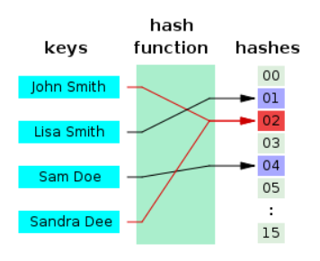
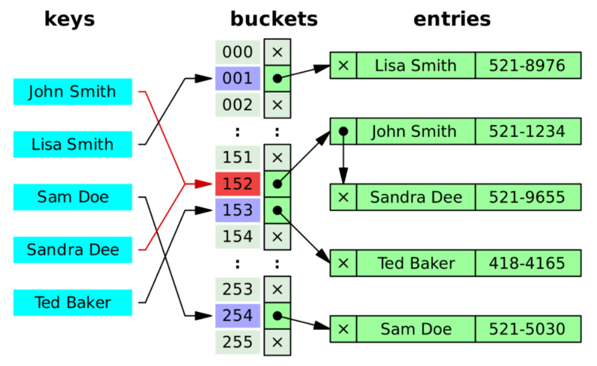
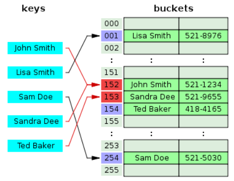

##### 출처

```
https://k39335.tistory.com/18

https://velog.io/@cyranocoding/Hash-Hashing-Hash-Table%ED%95%B4%EC%8B%9C-%ED%95%B4%EC%8B%B1-%ED%95%B4%EC%8B%9C%ED%85%8C%EC%9D%B4%EB%B8%94-%EC%9E%90%EB%A3%8C%EA%B5%AC%EC%A1%B0%EC%9D%98-%EC%9D%B4%ED%95%B4-6ijyonph6o
```


### 충돌 (Collision)

------

##### 해시 테이블과 충돌

> 해시 테이블은 삽입, 삭제, 검색 등의 연산에서 모두 평균적으로 O(1)의 시간 복잡도를 갖기 때문에 자료구조의 효율성 측면에서 매우 우수한 자료구조이다. 그러나 해시 테이블의 기반이 되는 해시를 이용한 자료구조 방식에서 필연적으로 나타나는 문제가 있다.
>
> 그 문제란 해시 함수를 통해서 해시 값들을 결정할 때 서로 다른 둘 이상의 키에 대해서 동일한 해시 값이 도출될 수가 있다는 점이다. 이렇게 되면 동일한 저장소에 복수 개의 데이터가 할당되게 되는데, 이를 **충돌**이라 한다.
>
> 충돌에 대한 참고 이미지는 다음과 같다.



> 위의 이미지에서 John과 Sandra의 해시가 같은 값으로 도출된다. 이러한 경우가 충돌에 해당한다.
>
> 충돌이 발생하면, 서로 다른 두 개의 키가 같은 인덱스로 해싱되므로 충돌을 최소화하도록 해시 함수를 설계해야 한다. 그러나 최소화한다고 표현한 이유는, 충돌이 일반적인 해시 테이블에서 필연적으로 마주하는 문제이기 때문이다.
>
> 일반적인 해시 테이블은 해시 함수를 통해 **무한한 범위를 갖는 값(키)**를 **유한한 값(해시)**으로 변환하여 표현하는 과정을 거친다. 따라서 비둘기집의 원리에 의해 서로 다른 둘 이상의 키가 동일한 해시 값을 갖는 것은 필연적이다.
>
> 따라서 충돌을 해결하는 방법은 해시 테이블을 사용할 때 반드시 구현해야 하는 부분이다. 대표적인 충돌 해결법에는 체이닝과 개방주소법이 있다. 


#### 체이닝 (Separate Chaining)

------

> 체이닝에 대한 참고 이미지는 다음과 같다.



> 위 이미지에서 John과 Sandra가 서로 충돌하자, Sandra를 John의 값에 연결시킨 것을 확인할 수 있다. 이처럼 체이닝은 충돌이 발생하면, 해당 값을 기존에 저장된 값에 연결시키는 기법이다. 이 때 어떤 자료구조를 활용하여 체이닝을 구현하느냐에 따라 다음의 두 가지 방법으로 나뉜다.


##### 체이닝의 구현에 따른 분류

> ##### 연결 리스트를 사용하는 방식
>
> 각각의 저장소들을 하나의 연결 리스트로 연결하여 충돌 발생시 연결 리스트에 추가하는 방식이다. 연결 리스트의 특징을 그대로 이어받아 삭제 또는 삽입이 간단하다. 하지만 단점도 그대로 물려받아 작은 데이터들을 저장 할 때 연결 리스트 자체의 오버헤드가 부담이 된다. 

> ##### 트리를 사용하는 방식 (Red-Black Tree)
>
> 연결 리스트 대신 트리를 사용하는 방식이다. 연결 리스트를 사용할 지, 트리를 사용할 지에 대한 기준은 충돌이 일어난 저장소에 할당된 키-값 쌍의 개수이다. 만약 개수가 적다면, 최악의 경우를 가정하여도 연결 리스트와 트리의 성능 차이가 크지 않아 연결 리스트를 사용하는 것이 효율적이다. 트리는 기본적으로 메모리 사용량이 많기 때문이다. 그러나 데이터가 충분히 많다면 트리를 사용하는 것이 성능 측면에서 효율적이다.


##### 체이닝의 장단점

> ##### 장점

* 한정된 저장소를 효율적으로 사용할 수 있다.
* 해시 함수 선택의 중요성이 개방주소법에 비해 상대적으로 적다.
* 미리 공간을 잡을 필요가 없어 상대적으로 적은 메모리를 사용한다.
* 개방 주소법과 비교하여 해시 테이블의 확장을 보다 늦출 수 있다.

> ##### 단점

* 하나의 저장소에 자료들이 계속 연결되면 성능이 저하된다. 이를 쏠림현상이라고 한다.
* 추가로 별도의 저장 공간 및 이 공간에 대한 작업을 필요로 한다.


##### 연산 및 시간 복잡도

> 복잡도에 대해 설명하기 전에, 설명에 필요한 한 가지 변수에 대해 정의하고 넘어가자. 해시 테이블의 저장소(Bucket)의 길이를 n, 키의 수를 m이라고 가정한다면, 평균적으로 저장소 하나 당 (m/n)개의 키가 할당될 것이다. 이를 a라고 정의한다.

```
a = m/n (하나의 해시 당 평균적으로 a개의 키와 매칭이 된다.)
```


> ##### 삽입 (Insertion)
>
> 충돌이 일어난 경우, 연결 리스트의 **헤드(Head)에 자료를 저장**할 경우 **O(1)**의 사간 복잡도를 갖는다. 이는 해시를 산출하고 저장하면서 기존 값과 연결하는 행위만 하면 되기 때문이다.
>
> 반면 **테일(Tail)에 자료를 저장**할 경우 **O(a)**의 시간 복잡도를 갖는다. 해시를 저장할 때 연결 리스트의 모든 노드를 지나서 테일에 접근해야 하기 때문이다. 
>
> **최악의 경우**, **O(n)**의 시간 복잡도를 갖는다. 최악의 경우란 하나의 저장소에 모든 데이터가 연결된 경우를 말한다.


> ##### 검색, 삭제 (Search, Deletion)
>
> 삭제와 검색 모두 해당 데이터를 탐색하는 과정을 필요로 한다. 따라서 연산에 소요되는 시간 복잡도 역시 같다.
>
> 산출된 해시의 연결리스트를 순회하면서 데이터를 탐색하게 되므로 **평균적으로 O(a)**의 시간 복잡도를 갖는다.
>
> **최악의 경우**, **O(n)**의 시간 복잡도를 갖는다. 최악의 경우란 하나의 저장소에 모든 데이터가 연결된 경우를 말한다. 이 경우 배열 또는 연결 리스트를 순회하며 데이터를 탐색하는 과정과 동일하다.


#### 개방 주소법 (Open Addressing)

------

> 개방 주소법에 대한 참고 이미지는 다음과 같다.



> 위의 예시에서도 John과 Sandra가 서로 충돌하였다. 체이닝에서는 Sandra를 John에 연결하였다면, 이번에는 해시 값을 임의로 바꾸어 다른 저장소를 Sandra에게 할당한 것을 알 수 있다.
>
> 개방주소법에서는 데이터의 해시가 변경되지 않았던 체이닝과 달리 해시의 값을 임의로 변경해가면서 비어있는 해시를 찾아 데이터와 매칭시켜 저장하는 기법이다. 따라서 개방주소법에서의 해시 테이블은 해시와 값이 **1:1**로 매칭되어 있는 형태로 유지된다.
>
> 위의 이미지에서는 Sandra가 저장될 때 해시가 John으로 채워져 있어 그 다음 해시에 Sandra를 저장하였고, Ted의 해시는 Sandra가 저장되어 있어 그 다음해시에 Ted를 저장한 것을 알 수 있다.
>
> 개방 주소법은 비어있는 해시를 찾아내는 과정에 따라 구분된다.


##### 해시 탐색에 따른 분류

> ##### 선형 탐색 (Linear Probing)
>
> 다음 해시(+1) 또는 k개(+k)를 건너뛰어 비어있는 해시를 찾는다.

> ##### 제곱 탐색 (Quadratic Probing)
>
> 충돌이 일어난 해시에 2차 함수를 적용하여 비어있는 해시를 찾는다.

> ##### 이중 해시 (Double Hashing)
>
> 다른 해시 함수를 한 번 더 적용하여 비어있는 해시를 찾는다.

> 개방 주소법에서는 이러한 방법들을 활용하여 다른 비어있는 해시를 탐색하고, 비어있는 해시를 찾으면 해당 해시에 값을 매칭시켜 저장한다. 그러나 최악의 경우에는 비어있는 해시를 찾지 못하고 탐색을 시작한 위치로 되돌아 올 수도 있다.


##### 개방 주소법의 장단점

> ##### 장점

* 별도의 저장 공간 없이 해시 테이블 내에서 데이터 저장 및 처리가 가능하다. 물론 이러한 공간에 대한 추가적인 작업도 없다.
* 연속된 공간에 데이터를 저장하므로 체이닝에 비해 캐시 효율이 높다.
* 데이터의 개수가 적다면 체이닝에 비해 성능이 좋다.

> ##### 단점

* 해시 함수의 성능이 전체 해시 테이블의 성능에 큰 영향을 미친다.
* 데이터의 길이가 늘어나면 그에 해당하는 저장소를 마련해야 한다.


##### 연산 및 시간 복잡도

> 체이닝에서 정의한 a를 개방 주소법에 대해서도 정의하고 넘어가자. 마찬가지로 해시 테이블의 저장소(Bucket)의 길이를 n, 키의 수를 m이라고 가정한다. 개방 주소법에서는 저장소 하나 당 하나의 값이 할당되므로 a는 다음과 같다.

```
a = m/n (a <= 1, 하나의 해시는 하나의 값을 할당 받거나 할당되지 않음)
```


> ##### 삽입, 검색, 삭제 (Insertion, Search, Deletion)
>
> 개방 주소법에서는 삽입, 검색, 삭제 모두 대상이 되는 해시를 찾아가는 과정에 따라 시간 복잡도가 계산이 된다. 해시 함수를 통해 얻은 해시가 비어있지 않으면 다음 해시를 찾아야 한다. 이 때 탐색하는 횟수가 많아질 수록 시간 복잡도가 증가한다. **최상의 경우**에는 **O(1)**이겠지만 **최악의 경우**에는 모든 저장소를 탐색하게 되어 **O(n)**이 된다.


#### 충돌 최소화

------

> 체이닝과 개방 주소법은 충돌이 발생했을 때 해결하는 방법이었다. 이와는 다른 관점에서 충돌을 최소화 하는 방법 또한 해시 테이블의 성능 향상을 위해 고려해야 할 것들이다.
>
> 충돌을 최소화하기 위해 사용되는 방법으로 보조 해시 함수와 해시 저장소의 확장 등이 있다.


##### 보조 해시 함수 (Supplement Hash Function)

> 보조 해시 함수는 키의 해시 값을 변형하여 해시 충돌 가능성을 줄이는 것이다. 주로 체이닝 방식을 사용할 때 함께 사용되며 보조 해시 함수로 최악의 경우(Worst Case)에 가까워지는 경우를 줄일 수 있다.


##### 해시 저장소의 동적 확장 (Resize)

> 해시 저장소의 개수가 적다면 메모리 사용을 아낄 수 있지만 충돌로 인해 성능이 저하될 가능성이 높아진다. 그래서 HashMap은 키-값 쌍의 데이터 개수가 일정 개수 이상이 되면 해시 저장소의 개수를 두 배로 늘린다. 이러한 방법을 통해 충돌로 인한 성능 저하 문제를 어느 정도 해결이 가능하다. 여기서 일정 개수란 해시 저장소의 크기를 두 배로 확장하게 되는 임계점을 의미한다. HashMap에서는 데이터의 수가 해시 저장소의 수의 75%가 될 때 확장한다. 0.75라는 숫자를 load factor라 한다.

