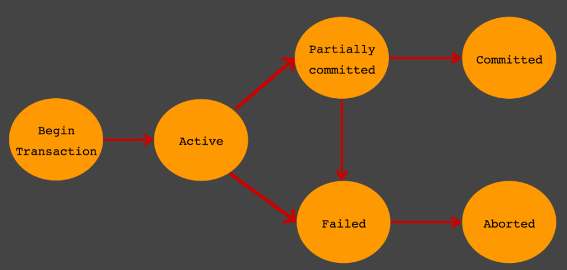
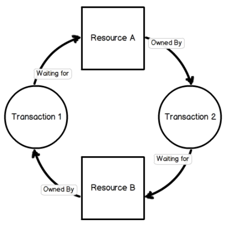

### 트랜잭션 (Transaction)

------

> 트랜잭션이란 작업의 완전성을 보장해주기 위해 구현된 기능이다. 어떠한 논리적인 작업에 포함되는 모든 세부작업이 완료되는 경우에만 해당 작업이 적용되도록 한다. 만약 모든 세부작업이 완료되지 못하는 경우에는, 작업의 일부만 적용되는 현상을 방지하기 위해 해당 작업 자체가 취소된다. 따라서 데이터의 정합성을 보장할 수 있는데 이러한 기능을 트랜잭션이라 한다.
>
> 트랜잭션은 사용자의 입장에서는 작업의 논리적 단위이고, 시스템의 입장에서는 데이터에 접근하거나 변경하는 프로그램의 단위가 된다.

#### 트랜잭션의 특성

------

> 트랜잭션은 다음의 ACID라는 네 가지 특성을 만족해야 한다. ACID의 의미는 다음과 같다.

##### 원자성 (Atomicity)

> 만약 트랜잭션 중간에 어떠한 문제가 발생한다면 트랜잭션에 해당하는 어떠한 작업 내용도 수행되서는 안되며, 아무런 문제가 발생되지 않았을 경우에만 모든 작업이 수행되어야 한다.

##### 일관성 (Consistency)

> 트랜잭션이 완료된 다음의 상태에서도 트랜잭션이 일어나기 전의 상황과 동일하게 데이터의 일관성을 보장해야 한다.

##### 고립성 (Isolation)

> 각각의 트랜잭션은 서로에게 간섭하지 못하며, 독립적으로 수행되어야 한다.

##### 지속성 (Durability)

> 트랜잭션이 정상적으로 종료된 다음에는 영구적으로 데이터베이스에 작업의 결과가 저장되어야 한다.

#### 트랜잭션의 상태

------

> 위 이미지는 트랜잭션의 상태가 어떻게 전이되는지를 나타낸 이미지이다. 각 상태에 대한 설명은 다음과 같다.

##### Active

> 트랜잭션의 활동 상태. 트랜잭션이 실행 중이며 동작 중인 상태를 의미한다.

##### Failed

> 트랜잭션이 성공적으로 완료되지 못해 실패한 상태.

##### Partial Committed

> 트랜잭션의 Commit 명령이 도착한 상태. 트랜잭션의 Commit 이전 SQL 문이 수행되고 Commit만 남은 상태를 말한다.

##### Committed

> 트랜잭션 완료 상태. 트랜잭션이 정상적으로 완료된 상태를 말한다.
>
> Partial Committed와의 차이는 다음과 같다. Commit 요청이 들어오면 상태는 Partial Committed 상태가 되는데, 이후 Commit을 문제없이 수행할 수 있으면 Committed 상태로 전이된다. 그러나 오류가 발생하면 Failed 상태로 전이된다.

##### Aborted

> 트랜잭션이 취소된 상태. 트랜잭션이 취소되고 트랜잭션 실행 이전의 데이터로 돌아간 상태를 말한다.

#### 교착상태

------

> 멀티 프로세싱이나 멀티 스레딩 처럼, 트랜잭션 역시 복수의 트랜잭션이 동시에 독립적으로 수행되는 것이 가능하다. 이 트랜잭션들은 동일한 데이터에 접근하므로 교착상태가 일어나기도 한다. 예시 이미지는 다음과 같다.

> 위의 참고용 이미지는 두 개의 트랜잭션이 각각의 자원을 점유한 상태에서 서로가 점유한 자원을 요청함으로써 발생한 교착상태이다. 이러한 교착상태의 빈도를 낮추는 방법으로는 다음과 같은 방법들이 있다.

##### 교착상태의 빈도를 낮추는 방법

* 트랜잭션을 자주 Commit 한다.
* 정해진 순서로 테이블에 접근한다. 위의 이미지에서는 트랜잭션 1이 B→A의 순으로 접근했고, 트랜잭션 2는 A→B의 순으로 접근했다. 접근 순서를 통일시키면 교착상태를 회피할 수 있다.
* 읽기 잠금 획득 (SELECT ~ FOR UPDATE)의 사용을 피한다.
* 한 테이블의 복수 행을 복수의 연결에서 순서 없이 갱신하면 교착상태가 발생하기 쉽다. 따라서 이 경우에는 테이블 단위의 잠금을 획득해 갱신을 직렬화하면 동시성은 떨어지지만 교착상태를 회피할 수 있다.

