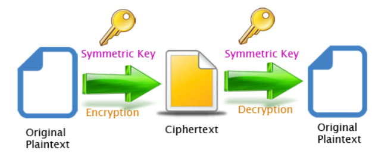
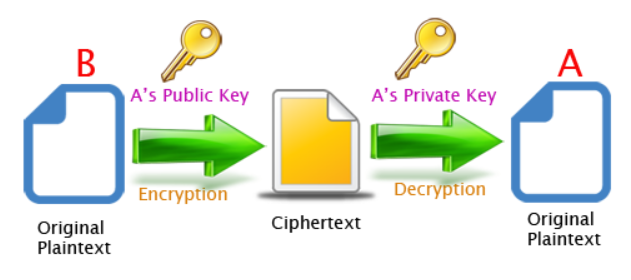

##### 출처

```
https://sungjk.github.io/2016/09/30/Security.html
```


### 대칭형 암호화 알고리즘, 비대칭형 암호화 알고리즘

### (Symmetric, Asymmetric Encryption)

------

##### 전통적인 방식과 현대적인 방식의 암호화 알고리즘의 차이

> 예전 방식의 암호화는 평문을 암호 알고리즘에 입력하여 암호화된 문장을 얻어내는 방식이었다. 하지만 이러한 방식은 암호 알고리즘이 노출될 경우 암호화된 문장을 누구나 해독할 수 있다는 문제점이 있었다.
>
> 현대의 암호화 알고리즘은 **평문 + 키**를 입력값으로 하여 암호화된 문장을 얻는다. 마찬가지로 **암호문+키**를 입력값으로 하여 복호화한다. 이러한 방식은 암호화 알고리즘이 노출되더라도 **키**값을 알지 못하면 복호화 할 수 없기 때문에 훨씬 안전하다는 장점이 있다.
>
> 현대 암호 알고리즘들은 크게 대칭형 암호 알고리즘과 비대칭형 암호 알고리즘으로 구분된다. 대칭형 암호 알고리즘은 암호화할 때 사용되는 키 값과 복호화할 때 사용되는 키 값이 동일한 알고리즘이고, 비대칭형 알고리즘은 암호화할 때 사용되는 키 값과 복호화할 때 사용되는 키 값이 서로 다른 알고리즘이다.


#### 대칭형 암호화 알고리즘

------

> 참고 이미지는 다음과 같다.



> 대칭형 암호화 알고리즘은 다음과 같은 장점으로 인해 주로 데이터 통신의 암호화에 사용된다.

* 암호화/복호화 속도가 비대칭형 암호화 알고리즘보다 빠르다.(10~1000배)

> 암호화/복호화 속도는 통신 속도에 영향을 미치므로 당연히 속도가 빠른 것이 통신에 유리하다.

* 암호문의 크기가 평문보다 크지 않다. (암호화 시 데이터 증가가 없다.)

> 크기가 증가하지 않는다는 것은 암호화된 데이터의 크기가 평문과 같다는 것이고, 네트워크 대역폭을 추가적으로 필요로 하지 않는다는 것이므로 통신에 적합하다.


##### Key Agreement Problem

> 그런데 대칭형 암호화 알고리즘은 그 원리상 필연적으로 부딪히는 문제가 있다. 이 문제란, 데이터를 송신하는 A와 수신하는 B가 동일한 키를 가져야 하는데, A와 B가 어떻게 같은 키를 가질 수 있도록 해야 하는가? 라는 문제이다. 이를 **Key Agreement Problem** 또는 **Key Bootstrapping** 이라 한다.
>
> 이러한 문제가 발생하는 이유는, 당연히 A가 키를 만들고 이 키를 네트워크를 통해 B에게 전달하는 식의 방법은 공격자가 중간에 키를 가로챌 위험이 있어 사용할 수 없기 때문이다.

> ##### 해결법
>
> 이러한 문제를 해결하는 일반적인 방법은 두 가지가 있다. 첫 번째는 키를 뒤에서 설명할 비대칭 암호화 알고리즘을 이용하여 암호화 시킨 후 전송하는 방법이다. 두 번째는 실제 키를 전송하지 않고도 A와 B가 동일한 키를 생성할 수 있도록 하는 알고리즘을 사용하는 것인데 대표적으로 Diffie-Hellman 알고리즘이 있다.


##### 대칭형 암호화 알고리즘의 예

> SEED, DES, DES3, AES 등이 있다.


#### 비대칭형 암호화 알고리즘

------

> 비대칭형 암호화 알고리즘은 흔히 공개키 알고리즘으로 불린다. 참고할 이미지는 다음과 같다.




##### 공개키(Public Key)와 개인키(Private Key)

> 공개키는 외부에게 공개되는 키이고, 개인키는 외부에 공개하지 않는 키이다. 생성된 공개키와 개인키는 수학적으로 다음과 같은 특성을 갖는다.

* A의 공개키를 이용하여 암호화된 데이터는 A의 개인키로만 복호화가 가능하다.
* A의 개인키를 이용하여 암호화된 데이터는 A의 공개키로만 복호화가 가능하다.


##### 통신 방법

* 먼저, 통신하려는 A와 B가 각각 자신의 공개키와 개인키를 생성해야 한다. 

* 이후 A와 B가 각자의 공개키를 서로에게 알려준다. 각자의 공개키를 나눠 갖게 되면 A는 공개 A키, 개인 A키, 공개 B키를 가지고 있고, B는 공개 B키, 개인 B키, 공개 A키를 가지고 있다. 이 때 잠재적 공격자 역시 공개 A키와 공개 B키를 가지고 있다.
* A는 B에게 데이터를 전송하기 위해 공개 B키를 이용하여 암호화한 후 전송한다. 암호화된 데이터는 개인 B키를 갖고 있는 B만 해독이 가능하다.
* B가 A에게 데이터를 전송할 때에도 위와 같은 방법을 사용한다. 따라서 공개키가 공개되더라도 안전하게 통신이 가능하다.


##### 비대칭형 암호화 알고리즘의 사례

> 대표적인 비대칭형 암호화 알고리즘에는 **RSA**가 있고, 비대칭형 암호화 알고리즘은 위에서 언급했던 것처럼 **대칭형 암호화 알고리즘의 키를 암호화**하는데 사용하거나, 주로 **인증**에 많이 사용한다.
>
> 예를 들어, C라는 고객이 은행에서 인터넷 뱅킹을 한다고 가정하자. 이 때의 과정은 다음과 같다.

* C가 은행에 자신의 공개키를 보낸다.
* 은행은 대칭형 암호화 알고리즘에서 사용할 비밀키를 C의 공개키를 이용하여 암호화한 다음 전송한다.
* C는 자신의 개인키로 복호화하여 은행의 비밀키를 얻어낸다.
* C와 은행 간의 통신은 전송받은 비밀키를 통해 암호화된다.
* 공격자가 중간에서 암호화된 비밀키를 획득하더라도 C의 개인키를 알지 못하면 복호화할 수 없기 때문에 비밀키를 알 수 없다.

> 그런데 여기서 하나의 문제가 있는데, 이는 다음과 같다.
>
> 만약 공격자 D가 은행에 접속하여 자신이 마치 C인 것처럼 가장하고 자신의 공개키로 전송하면 어떻게 될까? 만약 은행이 속는다면 은행은 D의 공개키를 이용하여 비밀키를 암호화한 후에 전송할 것이고, D는 이를 자신의 개인키로 해독하여 비밀키를 획득할 것이다.
>
> 이러한 공격을 막기 위해서는 은행이 C의 공개키를 인증할 수 있는 방법이 필요하다. 이 때 사용되는 것이 **인증서**이다. 인증서에는 인증받는 자(보통 target이라 함)의 정보와 인증받는 자의 공개키, 유효기간, 인증 기관 정보 등이 기록되어 있다. 인증서는 타겟의 공개키와 인증서에 기록된 공개키가 맞다는 사실을 인증기관이 보장한다는 내용을 담고 있다.