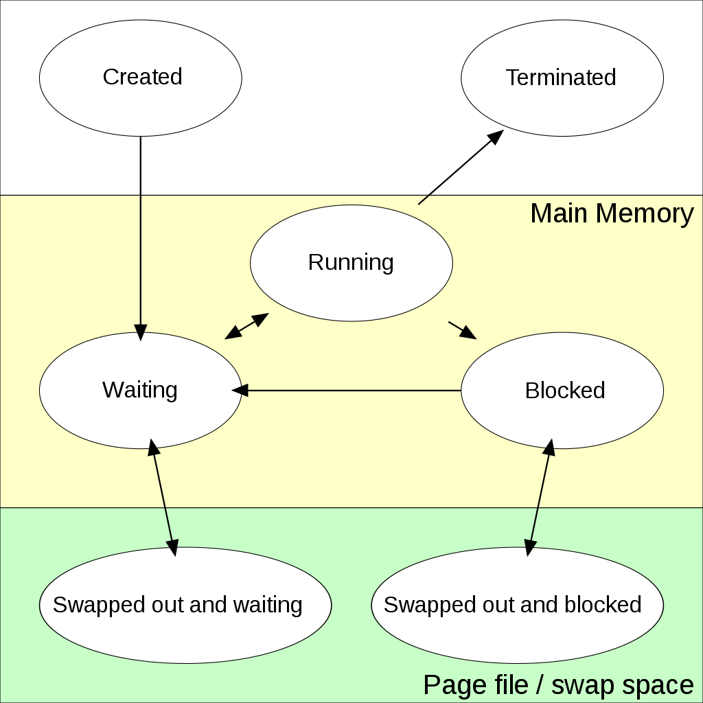

### 프로세스 (Process)

------

> 컴퓨터에서 연속적으로 실행되고 있는 컴퓨터 프로그램을 말한다. 스케줄링의 대상이 되는 작업(task)라는 용어와 거의 같은 의미로 쓰인다. 운영체제로부터 주소 공간, 파일, 메모리 등을 할당 받는다. 메모리는 함수의 매개변수, 복귀 주소와 로컬 변수와 같은 임시 자료를 갖는 프로세스 스택과 전역 변수를 수록하는 데이터 섹션, 동적 할당 메모리인 힙 등이 포함된다.


#### 프로그램과 프로세스

> 프로그램은 일반적으로 하드 디스크 등에 저장되어 있는 실행 코드를 의미한다. 반면 프로세스는 프로그램을 구동하여  프로그램 자체와 프로그램 상태가 메모리 상에서 실행되는 작업 단위를 지칭한다. 예를 들어, 하나의 프로그램을 여러 번 구동하면 여러 개의 프로세스가 메모리 상에서 실행된다.


#### 프로세스의 상태

> 커널 내부에는 준비 큐, 대기 큐, 실행 큐 등의 자료구조가 구현되어 있다. 커널은 이 큐들을 활용하여 프로세스의 상태를 관리한다. 프로세스의 상태를 잘 보여주는 이미지를 보자.



* 생성 (create) : 프로세스가 생성되는 중이다.
* 실행 (running) : 프로세스가 CPU를 차지하며 명령어들이 실행되고 있다.
* 준비 (ready) : 프로세스가 CPU를 사용하고 있지는 않지만 언제든지 사용할 수 있는 상태로, CPU가 할당되기를 기다리고 있다. 일반적으로 준비 상태의 프로세스 중 우선순위가 높은 프로세스가 CPU를 할당 받는다.
* 대기(wating) / 보류(blocked) : 프로세스가 입출력 완료, 시그널 수신 등 어떤 사건을 기다리고 있는 상태를 말한다.
* 종료(terminated) : 프로세스의 실행이 종료되었다.
* Suspended(stopped): 외부적인 이유로 인해 프로세스의 수행이 정지된 상태로 메모리에서 디스크로 내려간 상태를 의미한다. 프로세스 전부 디스크로 swap out 된다. blocked 상태와의 차이점은, blocked 상태는 다른 I/O 작업을 기다리는 상태이므로 스스로  ready state로 돌아갈 수 있지만 suspended 상태는 원인이 외부에 있으므로 스스로 돌아갈 수 없다.


#### 프로세스의 상태 전이

> 하나의 프로그램이 실행되면 그 프로그램에 대응되는 프로세스가 생성되어 준비 리스트의 끝에 들어간다. 준비 리스트 상의 다른 프로세스들이 CPU를할당 받아 준비 리스트를 떠나면, 그 프로세스는 점차 준비 리스트의 앞으로 나가게 되고 언젠가 CPU를 사용할 수 있게 된다. 상태 전이의 종류와 설명은 다음과 같다.


* ##### 디스패치(dispatch) 

> 준비 리스트의 맨 앞에 있던 프로세스가 CPU를 점유하게 된다. 따라서 준비 상태에서 실행 상태로 바뀌는 것을 의미한다.

```
dispatch (process_name): ready > running
```

* ##### 보류 (block)

> 실행 상태의 프로세스가 허가된 시간을 다 쓰기 전에 입출력 동작을 필요로 하는 경우 프로세스는 CPU를 스스로 반납하고 보류 상태로 넘어간다. 이것을 보류라고 하며 다음과 같이 표시한다.

```
block (process_name): running > blocked
```

* ##### 깨움 (wakeup)

> 입출력 작업 종료 등 기다리던 사건이 일어났을 때 보류 상태에서 준비 상태로 넘어가는 과정을 꺠움이라고 한다.

```
wakeup (process_name): blocked > ready
```

* ##### 시간제한 (timeout)

> 운영체제는 프로세스가 프로세서를 계속 독점해서 사용하지 못하게 하기 위해 clock interrupt를 두어서 프로세스가 일정 시간 동안만 프로세서를 점유할 수 있게 한다.

```
timeout (process_name): running > ready
```


#### 프로세스의 제어 블록 (PCB, Process Control Block)

> 특정한 프로세스를 관리할 목적으로 프로세스에 대한 중요한 정보를 저장하고 있는 운영체제의 자료구조이다. 프로세스의 생성과 동시에 프로세스의 고유한 PCB가 생성된다. PCB에 저장되는 정보는 다음과 같다.

* 프로세스 식별자 (Process ID)
* 프로세스 상태 : 생성, 준비, 실행, 대기, 완료 등의 상태 정보
* 프로그램 계수기 (Program Counter) : 다음에 실행할 명령어의 주소
* CPU 레지스터, 일반 레지스터
* CPU 스케줄링 정보 : 우선순위, 최종 실행시각, CPU 점유시간 등
* 메모리 관리 정보 : 해당 프로세스의 주소 공간
* 프로세스 계정 정보 : 페이지 테이블, 스케쥴링 큐 포인터, 소유자, 부모 등
* 입출력 상태 정보 : 프로세스에 할당된 입출력 장치 목록, 열린 파일 목록


#### 프로세스 간 통신(IPC, Inter-Process Communication)

> 프로세스들 사이에서 서로 데이터를 주고받는 행위 또는 그에 대한 방법이나 경로를 뜻한다. 주요 방법은 다음과 같다.

* 파일
* 신호
* 소켓
* 메시지 큐
* 파이프
* 지명 파이프
* 세마포어
* 공유 메모리
* 메시지 전달(비공유)


#### 프로세스 관리

> 

