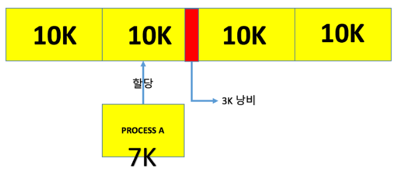

### 메모리 관리 (Memory Management)

------

> 메모리 관리는 컴퓨터 메모리를 관리하는 행위이다. 가장 단순한 형태의 메모리 관리 방법은 프로그램의 요청이 있을 때, 메모리의 일부를 해당 프로그램에 할당하고, 더이상 필요하지 않을 때 나중에 다시 사용할 수 있도록 할당을 해제하는 것이다. 이는 하나 이상의 프로세스가 언제든 실행되는 고급 컴퓨터 시스템에 필수적이다.
>
> 그러나 위의 방법만으로는 충분하지 않을 것이다. 고급 컴퓨터 시스템에는 수많은 프로그램을 기반으로 한 프로세스들이 존재한다. 이 프로세스들을 모두 수용하기에는 메모리 자원은 부족하다. 메모리 관리란 이런 상황에서 최대한 효율적으로 메모리 자원을 사용하기 위해 설계된 방법을 말한다. 메모리 관리의 주된 목표는 다음과 같다.

##### 메모리 관리의 목표

* 여러 프로세스가 동시에 실행될 수 있도록 메모리 공간을 제공할 것
* 시스템 사용자들을 위해 만족할 만한 수준의 성능을 제공할 것
* 각 프로그램의 리소스를 보호할 것
* 프로세스 사이에 있는 메모리 공간을 공유할 것
* 프로그래머를 위해 되도록 메모리 공간의 어드레싱을 투명하게 할 것

> 메모리 관리는 운영체제에 의해 진행된다. 각각의 프로세스는 독립된 메모리 공간을 갖고, 운영체제 혹은 다른 프로세스의 메모리 공간에 접근할 수 없도록 제한된다. 운영체제는 운영체제 메모리 영역을 할당받으며 사용자 메모리 영역에도 접근할 수 있다.

##### 스왑핑 (Swapping)

> 메모리의 관리를 위해 사용되는 기법이다. 표준 스왑핑 방식은 대개 Round-Robin과 같은 스케줄링 을 통해 CPU 할당 시간이 끝난 프로세스는 메모리의 보조 기억장치로 내보내고, 다음 프로세스를 메모리에 적재하는 방식으로 진행된다.
>
> 이 때 디스크로부터 주기억장치로 프로그램을 적재하는 것을 Swap-In, 반대로 주기억장치에서 디스크로 내보내는 것을 Swap-Out이라 한다. 스왑핑에는 큰 디스크 전송시간이 필요하므로 메모리 공간이 부족한 경우에 스왑핑이 진행된다.
>
> 이 스왑핑이 반복되면 단편화라는 새로운 문제점이 발생하게 된다.

#### 단편화 (Fragmentation)

------

> 프로세스들이 메모리에 적재되고 제거되는 일이 반복되다보면, 프로세스들이 차지하는 메모리 틈 사이에 사용하지 못할 만큼의 작은 자유공간들이 늘어난다. 이를 단편화라 한다. 단편화의 예시 이미지는 다음과 같다. 단편화는 외부 단편화와 내부 단편화로 구분된다.

> ##### 외부 단편화
>
> 메모리 공간 중 사용하지 못하는 부분들을 말한다. 물리 메모리에서 사이사이 남는 공간을 모두 합하면 충분한 공간이 되지만, 분산되어 있어 사용하지 못하는 경우 이를 외부 단편화라 한다. 외부 단편화를 해소하기 위한 방법으로 사용하지 못하는 공간을 하나로 통합하는 압축이라는 방법을 사용하기도 한다. 단, 압축의 효율은 좋지 않다.

> ##### 내부 단편화
>
> 메모리를 할당하는 최소 블록의 크기를 10K라고 가정한다. 만약 이 블록에 7K의 크기를 갖는 프로세스를 할당한다고 하면, 3K의 공간을 낭비하게 된다. 이러한 문제를 내부 단편화라 한다.

#### 페이징 (Paging)

------

> 참고 이미지는 위와 같다.
>
> 페이징이란 하나의 프로세스가 사용하는 메모리 공간이 연속적이어야 한다는 제약을 없애는 관리 방법으로, 외부 단편화를 해소하기 위한 방법이다. 물리 메모리는 프레임이라는 고정 크기로 분리되고, 논리 메모리는 페이지라 불리는 고정 크기의 블록으로 분리된다. 이 때의 페이지는 추후 설명할 페이지 교체 알고리즘에서 등장하는  페이지의 개념이다.
>
> 페이징 기법을 사용함으로써 논리 메모리는 물리 메모리에 저장될 떄, 연속되어 저장될 필요가 없고 물리 메모리의 남는 프레임에 적절히 배치됨으로써 외부 단편화를 해결할 수 있다. 프레임과 페이지를 대응시키기 위해 페이지 매핑이라는 과정이 필요하고 이 페이지 매핑을 위해 페이징 테이블이 필요하다.
>
> 그러나 페이지와 프레임의 크기가 고정되어 있으므로 할당되는 과정에서 일부 메모리는 낭비하게 되므로 내부 단편화 문제는 여전히 발생한다. 만약 페이지의 크기를 작게 한다면 내부 단편화 문제 역시 해결이 가능하나 그만큼 페이지 매핑 과정이 증가하게 되므로 내부 단편화 정도와 페이지 매핑의 비용은 서로 Trade-Off 관계에 있다. 

#### 세그멘테이션 (Segmentation)

------

> 페이징 기법에서 가상 메모리를 같은 크기로 분할한다면, 세그멘테이션 기법은 가상 메모리를 크기가 다른 논리적 단위인 세그먼트로 분할하고 메모리에 할당된다. 세그먼트들의 크기가 서로 다르기 때문에 메모리를 페이징 기법처럼 미리 분할해 둘 수는 없고, 메모리에 적재될 때 빈공간을 찾아 할당하는 사용자 관점의 가상메모리 관리 기법이다. 
>
> 세그멘테이션 역시 페이징 기법처럼 매핑을 위한 세그먼트 테이블을 필요로 한다. 하나의 세그먼트 단위로 통제가 가능한 장점이 있어 내부 단편화가 발생하지 않지만, 서로 다른 크기의 세그먼트들에 대해 메모리에 적재하고 내리는 과정을 반복하다보면 외부 단편화가 발생한다는 문제가 있다.

