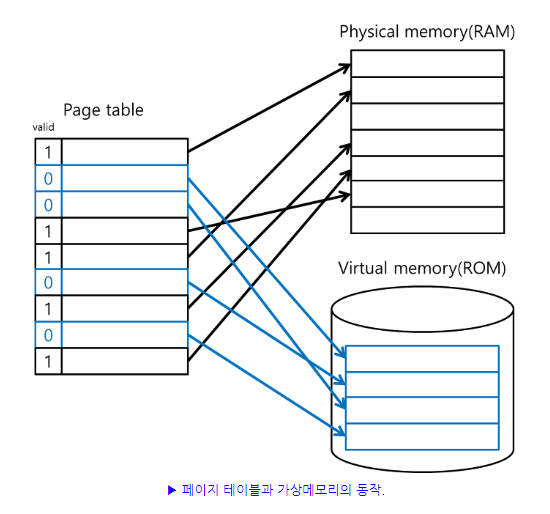

### 가상 메모리 (Virtual Memory)

------

> 다중 프로그래밍을 실현하기 위해서는 많은 프로세스들을 동시에 메모리에 올려두어야 한다. 가상 메모리는 프로세스 전체가 메모리 내에 올라오지 않더라도 실행이 가능하도록 하는 기법이며, 프로그램이 물리 메모리보다 커도 된다는 주요 장점이 있다.
>
> 이해를 돕기 위한 참고용 이미지는 다음과 같다.

> 가상 메모리가 개발되기 전에는 실행되는 코드의 전부를 물리 메모리에 적재해야 했다. 따라서 메모리 용량보다 큰 프로그램을 실행시킬 수 없었다. 또한, 여러 프로그램을 동시에 메모리에 올리기에는 용량의 한계 등의 이슈에 부딪히게 되었다.
>
> 그런데 하나의 프로그램을 실행시킴에도 항상 모든 코드가 필요한 것은 아니다. 어떤 코드는 사용 빈도가 낮기도 하고, 사용되지 않는 동안에도 메모리에 적재된다면 이는 메모리 자원의 낭비로 이어질 것이다. 만약 프로그램의 필요한 부분만 메모리에 올리고, 이를 교체해 나간다면 프로그램의 모든 코드를 사용하면서도, 메모리 공간을 절약 할 수 있을 것이다. 이것이 가상 메모리의 기본적인 컨셉이다.

##### 가상 메모리의 장점

> 가상 메모리는 다음과 같은 장점을 갖는다.

* 물리 메모리 크기에 제약 받지 않는다.
* 더 많은 프로그램을 동시에 실행할 수 있게 된다. 이에 따라 응답시간은 유지되고, CPU 이용률과 처리율은 높아진다.
* 스왑에 필요한 입출력 크기가 줄어드므로, 프로그램들이 빠르게 실행된다.

##### 가상 공간과 물리 공간

> 가상적으로 주어진 주소를 가상 주소, 또는 논리 주소라고 한다. 반면 실제 메모리 상에서 유효한 주소를 물리 주소 또는 실 주소라고 한다. 가상 주소의 범위를 가상 주소 공간, 물리 주소의 범위를 물리 주소 공간이라 한다. 
>
> 가상 주소 공간은 메모리 고나리 장치에 의해 물리 주소로 변환된다. 이 덕분에 프로그래머는 가상 주소 공산 상에서 프로그램을 짜게 되어 프로그램이나 데이터가 주 메모리 상에 어떻게 존재하는지를 의식할 필요가 없어진다. 대부분의 현대적 아키텍처와 운영체제는 가상 메모리 기능을 제공하며, 각 응용 프로그램에 더 적합 한 메모리 관리를 위해 어도비 포토샵과 같은 일부 애플리케이션은 스스로 가상 메모리를 관리하기도 한다.

#### 요구 페이징과 페이지 부재 (Demand Paging, Page Fault)

------

> 요구 페이징이란 프로그램 시행 시작 시 프로그램 전체를 디스크에서 물리 메모리에 적재하는 대신, 초기에 필요한 것들만 적재하는 전략을 말한다. 가상 메모리 시스템에서 많이 사용된다. 사실 대부분의 가상 메모리는 페이지로 관리된다. 요구 페이징을 사용하는 가상 메모리에서는 실행과정에서 필요해질 때 페이지들이 적재된다. 한 번도 접근되지 않은 페이지는 물리 메모리에 적재되지 않는다. 사용되지 않는 페이지는 메모리에 가져오지 않으므로 시간 낭비와 메모리 공간 낭비를 줄일 수 있다.
>
> 모든 페이지가 적재된 것이 아니므로 프로세스는 메모리에 없는 페이지에 접근하려고 할 때 페이지 부재 트랩을 발생시킨다. 이 때 잠시 프로세스가 중단되고, 페이지 교체가 일어난다. 페이지 교체가 적을 수록 중단되는 횟수가 줄어드므로 효율적이다. 그런데 대부분의 프로그램은 참조의 지역성이라는 성질을 갖고 있어서 요구 페이징은 대부분의 경우에 만족할 만한 성능을 보인다.

##### ※ 참조의 지역성 (Locality of Reference)

> 참조의 지역성이란 모든 코드가 균등하게 참조되는 것이 아니라, 특정 값이나 해당 값과 관계된 스토리지가 자주 참조되는 특성을 말한다. 시간, 공간, 순차 지역성으로 구분된다. 참조의 지역성의 원리는 추후에 설명하게 될 캐시의 메커니즘에도 사용된다.

* ##### 공간 지역성 (Spatial Reference)

> 특성 클러스터들의 기억 장소들에 대해 참조가 집중적으로 이루어지는 경향으로, 참조된 메모리의 근처의 메모리를 참조한다.

* ##### 시간 지역성 (Time Reference)

> 최근 사용되었던 기억 장소들이 집중적으로 액세스 되는 경향으로, 참조했던 메모리는 빠른 시간에 다시 참조될 확률이 높다.

* ##### 순차 지역성 (Sequence Reference)

> 데이터가 순차적으로 액세스 되는 경향으로, 프로그램 내의 명령어가 순차적으로 구성되어 있는 것이 대표적인 경우이다.

#### 페이지 교체 알고리즘

------

> 페이지 부재 시에는 페이지 교체가 필연적으로 발생하게 된다. 만약 남는 프레임 공간이 있다면 해당 공간에 페이지를 할당하면 된다. 그런데 남는 프레임 공간이 없다면 현재 메모리에 적재된 페이지 중 하나를 스왑아웃 시켜야만 한다. 그렇다면 어떤 페이지를 스왑아웃해야 할까? 또한 어떤 기준에 따라 스왑아웃할 페이지를 선정하는 것이 가장 효율적일까? 페이지 교체 알고리즘이란 이 질문에 답을 내리기 위한 방법이라 할 수 있다. 
>
> 페이지 교체 알고리즘의 종류는 다음과 같은 것들이 있다.

##### FIFO (First In First Out)

> 가장 간단한 페이지 교체 알고리즘으로 먼저 물리 메모리에 들어온 페이지 순서대로 페이지 교체 시점에 메모리로부터 방출되는 방식이다. FIFO는 이해하기 쉽고, 프로그래미오 쉽다는 장점이 있다. 그러나 오래된 페이지가 항상 불필요하다는 보장이 없기 때문에, 첫 페이지가 자주 참조되는 페이지라면 도리어 페이지 부재율을 높이게 된다는 부작용이 있다.

##### LRU (Least Recently Used)

> 이후 설명하게 될 최적 페이지 교체 알고리즘의 근사 알고리즘으로, 가장 오랫동안 사용되지 않은 페이지를 선택하여 교체한다. 대체로 FIFO 알고리즘 보다 우수한 성능을 보여준다.

##### LFU (Least Frequently Used)

> 참조 횟수가 가장 적은 페이지를 교체하는 방법이다. 활발하게 사용되는 페이지는 참조 횟수가 많아질 것이라는 가정에서 만들어진 알고리즘이다. 그러나 최적 페이지 교체 알고리즘을 제대로 근사하지 못하므로, 잘 사용되는 알고리즘은 아니다.

##### 최적 페이지 교체 알고리즘 (OPR, Optimal Page Replacement)

> 앞으로 가장 오랫동안 사용되지 않을 페이지를 찾아 교체한다. 알고리즘 중 가장 낮은 페이지 부재율을 보장한다는 장점이 있다. 그러나 프로세스의 메모리 참조 계획을 미리 파악할 수 없으므로 구현의 어려움이 있다.

##### MFU (Most Frequently Used)

> 참조 횟수가 가장 적은 페이지가 최근에 메모리에 올라왔고, 따라서 앞으로 계속 사용될 것이라는 가정에 기반한다. 가장 많이 참조된 페이지를 교체한다. 그러나 이 방법은 최적 페이지 교체 알고리즘을 제대로 근사하지 못하므로 잘 사용되는 알고리즘은 아니다.