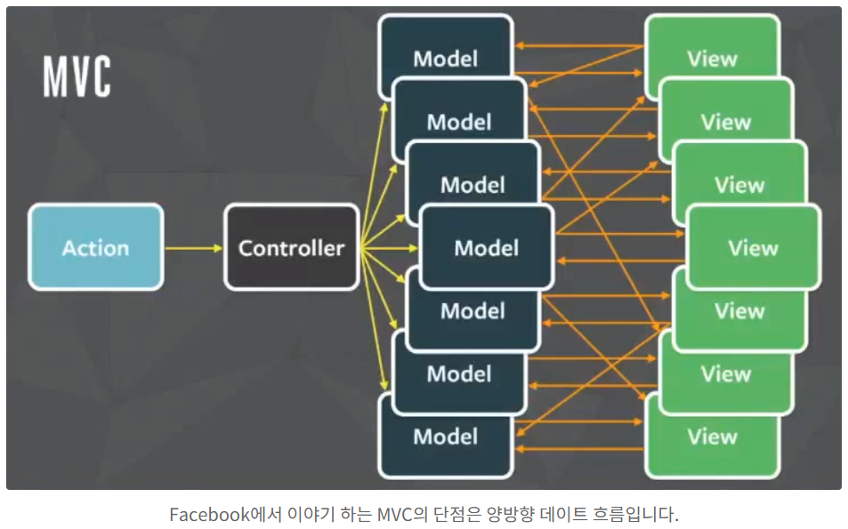
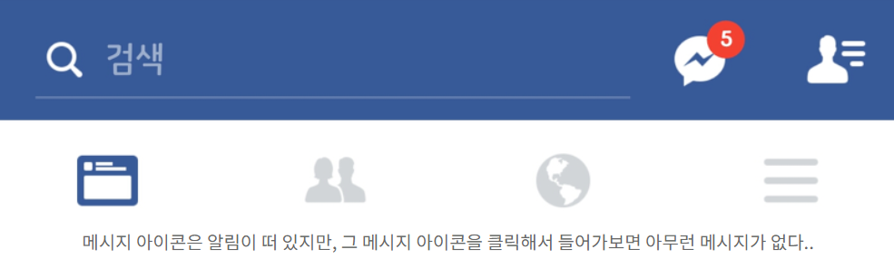
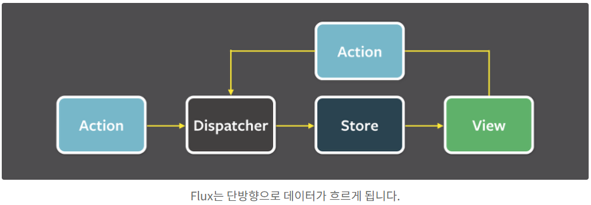

##### 출처

```
https://beomy.tistory.com/44
```


### Flux

------

> Flux은 MVC 패턴의 단점을 보완하기 위해 페이스북에서 발표한 아키텍처이다. React.js의 Redux의 디자인패턴으로, Vuex에도 영향을 주었다.


##### MVC의 문제점

> 페이스북에서 이야기하는 MVC의 가장 큰 단점은 **양방향 데이터 흐름**이었다. 이를 표현하는 이미지는 다음과 같다.



> MVC 패턴에서 Controller는 Model의 데이터를 조회하거나 업데이트하는 역할을 한다. Model이 업데이트 되면, View는 화면에 반영한다. View가 Model을 업데이트 할 수도 있다. Model이 업데이트 되어 View가 따라서 업데이트 되고, 업데이트 된 View가 다시 다른 Model을 업데이트 한다면, 또 다른 View가 업데이트 될 수 있다.


> ##### 양방향 데이터 흐름과 복잡도
>
> 이렇게 되는 이유는 애플리케이션의 구조가 복잡해졌기 때문이다. 사실 복잡하지 않은 애플리케이션에서는 양방향 데이터 흐름이 그다지 문제로 작용하지 않을 것이다. 그러나 애플리케이션의 규모가 커지고 구조가 복잡해지면 양방향 데이터 흐름은 새로운 기능이 추가 될 때마다 시스템의 복잡도를 기하급수적으로 증가시키고, 예측 불가능한 코드를 만들어낸다. 개발자도 예측하지 못한 버그들이 등장하게 되는 것이다.


> ##### 사례 : 페이스북 알림 버그



> 페이스북은 양방향 데이터 흐름이 만들어낸 버그의 사례로 알림 버그를 들었다. 페이스북에 로그인 했을 때, 화면 위 메시지 아이콘에 알림이 떠 있지만 그 메시지 아이콘을 클릭하면 아무런 메시지가 없는 경우가 있었다.
>
> 이 버그를 수정하고 얼마 동안은 괜찮았으나, 애플리케이션을 업데이트 하면서 다시 알림버그가 등장하였다. 그리고 다시 버그를 수정하는 일이 반복되었다. 페이스북은 이 문제를 단방향 데이터 흐름으로 설계함으로써 애플리케이션을 예측 가능하도록 만듦으로써 해결하였다.


#### Flux의 도입

------

> 페이스북은 알림 버그의 원인을 양방향 데이터 흐름으로 보고, 단방향 데이터 흐름인 Flux를 도입하였다. 
>
> Flux의 이미지는 다음과 같다.



> Flux의 가장 큰 특징은 단방향 데이터 흐름이다. 데이터 흐름은 항상 Dispatcher에서 Store로, Store에서 View로, View는 Action을 통해 다시 Dispatcher로 데이터가 흐른다. 이런 단방향 데이터 흐름은 데이터의 변화를 훨씬 예측하기 쉽게 만든다.


#### Flux의 구성 요소

------

> Dispatcher, Store, View, Action의 네 부분으로 구성된다.


##### Dispatcher

> Dispatcher는 Flux의 모든 데이터 흐름을 관리하는 허브 역할을 하는 부분이다. Action이 발생되면 Dispatcher로 전달되는데, Dispatcher는 전달된 Action을 보고, 등록된 콜백 함수를 실행하여 Store에 데이터를 전달한다. Dispatcher는 전체 애플리케이션에서 한 개의 인스턴스만 사용된다.


##### Store

> 애플리케이션의 모든 상태 변경은 Store에 의해 결정이 된다. Dispatcher로 부터 메시지를 수신받기 위해서는 Dispatcher에 콜백 함수를 등록해야 한다. Store가 변경되면 View에 변경되었다는 사실을 알려준다. Store는 싱글톤으로 관리된다.


##### View

> Flux의 View는 화면에 나타내는 것 뿐만 아니라, 자식 View로 데이터를 흘려 보내는 뷰 컨트롤러의 역할도 함께한다.


##### Action

> Dispatcher에서 콜백 함수가 실행되면 Store가 업데이트 되는데, 이 콜백 함수를 실행할 때 데이터가 담겨있는 객체가 인수로 전달되어야 한다. 이 전달되는 객체를 Action이라 하는데, Action은 대체로 액션 생성자에서 만들어진다.


