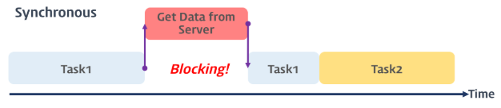
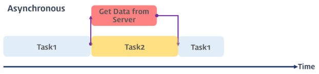

### 프로미스 (Promise)

------

> 프로미스에 대해 이해하기 전에 **동기 / 비동기식 처리**와 자바스크립트의 비동기 처리에 사용되는 **콜백 패턴**에 대해 먼저 알아야 한다.


#### 동기 / 비동기식 처리 

#### (Synchronous / Asynchronous Processing)

------

##### 동기식 처리

> 참고 이미지는 다음과 같다.



> 동기식 처리는 직렬적으로 작업(Task)을 수행한다. 즉, 작업은 순차적으로 실행되며 어떤 작업이 수행 중이면 다음 작업은 대기하게 된다. 
>
> 예를 들어 서버에서 데이터를 가져와서 화면에 표시하는 작업을 수행할 때, 서버에 데이터를 요청하고 데이터가 응답될 때까지 이후의 작업들은 모두 블로킹된다.


##### 비동기식 처리

> 참고 이미지는 다음과 같다.



> 비동기식 처리는 병렬적으로 작업을 수행한다. 즉, 작업이 종료되지 않은 상태라 하더라도 대기하지 않고 즉시 다음 작업을 실행한다. 
>
> 예를 들어 서버에서 데이터를 요청한 다음 요청한 데이터를 가져와 화면에 표시하는 작업을 수행할 때, 서버에 데이터를 요청한 이후 서버로부터 데이터가 응답될 때까지 대기하지 않고 다음 작업을 수행한다. 이후 서버로부터 데이터가 응답되면 이벤트가 발생하고 이벤트 핸들러가 데이터를 가지고 수행할 작업을 계속 수행한다.
>
> 자바스크립트의 대부분의 DOM 이벤트와 Timer 함수(setTimeout, setInterval), Ajax 요청은 비동기식 처리로 동작한다.


#### 콜백 패턴의 문제점

------

> 자바스크립트는 비동기 처리를 위한 하나의 패턴으로 콜백 함수를 사용한다. 그러나 전통적인 콜백 패턴은 가독성이 나쁘고 비동기 처리 중 발생한 에러의 예외 처리가 곤란하며 여러 개의 비동기 처리 로직을 한꺼번에 처리하는 것도 한계가 있었다.
>
> ES6에서는 비동기 처리를 위한 다른 패턴으로 프로미스를 도입함으로써 전통적인 콜백 패턴이 가진 단점을 보완하였다. 프로미스에 대해 알아보기 이전에 콜백 함수 사용 패턴의 문제에 대해 알아보자.


##### 콜백 헬 (Callback Hell)

> 비동기 처리를 위해 콜백 패턴을 사용하다 보면 각 작업의 처리 순서를 보장하기 위해 여러 콜백 함수가 중첩(nesting)되어 코드의 복잡도가 높아지는 현상을 말한다. 콜백 헬은 코드의 복잡성을 증가시키고, 가독성을 나쁘게 함으로써 실수를 유발하는 원인이 된다.
>
> 콜백 헬에 대한 예시는 다음과 같다.

```javascript
step1(function(value1) {
  step2(value1, function(value2) {
    step3(value2, function(value3) {
      step4(value3, function(value4) {
        step5(value4, function(value5) {
            // value5를 사용하는 처리
        });
      });
    });
  });
});
```


> ##### 비동기 처리와 콜백 헬의 발생 원인
>
> 그런데 이렇게 콜백헬이 발생하는 이유는 무엇 때문일까? 사실 이는 비동기 처리와 관련이 있다. 비동기 처리는 어떤 작업의 실행이 완료될 때까지 기다리지 않고 즉시 다른 작업을 실행한다. 
>
> 따라서 비동기 처리를 포함한 로직에서 비동기 처리에 의해 반환된 결과를 활용하는 로직을 동기 처리를 하듯이 구성하면 의도한 대로 동작하지 않는다.
>
> 이를 잘 보여주는 예시는 다음과 같다.

```html
<body>
  <script>
    // 비동기 함수
    function get(url) {
      // XMLHttpRequest 객체 생성
      const xhr = new XMLHttpRequest();

      // 서버 응답 시 호출될 이벤트 핸들러
      xhr.onreadystatechange = function () {
        // 서버 응답 완료가 아니면 무시
        if (xhr.readyState !== XMLHttpRequest.DONE) return;

        if (xhr.status === 200) { // 정상 응답
          console.log(xhr.response);
          // 비동기 함수의 결과에 대한 처리는 반환할 수 없다.
          return xhr.response; // ①
        } else { // 비정상 응답
          console.log('Error: ' + xhr.status);
        }
      };

      // 비동기 방식으로 Request 오픈
      xhr.open('GET', url);
      // Request 전송
      xhr.send();
    }

    // 비동기 함수 내의 readystatechange 이벤트 핸들러에서 처리 결과를 반환(1)하면 순서가 보장되지 않는다.
    const res = get('http://jsonplaceholder.typicode.com/posts/1');
    console.log(res); // (2) undefined
  </script>
</body>
```

> 위 예시에 대한 설명은 다음과 같다.
>
> 비동기 함수 내의 readystatechange 이벤트 핸들러에서 처리 결과를 반환(1)하면 순서가 보장되지 않는다. 즉 (2)에서 get 함수가 반환한 값을 참조할 수 없다. 그 이유는 다음과 같다.
>
> get 함수가 호출되면 get 함수의 실행 컨텍스트가 생성되고 호출 스택(실행 컨텍스트 스택)에서 실행된다. get 함수가 반환하는 xhr.response는 readystatechange 이벤트 핸들러가 반환한다. readystatechange 이벤트는 발생하는 시점을 명확히 알수 없지만 반드시 get 함수가 종료한 이후에 발생한다. 왜냐하면 get 함수의 마지막 문인 xhr.send(); 가 실행되어야 서버에 request를 전송하고, 이에 대한 response를 서버로부터 받아야 readystatechange 이벤트가 발생할 수 있기 때문이다.
>
>  xhr.send(); 가 실행되고 get 함수가 종료되면, 곧바로 console.log(res)가 호출되어 호출 스택에 들어가 실행된다. console.log가 호출되기 직전에 readystatechange 이벤트가 이미 발생하여도 이벤트 핸들러는 console.log보다 먼저 실행되지 않는다. 그 이유는 무엇일까?
>
> 이는 readystatechange 이벤트의 이벤트 핸들러가 이벤트가 발생하면 즉시 실행되는 것이 아니기 때문이다. 이벤트가 발생하면 먼저 태스크 큐로 들어간다. 태스크 큐에서 대기하다 호출 스택이 비면 그 때 이벤트 루프에 의해 호출 스택으로 들어가 실행된다. console.log 호출 시점 이전에 readystatechange 이벤트가 이미 발생했다 하더라도 get 함수가 종료하면 곧바로 console.log가 호출되어 호출 스택에 들어가므로 readystatechange 이벤트의 이벤트 핸들러는 console.log가 종료되어 호출 스택에서 빠진 이후에 실행된다. 만약 get 함수 이후에 console.log가 10번 호출된다면 readystatechange 이벤트의 이벤트 핸들러는 모든 console.log가 종료한 이후에 실행된다.
>
> 따라서 위의 코드에서는 get 함수의 반환 결과를 갖고 후속 처리를 할 수 없다. (1)과 (2)의 작업 순서가 보장되지 않기 때문이다. 만약 콜백 함수를 사용한다면 이 작업 순서를 보장할 수 있는데, 이를 과도하게 사용하다보니 결국 콜백 헬이 발생하게 된다.


##### 에러 처리의 한계

> 콜백 패턴을 활용한 비동기 처리가 갖는 문제점 중 가장 심각한 것은 에러 처리가 곤란하다는 점이다.
>
> 다음의 예시 코드를 보자.

```javascript
try {
    setTimeout(() => { throw new Error('Error!'); }, 1000)
} catch(error) {
    console.log('에러를 캐치하지 못한다.');
    console.log(error);
}
```

> 위 예시 코드에서는 try 블록 내에서 setTimeout 함수가 실행되면 1초 후에 콜백 함수가 실행되고 이 콜백 함수는 예외를 발생시킨다. 그러나 이 예외는 catch 블록에서 캐치되지 않는다. 그 이유는 무엇일까?
>
> 비동기 처리 함수의 콜백 함수는 해당 이벤트(timer 함수의 tick 이벤트, XMLHttpRequest의 readystatechange 이벤트 등)가 발생하면 태스크 큐로 이동한 후 호출 스택이 비어졌을 때, 호출 스택으로 이동되어 실행된다.
>
> setTimeout 함수는 비동기 함수이므로 콜백 함수가 실행될 때까지 기다리지 않고 즉시 종료되어 호출 스택에서 제거된다. 이후 tick 이벤트가 발생하면 setTimeout함수의 콜백 함수는 태스크 큐를 거쳐 호출 스택이 비어졌을 때 호출 스택으로 이동되어 실행된다.
>
> 그런데 이 때, setTimeout 함수는 이미 호출 스택에서 제거된 상태이다. 이것은 setTimeout 함수의 콜백 함수를 호출한 것은 setTimeout 함수가 아니다라는 것을 의미한다. setTimeout 함수의 콜백 함수의 호출자(caller)가 setTimeout 함수라면 호출 스택에 setTimeout 함수가 존재해야 하기 때문이다.
>
> 예외(exception)는 호출자 방향으로 전파된다. 그런데 콜백함수의 호출자는 setTimeout 함수가 아니다. 따라서 setTimeout 함수에는 에러가 전달되지 않게 되어 catch 블록에서 에러가 캐치되지 않는다. 그리고 프로세스는 종료된다.
>
> 이러한 문제를 극복하기 위해 프로미스가 제안되었다. 프로미스는 ES6에서 정식 채택되어 IE를 제외한 대부분의 브라우저가 지원하고 있다.


#### 프로미스의 생성

------

> 프로미스는 Promise 생성자 함수를 통해 인스턴스화한다. Promise 생성자 함수는 비동기 작업을 수행할 콜백 함수를 인자로 전달받으며, 이 콜백 함수는 resolve와 reject 함수를 인자로 전달받는다.
>
> 이에 대한 예시는 다음과 같다.

```javascript
const promise = new Promise((resolve, reject) => {
    // 비동기 작업 수행
    
    if (/* 비동기 작업 수행 성공*/) {
       resolve('result')
    } else { /* 비동기 작업 수행 실패 */
       reject('failure reason')
    }
});
```


##### 프로미스의 상태 정보

> 프로미스는 비동기 처리가 성공하였는지 또는 실패하였는지 등의 상태 정보를 갖는다. 이 상태 정보에 대한 정보는 다음의 표와 같다.

| 상태      | 비동기 처리 수행 여부     | resolve / reject 호출 여부   |
| --------- | ------------------------- | ---------------------------- |
| pending   | 아직 수행되지 않은 상태   | 아직 호출되지 않은 상태      |
| fulfilled | 수행된 상태 (성공)        | resolve가 호출된 상태        |
| rejected  | 수행된 상태 (실패)        | reject가 호출된 상태         |
| settled   | 수행된 상태 (성공 / 실패) | resolve 또는 reject가 호출됨 |

> Promise 생성자 함수가 인자로 전달받은 콜백 함수는 내부에서 비동기 처리 작업을 수행한다. 이때 비동기 처리가 성공하면 콜백 함수의 인자로 전달받은 resolve 함수를 호출한다. resolove 함수가 호출되면 프로미스의 상태는 'fulfilled'가 된다. 반면 비동기 처리가 실패하면 reject 함수를 호출한다. reject 함수가 호출되면 프로미스의 상태는 'rejected'가 된다.


##### 프로미스를 활용한 비동기 처리의 정의

> 예시는 다음과 같다.

```javascript
const promiseAjax = (method, url, payload) => {
    return new Promise((resolve, reject) => {
        const xhr = new XMLHttpRequest();
        xhr.open(method, url);
        xhr.setRequestHeader('Content-type', 'application/json');
        xhr.send(JSON.stringify(payload));
        
        xhr.onreadystatechange = function() {
            // 서버 응답 완료가 아니면 무시
            if (xhr.readyState !== XMLHttpReqeust.DONE) return;
            if (xhr.status >= 200 && xhr.status < 400) {
                // resolve 메소드를 호출하여 처리 결과 전달
                resolve(xhr.response);
            } else {
                // reject 메소드를 호출하여 에러 메시지 전달
                reject(new Error(xhr.status));
            }
        };
    });
};
```

> 위 예시처럼 비동기 함수 내에서 프로미스 객체를 생성하고 프로미스 객체의 콜백 함수의 내부에서 비동기 처리를 구현한다. 
>
> 비동기 처리에 성공하면 resolve 메소드를 호출한다. resolve 메소드를 호출하면서 인자로 비동기 처리 결과를 전달한다. 이 처리 결과는 프로미스 객체의 후속 처리 메소드로 전달된다.
>
> 비동기 처리에 실패하면 reject 메소드를 호출한다. reject 메소드의 인자로 에러 메시지를 전달한다. 이 에러 메시지 또한 프로미스 객체의 후속 처리 메소드로 전달된다.


#### 프로미스의 후속 처리

------

> **프로미스로 구현된 비동기 함수는 프로미스 객체를 반환**하여야 한다. 프로미스로 구현된 비동기 함수를 호출하는 측에서는 프로미스 객체의 후속 처리 메소드(then, catch)를 통해 비동기 처리 결과 또는 에러 메시지를 전달받아 처리한다. 
>
> 프로미스 객체는 상태를 갖는다고 위에서 언급하였는데, 이 상태에 따라 후속 처리 메소드를 체이닝 방식으로 호출한다. 프로미스의 후속 처리 메소드는 then과 catch가 존재한다. 


##### 후속 처리 메소드

> ##### then
>
> then 메소드는 두 개의 콜백 함수를 인자로 전달 받는다. 첫 번째 콜백 함수는 성공(fulfilled, resolve 함수가 호출된 상태)시 호출되고, 두 번째 함수는 실패(rejected, reject 함수가 호출된 상태)시 호출된다. 
>
> then 메소드는 **프로미스 객체를 반환**한다.

> ##### catch
>
> 예외(비동기 처리, then 메소드에서 발생한 에러)가 발생하면 호출된다.
>
> catch 메소드도 **프로미스 객체를 반환**한다.


##### 후속 처리 메소드 then의 활용 예시

```html
<body>
    <pre class="result"></pre>
    <script>
    	const result = document.querySelector('.result');
        
        // then에 인자로 사용될 콜백 함수 정의
        const render = content => {
            result.textContent = JSON.stringify(content, null, 2);
        };
        
        // 프로미스 객체 및 비동기 처리 정의
        const promiseAjax = (method, url, payload) => {
            return new Promise((resolve, reject) => {
                const xhr = new XMLHttpRequest();
                xhr.open(method, url);
                xhr.setRequestHeader('Content-type', 'application/json');
                xhr.send(JSON.stringify(payload));
                
                xhr.onreadystatechange = function() {
                    if (xhr.readyState !== XMLHttpRequest.DONE) return;
                    
                    if (xhr.status >= 200 && xhr.status < 400) {
                        resolve(xhr.response);
                    } else {
                        reject(new Error(xhr.status));
                    }
                };
            });
        };
        
        
        /*
        	프로미스 객체의 생성 및 후속 처리 메소드 정의
        	비동기 함수 promiseAjax는 프로미스 객체를 반환한다.
        	프로미스 객체의 후속 메소드를 사용하여 비동기 처리 결과에 대한 후속 처리 진행
        */
        promiseAjax('GET', 'http://jsonplaceholder.typicode.com/posts/1')
        	.then(JSON.parse)
        	.then(
        		// 첫 번째 함수는 성공 시 호출된다.
            	render,
            	// 두 번째 함수는 실패 시 호출된다.
            	console.error
        	);
    </script>
</body>
```


##### 에러 처리

> 위 예제에서 비동기 함수 get은 프로미스 객체를 반환한다. 프로미스 객체의 후속 처리 메소드를 사용하여 비동기 처리 결과에 대한 후속 처리를 수행한다. 비동기 처리 시 발생한 에러 메시지는 then 메소드의  두 번째 콜백 함수로 전달된다.
>
> 그런데 다음의 예시와 같이 catch를 사용하여 에러를 처리할 수 있다.

```javascript
promiseAjax('GET', 'http://jsonplaceholder.typicode.com/posts/1')
        	.then(JSON.parse)
        	.then(render)
			.catch(console.error);
```

> ##### then과 catch 에러 처리의 차이점
>
> catch 메소드는 에러를 처리한다는 점에서 then 메소드의 두 번째 콜백 함수와 유사하지만 미묘한 차이가 있다. then 메소드의 두 번째 콜백 함수는 비동기 처리에서 발생한 에러(reject 함수가 호출된 상태)만을 캐치한다. 하지만 catch 메소드는 비동기 처리에서 발생한 에러(reject 함수가 호출된 상태) 뿐만 아니라 then 메소드 내부에서 발생한 에러도 캐치한다. 따라서 **에러 처리는 catch 메소드**를 사용하는 편이 좋다.


#### 프로미스 체이닝

------

> 비동기 함수의 처리 결과를 가지고 다른 비동기 함수를 호출해야 하는 경우, 함수의 호출이 중첩(nesting)되어 복잡도가 높아지는 콜백 헬이 발생한다. 프로미스는 후속 처리 메소드를 체이닝하여 여러 개의 프로미스를 연결하여 사용할 수 있다. 이로써 콜백 헬을 해결한다.
>
> 프로미스 객체를 반환한 비동기 함수는 프로미스 후속 처리 메소드인 then이나 catch 메소드를 사용할 수 있다. 따라서 then 메소드가 프로미스 객체를 반환하도록 하면(then 메소드는 기본적으로 프로미스를 반환한다.) 여러 개의 프로미스를 연결하여 사용할 수 있다.


##### 활용 예시

> 다음은 서버로부터 특정 포스트를 취득한 후, 그 포스트를 작성한 사용자의 아이디로 작성된 모든 포스트를 검색하는 예제이다.

```html
<body>
    <pre class="result"></pre>
    <script>
        // 요소 바인딩
    	const result = document.querySelector('.result');
        
        // 후속 메소드의 정의
        const render = content => { result.textContent = JSON.stringify(content, null, 2); };
        
        // 프로미스 객체를 반환하는 함수 정의
        const promiseAjax = (method, url, payload) => {
            return new Promise((resolve, reject) => {
                const xhr = new XMLHttpRequest();
                xhr.open(method, url);
                xhr.setRequestHeader('Content-type', 'application/json');
                xhr.send(JSON.stringify(payload));
                
                xhr.onreadystatechange = function() {
                    if (xhr.readyState !== XMLHttpRequest.DONE) return;
                    
                    if (xhr.status >= 200 && xhr.status < 400) {
                        resolve(xhr.response);
                    } else {
                        reject(new Error(xhr.status));
                    }
                };
            });
        };
        
        // url 정의
        const url = 'http://jsonplaceholder.typicode.com/posts';
        
        /* 비동기 처리 로직 */
        // 포스트 id가 1인 포스트를 검색하고 프로미스를 반환
        promiseAjax('GET', `${url}/1`)
        	// 해당 포스트에서 포스트를 작성자의 아이디를 GET 쿼리의 Parameter 처리
        	// 따라서 작성자가 작성한 모든 포스트를 검색하고 프로미스를 반환
        	.then(response => promiseAjax('GET', `${url}?userId=${JSON.parse(response).userId}`))
        	.then(JSON.parse)
        	.then(render)
        	.catch(console.error);
    </script>
</body>
```


#### 프로미스의 정적 메소드

------

> 프로미스는 주로 생성자 함수로 사용되지만 함수도 객체이므로 메소드를 가질 수 있다. 프로미스 객체는 네 가지 정적 메소드를 제공한다. 이 정적 메소드는 프로미스 함수가 갖고 있는 메소드이다.
>
> 이를 직접 확인해보자. 먼저 다음과 같이 프로미스 객체를 생성한다.

```javascript
// 프로미스 객체를 반환하는 함수 정의
const promiseAjax = (method, url, payload) => { return new Promise((resolve, reject) => {}) }

// 정의한 함수를 호출함으로써 프로미스 객체 생성
const res = promiseAjax('GET', '', '')
```

> 다음의 구문을 통해  정적 메소드가 Promise.prototype에 속하지 않은 메소드임을 알 수 있다.

```javascript
// true
console.log(res.__proto__ === Promise.prototype)

// undefined
console.log(res.__proto__.resolve)
console.log(res.__proto__.reject)
console.log(res.__proto__.all)
console.log(res.__proto__.race)
```

> 반면 다음의 구문을 통해 정적 메소드가 **Promise 함수**에 속한 메소드임을 확인할 수 있다.

```javascript
// true
console.log(res.__proto__.constructor === Promise)


/* 
	f resolve() / reject() / all() / race() 
	{ [native code ] }
*/
console.log(res.__proto__.constructor.resolve);
console.log(res.__proto__.constructor.reject);
console.log(res.__proto__.constructor.all);
console.log(res.__proto__.constructor.race);
```


##### Promise.resolve / Promise.reject

> Promise.resolve와 Promise.reject 메소드는 존재하는 값을 프로미스로 래핑하기 위해 사용한다. 
>
> 예시는 다음과 같다.


> ##### resolve 예시
>
> 정적 메소드 Promise.resolve 메소드는 인자로 전달된 값을 resolve하는 프로미스를 생성한다.

```javascript
const resolvedPromise = Promise.resolve([1, 2, 3]);
resolvedPromise.then(console.log);
// [ 1, 2, 3 ]
```

> 위의 예제는 다음의 예제와 동일하게 동작한다.

```javascript
const resolvedPromise = new Promise(resolve => resolve([1, 2, 3]));
resolvedPromise.then(console.log)
// [ 1, 2, 3 ]
```


> ##### reject 예시
>
> Promise.reject 메소드는 인자로 전달된 값을 reject하는 프로미스를 생성한다.

```javascript
const rejectedPromise = Promise.reject(new Error('Error!'));
rejectedPromise.catch(console.log); 
// Error: Error!
```

> 이 예제 역시 아래 예제와 동일하게 동작한다.

```javascript
const rejectedPromise = new Promise((resolve, reject) => reject(new Error('Error!')));
rejectedPromise.catch(console.log);
// Error: Error!
```


##### Promise.all

> Promise.all 메소드는 프로미스가 담겨 있는 배열 등의 **이터러블**을 인자로 전달 받는다. 그리고 전달받은 모든 프로미스를 병렬로 처리하고 그 처리 결과를 resolve하는 새로운 프로미스를 반환한다. 
>
> 다음의 예제를 보자.

```javascript
Promise.all([
    new Promise(resolve => setTimeout(() => resolve(1), 3000)),
    new Promise(resolve => setTimeout(() => resolve(2), 2000)),
    new Promise(resolve => setTimeout(() => resolve(3), 1000))
])
```

> 위 예시에서 Promise.all 메소드는 세 개의 프로미스를 담은 배열을 전달받았다. 가각의 프로미스는 다음과 같이 동작한다.

* 첫 번째 프로미스는 3초 후에 1을 resolve하여 처리 결과를 반환한다.
* 두 번째 프로미스는 2초 후에 2를 resolve하여 처리 결과를 반환한다.
* 세 번째 프로미스는 1초 후에 3을 resolve하여 처리 결과를 반환한다.

> Promise.all 메소드는 전달받은 모든 프로미스를 병렬로 처리한다. 이 때 모든 프로미스의 처리가 종료될 때까지 기다린 후 다음과 같이 모든 처리 결과를 resolve 또는 reject한다.

* 모든 프로미스의 처리가 성공하면 **각각의 프로미스가 resolve한 처리 결과를 배열에 담아 resolve하는 새로운 프로미스를 반환**한다. 이 때 첫 번째 프로미스가 가장 나중에 처리되어도 Promise.all 메소드가 반환하는 프로미스는 첫 번째 프로미스가 resolve한 처리 결과부터 차례대로 배열에 담아 그 배열을 resolve하는 새로운 프로미스를 반환한다. 즉, **처리 순서가 보장**된다.
* 프로미스의 처리가 하나라도 실패하면 가장 먼저 실패한 프로미스가 reject한 에러를 reject하는 새로운 프로미스를 즉시 반환한다.

> reject가 호출되는 경우에 대한 예시는 다음과 같다.

```javascript
Promise.all([
    new Promise((resolve, reject) => setTimeout(() => reject(new Error('Error 1!')), 3000)),
    new Promise((resolve, reject) => setTimeout(() => reject(new Error('Error 2!')), 2000)),
    new Promise((resolve, reject) => setTimeout(() => reject(new Error('Error 3!')), 1000))
]).then(console.log)
  .catch(console.log);
// Error: Error 3!
```

> 위 예제의 경우, 세 번째 프로미스가 가장 먼저 실패하므로 세 번째 프로미스가 reject한 에러가 catch 메소드로 전달된다. 
>
> Promise.all 메소드는 전달받은 이터러블의 요소가 프로미스 객체가 아닌 경우, Promise.resolve 메소드를 통해 프로미스로 래핑한다.
>
> 이에 대한 예시는 다음과 같다.

```javascript
Promise.all([
    1, 	// => Promise.resolve(1)
    2,	// => Promise.resolve(2)
    3	// => Promise.resolve(3)
]).then(console.log)	// [1, 2, 3]
  .catch(console.log);
```

> 다음은 github id로 github 사용자 이름을 취득하는 예제이다.

```javascript
const githubIds = ['jeresig', 'ahejlsberg', 'ungmo2'];

Promise.all(githubIds.map(id => fetch(`https://api.github.com/users/${id}`)))
	// [Response, Response, Response] => Promise
	.then(responses => Promise.all(responses.map(res => res.json())))
	// [user, user, user] => Promise
	.then(users => users.map(user => user.name))
	// [ 'John Resig', 'Anders Hejlsberg', 'Ungmo Lee' ]
	.then(console.log)
	.catch(console.log);
```

> 위 예시에 대한 설명은 다음과 같다.
>
> 먼저 Promise.all 메소드는 fetch 함수가 반환한 세 개의 프로미스의 배열을 인수로 전달받고 이 프로미스들을 병렬처리한다. 모든 프로미스의 처리가 성공하면 Promise.all 메소드는 각각의 프로미스가 resolve한 세 개의 Response 객체가 담긴 배열을 resolve하는 새로운 프로미스를 반환하고 후속 처리 메소드 then에는 이 세개의 Responses 배열이 전달된다. 이 때 json 메소드는 프로미스를 반환하므로 한번 더 Promise.all 메소드를 호출해야 하는 것에 주의하자. 두 번째 호출한 Promise.all 메소드는 github에서 취득한 세 개의 사용자 정보 객체가 담긴 배열을 resolve하는 프로미스를 반환하고 후속 처리 메소드 then에는 세 개의 사용자 정보 객체가 담긴 배열이 전달된다.


##### Promise.race

> Promise.race 메소드는 Promise.all 메소드와 동일하게 프로미스가 담겨 있는 배열 등의 이터러블을 인자로 전달 받는다. 그리고 Promise.race 메소드는 Promise.all 메소드처럼 모든 프로미스를 병렬 처리하는 것이 아니라 가장 먼저 처리된 프로미스가 resolve한 처리 결과를 resolve하는 새로운 프로미스를 반환한다.
>
> 예시는 다음과 같다.

```javascript
Promise.race([
    new Promise(resolve => setTimeout(() => resolve(1), 3000)),
    new Promise(resolve => setTimeout(() => resolve(2), 2000)),
    new Promise(resolve => setTimeout(() => resolve(3), 1000))
]).then(console.log)
  .catch(console.log);
// 3
```

> 위 예시는 3을 출력한다. 세 번째 프로미스가 가장 먼저 처리되기 때문이다.
>
> Promise.race에서 에러가 발생한 경우에는 Promise.all 메소드와 동일하게 처리된다. 즉, Promise.race 메소드에 전달된 프로미스 처리가 하나라도 실패하면 가장 먼저 실패한 프로미스가 reject한 에러를 reject하는 새로운 프로미스를 즉시 반환한다.

```javascript
Promise.race([
    new Promise((resolve, reject) => setTimeout(() => reject(new Error('Error 1!')), 3000)),
    new Promise((resolve, reject) => setTimeout(() => reject(new Error('Error 2!')), 2000)),
    new Promise((resolve, reject) => setTimeout(() => reject(new Error('Error 3!')), 1000))
]).then(console.log)
  .catch(console.log);
// Error: Error 3!
```

