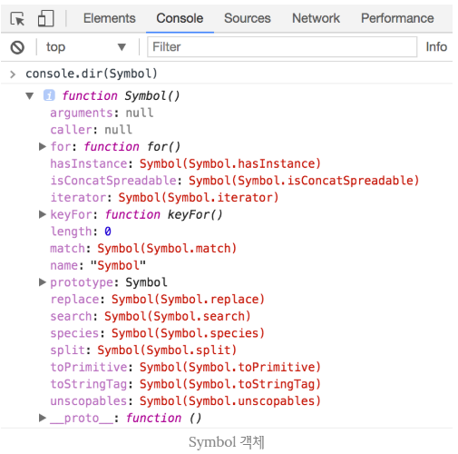

##### 출처

```
https://medium.com/@pks2974/javascript%EC%99%80-%EC%8B%AC%EB%B3%BC-symbol-bbdf3251aa28

https://poiemaweb.com/es6-symbol
```


### 심볼 (Symbol)

------

> 1997년 자바스크립트가 ECMAScript로 처음 표준화된 이래로 자바스크립트는 6개의 데이터타입을 가지고 있었다. 이 6개의 데이터타입은 다음과 같다.

> ##### 원시 데이터타입 (Primitive Datatype)
>
> Boolean, Number, String, null, undefined

> ##### 객체 데이터타입 (Object Datatype)
>
> Object

> 심볼은 ES6에서 새롭게 추가된 7번째 타입으로 변경 불가능한 원시 타입의 값이다. 심볼은 주로 이름 충돌 위험이 없는 유일한 객체의 프로퍼티 키(Property Key)를 만들기 위해 사용한다. 심볼은 객체의 프로퍼티 키를 만들 수 있는 원시 데이터타입이다.


#### 심볼의 생성

------

> 심볼은 Symbol() 함수로 생성한다. Symbol() 함수는 호출될 때마다 Symbol 값을 생성한다. 이때 생성된 Symbol은 객체가 아니라 변경 불가능한 원시 타입의 값이다.
>
> 심볼 생성에 대한 예시는 다음과 같다.

```javascript
// 심볼 mySymbol은 이름의 충돌 위험이 없는 유일한 프로퍼티 키
let mySymbol = Symbol();

console.log(mySymbol);			// Symbol()
console.log(typeof mySymbol);	// symbol
```

> 위의 예시에서 알 수 있듯이, Symbol 함수는 String, Number, Boolean과 같이 래퍼 객체를 생성하는 생성자 함수와는 달리 new 연산자를 사용하지 않는다. new 연산자를 사용하여 호출할 경우 다음과 같이 에러가 발생한다.

```javascript
new Symbol(); // TypeError: Symbol is not a constructor
```


##### String Description

> Symbol() 함수에는 문자열을 인자로 전달할 수 있다. 이 문자열은 Symbol 생성에 어떠한 영향을 주지 않으며 다만 생성된 Symbol에 대한 설명(description)으로 디버깅 용도로만 사용된다.
>
> 이에 대한 예시는 다음과 같다.

```javascript
let symbolWithDesc = Symbol('ungmo2');

console.log(symbolWithDesc); 
// Symbol(ungmo2)
console.log(symbolWithDesc === Symbol('ungmo2')); 
// false
```


#### 심볼의 사용

------

> 객체의 프로퍼티 키는 빈 문자열을 포함하는 모든 문자열로 만들 수 있다.

```javascript
const obj = {};

obj.prop = 'myProp';
obj[123] = 123; 	
/*
프로퍼티 키 123은 '123'의 문자열로 변환된다.
단, 값을 참조할 때에는 반드시 obj[123] 또는 obj['123']으로 접근해야 한다. 
obj.123 또는 obj.'123' 등으로 접근하면 SyntaxError 발생
*/

obj['prop' + 123] = false;
// 프로퍼티 키는 prop123이 된다.

console.log(obj);
// {123: 123, prop: "myProp", prop123: false}
```


##### 객체의 프로퍼티 키와 심볼

> Symbol 값도 객체의 프로퍼티 키로 사용할 수 있다. Symbol 값은 유일한 값이므로 Symbol 값을 키로 갖는 프로퍼티는 다른 어떠한 프로퍼티와도 충돌하지 않는다.
>
> 예시는 다음과 같다.

```javascript
const obj = {};

// 심볼의 생성 및 객체 프로퍼티로 할당 
const mySymbol = Symbol('desc');
obj[mySymbol] = 123;

console.log(obj); 				// { Symbol(desc): 123 }
console.log(obj[mySymbol]); 	// 123
```

> 심볼을 정의하면 독립적인 값이 되므로, 같은 string으로 정의해도 같은 값이 아니다. 이에 대한 예시는 다음과 같다.

```javascript
var symbolProperty1 = Symbol('key');
var symbolProperty2 = Symbol('key');

var obj = {};
obj[symbolProperty1] = 'value1';
obj[symbolProperty2] = 'value2';

// {Symbol(key): "value1", Symbol(key): "value2"}
console.log(obj);

// true
console.log(obj[symbolProperty1] === 'value1');
console.log(obj[symbolProperty2] === 'value2');
console.log(symbolProperty1 !== symbolProperty2);
```


#### 심볼 객체

------

##### Well-Known Symbol

> Symbol() 함수로 Symbol 값을 생성할 수 있었다. 이것은 Symbol이 함수 객체라는 의미이다. 브라우저 콘솔에서 Symbol을 참조해보자.
>
> 다음의 구문을 사용하면 된다.

```javascript
console.dir(Symbol)
```

> 이에 대한 결과는 다음과 같다.



> 위 참조 결과에서 알 수 있듯이 Symbol 객체는 프로퍼티와 메소드를 가지고 있다. Symbol 객체의 프로퍼티 중에 length와 prototype을 제외한 프로퍼티를 **Well-known Symbol**이라 한다.


##### Symbol.iterator

> Well-Known Symbol은 자바스크립트 엔진에 상수로 존재하며 자바스크립트 엔진은 Well-Known Symbol을 참조하여 일정한 처리를 한다. 예를 들어 어떤 객체가 Symbol.iterator를 프로퍼티 키로 사용한 메소드를 갖고 있으면 자바스크립트 엔진은 이 객체가 **이터레이션 프로토콜**을 따르는 것으로 간주하고 이터레이터로 동작하도록 한다.
>
> Symbol.iterator를 프로퍼티 키로 사용하여 메소드를 구현하고 있는 빌트인 객체(빌트인 이터러블)는 다음과 같다. 다음의 객체들은 이터레이션 프로토콜을 준수하고 있으며 이터레이터를 반환한다.

> ##### Array
>
> Array.prototype[Symbol.iterator]

> ##### String
>
> String.prototype[Symbol.iterator]

> ##### Map
>
> Map.prototype[Symbol.iterator]

> ##### Set
>
> Set.prototype[Symbol.iterator]

> ##### DOM data structures
>
> NodeList.prototype[Symbol.iterator]
>
> HTMLCollection.prototype[Symbol.iterator]

> ##### arguments
>
> arguments[Symbol.iterator]


> ##### Symbol.iterator에 대한 예시
>
> 이에 대한 예시는 다음과 같다.

```javascript
/* 
  이터러블
  Symbol.iterator를 프로퍼티 키로 사용한 메소드를 구현하여야 한다.
  배열에는 Array.prototype[Symbol.iterator] 메소드가 구현되어 있다.
*/
const iterable = ['a', 'b', 'c'];

/* 
  이터레이터
  이터러블의 Symbol.iterator를 프로퍼티 키로 사용한 메소드는 이터레이터를 반환한다.
*/
const iterator = iterable[Symbol.iterator]();
```

```javascript
/*
  이터레이터는 순회 가능한 자료 구조인 이터러블의 요소를 탐색하기 위한 포인터로서 value, done 프로퍼티를 갖는 객체를 반환하는 next()를 메소드로 갖는 객체이다. 이터레이터의 next() 메소드를 통해 이터러블 객체를 순회할 수 있다.
*/

console.log(iterator);			// Array Iterator {}
console.log(iterator.next());	// ƒ next() { [native code] }

console.log(iterator.next());	// {value: "a", done: false}
console.log(iterator.next());	// {value: "b", done: false}
console.log(iterator.next());	// {value: "c", done: false} 
console.log(iterator.next());	// {value: undefined, done: true}
```

> 위 예시에 대한 설명은 다음과 같다.
>
> iterable은 배열 객체로 Array.prototype에 Symbol.iterator를 키로하는 메소드가 이미 구현되어 있다. 따라서 **iterable[Symbol.iterator]** 구문은 프로토타입 체인에 의해 문제 없이 실행된다. 
>
> 이 때 **Symbol.iterator**를 프로퍼티 키로 사용한 메소드는 **이터레이터**를 반환한다. 반환된 이터레이터를 iterator 변수에 담아 사용할 수 있다.
>
> 반환된 이터레이터에는 next()라는 메소드가 존재한다. 이 메소드를 실행하면 value와 done이라는 프로퍼티를 갖는 객체를 반환한다. 순회가 종료되면 done의 값이 true로 변한다. 이 메소드를 통해 이터러블 객체를 순회할 수 있다.


##### Symbol.for

> Symbol.for 메소드는 인자로 전달받은 문자열을 키로 사용하여 Symbol 값들이 저장되어 있는 전역 Symbol 레지스트리에서 해당 키와 일치하는 저장된 Symbol 값을 검색한다. 이 때 검색에 성공하면 검색된 Symbol 값을 반환하고, 검색에 실패하면 새로운 Symbol 값을 생성하여 해당 키로 전역 Symbol 레지스트리에 저장한 후, Symbol 값을 반환한다.
>
> 예시는 다음과 같다.

```javascript
const s1 = Symbol.for('foo');
const s2 = Symbol.for('foo');

console.log(s1 === s2);		// true
```

> 위 예시에 대한 설명은 다음과 같다.
>
> s1 선언시에는 Symbol 레지스트리에 foo 키워드와 일치하는 Symbol 값이 없으므로 새로 생성하여 반환한다. s2 선언시에는 s1에 바인딩된 값이 존재하므로 이를 검색하여 반환한다. 따라서 s1과 s2에 바인딩된 Symbol 값은 같다.


> ##### 키를 갖는 공유 가능한 Symbol 값 반환
>
> Symbol 함수는 매번 다른 Symbol 값을 생성하는 것에 반해, **Symbol.for** 메소드는 하나의 Symbol을 생성하여 여러 모듈이 **키를 통해 같은 Symbol을 공유**할 수 있다. Symbol.for 메소드를 통해 생성된 Symbol 값은 반드시 키를 갖는다. 이에 반해 Symbol 함수를 통해 생성된 Symbol 값은 키가 없다.

```javascript
// Symbol.for를 활용한 생성. 키가 있어 keyFor 메소드로 접근 가능.
const sharedSymbol = Symbol.for('myKey');
const key1 = Symbol.keyFor(sharedkeSymbol);
console.log(key1);	// myKey

// Symbol을 활용한 생성. 키가 없어 keyFor 메소드로 접근 불가.
const unsharedSymbol = Symbol('myKey');
const key2 = Symbol.keyFor(unsharedSymbol);
console.log(key2);	// undefined
```


> ##### Symbol.keyFor
>
> Symbol.for로 정의한 Symbol은 전역에 존재하는 Symbol 레지스트리에 등록된다고 하였다. keyFor 메소드는 키를 인자로 하여 이 레지스트리에 해당 키를 갖는 Symbol 값이 존재하는지 탐색하고 일치하는 값이 있을 경우 해당 값을 반환한다. 