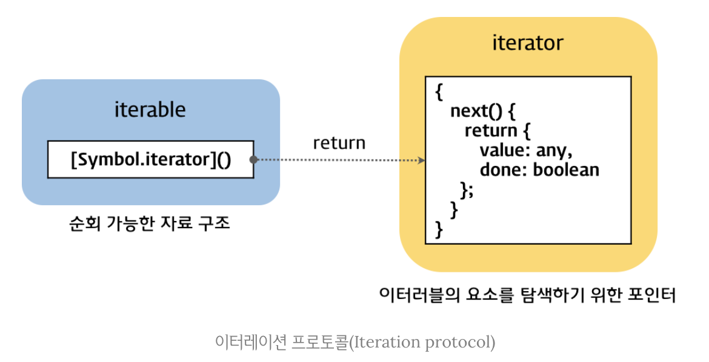

### 이터레이션 (Iteration)

------


#### 이터레이션 프로토콜 (Iteration Protocol)

------

> ES6에서 도입된 이터레이션 프로토콜은 데이터 컬렉션을 순회하기 위한 프로토콜(미리 약속된 규칙)이다. 이터레이션 프로토콜을 준수한 객체는 다음의 두 가지가 가능하다.

* for...of 문으로 순회할 수 있다.
* Spread 문법의 피연산자가 될 수 있다.

> 이터레이션 프로토콜에는 **이터러블 프로토콜, 이터레이터 프로토콜**이 있다.




##### 이터러블 (iterable)

> 이터러블이란, 이터러블 프로토콜을 준수한 객체를 말한다. 이터러블은 Symbol.iterator 메소드를 구현하거나 프로토타입 체인에 의해 상속한 객체를 말한다. Symbol.iterator 메소드는 이터레이터를 반환한다. 이터러블은 for...of 문에서 순회할 수 있으며, Spread Operator의 대상으로 사용이 가능하다.

> ##### 배열 === 이터러블
>
> 배열은 Symbol.iterator 메소드를 소유한다. 따라서 배열은 이터러블 프로토콜을 준수한 이터러블이다.

```javascript
const array = [1, 2, 3];

// Symbol.iterator가 있으므로 이터러블이다.
console.log(Symbol.iterator in array);	// true

// 이터러블은 for...of를 통해 순회가 가능하다.
for (const item of array) {
  console.log(item);
}		
// 1, 2, 3
```

> ##### 객체 !== 이터러블
>
> 일반 객체는 Symbol.iterator 메소드를 소유하지 않는다. 따라서 일반 객체는 이터러블 프로토콜을 준수한 이터러블이 아니다.

```javascript
const obj = { a: 1, b: 2, c: 3 };

// 일반 객체는 Symbol.iterator를 소유하지 않는다. 따라서 이터러블이 아니다.
console.log(Symbol.iterator in obj); 	// false

// 이터러블이 아닌 객체는 for...of로 순회할 수 없다.
for (const prop of obj) {
  console.log(prop);
}	
// TypeError: obj is not iterable
```

> 일반 객체는 이터러블이 아니므로 for...of로 순회할 수 없으며, Spread 문법의 대상으로 사용할 수 없다. 하지만 일반 객체도 이터러블 프로토콜을 준수하도록 구현한다면 이터러블이 된다. 이는 아래의 **커스텀 이터러블**에서 살펴볼 예정이다.


##### 이터레이터 (iterator)

> 이터레이터란, 이터레이터 프로토콜을 준수한 객체이다. 이터레이터 프로토콜은 **next** 메소드를 소유한다. next 메소드를 호출하면 이터러블을 순회하며 `value`, `done` 프로퍼티를 갖는 **Iterator Result Object**를 반환한다.
>
> 이터러블의 Symbol.iterator 메소드를 실행하면 해당 이터러블을 순회하는 이터레이터를 반환하다. 반환된 이터레이터의 next 메소드를 호출함으로써 이터러블을 순회할 수 있다. 예시를 보자.

```javascript
const array = [1, 2, 3];
const iterator = array[Symbol.iterator]();	// 이터레이터 반환
console.log('next' in iterator);						// true

let iteratorResult = iterator.next()				// next 메소드 호출
console.log(iteratorResult);
// {value: 1, done: false}
```

> 이 예시의 `iterator.next` 메소드를 계속 호출하여 반환값을 출력해보면 다음과 같다.

```javascript
console.log(iterator.next()); // {value: 2, done: false}
console.log(iterator.next()); // {value: 3, done: false}
console.log(iterator.next()); // {value: undefined, done: true}
```

> ##### iterator.next 메소드와 Iterator Result Object
>
> 이터레이터의 next 메소드는 이터러블의 각 요소를 순회하기 위한 포인터의 역할을 한다. next 메소드를 호출하면 이터러블을 순차적으로 한 단계씩 순회하면서 Iterator Result Object를 반환한다. 이 객체에는 value, done의 프로퍼티를 갖는다. 
>
> value는 현재 순회 중인 이터러블의 값이다. 만약 순회가 완료된 경우라면, 값이 할당되지 않아 undefined이다. done 프로퍼티는 이터러블의 순회 완료 여부를 의미한다. 순회가 완료되기 전까지는 false, 완료된 후에는 true 값을 갖는다.


#### 빌트인 이터러블 (built-in iterable)

------

> ES6에서 제공하는 빌트인 이터러블은 다음과 같은 것들이 있다.

* Array
* String
* Map
* Set
* Arguments
* DOM data structure(NodeList, HTMLCollection)
* TypedArray(Int8Array, Uint8Array, Uint8ClampedArray, Int16Array, Uint16Array, Int32Array, Uint32Array, Float32Array, Float64Array)

> 빌트인 이터러블에 대한 예시를 보자.

```javascript
// Array
const array = [1, 2, 3]
let iterator = array[Symbol.iterator]();

for (let i = 0; i < array.length + 1; i++) {
  console.log(iterator.next());
}
/*
- iterator.next 순회
{value: 1, done: false}
{value: 2, done: false}
{value: 3, done: false}
{value: undefined, done: true}
*/


for (const item of array) {
  console.log(item);
}
/*
- for... of 순회
1 2 3
*/
```

```javascript
// String
const string = 'string';
let iterator = string[Symbol.iterator]();

for (let i = 0; i < string.length + 1; i++) {
  console.log(iterator.next());
}
/*
- iterator.next 순회
{value: "s", done: false}
{value: "t", done: false}
{value: "r", done: false}
{value: "i", done: false}
{value: "n", done: false}
{value: "g", done: false}
{value: undefined, done: true}
*/

for (const letter of string) {
  console.log(letter);
}
/*
- for... of 순회
s t r i n g
*/
```

```javascript
// Arguments
const params = 'params';

(function() {
  let iterator = arguments[Symbol.iterator]();
  
  for (let i = 0; i < arguments.length + 1; i++) {
    console.log(iterator.next());
  }
  
  for (const letter of arguments) {
    console.log(letter);
  }
}(...params));
/*
- iterator.next 순회
{value: "p", done: false}
{value: "a", done: false}
{value: "r", done: false}
{value: "a", done: false}
{value: "m", done: false}
{value: "s", done: false}
{value: undefined, done: true}
*/

/*
- for... of 순회
p a r a m s
*/
```


##### ※ 이터레이션 프로토콜의 필요성

> 그런데 이렇게 다소 사용이 번거로워 보이는 이터레이션 프로토콜이 필요한 이유는 무엇일까? 이유는 오히려 번거로움을 줄이기 위함이다. 이터레이션 프로토콜을 준수하는 이터러블에는 Array, String, Arguments, Map, Set 등 다양한 객체들을 포함한다고 앞서 언급하였다. 만약 이러한 객체들이 이터러블이 아니라면, 이터레이션 프로토콜을 준수하지 않는다고 가정하면 어떻게 될까? 
>
> 우리는 각 객체에 따라 다르게 구현된 순회 방식을 사용하거나, 혹은 직접 순회 방식을 구현하여 사용해야 할 것이다. 이는 매우 번거로우며, 효율적이지 않을 것이다. 따라서 객체가 각자 자신만의 순회 방식을 갖는 것 보다 통일된 순회 방식을 여러 종류의 객체에 적용하는 것이 효율적일 것이다. 


> 이터레이션 프로토콜이 필요한 이유는 이 때문이다. 이터레이션 프로토콜은 다양한 데이터 소스(객체)가 하나의 순회 방식을 갖도록 규정하여 사용자가 효율적으로 다양한 데이터 소스를 사용할 수 있도록 하는 인터페이스의 역할을 한다.


#### for...of 문

------

> 그 동안 순회에 자주 사용해온 for...of 문의 동작 방식은 이터레이터와 관련이 있다. for...of 문의 동작 방식은 다음과 같은 절차로 진행된다.

* for...of 문은 내부적으로 이터레이터의 next 메소드를 호출한다.
* next 메소드를 호출함으로써 이터러블을 순회하고, 반환된 Iterator Result Object의 value 프로퍼티의 값을 for...of 문의 변수에 할당한다.
* done 프로퍼티의 값이 false이면 이터러블의 순회를 계속한다. 값이 true이면 순회를 중단한다.


> 이터러블을 for...of로 순회하는 예시는 다음과 같다.

```javascript
// Array
for (const item of ['a', 'b', 'c']) {
  console.log(item);
}
// a b c
```

```javascript
// String
for (const letter of 'abc') {
  console.log(letter);
}
// a b c 
```

```javascript
// Map
for (const [key, value] of new Map([['a', '1'], ['b', '2'], ['c', '3']])) { 
  console.log(key, value) 
}
/*
a 1
b 2
c 3
*/
```

```javascript
// Set
for (const value of new Set([1, 2, 3])) {
	console.log(value); 
}
// 1 2 3
```


> for...of 문의 내부 동작을 for 문으로 표현하면 다음과 같다.

```javascript
const iterable = [1, 2, 3];
const iterator = iterable[Symbol.iterator]();
let value;	// for...of문에서 선언된 변수

for (;;) {
    const res = iterator.next();	// next()로 순회 진행
    if (res.done) break;					// 순회가 완료되면 반복문 종료
    value = res.value;						// 변수에 value 프로퍼티의 값 할당
  	console.log(value);						// 변수 처리 로직
}
// 1 2 3
```


#### 커스텀 이터러블

------

##### 커스텀 이터러블의 구현

> 위에서 일반적인 객체는 이터러블에 해당되지 않으므로 Symbol.iterator 메소드를 호출할 수 없으며, for...of를 활용한 순회 방식도 사용할 수 없다는 것을 살펴보았다. 
>
> 다음의 예시를 통해 이 사실을 다시 한번 확인해보자.

```javascript
const obj = { 'a': 1, 'b': 2 };

// 일반 객체는 Symbol.iterator를 소유하거나 상속받지 않는다.
console.log(Symbol.iterator in obj); 	// false

// 일반 객체는 for...of를 활용하여 순회할 수 없다.
for (const p of obj) {
  console.log(p);
}
// TypeError: obj is not iterable
```

> 그러나 일반 객체가 이터레이션 프로토콜을 준수하도록 구현하면 일반 객체 역시 이터러블이 될 수 있다. 


> ##### 커스텀 이터러블 구현 예 : 피보나치 수열
>
> 다음은 피보나치 수열을 구현한 이터러블의 예시이댜.

```javascript
const fibonacci = {
  // Symbol.iterator를 구현하여 이터러블 프로토콜을 준수한다.
  [Symbol.iterator]() {
    let [pre, cur] = [0, 1];
    const max = 10;
    
    // Symbol.iterator는 iterator 객체를 반환해야 한다.
    return {
      // iterator 객체는 next 메소드를 갖고 있어야 한다.
      next() {
        [pre, cur] = [cur, cur + pre];
        // next 메소드는 Iterator Result Object({ value, done })을 반환해야 한다.
        return {
          value: cur,
          done: cur >= max
        };
      }
    };
  }
};
```

> 이터러블인 fibonacci를 for...of로 순회하면 다음과 같다.

```javascript
for (const num of fibonacci) {
    console.log(num);
}
// 1 2 3 5 8
```


> ##### 커스텀 이터러블 구현 시 준수 사항
>
> 이터러블을 직접 구현하고자 할 때 다음을 준수하면 된다.

* 객체 내부에 Symbol.iterator를 구현한다. 이 메소드는 반드시 iterator 객체를 반환하도록 한다.
* iterator  객체는 반드시 내부에 next 메소드를 갖는다. next 메소드는 반드시 Iterator Result Object를 반환한다.
* Iterator Result Object는 내부에 value, done 프로퍼티를 갖는다. done 프로퍼티가 true가 될 수 있도록 정의한다.


> ##### 이터러블의 사용
>
> 이터러블이 사용되는 곳은 다음과 같다.

* for...of
* 전개 연산자 (Spread Operator)
* 디스트럭처링 (Destructuring)
* Map, Set의 생성자

> 이 중 전개 연산자와 디스트럭처링의 예시를 보자.

```javascript
// Spread Operator
const arr = [...fibonacci];
console.log(arr); 
// [1, 2, 3, 5, 8]

// Destructuring
const [first, second, ...rest] = fibonacci;
console.log(first, second, rest);
// 1 2 [3, 5, 8]
```

> 전개 연산자와 디스트럭처링을 활용하면 이터러블, 또는 이터러블의 일부를 쉽게 배열로 변환할 수 있다.


##### 이터러블 생성(반환) 함수의 구현