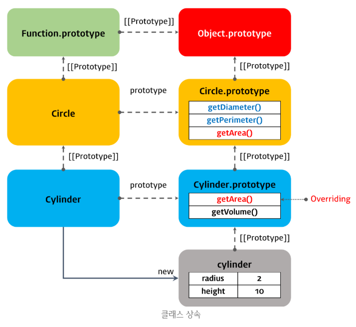

### 클래스 (Class)

------

> 자바스크립트는 프로토타입 기반 객체지향 언어이다. 비록 다른 객체지향 언어들과의 차이점에 대한 논쟁이 있긴 하지만, 자바스크립트는 강력한 객체지향 프로그래밍 능력을 갖고 있다.
>
> 프로토타입 기반 프로그래밍은 클래스가 필요없는 객체지향 프로그래밍 스타일로 프로토타입 체인과 클로저 등으로 객체지향 언어의 상속, 캡슐화(정보 은닉) 등의 개념 구현이 가능하다.

```javascript
// ES5
var Person = (function () {
    // Constructor
    function Person(name) {
        this._name = name;
    }
    
    // Public Method
    Person.prototype.sayHi = function() {
        console.log('Hi' + this._name);
    };
    
    // return Constructor
    return Person;
}());

var me = new Person('Lee');
me.sayHi(); // Hi! Lee.

console.log(me instanceof Person); // true
```

> 위 예제를 프로토타입 관점에서 표현하자면 아래와 같다.


##### 클래스의 도입 이유와 JS 클래스의 본질

> 그러나 클래스 기반 언어에 익숙한 프로그래머들은 프로토타입 기반 프로그래밍 방식이 혼란스러울 수 있으며 자바스크립트를 어렵게 느끼게하는 하나의 장벽처럼 인식되었다.
>
> ES6의 클래스는 기존 프로토타입 기반 객체지향 프로그래밍보다 클래스 기반 언어에 익숙한 프로그래머가 보다 빠르게 학습할 수 있는 단순명료한 새로운 문법을 제시하고 있다. 그렇다고 ES6의 클래스가 기존의 프로토타입 기반 객체지향 모델을 폐지하고 새로운 객체지향 모델을 제공하는 것은 아니다.
>
> 자바스크립트의 클래스의 본질은 함수이다. 따라서 자바스크립트의 클래스는 기존 프로토타입 기반 패턴의 문법적 설탕(Syntactic Sugar)이라 볼 수 있다. 다만, 클래스와 생성자 함수가 정확히 동일하게 동작하는 것은 아니며, 클래스가 보다 엄격하다.


#### 클래스의 정의

------

> ES6 클래스는 class 키워드를 사용하여 정의한다. 앞에서 살펴본 Person 생성자 함수를 클래스로 정의할 수 있다. 클래스 이름은 생성자 함수와 같이 파스칼 케이스를 사용하는 것이 일반적이다.

```javascript
// Class Definition
class Person {
    // constructor
    constructor(name) {
        this._name = name;
    }
    
    // method
    sayHi() {
        console.log(`Hi ${this._name}`);
    }
}
```

```javascript
// Instacne Creation
const me = new Person('Lee');
me.sayHi(); // Hi! Lee

console.log(me instanceof Person); // true
```


##### 클래스 선언과 호이스팅

> 클래스는 클래스 선언문 이전에 참조할 수 없다.

```javascript
console.log(Foo);
// ReferenceError: Cannot access 'Foo' before initialization

class Foo {}
```

> 그러나 호이스팅이 발생하지 않는 것은 아니다. 클래스는 var 키워드로 선언한 변수처럼 호이스팅 되는 것이 아니라 let, const 키워드로 선언한 변수처럼 호이스팅된다. 따라서 클래스 선언문 이전에 일시적 사각지대에 빠지므로 호이스팅이 되지 않는 것처럼 보일 뿐이다.
>
> 클래스에도 호이스팅이 적용되는 것은 다음 구문을 통해 확인할 수 있다.

```javascript
const Foo = '';

{
    // 만약 호이스팅이 발생하지 않는다면 ''가 출력되어야 한다.
    console.log(Foo);
    // ReferenceError: Cannot access 'Foo' before initialization
  	class Foo {}
}
```

> 클래스 선언문도 변수 선언, 함수 정의와 마찬가지로 호이스팅이 발생한다. 호이스팅은 var, let, const, function, function*, class 키워드를 사용한 모든 선언문에 대해 적용된다. 
>
> 이는 선언문을 통해 모든 식별자(변수, 함수, 클래스 등)은 호이스팅 됨을 의미한다. 모든 선언문은 런타임 이전에 먼저 실행되기 때문이다.


##### 표현식을 활용한 클래스의 정의

> 일반적이지는 않지만, 표현식으로도 클래스를 정의할 수 있다. 함수와 마찬가지로 클래스는 이름을 가질 수도, 갖지 않을 수도 있다. 이때 클래스가 할당된 변수를 사용해 클래스를 생성하지 않고 기명 클래스의 클래스 이름을 사용해 클래스를 생성하면 에러가 발생한다. 이는 함수와 마찬가지로 클래스 표현식에서 사용한 클래스 이름은 외부코드에서 접근하는 것이 불가능하기 때문이다. 이에 대한 내용 이해 및 참조는 함수 표현식을 참고하면 된다.

```javascript
// 클래스명 MyClass는 함수 표현식과 동일하게 클래스 몸체 내부에서만 유용하다.

const Foo = class MyClass {};

const foo = new Foo();
console.log(foo); // MyClass {}

new MyClass();
// ReferenceError: MyClass is not defined
```


#### 인스턴스 생성

------

> 생성자 함수처럼 new 연산자와 함께 클래스 이름을 호출하면 클래스의 인스턴스가 생성된다.

```javascript
class Foo {}

const foo = new Foo();
```

> 위 코드에서 new 연산자와 함께 호출한 Foo는 클래스 이름이 아니라 constructor(생성자)이다. 표현식이 아닌 선언식으로 정의한 클래스의 이름은 constructor와 동일하다. Foo가 생성자 함수임을 다음 구문을 통해 확인할 수 있다.

```javascript
// Foo는 사실 생성자 함수이다.
// 다음 구문은 true를 출력한다.
console.log(Object.getPrototypeOf(foo).constructor === Foo);
```

> new 연산자 없니 생성자를 호출하는 것은 불가능하다. 만약 호출하게 되면 다음과 같이 TypeError가 발생한다.

```javascript
class Foo {}

const foo = Foo();
// TypeError: Class constructor Foo cannot be invoked without 'new'
```


#### 생성자 (Constructor)

------

> 생성자는 인스턴스를 생성하고, 클래스 필드를 초기화하기 위한 특수한 메소드이다. 


##### ※ 클래스 필드

> 클래스 내부의 캡슐화된 변수를 말한다. 데이터 멤버 또는 멤버 변수라고도한다. 클래스 필드는 인스턴스의 프로퍼티 또는 정적 프로퍼티가 될 수 있다. 쉽게 말해, 자바스크립트의 생성자 함수에서 this에 추가한 프로퍼티를 클래스 기반 객체지향 언어에서는 클래스 필드라고 부른다.


##### 생성자의 정의와 사용

```javascript
// 클래스 선언문
class Person {
    // constructor(생성자). 이름을 바꿀 수 없다.
    constructor(name) {
        // this는 클래스가 생성할 인스턴스를 가리킨다.
        // _name은 클래스 필드이다.
        this._name = name;
    }
}
```

```javascript
// 인스턴스 생성
const me = new Person('Lee');
console.log(me);
```

> constructor는 클래스 내에 한 개만 존재할 수 있으며 만약 클래스가 두 개 이상의 constructor를 포함하면 문법 에러가 발생한다. 인스턴스를 생성할 때 new 연산자와 함께 호출한 것이 바로 constructor이며 constructor의 파라미터에 전달한 값은 클래스 필드에 할당한다.


##### 생성자의 생략 및 동적 프로퍼티 추가

> constructor는 생략할 수 있다. constructor를 생략하면 클래스에 `constructor() {}`를 포함한 것과 동일하게 동작한다. 즉, 빈 객체를 생성한다. 따라서 인스턴스에 프로퍼티를 추가하려면 인스턴스를 생성한 이후, 프로퍼티를 동적으로 추가해야 한다.

```javascript
class Foo {}

const foo = new Foo();
console.log(foo); // Foo {}

// 프로퍼티 동적 할당 및 초기화
foo.num = 1;
console.log(foo);
```


##### 생성자의 사용과 클래스 필드 초기화

> constructor는 인스턴스의 생성과 동시에 클래스 필드의 생성과 초기화를 실행한다. 따라서 클래스 필드를 초기화해야 한다면 constructor를 생략해서는 안된다.

```javascript
class Foo {
    // 생성자는 인스턴스의 생성과 동시에 클래스 필드의 생성과 초기화를 실행한다.
    constructor(num) {
        this.num = num;
    }
}

const foo = new Foo(1);
console.log(foo);
```


#### 클래스 필드

------

##### 클래스 필드의 선언

> 클래스 몸체에는 메소드만 선언할 수 있다. 클래스 바디에 클래스 필드(멤버 변수)를 선언하면 문법 에러가 발생한다.

```javascript
class Foo {
    name = '';  // SyntaxError
	
	constructor() {}
}
```

> 다만 위 예제를 최신 버전의 브라우저나(Chrome 72 이상) 또는 최신 Node.js(버전 12 이상)에서 실행하면 정상 동작한다. 이는 2019년 5월 현재 TC39 프로세스의 stage 3(candidate) 단계에 있는 클래스 몸체에서 직접 인스턴스 필드를 선언하고 private 인스턴스 필드를 선언할 수 있는 프로포절 Class field declarations proposal의 Field declarations을 최신 브라우저와 최신 Node.js가 구현했기 때문이다.
>
> 그러나 위의 경우 처럼 최신 버전이 아닌 경우에는 에러가 발생하므로, 클래스 필드의 선언과 초기화는 반드시 constructor 내부에서 실시해야 한다.

```javascript
class Foo {
    constructor(name = '') {
        this.name = name; // 클래스 필드의 선언과 초기화
    }
}

const foo = new Foo('Lee');
console.log(foo);
```


##### 클래스 필드의 참조

> constructor 내부에서 선언한 클래스 필드는 클래스가 생성할 인스턴스를 가리키는 this에 바인딩한다. 이로써 클래스 필드는 클래스가 생성할 인스턴스의 프로퍼티가 되며, 클래스의 인스턴스를 통해 클래스 외부에서 언제나 참조할 수 있다. 즉, 언제나 public이다.
>
> 사실 ES6의 클래스는 다른 객체지향 언어처럼 private, public, protected 키워드와 같은 접근제한자를 지원하지 않는다.

```javascript
class Foo {
    constructor(name='') {
        this.name = name; // public 클래스 필드
    }
}

const foo = new Foo('Lee');
console.log(foo.name); // 클래스 외부에서 참조할 수 있다.
```


#### Class Field Declarations Proposal

------

> 2019년 5월 TC39 프로세스의 stage 3(candidate) 단계에 잇는 Class Field Declarations Proposal과 Static Class Features에는 클래스에 관련한 몇 가지 새로운 표준안이 제안되었다. 그 표준안은 다음과 같다.

* Field Declarations
* Private Field
* Static Public Fields

> (작성 예정 ...) 이에 대한 자세한 내용 및 예시


#### Getter, Setter

------

##### Getter

> Getter는 클래스 필드에 접근할 때마다 클래스 필드의 값을 조작하는 행위가 필요할 때 사용한다. getter는 메소드 이름 앞에 `get` 키워드를 사용해 정의한다.  이때 메소드 이름은 클래스 필드 이름처럼 사용된다. 
>
> Getter는 호출하는 것이 아니라 프로퍼티처럼 참조하는 형식으로 사용하며 참조 시에 메소드가 호출된다. Getter를 정의할 때에는 용도에 맞게 사용되도록 반드시 무언가를 반환하도록 정의해야 한다. 

```javascript
const foo = new Foo([1, 2]);
console.log(foo.firstElem); // 1
```


##### Setter

> Setter는 클래스 필드에 값을 할당할 때마다 클래스 필드의 값을 조작하는 행위가 필요할 때 사용한다. Setter는 메소드 이름 앞에 `set` 키워드를 사용해 정의한다. 이때 메소드 이름은 클래스 필드 이름처럼 사용된다. Setter 역시 호출하는 것이 아니라 프로퍼티처럼 값을 할당하는 형식으로 사용하며, 할당 시에 메소드가 호출된다.


##### 정의 및 호출 예시

> Getter, Setter의 사용 예시는 다음과 같다.

```javascript
class Foo {
    constructor(arr = []) {
        this._arr = arr;
    }
    
    // getter : get 키워드 뒤에 오는 메소드 이름 firstElem은 클래스 필드 이름처럼 사용된다.
    get firstElem() {
        // getter는 반드시 무언가를 반환해야 한다.
        return this._arr.length ? this._arr[0] : null;
    }
    
    // setter : set 키워드 뒤에 오는 메소드 이름 firstElem은 클래스 필드 이름처럼 사용된다.
    set firstElem(elem) {
        // ...this._arr는 this._arr를 개별 요소로 분리한다.
        this._arr = [elem, ...this._arr];
    }
}
```

```javascript
// Getter 호출 예시
const foo = new Foo([1, 2]);

// 필드 firstElem에 접근하면 getter가 호출된다.
console.log(foo.firstElem);	// 1
```

```javascript
// Setter 호출 예시
const foo = new Foo([1, 2]);

// 클래스 필드 firstElem에 값을 할당하면 setter가 호출된다.
foo.firstElem = 100;
console.log(foo.firstElem); // 100
```


##### 접근자 프로퍼티 (Accessor Property)

> Getter와 Setter는 클래스에서 새롭게 도입된 기능이 아니다. Getter와 Setter는 접근자 프로퍼티이다. 이 접근자 프로퍼티는 인스턴스의 프로퍼티가 아니라 프로토타입의 프로퍼티이다.
>
> 다음의 예시를 보자.

```javascript
// _arr는 데이터 프로퍼티이다.
// {value: Array(3), writable: true, enumerable: true, configurable: true} 라고 출력된다.
console.log(Object.getOwnPropertyDescriptor(foo, '_arr'));
```

```javascript
// firstElem은 접근자 프로퍼티이다. 접근자 프로퍼티는 프로토타입의 프로퍼티이다.
// {enumerable: false, configurable: true, get: ƒ, set: ƒ} 라고 출력된다.
console.log(Object.getOwnPropertyDescriptor(Foo.prototype, 'firstElem'));
```


#### 정적 메소드 (Static Method)

------

##### 정적 메소드의 정의와 호출

> 클래스의 정적 메소드를 정의할 때 `static` 키워드를 사용한다. 정적 메소드는 클래스의 인스턴스가 아닌 클래스 이름으로 호출한다. 따라서 클래스의 인스턴스를 생성하지 않아도 호출할 수 있다.

```javascript
// 정적 메소드의 정의
class Foo {
    constructor(prop) {
        this.prop = prop;
    }
    
    static staticMethod() {
    	/*
    	정적 메소드는 this를 사용할 수 없다.
    	정적 메소드 내부에서 this는 클래스의 인스턴스가 아닌 클래스 자신을 가리킨다.
    	*/
        return 'staticMethod';
    }
    
    prototypeMethod() {
        return this.prop;
    }
}
```

```javascript
// 정적 메소드의 호출
console.log(Foo.staticMethod());

const foo = new Foo(123);
// 정적 메소드는 인스턴스를 통한 호출이 불가능하다.
console.log(foo.staticMethod());
// Uncaught TypeError: foo.staticMethod is not a function
```

> 대신 클래스의 정적 메소드는 인스턴스로 호출할 수 없다. 이것은 정적 메소드는 this를 사용할 수 없다는 것을 의미한다. 일반 메소드 내부에서 this는 클래스의 인스턴스를 가리키며, 메소드 내부에서 this를 사용한다는 것은 클래스의 인스턴스의 생성을 전제로 하는 것이다.
>
> 정적 메소드는 클래스 이름으로 호출하기 때문에 클래스의 인스턴스를 생성하지 않아도 사용할 수 있다. 단, this를 사용할 수 없다. 이를 달리 말하면 메소드 내부에서 this를 사용할 필요가 없는 메소드는 정적 메소드로 만들 수 있다. 정적 메소드는 Math 객체의 메소드처럼 애플리케이션 전역에서 사용할 유틸리티 함수를 생성할 때 주로 사용한다.
>
> 정적 메소드는 클래스의 인스턴스 생성없이 클래스의 이름으로 호출하되 클래스의 인스턴스로 호출할 수 없는 이유에 대해 알기 위해서는 `Javascript OOP`에 대한 지식과 이해를 필요로 한다.


##### 정적 메소드와 프로토타입 체인

> 왜 정적 메소드를 인스턴스에서 참조하는 것이 불가능할까? 
>
> 우선 위의 예시를 ES5의 문법으로 표현한 예시 코드를 보자. 다음의 예시 코드는 위의 예시 코드와 동일하게 동작하는데, 이는 앞서 언급하였듯이 JS에서 클래스의 본질은 함수이며, ES6에서의 클래스는 문법적 설탕이기 때문이다.

```javascript
var Foo = (function () {
    // 생성자 함수
    function Foo(prop) {
        this.prop = prop;
    }
    
    Foo.staticMethod = function() {
        return 'staticMethod';
    };
    
    Foo.prototype.prototypeMethod = function() {
        return this.prop;
    };
    
    return Foo;
}());
```

```javascript
var foo = new Foo(123);
console.log(foo.prototypeMethod()); // 123
console.log(Foo.staticMethod()); // staticMethod
console.log(foo.staticMethod());
// Uncaught TypeError: foo.staticMethod is not a function
```

> 사실 staticMethod로 정의된 함수는 Foo.prototype의 메소드에 해당되지 않는다. staticMethod로 정의된 함수는 생성자 함수인 Foo의 메소드이다. 생성자 함수 역시 함수 객체이므로 메소드를 가질 수 있으므로 문제가 없다. 
>
> 이에 대한 참고 이미지는 다음과 같다.


> 이제 인스턴스 foo에서 정적 메소드를 참조하는 것이 불가능한 이유를 위의 이미지를 통해 명확히 알 수 있게되었다. 정적 메소드는 프로토타입 객체가 아닌 생성자 함수 내부에 정의되기 때문이다.


#### 클래스 상속 (Class Inheritance)

------

> 클래스 상속은 코드 재사용 관점에서 매우 유용하다. 새롭게 정의할 클래스가 기존에 있는 클래스와 매우 유사하다면, 상속을 통해 그대로 사용하되 다른 점만 추가로 구현하면 된다. 코드 재사용은 개발 비용을 현저히 줄이기 위해 매우 중요하다.


##### extends 키워드를 활용한 상속 구현

> extends 키워드는 부모 클래스를 상속받는 자식 클래스를 정의할 때 사용한다. 이해를 위해 부모 클래스 Circle을 상속받는 자식 클래스 Cylinder를 정의한 예시 코드는 다음과 같다.

```javascript
// 부모 클래스
class Circle {
    // 반지름을 클래스 필드로 정의
    constructor(radius) {
        this.radius = radius;
    }
    
    // 지름
    getDiameter() {
        return 2 * this.radius;
    }
    
    // 원의 둘레
    getPerimeter() {
        return 2 * Math.PI * this.radius;
    }
    
    // 원의 넓이
    getArea() {
        return Math.PI * Math.pow(this.radius, 2);
    }
}


// 자식 클래스
class Cylinder extends Circle {
    /* 
    	반지름은 부모 클래스의 생성자를 통한 초기화
    	높이는 자신의 클래스 필드로 초기화
    */
    constructor(radius, height) {
        super(radius);
        this.height = height;
    }
    
    // 원통의 넓이 : 오버라이딩, (원통의 높이 * 원의 둘레) + (2 * 원의 넓이)
    getArea() {
        return (this.height * super.getPerimeter()) + (2 * super.getArea());
    }
    
    // 원통의 부피
    getVolume() {
        return super.getArea() * this.height;
    }
}
```

>Cylinder는 Circle의 자식 클래스이므로 다음의 구문이 true임을 알 수 있다.

```javascript
// true
console.log(cylinder instanceof Cylinder);
console.log(cylinder instanceof Circle);
```


##### 상속과 프로토타입 체인

> 위 예시를 프로토타입 체인의 관점에서 본 이미지는 다음과 같다.



> 위의 이미지를 참고하여, 다음의 구문이 모두 true임을 알 수 있다.

```javascript
// true
console.log(cylinder.__proto__ === Cylinder.prototype);
console.log(Cylinder.prototype.__proto__ === Circle.prototype);
console.log(Circle.prototype.__proto__ === Object.prototype);
console.log(Object.prototype.__proto__ === null);
```


##### ※ 오버라이딩 / 오버로딩

> ##### 오버라이딩
>
> 상위 클래스가 가지고 있는 메소드를 하위 클래스에서 재정의하여 사용할때 부모 클래스의 메소드를 오버라이딩한다고 표현한다.

> ##### 오버로딩
>
> 자바와 같은 언어에서는 같은 이름을 가진 메소드여도 매개변수의 타입이나 개수, 순서 등이 다른 경우 매개변수에 따라 메소드를 구별하여 사용하는데 이를 오버로딩이라 한다. 자바스크립트는 오버로딩을 지원하지 않지만, arguments 객체를 사용하여 구현할 수 있다.


##### super 키워드를 활용한 부모 클래스 참조 또는 부모 클래스 생성자 호출

> super 키워드는 부모 클래스를 참조하거나 부모 클래스의 생성자를 호출하기 위해 사용한다. 이는 super 키워드가 객체로 사용되는지, 메소드로 사용되는 지에 따라 구분된다. 위의 Cylinder와 Circle에 관련한 예시를 다시 살펴보자.
>
> 먼저 super 키워드가 부모 클래스의 생성자를 호출하는 예시이다.

```javascript
constructor(radius, height) {
    super(radius);
    this.height = height;
}
```

> 이 예시에서는 super가 메소드로 사용되면서 부모 클래스의 생성자를 호출한다. 그리고 부모 클래스에 생성자에 필요한 인수를 전달한다. 따라서 super 메소드는 부모 클래스의 인스턴스를 생성하게 된다.
>
> 위의 예시에서처럼 자식 클래스의 생성자에서는 반드시 super()를 호출해야 한다. 만약 호출하지 않으면 this를 참조할 수 없다. 다음의 예시는 이를 보여준다.

```javascript
class Parent {}

class Child extends Parent {
    constructor() {}
}

const child = new Child();
// ReferenceError: Must call super constructor in derived class before accessing 'this' or returning from derived constructor
```

> 다음과 같이 참조 에러가 발생하는 것을 확인할 수 있다. 따라서 super() 메소드를 호출하기 이전에는 this를 참조할 수 없다.
>
> 그리고 아래는 super 키워드를 통해 부모 클래스를 참조하는 경우의 예시이다.

```javascript
getArea() {
    return (this.height * super.getPerimeter()) + (2 * super.getArea());
}
```

> 부모 클래스를 참조하는 이유는 부모 클래스의 필드 또는 메소드를 참조하기 위함이다. 이를 통해 위와 같이 메소드의 오버라이딩에 활용할 수 있다.


##### 정적 메소드의 상속

> 프로토타입 체인의 관점에서 바라보면 자식 클래스의 [[Prototype]] 내부 슬롯이 가리키는 프로토타입 객체는 부모 클래스이다. 
>
> 다음의 예시 코드와 이미지를 보자.

```javascript
class Parent {}
class Child extends Parent {}
```

> Child 클래스가 Parent 클래스를 상속하므로 다음의 구문은 true를 출력한다.

```javascript
// true
console.log(Child.prototype.__proto__ === Parent.prototype);
console.log(Child.__proto__ === Parent);
```

> 이를 이미지로 표현하면 다음과 같다.


> 위에서 정적 메소드는 프로토타입 객체가 아닌, 생성자 함수(또는 클래스, 클래스의 본질은 함수이므로)에 정의되는 것을 알 수 있었다. 위의 이미지를 보면 Parent에 정의된 정적 메소드는 Child에서도 프로토타입 체인에 의해 참조가 가능할 것으로 추측할 수 있을 것이다.
>
> 그리고 이 추측은 맞다. 다음의 예시 코드를 보자.

```javascript
class Parent {
  static staticMethod() {
    return 'staticMethod';
  }
}

class Child extends Parent {}
```

> Child 클래스에서 다음과 같이 Parent의 정적 메소드를 참조할 수 있다. 이는 곧 정적 메소드도 상속 가능함을 의미한다.

```javascript
// 'staticMethod'
console.log(Parent.staticMethod()); 
console.log(Child.staticMethod());
```

> 상속이 가능함은 당연히 정적 메소드의 오버라이딩 역시 가능함을 의미한다. 그리고 정적 메소드이므로 인스턴스에서는 정적 메소드를 참조할 수 없다는 점 또한 유지된다.
>
> 다음의 예시 코드를 보자.

```javascript
class Parent {
    static staticMethod() {
        return 'Hello';
    }
}

class Child extends Parent {
    static staticMethod() {
        return `${super.staticMethod()} world`;
    }
    
    prototypeMethod() {
        return `${super.staticMethod()} world`;
    }
}
```

> 오버라이딩이 가능하므로 다음의 구문은 문제없이 출력된다.

```javascript
console.log(Parent.staticMethod()); // 'Hello'
console.log(Child.staticMethod());  // 'Hello wolrd'
```

> 정적 메소드는 인스턴스에서 참조가 불가능하므로 다음의 구문은 에러를 발생시킨다.

```javascript
console.log(new Child().prototypeMethod());
// TypeError: (intermediate value).staticMethod is not a function
```

> 위의 예시를 이미지로 표현하면 다음과 같다.


