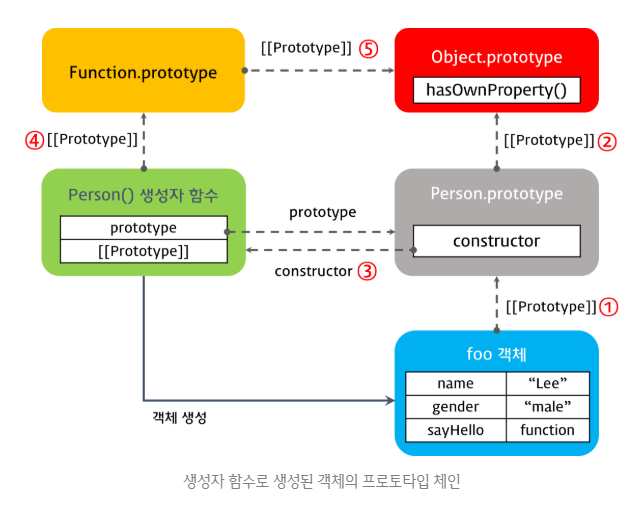
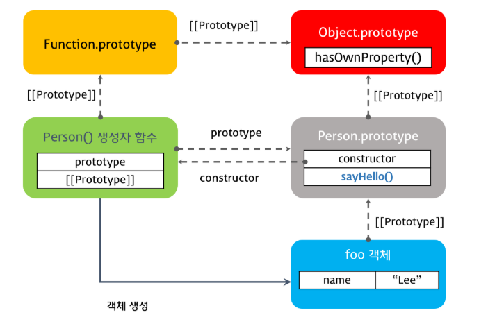
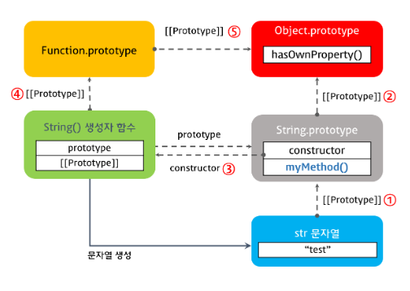
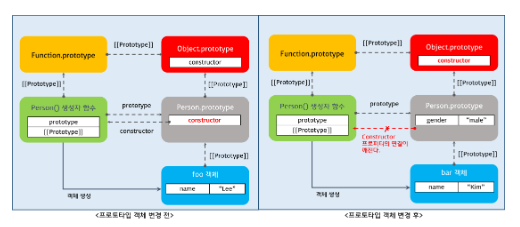
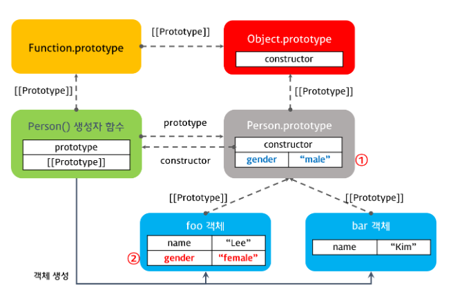

### Prototype

------

> Java, C++과 같은 클래스 기반 객체지향 프로그래밍 언어와 달리 자바스크립트는 프로토타입 기반 객체지향 프로그래밍 언어이다. 따라서 자바스크립트의 동작 원리를 이해하기 위해서는 프로토타입의 개념을 잘 이해하고 있어야 한다.
>
> 클래스 기반 객체지향 프로그래밍 언어에서는 객체 생성 이전에 클래스를 정의하고 이를 통해 객체를 생성한다. 하지만 프로토타입 기반 객체지향 프로그래밍 언어는 클래스 없이도 객체를 생성할 수 있다.
>
> 자바스크립트의 모든 객체는 자신의 부모 역할을 담당하는 객체와 연결되어 있다. 그리고 이는 마치 객체지향의 상속 개념과 같이 부모 객체의 프로퍼티 또는 메소드를 상속받아 사용할 수 있게 한다. 이러한 부모 객체를 Prototype(프로토타입) 객체 또는 프로토타입이라 한다.
>
> 이 프로토타입 객체는 생성자 함수에 의해 생성된 각각의 객체에 공유 프로퍼티를 제공하기 위해 사용한다.

```javascript
var student = {
    name: 'Lee',
    score: 90
};

// student에는 hasOwnProperty 메소드가 없으나 다음은 동작한다.
console.log(student.hasOwnProperty('name')); // true
```

> 다음의 구문을 활용하면 프로토타입 객체를 콘솔에서 확인할 수 있다.

```javascript
console.dir(student);
```


#### [[Prototype]]

------

> 자바스크립트의 모든 객체는  [[Prototype]]이라는 인터널 슬롯을 갖는다. 이 [[Prototype]]의 값은 null 또는 객체이며 상속을 구현하는 데 사용된다. [[Prototype]] 객체의 데이터 프로퍼티는 get 액세스를 위해 상속되어 자식 객체의 프로퍼티처럼 사용할 수 있다.
>
> [[Prototype]]의 값은 프로토타입 객체이며 `__proto__` access property로 접근할 수 있다.  `__proto__` 에 접근하면 내부적으로 Object.getPrototypeOf가 호출되어 프로토타입 객체를 반환한다.
>
> student 객체는  `__proto__`  프로퍼티로 자신의 부모 객체인 Object.prototype을 가리키고 있다. 이는 다음의 예시로 확인 가능하다.

```javascript
// true
console.log(student.__proto__ === Object.prototype); 
```

> 객체를 생성할 때 프로토타입은 결정된다. 결정된 프로토타입 객체는 다른 임의의 객체로 변경이 가능하다. 이것은 부모 객체인 프로토타입을 동적으로 변경하는 것이 가능함을 말한다. 이러한 특징을 활용하여 객체의 상속을 구현할 수 있다.


##### [[Prototype]] vs prototype

> 모든 객체는 자신의 프로토타입 객체를 가리키는 [[Prototype]] 인터널 슬롯을 갖으며 상속을 위해 사용된다. 함수도 객체이므로 [[Prototype]] 인터널 슬롯을 갖는다. 그런데 함수 객체는 일반 객체와는 다르게 prototype 프로퍼티도 소유한다.
>
> 유의할 점은 prototype 프로퍼티는 프로토타입 객체를 가리키는 [[Prototype]] 인터널 슬롯과는 다르다는 것이다. 둘 모두다 프로토타입 객체를 가리키지만 관점의 차이가 있다.
>
> 예시는 다음과 같다.

```javascript
function Person(name) {
    this.name = name;
}

var foo = new Person('Lee')
```

> Person은 함수 객체이고, foo는 Person의 생성자를 통해 생성된 함수를 가리키는 변수이다. foo와 Person은 모두 [[Prototype]]의 인터널 슬롯을 갖고 있으나, prototype 프로퍼티는 Person만 갖고 있다.

```javascript
console.dir(Person); // prototype 프로퍼티가 존재.
console.dir(foo); // prototype 프로퍼티가 존재하지 않음.
```

> 둘의 차이는 다음과 같다.

> ##### [[Prototype]]
>
> 함수를 포함한 모든 객체가 가지고 있는 인터널 슬롯이다. 객체의 입장에서 자신의 부모 역할을 하는 프로토타입 객체를 가리키며 함수 객체의 경우 Function.prototype을 가리킨다.

> ##### prototype
>
> 함수 객체만 가지고 있는 프로퍼티이다. 함수 객체가 생성자로 사용될 때 이 함수를 통해 생성될 객체의 부모 역할을 하는 객체(프로토타입)를 가리킨다. 따라서 다음 구문의 결과는 true이다.

```javascript
console.log(Person.prototype === foo.__proto__);
```

> 다음 구문의 결과도 true이다.

```javascript
console.log(Function.prototype === Person.__proto__);
```


##### constructor

> 프로토타입 객체는 constructor 프로퍼티를 갖는다. 이 constructor 프로퍼티는 객체의 입장에서 자신을 생성한 객체를 가리킨다.
>
> 예를 들어 Person() 생성자 함수에 의해 생성된 객체를 foo라 하자. 이 foo 객체를 생성한 객체는 Person() 생성자 함수이다. 이때 foo 객체 입장에서 자신을 생성한 객체는 Person() 생성자 함수이다. 반면 foo 객체의 프로토타입 객체는 Person.prototype이다. 프로토타입 객체인 Person.prototype의 constructor 프로퍼티 또한 Person() 생성자 함수를 가리킨다.
>
> Person의 입장에선 자신을 생성한 객체는 Function() 생성자 함수이다.
>
> 따라서 다음의 구문은 모두 true를 출력한다.

```javascript
console.log(Person.prototype.constructor === Person);
console.log(foo.constructor === Person);
console.log(Person.constructor === Function);
```


#### Prototype Chain

------

> 자바스크립트는 특정 객체의 프로퍼티나 메소드에 접근하려고 할 때 해당 객체에 접근하려는 프로퍼티 또는 메소드가 없다면 `__proto__`가 가리키는 프로토타입 객체의 프로퍼티나 메소드를 차례대로 검색한다.
>
> 부모 객체에도 없을 경우 부모 객체의 프로토타입 객체를 탐색하는데, 이를 프로토타입 체인이라 한다.
>
> 예시는 다음과 같다.

```javascript
var student = {
    name: 'Lee',
    score: 90
}

// Object.prototype.hasOwnProperty()
// 다음의 구문은 true를 출력한다.
console.log(student.hasOwnProperty('name'))
```

> 위의 예시에서 student 객체는 hasOwnProperty 메소드를 갖고 있지 않다. 보통의 경우라면 에러가 발생하는 것이 정상이다. 그러나 student 객체의 부모객체인 Object.prototype에는 hasOwnProperty 메소드를 갖고 있으므로 `__proto__`를 통해 프로토타입 객체를 탐색하고, 이를 상속하여 사용하는 것이 가능하다.


##### 객체 리터럴 방식으로 생성된 객체의 프로토타입 체인

> 객체 생성 방법은 크게 세 가지가 있다.

* 객체 리터럴
* 생성자 함수
* Object() 생성자 함수

> 객체 리터럴 방식으로 생성된 객체도 결국 내부적으로는 내장 함수인 Object() 생성자 함수로 객체를 생성하는 것을 단순화시킨 것이다. 이에 대한 참고 코드와 이미지는 다음과 같다.

```javascript
var person = {
  name: 'Lee',
  gender: 'male',
  sayHello: function(){
    console.log('Hi! my name is ' + this.name);
  }
}
```


```javascript
// 다음의 구문들은 전부 true를 출력한다.
console.log(person.__proto__ === Object.prototype);   
console.log(Object.prototype.constructor === Object); 
console.log(Object.__proto__ === Function.prototype); 
console.log(Function.prototype.__proto__ === Object.prototype);
```

> 위에 대한 설명은 다음과 같다. Object는 객체의 생성자 함수이다. Object.prototype은 Object 생성자 함수를 통해 생성된 모든 객체의 프로토타입 객체이다. Object는 함수에 속하므로 이 함수의 프로토타입 객체는 Function.prototype이다. 자바스크립트에서 함수는 객체이므로, Function.prototype의 프로토타입 객체는 Object.prototype이다.


##### 생성자 함수로 생성된 객체의 프로토타입 체인

> 생성자 함수로 객체를 생성하기 위해서는 우선 생성자 함수를 정의해야 한다. 

| 객체 생성 방식       | 엔진의 객체 생성     | 인스턴스의 prototype 객체 |
| -------------------- | -------------------- | ------------------------- |
| 객체 리터럴          | Object() 생성자 함수 | Object.prototype          |
| Object() 생성자 함수 | Object() 생성자 함수 | Object.prototype          |
| 생성자 함수          | 생성자 함수          | 생성자함수명.prototype    |

> 생성자 함수로 생성하는 경우에는 Object()가 아니라 생성자 함수가 객체를 생성하게 되며 인스턴스의 prototype 객체도 다른 것을 확인할 수 있다.
>
> 다음의 예시 코드와 설명에 참고할 이미지를 보자.

```javascript
// Person이라는 객체 생성자 함수의 정의
function Person(name, gender) {
  this.name = name;
  this.gender = gender;
  this.sayHello = function(){
    console.log('Hi! my name is ' + this.name);
  };
}

// Person 생성자 함수를 통해 생성된 인스턴스 foo
var foo = new Person('Lee', 'male');
```



> foo 객체는 Person()을 통해 생성되었으므로 해당 객체의 프로토타입 객체는 Person.prototype이다. Person.prototype은 객체이므로 이 객체의 프로토타입 객체가 Object.prototype이다. 
>
> Object.prototype 객체에서 프로토타입 체인은 끝나게 된다. 이 Object.prototype 객체를 프로토타입 체인의 종점이라 한다. 따라서 Object.prototype에는 모든 객체가 사용할 수 있는 메소드들이 존재한다.


##### 프로토타입 객체의 확장

> 프로토타입 객체도 객체이므로 일반 객체와 같이 프로퍼티를 추가 / 삭제할 수 있다. 그리고 이렇게 추가 / 삭제된 프로퍼티는 즉시 프로토타입 체인에 반영된다. 다음의 참고 코드와 이미지의 예시를 보자.

```javascript
function Person(name) {
    this.name = name;
}

var foo = new Person('Lee');

Person.prototype.sayHello = function() {
    console.log('Hi! my name is ' + this.name);
};

foo.sayHello();
```



> 생성자 함수 Person은 프로토타입 객체 Person.prototype와 prototype 프로퍼티에 의해 바인딩되어 있다. Person.prototype 객체는 일반 객체와 같이 프로퍼티를 추가하거나 삭제하는 것이 가능하다.
>
> 위의 예에서는 Person.prototype 객체에 메소드 sayHello를 추가하였다. 이때 sayHello 메소드는 프로토타입 체인에 반영된다. 따라서 생성자 함수 Person에 의해 생성된 모든 객체는 프로토타입 체인에 의해 부모객체인 Person.prototype의 메소드를 사용할 수 있게 되었다.


##### 원시타입(Primitive Datatype)의 확장

> 자바스크립트에서 원시 타입(숫자, 문자열, boolean, null, undefined)을 제외한 모든 것은 객체이다. 그런데 아래 예제를 살펴보면 원시 타입인 문자열이 객체와 유사하게 동작한다.

```javascript
var str = 'test';
console.log(typeof str); // string
console.log(str.constructor === String); // true
console.dir(str); // test

var strObj = new String('test');
console.log(typeof strObj); // object
console.log(strObj.constructor === String); // true
console.dir(strObj);
// {0: "t", 1: "e", 2: "s", 3: "t", length: 4, __proto__: String, [[PrimitiveValue]]: "test" }

// TEST
console.log(str.toUpperCase()); 
console.log(strObj.toUpperCase());
```

> 원시 타입 문자열과 String() 생성자 함수로 생성한 문자열 객체의 타입은 분명히 다르다. 원시 타입은 객체가 아니므로 프로퍼티나 메소드를 가질 수 없다. 하지만 원시 타입으로 프로퍼티나 메소드를 호출할 때 원시 타입과 연관된 객체로 일시적으로 변환되어 프로토타입 객체를 공유하게 된다.
>
> 원시 타입은 객체가 아니므로 프로퍼티나 메소드를 직접 추가할 수 없다. 다음의 예시를 보자.

```javascript
var str = 'test';

// 에러가 발생하지 않는다.
str.myMethod = function() {
    console.log('str.myMethod');
};

// 에러가 발생한다. 원시 타입에는 메소드 추가가 불가능하다.
// Uncaught TypeError: str.myMethod is not a function
str.myMethod();
```

> 그러나 프로토타입 객체에 메소드를 추가하면 이를 공유할 수 있어서 다음과 같이 추가된 메소드를 사용하는 것이 가능하다.

```javascript
var str = 'test';

String.prototype.myMethod = function() {
    return 'myMethod';
};

// myMethod
console.log(str.myMethod());      
console.log('string'.myMethod());
```



> 이제 추가된 myMethod를 사용할 수 있음을 알 수 있다. 아래의 구문을 통해 myMethod가 추가된 것을 확실하게 확인할 수 있다.

```javascript
console.dir(String.prototype);
```


##### 내장 객체와 프로토타입 객체

> String, Number, Array 등과 같이 자바스크립트에서 기본적으로 지원하는 객체를 내장 객체라 한다. 이러한 내장 객체 등이 가지고 있는 표준 메소드는 프로토타입 객체인 String.prototype, Number.prototype, Array.prototype 등에 정의되어 있다. 이들 프로토타입 객체 또한 Object.prototype을 프로토타입 체인에 의해 자신의 프로토타입 객체로 연결한다.
>
> 자바스크립트는 표준 내장 객체의 프로토타입 객체에 개발자가 정의한 메소드의 추가를 허용한다.


##### 프로토타입 객체의 변경

> 객체를 생성할 때 프로토타입은 결정된다. 결정된 프로토타입 객체는 다른 임의의 객체로 변경할 수 있다. 이것은 부모 객체인 프로토타입을 동적으로 변경할 수 있다는 것을 의미하낟. 이러한 특징을 활용하여 객체의 상속을 구현하는 것이 가능하다.
>
> 그런데 이때 유의할 점이 있다. 바로 프로토타입 객체의 변경 이후에 생성된 객체만 `__proto__`가 변경된 프로토타입 객체를 바인딩한다는 점이다. 변경 이전에 생성된 객체는 기존 프로토타입 객체를 여전히 바인딩하고 있다.
>
> 다음의 예시 코드와 이미지를 보자.

```javascript
function Person(name) {
    this.name = name;
}

var foo = new Person('Lee');

// 프로토타입 객체의 변경
Person.prototype = { gender: 'male' };

var bar = new Person('Kim');

console.log(foo.gender); // undefined
console.log(bar.gender); // 'male'

console.log(foo.constructor); // Person(name)
console.log(bar.constructor); // Object()
```



> 위의 예에 대한 설명은 다음과 같다. 먼저 변경 이전의 Person.prototype의 constructor 프로퍼티는 Person()을 가리키고 있었다. 그런데 이를 변경하게 되면서 constructor 프로퍼티의 참조가 끊어지게 된다. 그런데 이 Person.prototype은 객체 리터럴에 의해 생성된 객체이므로 bar.constructor의 값은 프로토타입 체이닝에 의해 Object.prototype.constructor인 Object() 생성자 함수가 된다.


##### 프로토타입 체인 동작 조건

> 객체의 프로퍼티를 참조하는 경우, 해당 객체에 찾고자 하는 프로퍼티가 없으면 프로토타입 체인이 동작한다. 객체의 프로퍼티에 값을 할당하는 경우에는 프로토타입 체인이 동작하지 않는다. 이는 값의 할당이 해당 프로퍼티가 없을 경우에는 프로퍼티를 동적으로 추가하는 방식으로 동작하기 때문이다. 물론 있을 경우에는 값의 재할당이 이루어진다.
>
> 예시 코드와 참고 이미지는 다음과 같다.

```javascript
function Person(name) {
    this.name = name;
}

Person.prototype.gender = 'male';

var foo = new Person('Lee');
var bar = new Person('Kim');

console.log(foo.gender); // male
console.log(bar.gender); // male

foo.gender = 'female';
console.log(foo.gender); // female
console.log(bar.gender); // male
```



> foo 객체의 gender 프로퍼티에 값을 할당하면 프로토타입 체인이 발생하여 Person.prototype 객체의 gender 프로퍼티에 값을 할당하는 것이 아니라 foo 객체에 프로퍼티를 동적으로 추가한다.