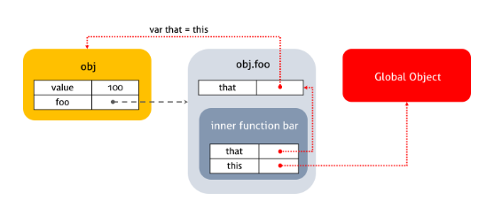
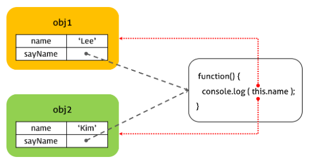
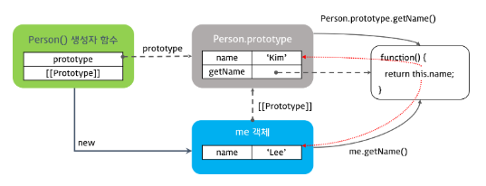
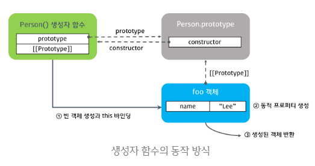

### this

------

##### 함수 호출 시 암묵적으로 전달되는 this, arguments

> 자바스크립트의 함수는 호출될 때, 매개변수로 전달되는 인자값 이외에, arguments 객체와 this를 암묵적으로 전달 받는다.
>
> 예시는 다음과 같다.

```javascript
function square(number) {
    console.log(arguments);
    console.log(this);
    return number * number;
}

square(2);
```

> 위 예시의 출력 결과는 다음과 같다.

```javascript
// arguments
Arguments [2, callee: ƒ, Symbol(Symbol.iterator): ƒ]
```

```javascript
// this
Window {parent: Window, postMessage: ƒ, blur: ƒ, focus: ƒ, close: ƒ, …}
```


##### 함수 호출에 따라 다르게 동작하는 this

> 자바스크립트의 this 키워드는 자바와 같은 언어에서의 this의 개념과 달라 개발자에게 혼란을 준다.

> ##### 비교 설명을 위한 Java에서의 this
>
> 자바에서의 this는 인스턴스 자신(self)을 가리키는 참조변수이다. this가 객체 자신에 대한 참조 값을 갖고 있다. 주로 매개변수와 객체 자신이 가지고 있는 멤버변수명이 같을 경우 이를 구분하기 위해 사용된다. 
>
> 예를 들어, 아래 예시에서 자바 코드의 생서자 함수 내의 this.name은 멤버변수를 의미하며 name은 생성자 함수가 전달받은 매개변수를 의미한다.

```java
public Class Person {
    private String name;
    
    public Person(String name) {
        this.name = name;
    }
}
```

> 하지만 자바스크립트의 경우 자바와 같이 this에 바인딩되는 객체는 한 가지가 아니라 해당 함수 호출 방식에 따라 this에 바인딩 되는 객체가 다르다.


#### this의 바인딩

------

##### 함수 호출에 따른 동적 바인딩

> 자바스크립트에서 this의 바인딩은 함수 호출 방식에 따라 동적으로 결정된다. 이해를 위해 렉시컬 스코프와 비교하여 설명하자면, 자바스크립트에서 함수의 상위 스코프는 함수의 호출 방식과는 무관하며, 함수가 어디에서 선언되었는지에 따라 정적으로 결정된다고 하였다.
>
> this의 바인딩은 이와 반대로 동작한다. 함수가 어디에서 선언되었는가는 this가 바인딩할 객체의 결정에 영향을 주지 않는다. 이를 다시 말하면, 함수를 선언할 때 this의 바인딩 객체는 결정된 상태가 아니다. 함수 호출 시에 함수의 호출 방식에 따라 this가 바인딩할 객체가 결정된다.
>
> 자바스크립트에서 함수의 호출 방식은 다음과 같이 구분된다.

* 함수 호출
* 메소드 호출
* 생성자 함수 호출
* apply / call / bind 호출


#### 함수 호출에 따른 this의 바인딩

------

##### 전역 객체와 전역 변수(또는 함수)의 관계에 대한 이해

> 전역 객체란 모든 객체의 유일한 최상위 객체를 의미하며 일반적으로 브라우저 상에서는 window 객체, 서버 상(Node.js)에서는 global  객체를 의미한다.

```javascript
// in browser console
this === window 	// true
```

```javascript
// in terminal
this === global		// true
```

> 이 전역 객체는 전역 스코프를 갖는 전역 변수를 프로퍼티로 소유한다. 전역에서 선언한 함수는 전역 객체의 프로퍼티로 접근할 수 있는 전역 객체의 메소드이다.
>
> 예시는 다음과 같다.

```javascript
// 전역 변수의 선언
var ga = 'Global variable';

// 다음의 두 구문은 동일한 결과를 출력한다.
// Global variable
console.log(ga);
console.log(window.ga);
```

```javascript
// 전역에서의 함수의 선언
function foo() {
    console.log('invoked');
}

// 전역에 선언된 함수는 전역 객체의 프로퍼티로 접근 가능한 메소드이다.
// invoked
window.foo();
```


##### 일반 함수 및 내부 함수에서의 this의 바인딩 : 전역 객체

> 기본적으로 this는 전역 객체에 바인딩된다. 전역에 선언된 함수에서의 this는 물론이고, 내부함수의 경우에도 this는 외부함수가 아닌 전역 객체에 바인딩된다.
>
> 이에 대한 예시는 다음과 같다.

```javascript
function foo() {
    console.log("foo's this: ", this); // window
    
    function bar() {
        console.log("bar's this: ", this); // window
    }
    bar();
}
foo();
```

> 위 예시에서 함수 foo와 bar 내부에서 this는 모두 window 객체를 가리킨다.


##### 객체의 메소드의 내부 함수에서의 this의 바인딩 : 전역 객체

> 어떤 객체의 메소드의 내부 함수에서의 this도 전역 객체에 바인딩된다. 객체의 메소드에서의 this가 객체를 가리키는 것과 다르다.
>
> 예시는 다음과 같다.

```javascript
var value = 1;

var obj = {
    value: 100,
    // 객체의 메소드
    foo: function() {
        console.log(this, this.value) // obj, 100
        
        // 메소드 내부 함수
        function bar() {
            console.log(this, this.value) // window, 1
        }
        bar();
    }    
};

obj.foo();
```

> 위의 예시에서 객체의 메소드에서의 this는 객체를 가리키지만, 내부함수에서의 this는 window 전역 객체를 가리키는 것을 확인할 수 있다.


##### 콜백함수에서의 this의 바인딩 : 전역 객체

> 콜백함수에서의 this도 전역 객체에 바인딩된다.

```javascript
var value = 1;

var obj = {
    value: 100,
    foo: function() {
        setTimeout(function() {
            console.log(this, this.value) // window, 1
        }, 100);
    }
};

obj.foo();
```


##### 내부함수의 this의 전역 객체 바인딩 회피

> 내부함수는 일반 함수, 메소드, 콜백함수 어디에서 선언되었든 관계 없이 this가 전역 객체에 바인딩된다. 더글라스 크락포드는 "이는 설계에서의 결함으로 메소드가 내부함수를 사용하여 자신의 작업을 돕게 할 수 없다는 것을 의미한다."라고 말했다. 내부함수의 this가 전역 객체를 바인딩하는 것을 회피하는 방법으로 다음 예시와 같은 방법이 있다.

```javascript
var value = 1;

var obj = {
    value: 100,
    foo: function() {
        var that = this;
        // 객체의 메소드이므로 this는 obj에 바인딩된다.
        // that을 obj를 가리키게 한다.
        
        function bar() {
            console.log(this, this.value); // window, 1
            console.log(that, that.value); // obj, 100
        }
        bar();
    }
};

obj.foo();
```

> 위의 예시를 이미지로 표현하면 다음과 같다.



> 이러한 방법 외에도 자바스크립트는 this를 명시적으로 바인딩할 수 있는 apply, call, bind 메소드를 제공한다.


#### 메소드 호출에 따른 this의 바인딩

------

> 함수가 객체의 프로퍼티 값이면 메소드로 호출된다. 이때 메소드 내부의 this는 해당 메소드를 소유한 객체, 즉 해당 메소드를 호출한 객체에 바인딩된다.
>
> 예시는 다음과 같다.

```javascript
var obj1 = {
    name: 'Lee',
    sayName: function() {
        console.log(this.name);
    }
}

var obj2 = {
    name: 'Kim'
}

obj2.sayName = obj1.sayName;

obj1.sayName(); 	// 'Lee'
obj2.sayName(); 	// ?
```

> 위 예시의 출력 결과는 어떻게 될까?
>
> `obj1.sayName()`의 경우 sayName 메소드 내부의 this는 obj1을 가리킨다. 따라서 출력 결과값은 'Lee'가 된다.
>
> `obj2.sayName()`의 출력값은 어떻게 될까? 결과부터 말하자면 출력 결과값은 'KIm'이 된다. 이는 `obj2.sayName = obj1.sayName;`의 구문이 실행되었기 때문이다. 이 구문이 실행되면서 obj2의 sayName은 obj1의 sayName이 가리키는 함수 객체를 바인딩한다. 이후 sayName은 obj2의 프로퍼티로써 obj2의 메소드로 호출되므로 sayName의 this는 obj2에 바인딩된다.
>
> 이를 이미지로 나타내면 다음과 같다.



> 또한 이를 함수 객체의 동적 프로퍼티 추가로도 볼 수 있다. 객체 리터럴로 생성된 함수는 이후 동적으로 프로퍼티를 추가하는 것이 가능하다. obj2를 콘솔에서 확인하면 sayName함수가 추가된 것을 볼 수 있다.

```javascript
// obj2
{name: "Kim", sayName: ƒ}
```


##### 프로토타입 객체의 메소드에서의 this의 바인딩

> 프로토타입 객체도 메소드를 가질 수 있다. 프로토타입 객체 메소드 내부에서 사용된 this도 일반 메소드 방식과 마찬가지로 해당 메소드를 호출한 객체에 바인딩된다.

```javascript
function Person(name) {
    this.name = name;
}

Person.prototype.getName = function() {
    return this.name;
}

var me = new Person('Lee');
console.log(me.getName()); 		// Lee

Person.prototype.name = 'Kim';
console.log(Person.prototype.getName()); // Kim
```

> 이를 이미지로 표현하면 다음과 같다.



> 위 예시의 이미지가 예시 코드가 어떻게 동작하는지 잘 보여준다. 먼저 Person.prototype 객체의 경우를 보자. 프로토타입 객체의 프로퍼티는 사용자에 의해 동적으로 추가하는 것이 가능하다. 따라서 getName이라는 함수를 메소드로 추가하였다.
>
> getName이 Person.prototype.getName의 프로퍼티에 의해 호출되는 경우, getName의 this는 메소드 호출 규칙에 의해 Person.prototype 객체에 바인딩 된다. 따라서 출력 결과는 'Kim'이 된다.
>
> me.getName을 실행하는 경우는 조금 다르다. me에는 getName이 없으므로 프로토타입 체인에 의해 Person.prototype 객체의 메소드인 getName이 호출된다. 그런데 이때에도 메소드 호출 규칙이 적용된다. 메소드 호출한 객체가 me이므로 this는 me에 바인딩된다. 따라서 출력 결과는 'Lee'이다.


#### 생성자 함수 호출에 따른 this의 바인딩

------

##### 생성자 함수와 new 연산자

> 자바스크립트의 생성자 함수는 말 그대로 객체를 생성하는 역할을 한다. 하지만 자바와 같은 객체지향 언어의 생성자 함수와 다르게 그 형식이 정해져 있는 것이 아니라 기존 함수에 `new` 연산자를 붙여 호출하면 해당 함수가 생성자 함수로 동작한다.
>
> 이는 반대로 생각하면 생성자 함수가 아닌 일반 함수에 `new` 연산자를 붙여 호출하면 생성자 함수처럼 동작할 수 있다. 따라서 일반적으로 생성자 함수명은 첫문자를 대문자로 기술함으로써 혼란을 방지하려는 노력을 한다.
>
> 이에 대한 예시는 다음과 같다.

```javascript
function Person(name) {
    this.name = name;
}

// Person이 생성자 함수로 동작한다.
// 출력 결과 : Person {name: "Lee"}
var me = new Person('Lee');
console.log(me);

// Person이 생성자 함수로 동작하지 않는다.
// 출력 결과 : undefined
var you = Person('Kim');
console.log(you);
```

> new 연산자와 함께 생성자 함수를 호출하면 this의 바인딩이 메소드나 함수 호출때와는 다르게 동작한다.


##### 생성자 함수 동작 방식

> new 연산자와 함께 생성자 함수를 호출하면 다음과 같은 수순으로 동작한다.

> ##### 빈 객체 생성 및 this 바인딩
>
> 생성자 함수의 코드가 실행되기 전 빈 객체가 생성된다. 이 빈 객체가 생성자 함수가 새로 생성하는 객체이다. 이후 생성자 함수 내에서 사용되는 this는 이 빈 객체에 바인딩된다. 그리고 생성된 빈 객체는 생성자 함수의 prototype 프로퍼티가 가리키는 객체를 자신의 프로토타입 객체로 설정한다.

> ##### this를 통한 프로퍼티 생성
>
> 생성된 빈 객체에 this를 사용하여 동적으로 프로퍼티나 메소드를 생성한다. this가 새로 생성된 빈 객체를 가리키므로 this를 통해 동적 프로퍼티 추가가 가능하다.

> ##### 생성된 객체 반환
>
> 함수 내에 반환문이 없는 경우, this에 바인딩된 새로 생성된 객체가 반환된다. 명시적으로 this를 반환하여도 결과는 같다. 만약 반환문이 this가 아닌 다를 객체를 명시적으로 반환하는 경우, 해당 객체가 반환된다. 이렇게 되면 함수는 생성자 함수로서의 역할을 수행하지 못했다고 볼 수 있다. 따라서 생성자 함수는 반환문을 명시적으로 사용하지 않는다.

> 이 단계의 예시 코드와 이미지는 다음과 같다.

```javascript
function Person(name) {
  // 빈 객체 생성 및 this 바인딩
  this.name = name;  // this를 통한 프로퍼티 생성
  // 생성된 객체 반환
}

var me = new Person('Lee');
console.log(me.name); 		// Lee
```




##### 객체 리터럴 방식과 생성자 함수 방식의 차이

> 객체 리터럴 방식과 생성자 함수 방식의 차이를 확인하기 위해 다음의 예시를 보자.

```javascript
// 객체 리터럴 방식
var me = {
    name: 'Lee',
    gender: 'male'
}

console.dir(me);
```

```javascript
// 생성자 함수 방식
function Person(name, gender) {
    this.name = name;
    this.gender = gender;
}

var you = new Person('Kim', 'female');
console.dir(you);
```

> `console.dir`을 통해 확인할 수 있듯, 두 객체 생성 방식의 차이는 프로토타입 객체에 있다. 객체 리터럴 방식은 내부적으로 Object 생성자에 의해 객체를 생성하는 방식이다. 따라서 객체 리터럴 방식으로 생성된 객체의 프로토타입 객체는 Object.prototype이다. 반면 생성자 함수로 생성된 객체의 프로토타입은 위 예시에서는 Person.prototype이다.


##### 생성자 함수에 new 연산자를 붙이지 않고 호출하는 경우

> 일반 함수와 생성자 함수 간의 특별한 형식적 차이는 없다. 단지 함수에 new 연산자를 붙여 호출하면 해당 함수가 생성자 함수로 동작한다.
>
> 그러나 객체 생성 목적으로 작성한 생성자 함수를 new 없이 호출하거나 일반 함수에 new를 붙여 호출하면 오류가 발생할 수 있다. 이는 일반함수와 생성자 함수의 호출 시 this의 바인딩 방식이 다르기 때문이다. 따라서 일반함수든, 생성자 함수든 목적에 맞게 호출해야 한다.
>
> 앞에서 살펴보았듯, 일반함수에서의 this는 전역 객체에 바인딩되지만, 생성자 함수에서의 this는 새로 생성된 빈 객체에 바인딩되기 때문이다.
>
> 다음의 예시를 보자.

```javascript
function Person(name) {
    // new 없이 호출하면, 전역객체에 name 프로퍼티를 추가하게 된다.
    this.name = name;
}

// 일반 함수로서 호출되었으므로 빈 객체를 생성하여 반환하지 않음.
// 일반 함수의 this는 전역 객체이므로 전역 객체의 프로퍼티가 추가된다.
var me  = Person('Lee');

console.log(me); // undefined
console.log(window.name); // Lee
```

> 위 예시에서 생성자 함수를 new 없이 호출한 경우, 함수 Person 내부의 this는 전역 객체를 가리킨다. 따라서 name은 전역 변수의 프로퍼티로 추가된다. 또한 new가 없으므로 Person은 어떤 객체도 반환하지 않는다. 따라서 me를 콘솔에 출력하면 undefined가 출력된다.


> ##### Scope-Safe Constructor Pattern
>
> 위와 같은 실수를 방지하기 위해 일반적으로 생성자 함수명은 첫 문자를 대문자로 기술하여 일반 함수와 구분하고자 하는 노력을 한다. 그러나 이러한 노력에도 불구하고 실수는 언제든 발생 가능할 것이다.
>
> Scope-Safe Constructor Pattern은 이러한 실수를 미연에 방지하기 위해 대부분의 라이브러리에서 광범위하게 사용되는 디자인 패턴이다. 대부분의 빌트인 생성자(Object, Regex, Array 등)은 new 연산자와 함께 호출되었는지를 확인한 후 적절한 값을 반환한다.
>
> 예시는 다음과 같다.

```javascript
// Scope-Safe Constructor Pattern
function A(arg) {
    if (!(this instanceof arguments.callee)) {
    return new arguments.callee(arg);
  }

  // 프로퍼티 생성과 값의 할당
  this.value = arg ? arg : 0;
}
```

> 위 예시에 서 함수 A는 new 연산자와 함께 호출되는 경우 함수의 선두에서 빈 객체를 생성하고 이 객체에 this를 바인딩한다. 
>
> 그러나 this가 호출된 함수(A)가 생성한 빈 객체가 아니라면 this는 window를 가리키는 것을 의미한다. 이는 new 연산자와 같이 호출된 것이 아닌, 일반 함수로써 호출되었음을 의미한다. 이런 경우에는 new와 함께 자신을 생성자 함수로 다시 호출하고 이를 반환하도록 함으로써 일반 함수로 호출되어도 생성자 함수로 동작하도록 한다.
>
> callee는 arguments 객체의 프로퍼티로 함수 내부에서 현재 실행 중인 함수를 참조하고자 할 때 사용한다. callee는 함수 내부에서 현재 실행중인 함수의 이름을 반환한다. 따라서 위 예시에서 callee를 활용하여 함수가 생성자 함수로 호출되었는지, 일반 함수로 호출되었는지 확인할 수 있는 것이다.
>
> 위와 같이 예시를 작성했다면, 아래의 예시로 잘 동작하는지 확인할 수 있다.

```javascript
var a = new A(100);
var b = A(10);

console.log(a.value); 	// 100
console.log(b.value); 	// 10
```


#### Apply / Call / Bind 호출

------

(작성 예정 ...)