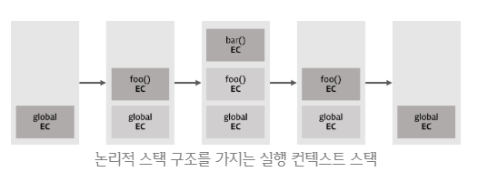
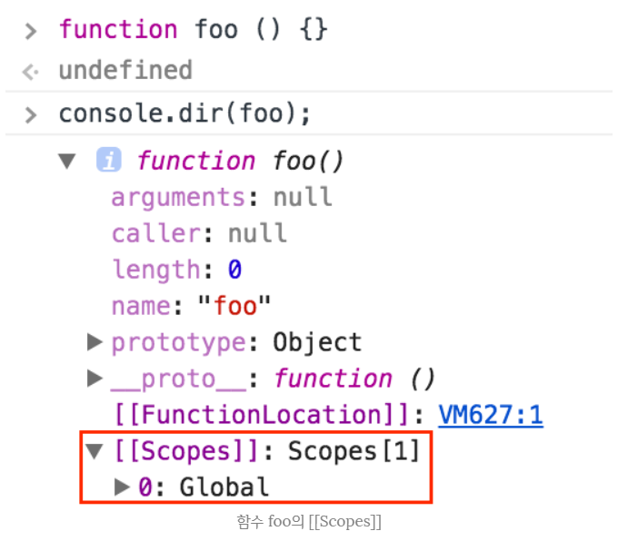

### 실행 컨텍스트 (Execution Context)

------

> 실행 컨텍스트란 스코프, 호이스팅, this, 함수, 클로저 등의 동작원리를 담고 있는 자바스크립트의 핵심원리이다. 실행 컨텍스트를 바로 이해하지 못하면 코드 독해가 어려워지며 디버깅도 매우 곤란해질 것이다.
>
> ECMAScript 스펙에 따르면 실행 컨텍스트를 실행 가능한 코드를 형상화하고 구분하는 추상적인 개념이라고 정의한다. 좀 더 쉽게 말하자면 실행 컨텍스트는 실행 가능한 코드가 실행되기 위해 필요한 환경이라고 말할 수 있다.


##### 실행 가능한 코드

> 여기서 실행 가능한 코드란 다음과 같은 코드들을 말한다.

* 전역 코드 : 전역에 존재하는 코드
* Eval 코드 : eval 함수로 실행되는 코드
* 함수 코드 : 함수 내에 존재하는 코드

> 일반적으로 실행 가능한 코드는 전역 코드와 함수 코드이다.
>
> 또한 자바스크립트 엔진은 코드를 실행하기 위하여 실행에 필요한 여러 정보를 알고 있어야 한다. 실행에 필요한 여러 정보란 다음과 같은 것들을 말한다.

* 변수 : 전역변수, 지역변수, 매개변수, 객체의 프로퍼티
* 함수 선언
* 변수의 유효범위(Scope)
* this


#### 실행 컨텍스트의 관리

------

> 이와 같이 실행에 필요한 정보를 형상화하고 구분하기 위해 자바스크립트 엔진은 실행 컨텍스트를 물리적 객체의 형태로 관리한다. 
>
> 다음의 예시 코드를 보자.

```javascript
var x = 'xxx';

function foo() {
    var y = 'yyy';
    
    function bar() {
        var z = 'zzz';
        console.log(x+y+z);
    }  
    bar();
}

foo();
```

> 위 코드에는 전역에 선언된 함수 foo와 함수 내부에 선언된 다른 함수 bar가 있다. 전역에 선언된 함수 foo가 실행되며 bar도 실행된다. 


##### 실행 컨텍스트 스택

> 실행 컨텍스트는 스택으로 관리된다. 현재 실행중인 컨텍스트에서 이 컨텍스트와 관련없는 코드가(다른 함수 등) 실행되면 새로운 컨텍스트가 생성된다. 이 컨텍스트는 스택에 쌓이게 되고 컨트롤(제어권)이 이동한다.
>
> 이에 대한 참고 이미지는 다음과 같다.



> 위 이미지에 대한 설명은 다음과 같다.

* 컨트롤이 실행 가능한 코드로 이동하면 논리적 스택 구조를 가지는 새로운 실행 컨텍스트 스택이 생성된다.
* 전역 코드로 컨트롤이 진입하면 전역 실행 컨텍스트가 생성되고 실행 컨텍스트 스택에 쌓인다. 전역 실행 컨텍스트는 애플리케이션이 종료될 때(웹 페이지에서 나가거나 브라우저를 닫을 때)까지 유지된다.
* 함수를 호출하면 해당 함수의 실행 컨텍스트가 생성되며 직전에 실행된 코드 블록의 실행 컨텍스트 위에 쌓인다.
* 함수 실행이 끝나면 해당 함수의 실행 컨텍스트를 파기하고 직전의 실행 컨텍스트에 컨트롤을 반환한다.


#### 실행 컨텍스트의 3가지 객체

------

> 실행 컨텍스트는 실행 가능한 코드를 형상화하고 구분하는 추상적인 개념이지만 물리적으로는 객체의 형태를 가지며 아래의 세 가지 프로퍼티를 소유한다.


> 세 가지 프로퍼티에 대한 설명은 다음과 같다.


##### 변수 객체 (VO, Variable Object)

> 실행 컨텍스트가 생성되면 자바스크립트 엔진은 실행에 필요한 여러 정보들을 담을 객체를 생성한다. 이를 변수 객체라 한다. 변수 객체는 코드가 실행될 때 엔진에 의해 참조되며 코드에서는 접근할 수 없다.
>
> 변수 객체는 아래의 정보를 담는 객체이다

* 변수
* 매개변수(parameter)와 인수(arguments)
* 함수 선언(함수 표현식은 제외)

> 변수 객체는 실행 컨텍스트의 프로퍼티이기 때문에 값을 갖는데 이 값은 다른 객체를 가리킨다. 그런데 전역 코드 실행시 생성되는 전역 컨텍스트의 경우와 함수를 실행할 때 생성되는 함수 컨텍스트의 경우, 가리키는 객체가 다르다. 이는 전역 코드와 함수의 내용이 다르기 때문이다. 예를 들어 전역 코드에는 매개변수가 없지만 함수에는 매개변수가 있다.


> ##### 전역 컨텍스트의 경우
>
> 변수 객체는 유일하며 최상위에 위치하고 모든 전역 변수, 전역 함수 등을 포함하는 전역 객체(GO, Global Object)를 가리킨다. 전역 객체는 전역에 선언된 전역 변수와 전역 함수를 프로퍼티로 소유한다.
>
> 참고 이미지는 다음과 같다.


> ##### 함수 컨텍스트의 경우
>
> 변수 객체는 활성 객체(AO, Activation Object)를 가리키며 매개 변수와 인수들의 정보를 배열의 형태로 담고 있는 객체인 arguments object가 추가된다.
>
> 참고 이미지는 다음과 같다.


##### 스코프 체인 (SC, Scope Chain)

> 스코프 체인은 일종의 리스트로서 전역 객체와 중첩된 함수의 스코프의 레퍼런스를 차례로 저장하고 있다. 스코프 체인은 전역 또는 함수에서 참조할 수 있는 변수, 함수 선언 등의 정보를 담고 있는 전역 객체(GO) 또는 활성 객체(AO)의 리스트를 가리킨다.
>
> 현재 실행 컨텍스트의 활성 객체를 선두로 하여 순차적으로 상위 컨텍스트의 활성 객체를 가리키며 리스트의 마지막 인덱스는 전역 객체를 가리킨다.
>
> 참고 이미지는 다음과 같다.


> ##### 스코프 체인과 프로토타입 체인
>
> 스코프 체인은 식별자 중에서 객체(전역 객체 제외)의 프로퍼티가 아닌 식별자, 즉 변수를 검색하는 메커니즘이다. 식별자 중 변수가 아닌 객체의 프로퍼티(메소드도 포함된다.)를 검색하는 메커니즘은 프로토타입 체인이다.


> ##### 스코프 체인과 변수 탐색
>
> 자바스크립트의 엔진은 스코프 체인을 통해 렉시컬 스코프를 파악한다. 함수가 중첩 상태일 때 하위함수 내에서 상위함수의 스코프와 전역 스코프까지 참조할 수 있는데 이는 스코프 체인 탐색을 통해서 가능하다. 
>
> 함수가 중첩되어 있는 경우 함수 중첩 시마다 상위 함수의 스코프가 하위 함수의 스코프 체인에 포함된다. 함수 실행 중 변수를 만나면 그 변수를 우선 현재 스코프의 활성 객체에서 탐색해보고, 탐색에 실패하면 스코프 체인(리스트)에 담겨진 순서대로 탐색을 진행한다. 
>
> 만약 리스트의 마지막 원소인 전역 객체에서까지 해당 변수를 찾아내지 못한다면 정의되지 않은 변수에 접근한 것으로 판단하여 Reference 에러를 발생시킨다. 스코프 체인은 함수의 숨겨진 프로퍼티인 [[Scope]]로 참조할 수 있다.


##### this

> this 프로퍼티에는 this가 바인딩된 객체에 대한 참조값이 할당된다. this에 할당되는 값은 함수 호출 패턴에 의해 결정된다.


#### 실행 컨텍스트의 생성 과정

------

> 실제 실행 컨텍스트는 어떻게 생성될까? 위에서 예시로 사용했었던 코드를 다시 살펴보자.

```javascript
var x = 'xxx';

function foo() {
    var y = 'yyy';
    
    function bar() {
        var z = 'zzz';
        console.log(x+y+z);
    }  
    bar();
}

foo();
```


##### 전역 코드의 진입

> 컨트롤이 실행 컨텍스트에 진입하기 이전에 유일한 전역 객체가 생성된다. 전역 객체는 단일 사본으로 존재하며 이 객체의 프로퍼티는 코드의 어떠한 곳에서도 접근이 가능하다. 초기 상태의 전역 객체에는 빌트인 객체(Math, String, Array 등)과 BOM, DOM이 설정되어 있다.
>
> 참고 이미지는 다음과 같다.


> 전역 객체가 생성된 이후, 전역 코드로 컨트롤이 진입하면 전역 실행 컨텍스트가 생성되고 실행 컨텍스트 스택에 쌓인다.
>
> 참고 이미지는 다음과 같다.


> 그리고 이후 이 실행 컨텍스트를 바탕으로 이하의 처리가 실행된다.

##### 	A. 스코프 체인의 생성과 초기화

##### 	B. 변수 객체화(Variable Instantiation) 실행

##### 	C. this의 값 결정

> 이 세 가지 처리에 대한 설명은 다음과 같다.


> ##### A. 스코프 체인의 생성과 초기화
>
> 실행 컨텍스트가 생성된 이후 가장 먼저 스코프 체인의 생성과 초기화가 실행된다. 이 때 스코프 체인은 전역 객체의 레퍼런스를 포함하는 리스트가 된다.
>
> 참고 이미지는 다음과 같다.


> ##### B. 변수 객체화(Variable Instantiation) 실행
>
> 스코프 체인의 생성과 초기화가 종료하면 변수 객체화가 실행된다. 변수 객체화는 변수 객체에 프로퍼티와 값을 추가하는 것을 의미한다. 이 과정에서 변수 객체에 변수, 매개 변수와 인수, 선언된 함수에 대한 정보 등을 변수 객체에 추가하여 객체화를 진행한다.
>
> 전역 코드에서 변수 객체는 전역 객체를 가리키므로 이에 대한 참고 이미지는 다음과 같다.


> 변수 객체화는 아래의 순서로 변수 객체에 프로퍼티와 값을 설정한다. (반드시 1→2→3 순서로 실행된다.)

1. (함수 코드인 경우) 매개변수(parameter)가 변수 객체의 프로퍼티로, 인수(arguments)가 값으로 설정된다.
2. 대상 코드 내의 함수 선언(함수 표현식 제외)을 대상으로 함수명이 변수 객체의 프로퍼티로, 생성된 함수 객체가 값으로 설정된다. **(함수 호이스팅)**
3. 대상 코드 내의 변수 선언을 대상으로 변수명이 변수 객체의 프로퍼티로, undefined가 값으로 설정된다. **(변수 호이스팅)**

> 이해를 돕기 위해 위 예제 코드를 다시 보자.
>
> 위 예시 코드에서는 전역에 변수 x와 함수 foo(매개변수 없음)가 선언되었다. 변수 객체화의 실행 순서 상, 우선 2. 함수 foo의 선언이 우선적으로 처리된다. 이는 실행 코드가 함수 코드가 아니라 전역 코드이기 때문이다. 따라서 1. 단계는 실행되지 않는다. 이후 3. 변수 x의 선언이 처리된다.
>
> 이에 대한 자세한 설명을 이미지와 같이 참고하여 설명하자면 다음과 같다.


> > ##### B-2. 함수 foo의 선언 처리
>
> 함수명 foo가 프로퍼티, foo의 함수 객체가 값으로 설정된다. 이에 대한 참고 이미지는 다음과 같다.


> 위 이미지를 보자.
>
> 함수 선언시 값으로 설정되는 함수 객체는 [[Scopes]]라는 프로퍼티를 갖는다. 이 프로퍼티는 함수 객체만이 소유하는 내부 프로퍼티로서 함수 객체가 실행되는 환경을 가리킨다. 따라서 이 프로퍼티는 현재 실행 컨텍스트의 스코프 체인이 참조하고 있는 객체를 값으로 설정한다.
>
> 따라서 이 [[Scopes]]라는 프로퍼티는 자신의 실행 환경(렉시컬 스코프)와 자신을 포함하는 외부 함수의 실행 환경과 전역 객체 모두를 가리키는 것을 알 수 있다. 따라서 자신을 포함하는 외부 함수의 실행 컨텍스트가 소멸하여도 [[Scopes]] 프로퍼티가 가리키는 외부 함수의 실행 환경(활성 객체, AO)은 소멸하지 않고 참조할 수 있다. 이것이 **클로저**이다.
>
> foo의 [[Scopes]] 프로퍼티에 대한 예시 이미지는 다음과 같다.



> 지금까지 살펴본 실행 컨텍스트는 아직 코드가 실행되기 이전이다. 하지만 스코프 체인이 가리키는 변수 객체에 이미 함수 foo가 등록되어 있으므로 이후 코드를 실행할 때 함수선언식 이전에 함수를 호출할 수 있게 되었다.
>
> 이 때 알 수 있는 것은 함수 선언식의 경우, 변수 객체에 함수 표현식과 동일하게 함수명을 프로퍼티로 함수 객체를 할당한다는 것이다. 단, 함수 선언식은 변수 객체에 함수명을 프로퍼티로 추가하고 즉시 함수 객체를 즉시 할당하지만 함수 표현식은 일반 변수의 방식을 따른다. 따라서 함수 선언식의 경우, 선언문 이전에 함수를 호출할 수 있다. 이러한 현상을 **함수 호이스팅**이라 한다.


> > ##### B-3. 변수 x의 선언 처리
>
> 변수 선언은 변수 객체화 실행 순서의 세 번째 단계와 같이 변수명 x가 변수 객체의 프로퍼티로, undefined가 값으로 설정된다. 이를 조금 더 세분화 하면 아래와 같다.

* **선언 단계** : 변수 객체에 변수를 등록한다. 이 변수 객체는 스코프가 참조할 수 있는 대상이 된다.
* **초기화 단계** : 변수 객체에 등록된 변수를 메모리에 할당한다. 이 단계에서 변수는 undefined로 초기화된다.
* **할당 단계** : undefined로 초기화된 변수에 실제 값을 할당한다.

> var 키워드로 선언된 변수는 선언 단계와 초기화 단계가 한번에 이루어진다. 다시 말해 스코프 체인이 가리키는 변수 객체에 변수가 등록되고 변수는 undefined로 초기화된다. 따라서 변수 선언문 이전에 변수에 접근하여도 변수 객체에 변수가 존재하기 때문에 참조 에러가 발생하지 않는다. 다만 undefined를 반환한다. 이러한 현상을 **변수 호이스팅**이라 한다.
>
> 이에 대한 참고 이미지는 다음과 같다.


> ##### C. this의 값 결정
>
> 변수 선언 처리가 끝나면 다음은 this의 값이 결정된다. this의 값이 결정되기 이전에 this는 전역 객체를 가리키고 있다가 함수가 호출되는 패턴에 의해 this에 할당되는 값이 결정된다. 전역 코드의 경우, this는 전역 객체를 가리킨다.
>
> 전역 컨텍스트(또는 전역 코드)의 경우에는 변수 객체와 스코프 체인, this의 값이 항상 전역 객체이다.


##### 전역 코드의 실행

> 앞에서 설명한 전역 코드의 진입은 코드 실행 환경을 갖추기 위한 사전 준비였다. 코드의 실행은 지금부터 시작된다.
>
> 다시 예시 코드를 보자.

```javascript
var x = 'xxx';

function foo () {
  var y = 'yyy';

  function bar () {
    var z = 'zzz';
    console.log(x + y + z);
  }
  bar();
}

foo();
```

> 예시에서 전역 변수 x에 문자열 'xxx'의 할당과 함수 foo의 호출이 실행된다.
>
> 이 과정은 다음과 같이 진행된다.


> ##### 변수 값의 할당
>
> 전역 변수 x에 문자열 'xxx'를 할당할 때, 현재 실행 컨텍스트의 스코프 체인이 참조하고 있는 변수 객체를 선두(0)부터 검색하여 변수명('x')에 해당하는 프로퍼티가 발견되면 값('xxx')를 할당한다.
>
> 이에 대한 이미지는 다음과 같다.


> ##### 함수의 실행
>
> 전역 코드의 함수 foo가 실행되기 시작하면 새로운 함수 실행 컨텍스트가 생성된다. 함수 foo의 실행 컨텍스트로 제어권이 이동하면 전역 코드와 마찬가지로 다음과 같은 과정이 실행된다.

##### 	A. 스코프 체인의 생성과 초기화

##### 	B. 변수 객체화(Variable Instantiation) 실행

##### 	C. this의 값 결정

> 단, 전역 코드와 다른 점은 실행되는 코드가 함수 코드라는 것이다. 따라서 위의 A, B, C의 과정에 전역 코드의 룰이 아닌, 함수 코드의 룰이 적용된다.
>
> 참고 이미지는 다음과 같다. 새로운 함수 foo의 실행 컨텍스트가 생성된다.


> > ##### A. 스코프 체인의 생성과 초기화
>
> 함수 코드의 스코프 체인의 생성과 초기화는 우선 활성 객체(AO)