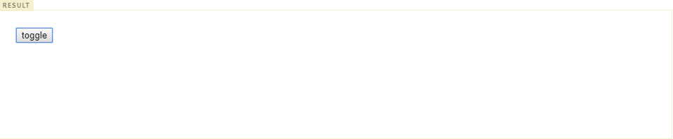

### 클로저 (Closure)

------

> 클로저는 자바스크립트에서 중요한 개념 중 하나로 자바스크립트에 관심을 갖고 있다면 한번쯤 들어보았을 내용이다. 클로저를 이해하기 위해서는 먼저 실행 컨텍스트에 대한 사전 지식을 갖추는 것이 좋다. 클로저는 자바스크립트 고유의 개념이 아니라 함수를 일급 객체로 취급하는 함수형 프로그래밍 언어(Erlang, Scala, Haskell, Lisp 등)에서 사용되는 중요한 특성이다.
>
> 클로저는 자바스크립트 고유의 개념은 아니므로 ECMAScript 명세에 클로저의 정의가 등장하지는 않는다. 클로저에 대해 MDN은 다음과 같이 정의하고 있다.

* 클로저는 함수와 그 함수가 선언되었을 때의 렉시컬 환경과의 조합이다.

> 이 말이 어떤 의미인지 아직은 파악하기 어렵다. 위 정의에서 중요한 키워드는 **함수가 선언되었을 때의 렉시컬 환경** 이다.


> 이 말을 이해하기 위해 다음의 예시를 살펴보자.

```javascript
function outerFunc() {
    var x = 10;
    var innerFunc = function() { console.log(x); }
    innerFunc();
}

outerFunc(); // 10
```

> 함수 outerFunc 내에서 내부함수 innerFunc가 선언되고 호출되었다. 이때 내부함수 innerFunc는 자신을 포함하고 있는 외부함수 outerFunc의 변수 x에 접근할 수 있다. 이는 실행 컨텍스트의 스코프 체인에 대한 개념을 기억하고 있다면 이해할 수 있다.
>
> 다시 말하자면, 함수 innerFunc는 함수 outerFunc 내부에 선언된 내부함수이므로 함수 innerFunc는 자신이 속한 렉시컬 스코프(전역, 함수 outerFunc의 스코프, 자신의 스코프)를 참조할 수 있다. 이것을 실행 컨텍스트의 관점에서 보면 다음과 같다.


> 내부함수 innerFunc가 호출되면 자신의 실행 컨텍스트가 실행 컨텍스트 스택에 쌓이고 변수 객체(VO)와 스코프 체인, this에 바인딩할 객체가 결정된다. 이 때 스코프 체인은 전역 스코프를 가리키는 전역 객체와 함수 outerFunc의 스코프를 가리키는 함수 outerFunc의 활성 객체, 자신의 스코프를 가리키는 활성 객체를 순차적으로 바인딩한다. 스코프 체인이 바인딩한 객체가 바로 렉시컬 스코프의 실체이다.
>
> 내부함수 innerFunc가 자신을 포함하고 있는 외부함수 outerFunc의 변수 x에 접근할 수 있는 것, 즉 상위 스코프에 접근이 가능한 이유는 렉시컬 스코프의 레퍼런스를 차례대로 저장하고 있는 실행 컨텍스트의 스코프 체인을 자바스크립트 엔진이 검색하였기에 가능한 것이다. 이 검색 과정은 다음과 같이 진행된다.

* innerFunc 함수 스코프(함수 자신의 스코프를 가리키는 활성 객체) 내에서 변수 x를 검색한다. 그러나 x가 없으므로 검색에 실패한다.
* innerFunc를 포함하는 외부 함수 outerFunc의 스코프(함수 outerFunc의 스코프를 가리키는 함수 outerFunc의 활성 객체)에서 변수 x를 검색한다. 검색에 성공한다.


> 이번에는 위의 예시에서 내부함수 innerFunc를 함수 outerFunc 내에서 호출하는 것이 아니라 반환하도록 변경해보자.
>
> 이에 대한 예시 코드는 다음과 같다.

```javascript
function outerFunc() {
    var x = 10;
    var innerFunc = function() { console.log(x); };
    return innerFunc;
}

/*
함수 outerFunc를 호출하면 내부함수 innerFunc가 반환된다.
이후 함수 outerFunc의 실행 컨텍스트틑 소멸한다.
*/

var inner = outerFunc();
inner();	// 10
```

> 함수 outerFunc는 내부함수 innerFunc를 반환하고 생을 마감했다. 즉, 함수 outerFunc는 실행된 이후 실행 컨텍스트 스택에서 제거되었으므로 함수 outerFunc의 변수 x 또한 더 이상 유효하지 않게 되어 변수 x에 접근할 수 없어 보인다. 그런데 위 코드의 실행 결과는 변수 x의 값인 10이다. 이미 실행 컨텍스트에서 제거된 함수 outerFunc의 지역변수 x가 다시 부활이라도 한 듯 동작하고 있다.
>
> 이처럼 자신을 포함하고 있는 외부함수보다 내부함수가 더 오래 유지되는 경우, 외부 함수 밖에서 내부함수가 호출되더라도 외부함수의 지역 변수에 접근하는 것이 가능한데 이러한 함수를 **클로저**라 한다.


##### 클로저의 이해

> 다시 MDN에서의 정의로 돌아가보자.

* 클로저는 함수와 그 함수가 선언되었을 때의 렉시컬 환경과의 조합이다.

> 위 정의에서 말하는 함수란 반환된 내부함수를 의미한다. 그 함수가 선언되었을 때의 렉시컬 환경이란 내부 함수가 선언되었을 때의 스코프를 의미한다. 즉, 클로저는 반환된 내부함수가 자신이 선언되었을 때의 환경인 렉시컬 스코프를 기억하여 자신이 선언되었을 때의 환경 밖에서 호출되어도 그 환경에 접근할 수 있는 함수를 말한다. 이를 간단히 표현하자면, 클로저는 자신이 생성될 때의 렉시컬 스코프를 기억하는 함수이다.


##### 자유 변수

> 위 예시의 x처럼 클로저에 의해 참조되는 외부함수의 변수를 **자유변수(Free Variable)**이라 한다. 클로저라는 이름은 자유변수에 함수가 닫혀있다(closed)라는 의미로 의역하면 자유변수에 엮여있는 함수라는 의미이다.


> 실행 컨텍스트의 관점에서 설명하자면, 내부함수가 유효한 상태에서 외부함수가 종료하여 외부함수의 실행 컨텍스트가 반환되어도, 외부함수 실행 컨텍스트 내의 활성 객체(AO)는 내부함수에 의해 참조되는 한 유효하여 내부함수가 스코프 체인을 통해 참조할 수 있는 것을 의미한다.
>
> 즉 외부함수가 이미 반환되었더라도 외부함수 내의 변수는 이를 필요로 하는 내부함수가 하나 이상 존재하는 경우 계속 유지된다. 이때 내부함수가 외부함수에 있는 변수의 복사본이 아니라 실제 변수에 접근하는 것에 주의해야 한다.
>
> 이를 설명하는 참고 이미지는 다음과 같다.


#### 클로저의 활용

------

> 클로저는 자신이 생성될 때의 렉시컬 스코프를 기억해야 하므로 메모리 차원에서 손해를 볼 수 있다. 하지만 클로저는 자바스크립트의 강력한 기능으로 다음과 같은 상황에서 유용하게 사용될 수 있다.


##### 상태 유지

> 클로저가 가장 유용하게 사용되는 상황은 현재 상태를 기억하고 변경된 최신 상태를 유지하는 것이다. 다음의 예제를 살펴보자.

```html
<!DOCTYPE html>
<html>
<body>
  <button class="toggle">toggle</button>
  <div class="box" style="width: 100px; height: 100px; background: red;"></div>

  <script>
    var box = document.querySelector('.box');
    var toggleBtn = document.querySelector('.toggle');

    var toggle = (function () {
      var isShow = false;

      // A. 클로저를 반환
      return function () {
        box.style.display = isShow ? 'block' : 'none';
        // C. 상태 변경
        isShow = !isShow;
      };
    })();

    // B. 이벤트 프로퍼티에 클로저를 할당
    toggleBtn.onclick = toggle;
  </script>
</body>
</html>
```




> 예시 코드 밑의 이미지는 결과 화면이다. toggle 버튼을 클릭 하면 박스가 나타나거나 혹은 소멸한다. 예시 코드에 대한 단계 별 설명은 다음과 같다.
>
> A. 즉시실행함수는 함수를 반환하고 즉시 소멸한다. 즉시실행함수가 반환한 함수는 자신이 생성되었을 때의 렉시컬 스코프에 속한 변수 isShow를 기억하는 클로저이다. 클로저가 기억하는 변수 isShow는 box 요소의 표시 상태를 나타낸다.
>
> B. 클로저를 이벤트 핸들러로서 이벤트 프로퍼티에 할당했다. 이벤트 프로퍼티에서 이벤트 핸들러인 클로저를 제거하지 않는 한 클로저가 기억하는 렉시컬 스코프의 변수 isShow는 소멸하지 않는다. 다시 말해 현재 상태를 기억한다.
>
> C. 버튼을 클릭하면 이벤트 프로퍼티에 할당한 이벤트 핸들러인 클로저가 호출된다. 이때 .box 요소의 표시 상태를 나타내는 변수 isShow의 값이 변경된다. 변수 isShow는 클로저에 의해 참조되고 있기 때문에 유효하며 자신의 변경된 최신 상태를 계속해서 유지한다.
>
> 이처럼 클로저는 현재 상태(위 예시에서의 isShow 변수)를 기억하고 이 상태가 변경되어도 최신 상태를 유지해야 하는 상황에 매우 유용하다. 만약 자바스크립트에 클로저라는 기능이 없다면 상태를 유지하기 위해 전역 변수를 사용할 수 밖에 없다. 전역 변수는 언제든지 누구나 접근할 수 있고 상태를 변경할 수 있기 때문에 많은 오작동이나 오류의 원인이 되므로 사용을 억제해야 한다는 점을 감안하면 클로저의 유용함을 체감할 수 있을 것이다.


##### 전역 변수의 사용 억제

> 버튼이 클릭될 때마다 클릭한 횟수가 누적되어 화면에 표시되는 카운터를 만들어보자. 이 예제에서 클릭된 횟수가 바로 유지해야 할 상태이다.

```html
<!DOCTYPE html>
<html>
<body>
  <p>전역 변수를 사용한 Counting</p>
  <button id="increase">+</button>
  <p id="count">0</p>
  <script>
    var increaseBtn = document.getElementById('increase');
    var count = document.getElementById('count');

    // 카운트 상태를 유지하기 위한 전역 변수
    var counter = 0;

    function increase() {
      return ++counter;
    }

    incleaseBtn.onclick = function () {
      count.innerHTML = increase();
    };
  </script>
</body>
</html>
```

> 이 코드의 결과는 다음과 같다.


> 위 코드는 잘 동작하지만 오류를 발생시킬 가능성을 내포하고 있는 좋지 않은 코드다. increase 함수는 호출되기 직전에 전역변수 counter의 값이 반드시 0이어야 제대로 동작한다. 하지만 변수 counter는 전역 변수이기 때문에 언제든지 누구나 접근할 수 있고 변경할 수 있다. 이는 의도치 않게 값이 변경될 수 있다는 것을 의미한다. 만약 누군가에 의해 의도치 안헥 전역 변수 counter의 값이 변경되었다면 이는 오류로 이어진다. 변수 counter는 카운터를 관리하는 increase 함수가 관리하는 것이 바람직하다. 전역 변수 counter를 increase 함수의 지역 변수로 바꾸어 의도치 않은 상태 변경을 방지해보자.


```html
<!DOCTYPE html>
<html>
<body>
  <p>지역 변수를 사용한 Counting</p>
  <button id="inclease">+</button>
  <p id="count">0</p>
  <script>
    var incleaseBtn = document.getElementById('inclease');
    var count = document.getElementById('count');

    function increase() {
      // 카운트 상태를 유지하기 위한 지역 변수
      var counter = 0;
      return ++counter;
    }

    incleaseBtn.onclick = function () {
      count.innerHTML = increase();
    };
  </script>
</body>
</html>
```

> 이 코드의 결과는 다음과 같다.


> 전역변수를 지역변수로 변경하여 의도치 않은 상태 변경은 방지했다. 하지만 increase 함수가 호출될 때마다 지역변수 counter를 0으로 초기화하므로 언제나 1이 표시된다. 다시 말해 변경된 이전 상태를 기억하지 못한다. 이전 상태를 기억하기 위해서 클로저를 활용해야 한다.


```html
<!DOCTYPE html>
<html>
  <body>
  <p>클로저를 사용한 Counting</p>
  <button id="inclease">+</button>
  <p id="count">0</p>
  <script>
    var incleaseBtn = document.getElementById('inclease');
    var count = document.getElementById('count');

    var increase = (function () {
      // 카운트 상태를 유지하기 위한 자유 변수
      var counter = 0;
      // 클로저를 반환
      return function () {
        return ++counter;
      };
    }());

    incleaseBtn.onclick = function () {
      count.innerHTML = increase();
    };
  </script>
</body>
</html>
```

> 위 코드의 결과는 다음과 같다.


> 스크립트가 실행되면 즉시실행함수가 호출되고 변수 increase에는 함수 `function() { return ++counter; }`가 할당된다. 이 함수는 자신이 생성되었을 때의 렉시컬 스코프를 기억하는 클로저이다. 즉시실행함수는 호출된 이후 소멸되지만 즉시실행함수가 반환한 함수는 변수 increase에 할당되어 increase 버튼을 클릭하면 클릭 이벤트 핸들러 내부에서 호출된다. 이때 클로저인 이 함수는 자신이 선언되었을 때의 렉시컬 환경인 즉시실행함수의 스코프에 속한 지역변수 counter를 기억한다. 따라서 즉시실행함수의 변수 counter에 접근할 수 있고 변수 counter는 자신을 참조하는 함수가 소멸될 때까지 유지된다.
>
> 즉시실행함수는 한번만 실행되므로 increase가 호출될 때마다 변수 counter가 재차 초기화될 일은 없을 것이다. 변수 counter는 외부에서 직접 접근할 수 없는 지역변수이므로 전역변수를 사용했을 때와 같이 의도되지 않은 변경에 취약하지 않아 안정적인 프로그래밍이 가능하다.


##### 클로저의 가치

> 변수의 값은  누군가에 의해 언제든지 변경될 수 있어 오류 발생의 근본적인 원인이 될 수 있다. 상태 변경이나 가변(mutable) 데이터를 피하고 불변성(Immutability)을 지향하는 함수형 프로그래밍에서 부수 효과(Side Effect)를 최대한 억제하여 오류를 피하고 프로그램의 안정성을 높이기 위해 클로저는 적극적으로 사용된다.
>
> 다음은 함수형 프로그래밍에서 클로저를 활용한 간단한 예제이다.

```javascript
// 함수를 인자로 전달받고 함수를 반환하는 고차 함수
// 이 함수가 반환하는 함수는 클로저로서 카운트 상태를 유지하기 위한 자유 변수 counter을 기억한다.
function makeCounter(predicate) {
  // 카운트 상태를 유지하기 위한 자유 변수
  var counter = 0;
  // 클로저를 반환
  return function () {
    counter = predicate(counter);
    return counter;
  };
}

// 보조 함수
function increase(n) {
  return ++n;
}

// 보조 함수
function decrease(n) {
  return --n;
}

// 함수로 함수를 생성한다.
// makeCounter 함수는 보조 함수를 인자로 전달받아 함수를 반환한다
const increaser = makeCounter(increase);
// increaser : function() { counter = increase(counter); return counter; };
console.log(increaser()); // 1
console.log(increaser()); // 2

// increaser 함수와는 별개의 독립된 렉시컬 환경을 갖기 때문에 카운터 상태가 연동하지 않는다.
const decreaser = makeCounter(decrease);
console.log(decreaser()); // -1
console.log(decreaser()); // -2
```


##### 정보의 은닉

> 이번에는 생성자 함수 Counter를 생성하고 이를 통해 counter 객체를 만들어보자.

```javascript
function() Counter() {
    // 카운트를 유지하기 위한 자유 변수
    var counter = 0;
    
    // 클로저
    this.increase = function() {
        return ++counter;
    };
    this.decrease = function() {
        return --counter;
    };
}

const counter = new Counter();

console.log(counter.increase()); 	// 1
console.log(counter.decrease());	// 0
```

> 생성자 함수 Counter는 increase, decrease 메소드를 갖는 인스턴스를 생성한다. 이 메소드들은 모두 자신이 생성되었을 때의 렉시컬 환경인 생성자 함수 Counter의 스코프에 속한 변수 counter를 기억하는 클로저이다. 또한 동일 인스턴스의 메소드이므로 렉시컬 환경을 공유한다. 생성자 함수가 함수가 생성한 객체의 메소드는 객체의 프로퍼티에만 접근할 수 있는 것이 아니며 자신이 기억하는 렉시컬 환경의 변수에도 접근할 수 있다.
>
> 이 때 생성자 함수 Counter의 변수 counter는 this에 바인딩된 프로퍼티가 아니라 변수이다. counter가 this에 바인딩된 프로퍼티라면 생성자 함수 Counter가 생성한 인스턴스를 통해 외부에서 접근이 가능한 public 프로퍼티가 되지만 생성자 함수 Counter 내에서 선언된 변수 counter는 생성자 함수 Counter 외부에서 접근할 수 없다. 그러나 생성자 함수 Counter가 생성한 인스턴스의 메소드인 increase, decrease는 클로저이기 때문에 자신이 생성되었을 때의 렉시컬 환경인 생성자 함수 Counter의 변수 counter에 접근할 수 있다. 이러한 클로저의 특징을 사용해 클래스 기반 언어의 private 키워드를 흉내낼 수 있다.


##### 자주 발생하는 실수

> 다음의 예시는 클로저를 사용할 때 자주 발생할 수 있는 실수에 관련한 예제다.

```javascript
var arr = [];

for (var i = 0; i < 5; i++) {
    arr[i] = function() {
        return i;
    };
}
// 배열 arr에 5개의 함수가 할당된다.

for (var j = 0; j < arr.length; j++) {
    console.log(arr[j]());
}

// 5가 5번 출력된다.
```

> 위의 예시에서는 배열 arr에 5개의 함수가 할당되고 각 함수는 순차적으로 0, 1, 2, 3, 4를 반환할 것으로 기대하겠지만 결과는 그렇지않다. 결과로 5가 5번 출력된다.
>
> 이렇게 되는 이유는 for 문에서 사용한 변수 i가 전역변수이기 대문이다. 이러한 문제를 클로저를 사용하여 바르게 동작하도록 할 수 있다.
>
> 클로저를 활용한 코드는 다음과 같다.

```javascript
var arr = [];

for (var i = 0; i < 5; i++) {
    arr[i] = (function(id) {
        return function() {
            return id;
        }
    }(i));
    // arr[i] : function() { return id; }
}

for (var j = 0; j < arr.length; j++) {
   console.log(arr[j]());
   // arr[j]() : j(j === i, id)
}
```

> 위 코드의 동작 방식은 다음과 같다.

* 먼저 배열 arr에는 즉시 실행함수에 의해 함수가 반환된다.
* 이때 즉시실행함수는 i를 인자로 전달받고 매개변수에 id를 할당한 후 내부 함수를 반환하고 life-cycle이 종료된다. 매개변수 id는 자유변수가 된다.
* 배열 arr에 할당된 함수는 id를 반환한다. 이때 id는 상위 스코프의 자유변수이므로 즉시실행함수가 종료되어도 그 값이 유지된다.

> var 키워드로 선언된 변수는 함수 레벨 스코프에 의해 제한된다. 따라서 for 문 안에서 선언된 var는 전역 변수로 선언되었으며, 이로 인해 문제가 발생하여 클로저를 활용한 것이다. ES6에서는 클로저를 활용하는 대신, 블록레벨 스코프로 제한되는 let 키워드를 활용하여도 된다.
>
> let을 활용한 코드는 다음과 같다.

```javascript
const arr = [];

for (let i = 0; i < 5; i++) {
  arr[i] = function () {
    return i;
  };
}

for (let i = 0; i < arr.length; i++) {
  console.log(arr[i]());
}
```

> 또는 함수형 프로그래밍 기법인 고차함수를 사용하는 방법도 있다. 이 방법은 변수와 반복문의 사용을 억제할 수 있기 때문에 애플리케이션의 오류를 줄이고 가독성을 좋게 만든다.

```javascript
const arr = new Array(5).fill();

arr.forEach((v, i, array) => array[i] = () => i);
arr.forEach(f => console.log(f()));
```

