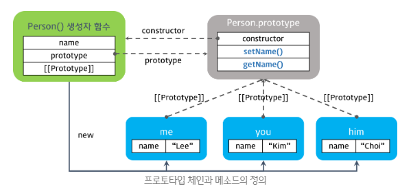
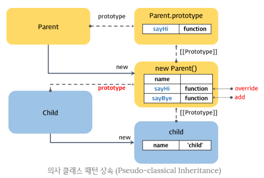
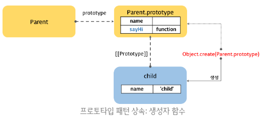
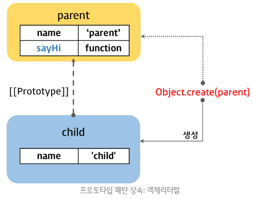
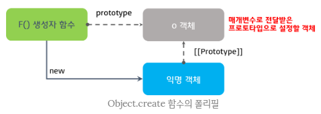
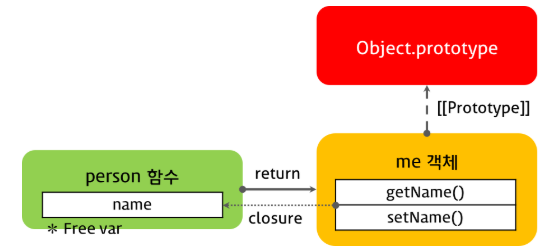
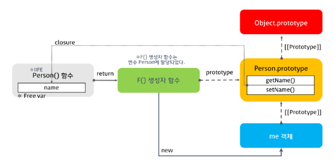

### 객체지향 프로그래밍 (Object-Oriented Programming)

------

##### 객체지향 프로그래밍의 이해

> 오늘날 많은 유명한 프로그래밍 언어(Java, C++, C#, Python, PHP, Ruby, Object-C)는 객체지향 프로그래밍을 지원한다. 그런데 객체지향이라는 개념은 명확한 정의가 존재하지 않는데, 따라서 객체지향의 개념을 이해하기 위해서는 객체지향의 특성을 통해 이해할 수 밖에 없다. 우리가 어떠한 개념을 이해하려할 때, 그 개념의 특성(attribute, property)를 통해 이해하는 것 처럼 말이다.


##### 객체지향 프로그래밍

> 객체지향 프로그래밍은 실세계에 존재하거나 인지 가능한 객체를 소프트웨어의 세게에서 표현하기 위해 객체의 핵심적인 개념 또는 기능만을 추출하는 추상화(abstraction)를 통해 모델링하려는 프로그래밍 패러다임을 말한다. 다시 말해, 우리가 주변의 실세계에서 사물을 인지하는 방식을 프로그래밍에 접목하려는 사상을 의미한다.
>
> 절차지향 프로그래밍에서 프로그램은 함수들의 집합 혹은 단순한 컴퓨터 멍령어들의 목록이다. 반면 객체지향 프로그래밍에서 프로그램은 서로 연관된 객체들의 집합이다. 각 객체는 메시지를 받거나 데이터를 처리할 수 있으며, 다른 객체에게 메시지를 전달하는 것이 가능하다. 프로그램이 기계라면, 각 객체는 고유의 역할이나 책임을 갖는 독립적인 부품으로 볼 수 있다. 객체지향 프로그래밍은 보다 유연하고 유지보수하기 쉬우며 확장성 측면에서도 유리한 프로그래밍을 하도록 의도되었고, 대규모 소프트웨어 개발에서 널리 사용된다.


#### 클래스 기반 / 프로토타입 기반

------

##### 클래스 기반 언어

> 클래스 기반의 OOP를 지원하는 언어(Java, C++, C#, Python, PHP, Ruby, Object-C)는 클래스로 객체의 자료구조와 기능을 정의하고 생성자를 통해 인스턴스를 생성한다.
>
> 클래스란 같은 종류의 집단에 속하는 인스턴스들의 속성과 행위를 정의한 것으로 객체지향 프로그램의 기본적인 사용자 정의 데이터형이라고 할 수 있다. 결국 클래스는 객체 생성에 사용되는 패턴 혹은 청사진일 뿐이며 new 연산자를 통한 인스턴스화 과정이 필요하다.
>
> 모든 인스턴스는 오직 클래스에서 정의된 범위 내에서만 작동하며 런타임에 그 구조를 변경할 수 없다. 이러한 특성은 정확성, 안전성, 예측성 측면에서 클래스 기반 언어가 프로토타입 기반 언어보다 더 나은 결과를 보장한다.


> ##### 클래스 기반 언어의 예시
>
> 다음의 예제는 Java로 구현된 클래스이다. Java는 class 키워드를 제공하고 이것으로 클래스를 정의한다. 생성자는 클래스명과 동일하며 메소드로 구현된다.

```java
class Person {
    private String name;
    
    public Person(String name) {
        this.name = name;
    }
    
    public void setName(String name) {
        this.name = name;
    }
    
    public String getName() {
        return this.name;
    }
    
    public static void main(String[] args) {
        Person me = new Person('Lee');
        
        String name = me.getName();
        System.out.printIn(name); 	// Lee
    }
}
```


##### 프로토타입 기반 언어

> 자바스크립트는 멀티-패러다임 언어로 명령형(imperative), 함수형(functional), 프로토타입 기반(prototype-based) 객체 지향 언어이다. 비록 다른 객체지향 언어들과의 차이점에 대한 논쟁들이 있긴 하지만, 자바스크립트는 강력한 객체지향 프로그래밍 능력들을 지니고 있다.
>
> 자바스크립트에서는 클래스 개념이 없고 별도의 객체 생성 방법이 존재하는데, 그 방법들은 다음과 같다.

* 객체 리터럴
* Object() 생성자 함수
* 생성자 함수

```javascript
// 객체 리터럴
var obj1 = {};
obj1.name = 'Lee';

// Object() 생성자 함수
var obj2 = new Object();
obj2.name = 'Lee';

// 생성자 함수
function  F() {
    var obj3 = new F();
    obj3.name = 'Lee';
}
```

> 자바스크립트는 이미 생성된 인스턴스의 자료구조와 기능을 동적으로 변경할 수 있다는 특징이 있다. 객체 지향의 상속, 캡슐화(정보 은닉) 등의 개념은 프로토타입 체인과 클로저 등으로 구현이 가능하다.
>
> 클래스 기반 언어에 익숙한 프로그래머들은 이러한 프로토타입 기반의 특성으로 인해 혼란을 느낀다. 자바스크립트에서는 함수 객체로 많은 것을 할 수 있는데, 클래스, 생성자. 메소드도 모두 함수로 구현이 가능하다.


> ##### ES6의 클래스
>
> ES6에서는 클래스란 개념이 추가되었다. 이는 프로토타입 기반 객체지향 프로그래밍보다 클래스 기반 언어에 익숙한 프로그래머가 자바스크립트를 보다 빠르게 학습할 수 있는 단순하고 깨끗한 새로운 문법을 제시하고 있다. ES6의 클래스가 새로운 객체지향 모델을 제공하는 것은 아니며 클래스도 사실 함수이고 기존 프로토타입 기반 패턴의 문법적 설탕이다.


#### 생성자 함수와 인스턴스의 생성

------

> 자바스크립트는 생성자 함수와 new 연산자를 통해 인스턴스를 생성할 수 있다. 이때 생성자 함수는 클래스이자 생성자의 역할을 한다.

```javascript
// 생성자 함수(Constructor)
function Person(name) {
    // 프로퍼티
    this.name = name;
    
    // 메소드
    this.setName = function(name) {
        this.name = name;
    };
    
  	this.getName = fucntion() {
        return this.name;
    };
}

// 인스턴스의 생성
var me = new Person('Lee')
console.log(me.getName()); 	// Lee

// 메소드 호출
me.setName('Kim');
console.log(me.getName()); 	// Kim
```

> 위 예제는 잘 동작한다. 하지만 이 예제는 문제가 많다. Person 생성자 함수로 여러 개의 인스턴스를 생성한 다음의  예제를 보자.

```javascript
var me = new Person('Lee');
var you = new Person('Kim');
var him = new Person('Choi');

console.log(me); 
console.log(you);
console.log(him);
// Person { name: 'Lee', setName: [Function], getName: [Function] }
// Person { name: 'Kim', setName: [Function], getName: [Function] }
// Person { name: 'Choi', setName: [Function], getName: [Function] }
```

> 위와 같이 인스턴스를 생성하면 각각의 인스턴스에 메소드 setName, getName이 중복되어 생성된다. 즉, 각 인스턴스가 내용이 동일한 메소드를 각자 소유한다. 이는 메모리 낭비인데 생성되는 인스턴스가 많아지거나 메소드가 크거나 많다면 무시할 수 없는 문제이다.
>
> 이러한 문제를 해결하기 위해 새로운 접근 방식이 필요하였고, 그 해답으로 나온 것이 바로 프로토타입이다.


#### 프로토타입 체인과 메소드의 정의

------

> 모든 객체는 프로토타입이라는 다른 객체를 가리키는 내부 링크를 가지고 있다. 즉, 프로토타입을 통해 직접 객체를 연결할 수 있는데 이를 프로토타입 체인이라 한다.
>
> 프로토타입을 이용하여 생성자 함수 내부의 메소드를 생성자 함수의 prototype 프로퍼티가 가리키는 프로토타입 객체로 이동시키면 생성자 함수에 의해 생성된 모든 인스턴스는 프로토타입 체인을 통해 프로토타입 객체의 메소드를 참조할 수 있다.
>
> 예시는 다음과 같다.

```javascript
// 생성자 함수 및 프로퍼티 정의
function Person(name) {
    this.name = name;
}

// 프로토타입 객체에 메소드 정의
Person.prototype.setName = function(name) {
    this.name = name;
};
Person.prototype.getName = function() {
    return this.name;
};

// 인스턴스 생성
var me  = new Person('Lee');
var you = new Person('Kim');
var him = new Person('choi');

// 프로토타입 객체 확인
console.log(Person.prototype);
// Person { setName: [Function], getName: [Function] }

// 메소드 동작 확인
console.log(me.getName()); // Lee
me.setName('Park');
console.log(me.getName()); // Park

// 각 객체 확인
console.log(me); 
console.log(you);
console.log(him);
// Person { name: 'Park' }
// Person { name: 'Kim' }
// Person { name: 'choi' }
```

> 각 객체에 setName, getName이 정의되어 있지 않음에도 불구하고 프로토타입 객체에 정의한 메소드를 활용하여 동작이 잘 수행됨을 알 수 있다. 이것이 프로토타입 객체 활용의 이점이다. 각 인스턴스가 공유하는 프로퍼티나 메소드는 프로토타입에 정의하는 것이 효율적이다.
>
> 이에 대한 참고 이미지는 다음과 같다.



> Person 생성자 함수의 prototype 프로퍼티가 가리키는 프로토타입 객체로 이동시킨 setName, getName 메소드는 프로토타입 체인에 의해 모든 인스턴스가 참조할 수 있다. 프로토타입 객체는 상속할 것들이 저장되는 장소이다.


##### ※ 더글라스 크락포드가 제안한 프로토타입 객체의 메소드 추가 방식

```javascript
/*
 * 모든 생성자함수의 프로토타입은 Function.prototype이다. 따라서 모든 생성자함수는 Function.prototype.method()에 접근할 수 있다.
 * @method Function.prototype.method
 * @param ({string}) (name) - (메소드 이름)
 * @param ({function}) (func) - (추가할 메소드 본체)
 */
Function.prototype.method = function (name, func) {
    // 생성자함수의 프로토타입에 동일한 이름의 메소드가 없으면 생성자함수의 프로토타입에 메소드를 추가한다.
    // this: 생성자함수
  	if(!this.prototype[name]) {
        this.prototype[name] = func;
    }
};

// 생성자함수 정의
function Person(name) {
    this.name = name;
}

// 생성자함수 Person의 프로토타입에 메소드 setName을 추가
Person.method('setName', function(name) {
    this.name = name;
});

// 생성자함수 Person의 프로토타입에 메소드 getName을 추가
Person.method('getName', function() {
    return this.name;
});
```

> 이제 잘 동작하는 지 다음과 같이 테스트한다.

```javascript
var me  = new Person('Lee');
var you = new Person('Kim');
var him = new Person('choi');

console.log(Person.prototype);
// Person { setName: [Function], getName: [Function] }

// 메소드 동작 확인
console.log(me.getName()); // Lee
me.setName('Park');
console.log(me.getName()); // Park

// 각 객체 확인
console.log(me); 
console.log(you);
console.log(him);
// Person { name: 'Park' }
// Person { name: 'Kim' }
// Person { name: 'choi' }
```


#### 상속 (Inheritance)

------

> 자바같은 클래스 기반 언어에서 상속(또는 확장)은 코드 재사용의 관점에서 매우 유용하다. 새롭게 정의할 클래스가 기존에 있는 클래스와 매우 유사하다면, 상속을 통해 다른 점만 구현하면 된다. 코드 재사용은 개발 비용을 현저히 줄일 수 있는 잠재력이 있기 때문에 매우 중요하다.
>
> 클래스 기반 언어에서 객체는 클래스의 인스턴스이며 클래스는 다른 클래스로 상속될 수 있다. 자바스크립트는 기본적으로 프로토타입을 통해 상속을 구현한다. 이는 프로토타입을 통해 객체가 다른 객체로 직접 상속된다는 의미이다. 이러한 점이 자바스크립트의 약점으로 여겨지기도 하지만 프로토타입 상속 모델은 사실 클래스 기반의 상속 모델보다 강력한 방법이다.
>
> 자바스크립트의 상속 구현 방식은 크게 두 가지로 구분이 가능하다. 하나는 클래스 기반 언어의 상속 방식을 흉내내는 의사 클래스 패턴 상속이고, 두 번째는 프로토타입으로 상속을 구현하는 프로토타입 패턴 상속(Prototypal Inheritance)이다.


##### 의사 클래스 패턴 상속 (Pseudo-classical Inheritance)

> 의사 클래스 패턴은 자식 생성자 함수의 prototype 프로퍼티를 부모 생성자 함수의 인스턴스로 교체하여 상속을 구현하는 방법이다. 부모와 자식 모두 생성자 함수를 정의해야 한다.
>
> 예시는 다음과 같다.

```javascript
// 부모 생성자 함수
var Parent = (function() {
    // constructor
    function Parent(name) {
        this.name = name;
    }
    
    // method
    Parent.prototype.sayHi = function() {
        console.log('Hi!' + this.name);
    };
    
    // return constructor
    return Parent;
}());
```

```javascript
// 자식 생성자 함수
var Child = (function () {
    // constructor
    function Child(name) {
        this.name = name;
    }
    
    // 자식 생성자 함수의 프로토타입 객체를 부모 생성자 함수의 인스턴스로 교체.
    Child.prototype = new Parent();
    
    // 메소드 오버라이드
    Child.prototype.sayHi = function () {
        console.log('안녕하세요!' + this.name);
    };
    
    // sayBye 메소드는 Parent 생성자함수의 인스턴스에 위치된다.
    Child.prototype.sayBye = function () {
        console.log('안녕하가세요!' + this.name);
    };
    
    return Child;
}());
```

```javascript
var child = new Child('child');
console.log(child);

console.log(Child.prototype);
// Parent { name: 'child' }

child.sayHi();
child.sayBye();
// 안녕하세요! child
// 안녕히가세요! child

// true
console.log(child instanceof Parent);
console.log(child instanceof Child);
```

> Child 생성자 함수가 생성한 인스턴스 child의 프로토타입 객체는 Parent 생성자 함수가 생성한 인스턴스이다. 그리고 Parent 생성자 함수가 생성한 인스턴스의 프로토타입 객체는 Parent.prototype이다.
>
> 이로써 child는 프로토타입 체인에 의해 Parent 생성자 함수가 생성한 인스턴스와 Parent.prototype의 모든 프로퍼티에 접근할 수 있다. 이름은 의사 클래스 패턴 상속이지만 내부적으로는 프로토타입을 기반으로 동작한다.
>
> 이를 표현한 이미지는 다음과 같다.



> 의사 클래스 패턴은 클래스 기반 언어의 상속을 흉내내어 상속을 구현하였다. 구동 상의 문제는 없지만 의사 클래스 패턴은 아래와 같은 문제를 가지고 있다.


> ##### new 연산자를 통해 인스턴스를 생성한다.
>
> 이는 자바스크립트의 프로토타입 본질에 모순되는 것이다. 프로토타입 본성에 맞게 객체에서 다른 객체로 직접 상속하는 방법을 갖는 대신 생성자 함수와 new 연산자를 통해 객체를 생성하는 불필요한 간접적인 단계가 있다. 클래스와 비슷하게 보이는 일부 복잡한 구문은 프로토타입 메커니즘을 명확히 나타내지 못하게 한다.
>
> 게다가 생성자 함수의 사용에는 심각한 위험이 존재한다. 만약 생성자 함수를 호출할 때 new 연산자를 포함하는 것을 잊게 되면 this는 새로운 객체와 바인딩되지 않고 전역객체에 바인딩 된다.
>
> 물론 이런 문제를 경감시키기 위해 파스칼 표기법으로 생성자 함수 이름을 표기하는 방법을 사용하지만, 더 나은 대안은 new 연산자의 사용을 피하는 것이다.


> ##### 생성자 링크의 파괴
>
> 위 그림을 보면 child 객체의 프로토타입 객체는 Parent 생성자 함수가 생성한 new Parent() 객체이다. 프로토타입 객체는 내부 프로퍼티로 constructor를 가지며 이는 생성자 함수를 가리킨다. 
>
> 하지만 의사 클래스 패턴 상속은 프로토타입 객체를 인스턴스로 교체하는 과정에서 constructor의 연결이 깨지게 된다. 즉, child 객체를 생성한 것은 Child 생성자 함수이지만 child.constructor의 출력 결과는 Child 생성자 함수가 아닌 Parent 생성자 함수를 나타낸다. 
>
> 이는 child 객체의 프로토타입 객체인 new Parent() 객체는 constructor가 없기 때문에 프로토타입 체인에 의해 Parent.prototype의 constructor를 참조했기 때문이다.

```javascript
console.log(child.constructor);  // [Function: Parent]
```


> ##### 객체 리터럴
>
> 의사 클래스 패턴 상속은 기본적으로 생성자 함수를 사용하기 때문에 객체 리터럴 패턴으로 생성한 객체의 상속에는 적합하지 않다. 이는 객체 리터럴 패턴으로 생성한 객체의 생성자 함수는 Object()이고 이를 변경할 방법이 없기 때문이다.


##### 프로토타입 패턴 상속

> 프로토타입 패턴 상속은 Object.create 함수를 사용하여 객체에서 다른 객체로 직접 상속을 구현하는 방식이다. 프로토타입 패턴 상속은 개념적으로 의사 클래스 패턴 상속보다 더 간단하다. 또한 의사 클래스 패턴의 단점인 new 연산자가 필요 없으며, 생성자 링크도 파괴되지 않으며, 객체 리터럴에도 사용할 수 있다.
>
> 생성자 함수를 사용한 프로토타입 패턴 상속은 다음과 같다.

```javascript
// 부모 생성자 함수
var Parent = (function () {
    // Constructor
    function Parent(name) {
        this.name = name;
    }
    
    // method
    Parent.prototype.sayHi = function() {
        console.log('Hi' + this.name);
    };
    
    // return constructor
    return Parent;
}());

// create 함수의 인수는 프로토타입이다.
var child = Object.create(Parent.prototype);
child.name = 'child';

child.sayHi(); 	// Hi! child
console.log(child instanceof Parent); // true
```

> 이에 대한 이미지는 다음과 같다.



> 다음의 예시와 같이 객체 리터럴 패턴으로 생성한 객체에도 프로토타입 패턴 상속을 사용할 수 있다.

```javascript
var parent = {
    name: 'parent',
    sayHi: function() {
        console.log('Hi ' + this.name);
    }
};

// create 함수의 인자는 객체이다.
var child = Object.create(parent);
child.name = 'child';

parent.sayHi();		// Hi! parent
child.sayHi();		// Hi! child

// true
console.log(parent.isPrototypeOf(child));
```

> 이에 대한 이미지는 다음과 같다.



> Object.create는 인자로 사용된 객체 또는 인스턴스를 프로토타입 객체로 하는 새로운 객체를 생성한다. 또한 객체 리터럴로 생성된 객체에도 적용이 가능하여 상속을 구현하기에 적합하다.
>
> 다만 Object.create는 표준에 비교적 늦게 추가되어 IE9 이상에서 정상적으로 동작한다. 따라서 크로스 브라우징에 주의하여야 한다. Object.create 함수의 폴리필(Polyfill: 특정 기능이 지원되지 않는 브라우저를 위해 사용할 수 있는 코드 조각이나 플러그인)을 살펴보면 상속의 핵심을 이해할 수 있다.

```javascript
// Object.create 함수의 폴리필
if (!Object.create) {
    Object.create = function(o) {
        function F() {} 	// 1
        F.prototype = o; 	// 2
        return new F();		// 3
    };
}
```

> 위 폴리필은 프로토타입 패턴 상속의 핵심을 담고 있다.

* 비어있는 생성자 함수 F를 생성한다.
* 생성자 함수 F의 prototype 프로퍼티에 매개변수로 전달받은 객체를 할당한다.
* 생성자 함수 F를 생성자로 하여 새로운 객체를 생성하고 반환한다.

> 이를 이미지로 표현하면 다음과 같다.




#### 캡슐화(Encapsulation)와 모듈 패턴(Module Pattern)

------

##### 캡슐화, 자바스크립트와 정보 은닉

> 캡슐화는 관련있는 멤버 변수와 메소드를 클래스와 같은 하나의 틀 안에 담고 외부에 공개될 필요가 없는 정보를 숨기는 것을 말하며 다른 말로 정보 은닉이라 한다.
>
> 자바의 경우, 클래스를 정의하고 그 클래스를 구성하는 멤버에 대해 public이나 private 등으로 한정할 수 있다. public으로 선언된 메소드 또는 데이터는 외부에서 사용이 가능하며, private으로 선언된 경우는 외부에서 참조할 수 없고 내부에서만 사용된다.
>
> 이는 클래스 외부에는 제한된 접근 권한을 제공하며 원하지 않는 외부의 접근에 대해 내부를 보호하는 작용을 한다. 이렇게 함으로써 이들 부분이 프로그램의 다른 부분들에 영향을 미치지 않고 변경될 수 있다.
>
> 그러나 자바스크립트는 public이나 private 등의 키워드를 제공하지 않는다. 그러나 정보 은닉이 불가능한 것은 아니다. 클로저와 자바스크립트의 함수 레벨 스코프 특징을 활용하여 다음과 같이 구현이 가능하다.


##### 자바스크립트 객체의 정보 은닉 구현 (클로저 활용)

> 예시는 다음과 같다.

```javascript
var Person = function(arg) {
    // 은닉할 정보를 클로저가 활용할 자유변수로 설정한다.
    var name =  arg ? arg: '';
    
    // 다음의 메소드는 클로저로 동작한다.
    this.getName = function() {
        return name;
    };
    this.setName = function(arg) {
        name = arg;
    };
}
```

> 위의 코드가 의도한 대로 잘 동작하는 지 다음과 같이 테스트해보자.

```javascript
// Person의 인스턴스 생성
var me = new Person('Lee');

// 정보 은닉 및 클로저의 동작 여부 확인
console.log(me.name); // undefined
console.log(me.getName()); // Lee

me.setName('Kim');
console.log(me.getName()); // Kim
```

> 이 코드의 의미는 다음과 같다. Person 내부에 선언된 name 변수는 private 변수가 된다. 이는 자바스크립트가 기본적으로 function-level scope를 제공하므로 함수 내의 변수를 외부에서 참조하는 것이 불가능하기 때문이다. 
>
> 만약 name 변수를 public한 변수로 설정하려고 하면 어떻게 해야할까? Person은 생성자 함수로 동작하므로 var 대신 this 키워드를 사용하면 될 것이다. 이렇게 하면 this가 생성되는 새로운 객체에 바인딩 되므로 name이 인스턴스의 프로퍼티로 설정되어 외부에서도 인스턴스를 통해 접근 가능하다.
>
> 반면 this로 선언된 메소드 getName, setName은 public 메소드로 동작하면서 클로저로 동작하므로 자유 변수 name에 접근이 가능하다. 


##### 모듈 패턴 방식의 구현

> 위에서 소개한 방법은 가장 기본적인 정보 은닉 방법이다. 위의 예시를 조금 더 정리한 예시는 다음과 같다.

```javascript
var person = function(arg) {
    var name = arg ? arg : '';
    
    // getName, setName을 메소드로 갖는 객체 반환
    return {
        getName: function() {
            return name;
        },
        setName: function(arg) {
            name = arg;
        }
    }
}
```

> 마찬가지로 다음과 같이 테스트가 가능하다.

```javascript
// Person의 인스턴스 생성, 이번에는 new를 사용하지 않는다.
var me = person('Lee');

// 정보 은닉 및 클로저의 동작 여부 확인
console.log(me.name); // undefined
console.log(me.getName()); // Lee

me.setName('Kim');
console.log(me.getName()); // Kim
```

> 이 예시에서 person 함수는 객체를 반환한다. 이 객체 내의 메소드 getName, setName은 클로저로서 private 변수 name에 접근 가능하다. 이러한 방식을 **모듈 패턴**이라 하며 캡슐화와 정보 은닉을 제공한다. 이러한 패턴은 많은 라이브러리에서 사용되는 유용한 패턴이다.


##### 모듈 패턴의 주의할 점

> 그러나 모듈 패턴은 다음과 같은 주의할 점이 있다.


> ##### private 멤버가 객체나 배열일 경우, 반환된 해당 멤버의 변경이 가능하다
>
> 다음의 예시를 보자.

```javascript
// 객체의 정의
var person = function (personInfo) {
    // 은닉할 정보
    var o = personInfo;
    
    return {
        getPersonInfo: function() {
            return o;
        }
    };
};
```

```javascript
var me = person({ name: 'Lee', gender: 'male' });

var myInfo = me.getPersonInfo();
console.log('myInfo: ', myInfo);
// myInfo:  { name: 'Lee', gender: 'male' }

myInfo.name = 'Kim';
myInfo = me.getPersonInfo();
console.log('myInfo: ', myInfo);
// myInfo:  { name: 'Kim', gender: 'male' }
```

> 이렇게 동작하는 이유는 무엇 때문일까?
>
> 이유는 객체를 반환할 때의 반환값은 얕은 복사(shallow copy)에 의해 객체의 참조값을 반환하기 때문이다. 해당 참조값을 활용하여 외부에서도 private으로 설정된 객체를 변경하는 것이 가능하다. 
>
> 이를 방지하기 위해서는 객체의 참조값을 그대로 반환해서는 안된다. 반환해야 할 객체의 정보를 새로운 객체에 담아 반환해야 하는데, 이 때 깊은 복사(deep copy)로 객체의 복사본을 만들어 반환해야 한다.


> ##### person 함수가 반환한 객체는 person 함수 객체의 프로토타입에 접근할 수 없다. 이는 상속을 구현할 수 없음을 의미한다.
>
> 모듈 패턴에서 정의한 함수는 생성자 함수로 동작하지 않으며, 객체를 반환할 뿐이다. 이러한 차이에 의해 모듈 패턴에서 정의한 함수로 생성된 객체는 함수 person의 프로토타입에 접근할 수 없다.
>
> 다음의 예시를 보자.

```javascript
var person = function(arg) {
    var name = arg ? arg : '';
    
    return {
        getName: function() {
            return name;
        },
        setName: function(arg) {
            name = arg;
        }
    }
}
```

```javascript
var me = person('Lee');

console.log(person.prototype === me.__proto__); // false
console.log(me.__proto__ === Object.prototype); // true
```

> 이 예시에 대한 설명은 다음과 같다.
>
> person에서 반환되는 객체는 객체 리터럴에 의해 생성된 것을 알 수 있다. 즉, Object() 생성자에 의해 생성됨을 의미하고, 따라서 생성된 객체의 프로토타입 객체는 person.prototype이 아니라 Object.prototype이 된다.
>
> 이를 이미지로 표현하면 다음과 같다.



> 반환된 객체가 함수 person의 프로토타입에 접근할 수 없다는 것은 person을 부모 객체로 상속할 수 없다는 것을 의미한다. 함수 person을 부모 객체로 상속할 수 없다는 것은 함수 person이 반환하는 객체에 모든 메소드를 포함시켜야 한다는 것을 의미한다. 그리고 이는 굉장히 비효율적일 것이다.
>
> 이 문제를 해결하기 위해서는 객체를 반환하는 것이 아니라 함수를 반환해야 한다.


##### 함수를 반환한 방식의 구현

> 예시는 다음과 같다.

```javascript
var Person = function () {
    var name;
    
    var F = function(arg) { 
        name = arg ? arg : ''; 
    };
    
    F.prototype = {
        getName: function() {
            return name;
        },
        setName: function(arg) {
            name = arg;
        }
    };
    
    // 함수를 반환한다.
    return F;
}();
// 선언과 동시에 실행되므로 Person은 반환되는 함수 F이다.
```

```javascript
var me = new Person('Lee');
// Person 자체가 F를 반환하므로 new F('Lee')로 동작한다.
// 생성된 객체의 프로토타입 객체명은 Person.prototype이 된다.
// 생성자 함수로 동작하므로 객체가 생성되고 이 객체가 me에 할당.

console.log(Person);
// ƒ (arg) { name = arg ? arg : ''; }, 함수 F를 가리킨다.

console.log(F.prototype);
// Uncaught ReferenceError: F is not defined
// F는 Person 내부에서 var로 선언되었으므로 접근할 수 없다.

// true, me 객체의 프로토타입 객체는 Person.prototype이다. 
console.log(Person.prototype === me.__proto__);

console.log(me.getName()); // Lee
me.setName('Kim')
console.log(me.getName()); // Kim
```

> 이 예시에 대한 이미지는 다음과 같다.



> 기존과의 차이점은 Person.prototype과 Person() 함수 사이에 F()라는 생성자 함수가 존재하는 것이다. 이 F()로부터 me 객체가 생성되지만 생성자의 명칭은 Person.prototype으로 결정된다.
>
> 이렇게 상속을 유지하면서도 캡슐화를 구현할 수 있으나 복잡하다.


##### 자바스크립트와 캡슐화

> 캡슐화를 구현하는 패턴은 다양하며 각 패턴에는 장단점이 있다. 다양한 패턴의 장단점을 분석하고 파악함으로써 용도에 맞게 패턴을 취사선택하여 활용할 수 있어야 한다.
>
> 사실 자바스크립트는 클래스 기반 언어가 아니므로 기존의 전통적 방식으로 구현하려는 시도는 바른 판단은 아니다. 다만 객체지향 프로그래밍이 추구하는 재사용성, 유지보수의 용이성 등을 극대화하기 위한 노력의 일환으로 보아야 한다. 자바스크립트만의 방식을 잘 활용하여 기존의 방식에 얽매이지 않는다면 보다 효율적인 프로그래밍이 가능할 것이다.