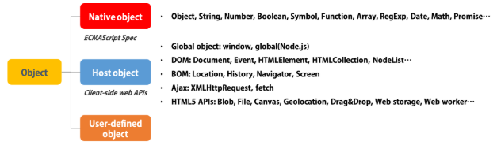
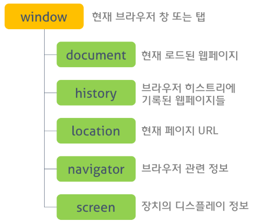
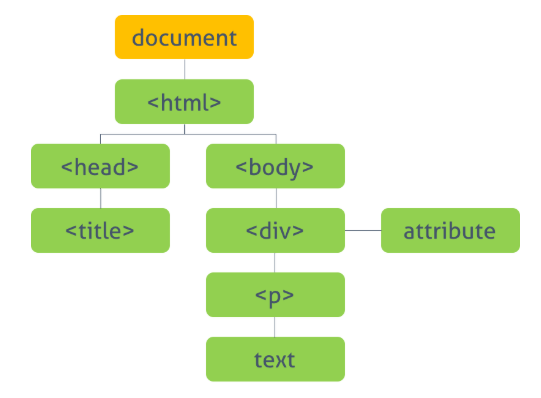

### 빌트인 객체 (Built-In Object)

------

##### 자바스크립트의 객체의 분류

> 자바스크립트의 객체는 아래와 같이 크게 세 개의 객체로 분류할 수 있다.




#### 네이티브 객체 (Native Object)

------

> **네이티브 객체(Native Objects 또는 Built-In Objects 또는 Global Objects)**는 ECMAScript 명세에 정의된 객체를 말하며 애플리케이션 전역에서 공통된 기능을 제공한다. 네이티브 객체는 애플리케이션 환경과 관계없이 언제나 사용할 수 있다.
>
> 네이티브 객체에는 Object, Array, Function, String, Number, RegExp, Date, Math와 같은 객체 생성에 관계가 있는 함수 객체와 메소드로 구성된다.
>
> 네이비트 객체를 Global Objects로 부르기도 하는데 이는 **전역 객체(Global Object)와는 다른 의미**로 사용되므로 혼동에 주의해야 한다.
>
> 반면, 전역 객체(Global Object)는 모든 객체의 최상위 객체를 의미하며 일반적으로 브라우저 환경에서는 window, 서버 환경(Node.js)에서는 global 객체를 의미한다.


##### Object

> ##### 형변환 없이 객체를 반환하는 경우
>
> Object() 생성자 함수는 객체를 생성한다. 만약 생성자 인수 값이 null이거나 undefined이면 빈 객체(`{}`)를 반환한다.
>
> 예시는 다음과 같다.

```javascript
/*
  변수 o에 빈 객체를 저장한다.
  다음의 구문은 모두 'object: {}'를 출력한다.
*/

var o = new Object();
console.log(typeof o + ': ', o);

o = new Object(undefined);
console.log(typeof o + ': ', o);

o = new Object(null);
console.log(typeof o + ': ', o);
```


> ##### 인수값에 따른 형변환된 객체가 반환되는 경우
>
> 그 이외의 인수를 생성자 함수에 전달하는 경우네는 인수값에 따라 강제 형변환된 객체가 반환된다. 따라서 이 때 반환된 객체의 [[Prototype]] 프로퍼티에 바인딩된 객체는 Object.prototype이 아니다.
>
> 예시는 다음과 같다.

```javascript
/*
  다음의 구문은 String 객체를 반환한다.
  var obj = new String('String'); 과 동일하게 동작한다.
*/

var obj = new Object('String');
console.log(typeof obj + ": ", obj);	// String {"String"}
console.log(obj.__proto__ === String.prototype)	
// true, __proto__가 String.prototype을 가리킨다.

var strObj = new String('String');
console.log(typeof strObj + ": ", strObj); // String {"String"}
// 위의 구문과 동일하게 동작한다.
```

```javascript
/*
  다음의 구문은 Number 객체를 반환한다.
  var obj = new Number(123); 과 동일하게 동작한다.
*/

var obj = new Object(123);
console.log(typeof obj + ": ", obj);	// Number {123}
console.log(obj.__proto__ === Number.prototype)	// true

var numObj = new Number(123);
console.log(typeof numObj + ': ', numObj);	// Number {123}
// 위의 구문과 동일하게 동작한다.
```

```javascript
/*
  다음의 구문은 Boolean 객체를 반환한다.
  var obj = new Boolean(true);과 동일하게 동작한다.
*/
var obj = new Object(true);
console.log(typeof obj + ': ', obj);	// Boolean {true}
console.log(obj.__proto__ === Boolean.prototype) // true

var boolObj = new Boolean(123);
console.log(typeof boolObj + ': ', boolObj); // Boolean {true}
// 위의 구문과 동일하게 동작한다.
```

> 객체를 생성할 경우, 특수한 상황이 아니라면 다음과 같이 객체리터럴 방식을 사용하는 것이 일반적이다.

```javascript
var o = {};
```


##### Function

> 자바스크립트의 모든 함수는 Function 객체이다. 다른 모든 객체들처럼 Function 객체는 new 연산자를 사용해 생성할 수 있다.

```javascript
var adder = new Function('a', 'b', 'return a + b');
adder(2, 6);	// 8
```


##### Boolean

> Boolean 객체는 원시 타입 boolean을 위한 **래퍼(wrapper) 객체**이다. Boolean 생성자 함수로 Boolean 객체를 생성할 수 있다. 인자로 전달되는 값이 true 또는 false로 평가되냐에 따라 생성되는 객체의 **[[PrimitiveValue]]**값이 결정된다.

```javascript
// foo : Boolean {true}
var foo = new Boolean(true);
var foo = new Boolean('false');

// foo : Boolean {false}
var foo = new Boolean(false);
var foo = new Boolean();
var foo = new Boolean('');
var foo = new Boolean(0);
var foo = new Boolean(null);
```


> ##### Boolean 객체와 원시 타입 boolean의 차이
>
> Boolean 객체는 true 또는 false 값을 포함하고 있는 객체로 원시타입 boolean과 다르다. 다음의 구문을 통해 둘의 차이를 확인할 수 있다.

```javascript
// x는 객체이므로 if문이 실행된다. 
var x = new Boolean(false);
if (x) { console.log("true") }
// true
```


##### Number, String, Array, Symbol, RegExp, Math, Date

> 각각 관련된 문서 참고


##### Error

> Error 생성자는 error 객체를 생성한다. error 객체의 인스턴스는 런타임 에러가 발생하였을 때 throw 된다.
>
> 예시는 다음과 같다.

```javascript
try {
    throw new Error('Whoops!');
} catch(e) {
    console.log(e.name + ": " + e.message);
}
// Error: Whoops!
```

> try 문에서 에러가 발생하여 catch 문이 실행되는 것을 확인할 수 있다. 에러가 발생한 이유는 Error 객체를 통해 에러를 명시적으로 발생시켰기 때문이다.
>
> Error 이외에 Error에 관련된 객체는 다음과 같다.

* EvalError
* InternalError
* RangeError
* ReferenceError
* SyntaxError
* TypeError
* URIError

```javascript
try { 
    throw new ReferenceError('RE'); 
} catch(e) { 
    console.log(e.name + ": " + e.message); 
}
// ReferenceError: RE
```


##### 원시 타입과 래퍼 객체

> 앞서 살펴본 바와 같이 각 네이티브 객체는 각자의 프로퍼티와 메소드를 가진다. 정적(static) 프로퍼티, 메소드는 해당 인스턴스를 생성하지 않아도 사용할 수 있고, prototype에 속한 메소드는 해당 prototype을 상속받은 인스턴스가 있어야만 사용할 수 있다.
>
> 그런데 원시 타입 값에 대해 표준 빌트인 객체의 메소드를 호출하면 정상적으로 작동한다. 이에 대한 예시는 다음과 같다.

```javascript
var str = 'Hello World!';
var res = str.toUpperCase();
console.log(res);	// "HELLO WORLD"

var num = 1.5;
console.log(num.toFixed());	// 2
```

> 이렇게 작동하는 이유는 무엇일까? 이는 원시 타입 값에 대해 표준 빌트인 객체의 메소드를 호출할 때, **원시 타입 값은 연관된 객체(래퍼 객체)로 일시 변환**되기 때문에 가능하다. 그리고 메소드 호출이 종료되면 래퍼 객체는 다시 원시 타입 값으로 복귀한다.
>
> 래퍼 객체로는 **String, Number, Boolean** 등이 있다.


#### 호스트 객체 (Host Object)

------

> 호스트 객체는 브라우저 환경에서 제공하는 window, XMLHttpRequest, HTMLElement 등의 DOM 노드 객체와 같이 호스트 환경에서 정의된 객체를 말한다. 브라우저에서 동작하는 환경과 브라우저 외부에서 동작하는 환경의 자바스크립트(Node.js)는 서로 다른 호스트 객체를 사용할 수 있다.
>
> 브라우저에서 동작하는 환경의 호스트 객체는 전역 객체인 window, BOM, DOM 및 XMLHttpRequest 객체 등을 제공한다.


##### 전역 객체 (Global Object)

> 전역 객체는 모든 객체의 유일한 최상위 개체를 의미하며 일반적으로 Browser-Side에서는 **window**, Server-Side(Node.js)에서는 **global** 객체를 의미한다.


##### BOM (Browser Object Model)

> 브라우저 객체 모델은 브라우저 탭 또는 브라우저 창의 모델을 생성한다. 최상위 객체는 **window** 객체로 현재 브라우저 창 또는 탭을 표현하는 객체이다. 또한 이 객체의 자식 객체들은 브라우저의 다른 기능들을 표현한다. 이 객체들은 Standard Built-In Objects가 구성된 후에 구성된다.
>
> BOM에 대한 참고 이미지는 다음과 같다.




##### DOM (Document Object Model)

> 문서 객체 모델은 현재 웹페이지의 모델을 생성한다. 최상위 객체는 **document** 객체로 전체 문서를 표현한다. 또한 이 객체의 자식 객체들은 문서의 다른 요소들을 표현한다. 이 객체들 역시 Standard Built-In Objects가 구성된 후에 구성된다.
>
> DOM에 대한 참고 이미지는 다음과 같다.



