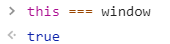
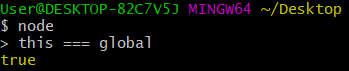
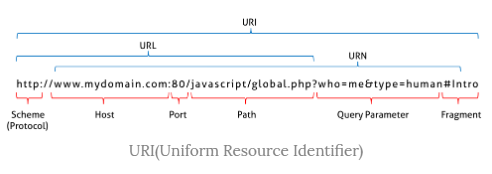

### 전역 객체 (Global Object)

------

##### 브라우저와 서버 환경에서의 전역 객체

> 전역 객체는 모든 객체의 유일한 최상위 객체를 의미하며 일반적으로 브라우저 환경에서는 **window**, 서버 환경(Node.js)에서는 **global** 객체를 의미한다.
>
> 참고 이미지는 다음과 같다.






##### 전역 객체의 특징

* 전역 객체는 실행 컨텍스트에 컨트롤이 들어가기 이전에 생성이 되며, constructor가 없기 때문에 **new 연산자를 이용하여 새롭게 생성할 수 없다.** 즉, 개발자가 전역 객체를 임의로 생성하는 것은 불가능하다.

* 전역 객체는 **전역 스코프**를 갖는다. 

* 전역 객체의 자식 객체를 사용할 때 **전역 객체의 기술은 생략 가능**하다. 예로 document 객체는 전역 객체 window의 자식 객체로서 `window.document...` 와 같이 기술할 수 있으나 일반적으로 전역 객체의 기술은 생략한다. 

```javascript
document.getElementById('foo').style.display = 'none';
/*
  위의 구문은 다음 구문과 동일하게 동작한다.
   window.document.getElementById('foo').style.display = 'none';
*/
```

* 단, 사용자가 정의한 변수명과 전역 객체의 자식 객체명이 충돌하는 경우 명확히 전역 객체를 기술함으로써 혼동을 방지할 수 있다. 

```javascript
function moveTo(url) {
    var location = {'href':'move to '};
    alert(location.href + url);
    // 스코프 규칙에 의해 location은 사용자가 정의한 변수를 가리킨다.
    window.location.href = url;
    // 전역 객체의 자식 객체 location을 참조하고자 할 때에는 전역 객체를 같이 기술한다.
}

moveTo('http://www.google.com');
```

* 전역 객체는 **전역 변수를 프로퍼티**로 갖는다. 다시 말하면 전역 변수는 전역 객체의 프로퍼티이다. 마찬가지로 전역에 선언한 함수도 전역 객체의 프로퍼티로 접근 가능하다. **전역 함수는 전역 객체의 메소드**이다.

```javascript
var ga = 'Global Varialbe';
console.log(ga);			// Global Varialbe
console.log(window.ga)		// Global Varialbe


function foo() {
    console.log('invoked');
}
window.foo();	// invoked
```

* **표준 빌트인 객체(Standard Built-In Objects)도 전역 객체의 자식 객체**이다. 전역 객체를 사용할 때 전역 객체의 기술은 생략할 수 있으므로 표준 빌트인 객체도 전역 객체의 기술을 생략할 수 있다.

```javascript
// window.alert('Hello world');
alert('Hello world');
```


#### 전역 프로퍼티 (Global Property)

------

> 전역 프로퍼티는 전역 객체의 프로퍼티를 의미한다. 애플리케이션 전역에서 사용하는 값들을 나타내기 위해 사용한다. 전역 프로퍼티는 간단한 값이 대부분이며 다른 프로퍼티나 메소드를 가지고 있지 않다.
>
> 전역 프로퍼티의 예로는 다음과 같은 것들이 있다.


##### Infinity

> Infinity 프로퍼티는 양/음의 무한대를 나타내는 숫자값을 갖는다.

```javascript
console.log(window.Infinity); // Infinity
console.log(3/0);  // Infinity
console.log(-3/0); // -Infinity
console.log(typeof Infinity); // number
console.log(Number.MAX_VALUE; // 1.7976931348623157e+308
```


##### NaN

> NaN 프로퍼티는 숫자가 아님(Not-a-Number)을 나타내는 숫자값 NaN을 갖는다. NaN 프로퍼티는 Number.NaN 프로퍼티와 같다.

```javascript
console.log(window.NaN);		// NaN
console.log(Number.NaN);		// NaN
console.log(NaN);				// NaN

console.log(Number('xyz'));		// NaN
console.log(1*'string');		// NaN

console.log(typeof NaN);		// number
```


##### undefined

> 원시 타입 undefined를 값으로 갖는 프로퍼티이다.

```javascript
console.log(window.undefined);	// undefined

var foo;
console.log(foo);				// undefined
console.log(typeof undefined);	// undefined
```


#### 전역 함수 (Global Function)

------

> 전역 함수는 애플리케이션 전역에서 호출할 수 있는 함수로서 전역 객체의 메소드이다. 전역 함수의 종류로는 다음과 같은 것들이 있다.


##### eval()

> 매개변수에 전달된 문자열 구문 또는 표현식을 평가 또는 실행한다. 사용자로부터 입력받은 컨텐츠를 eval()로 실행하는 것은 보안에 매우 취약하기 때문에 eval()의 사용은 가급적 금지되어야 한다.
>
> 사용 형식은 다음과 같다.

```javascript
eval(string)
```

> 인자로 들어가는 `string`은 code 또는 표현식을 나타내는 문자열이다. 표현식에는 존재하는 객체들의 프로퍼티들과 변수들을 포함할 수 있다.
>
> 사용 예시는 다음과 같다.

```javascript
var foo = eval('2 + 2');
console.log(foo);

var x = 5;
var y = 4;
console.log(eval('x * y'));
```


##### isFinite()

> 매개변수에 전달된 값이 정상적인 유한수인지 검사하여 그 결과를 Boolean으로 반환한다. 매개변수에 전달된 값이 숫자가 아닌 경우, 숫자로 변환한 후 검사를 수행한다.
>
> 사용 형식은 다음과 같다.

```javascript
isFinite(testValue)
```

> 인자로 들어가는 `testValue`는 검사의 대상이 되는 값이다.
>
> 사용 예시는 다음과 같다.

```javascript
console.log(isFinite(Infinity));  // false
console.log(isFinite(NaN));       // false
console.log(isFinite('Hello'));   // false
console.log(isFinite('2005/12/12'));   // false

console.log(isFinite(0));         // true
console.log(isFinite(2e64));      // true
console.log(isFinite('10'));      // true: '10' → 10 변환
console.log(isFinite(null));      // true: null → 0 변환
```

> 아래의 두 예시가 에러 없이 동작하는 것은 자바스크립트의 암묵적 강제 형변환이 발생하기 때문이다. 이는 다음의 예시로도 확인이 가능하다.

```javascript
Number(null);		// 0
Boolean(null);		// false
```


##### isNaN()

> 매개변수에 전달된 값이 NaN인지 검사하여 그 결과를 Boolean으로 반환한다. 매개변수에 전달된 값이 숫자가 아닌 경우, 숫자로 변환한 후 검사를 수행한다.
>
> 사용 형식은 다음과 같다.

```javascript
isNaN(testValue)
```

> 인자로 들어가는 `testValue`는 검사의 대상이 되는 값이다.
>
> 사용 예시는 다음과 같다.

```javascript
isNaN(NaN);       				// true
isNaN(undefined); 				// true: undefined → NaN
isNaN({});      				// true: {} → NaN
isNaN('blabla');  				// true: 'blabla' → NaN

isNaN(37);						// false
isNaN(null);					// false: null → 0
isNaN(true);					// false: true → 1

/* strings */
isNaN('37')      				// false: '37' → 37
isNaN('37.37')   				// false: '37.37' → 37.37
isNaN('')        				// false: '' → 0
isNaN(' ')       				// false: ' ' → 0

/* dates */
isNaN(new Date())   			// false: new Date() → Number
isNaN(new Date().toString())  	// true:  String → NaN
```

> 위 예시에서 `new Date()`를 인자로 넣었을 때 `false`로 출력되는 이유는 Date 객체가 Number로 변환되는 것이 가능하기 때문이다.
>
> 이에 대한 예시는 다음과 같다.

```javascript
Number(new Date())		// 1574941449318
```


##### parseFloat()

> 매개변수에 전달된 문자열을 부동소수점 숫자(floating point number)로 변환하여 반환한다.
>
> 사용 형식은 다음과 같다.

```javascript
parseFloat(string)
```

> 인자로 들어가는 `string`은 변환의 대상이 되는 문자열이다. 이때 `string`의 전후 공백은 무시되며 문자열의 첫 숫자만 반환된다. 만약 첫 문자를 숫자로 변환할 수 없다면 NaN을 반환한다.
>
> 사용 예시는 다음과 같다.

```javascript
parseFloat('3.14');     		// 3.14
parseFloat('10.00');    		// 10
parseFloat('34 45 66'); 		// 34
parseFloat(' 60 ');     		// 60
parseFloat('40 years'); 		// 40
parseFloat('He was 40') 		// NaN
```


##### parseInt()

> 매개변수에 전달된 문자열을 정수형 숫자(Integer)로 해석(parsing)하여 반환한다. 반환값은 언제나 10진수이다.

```javascript
parseInt(string, radix);
```

> 인자로 들어가는 `string`은 변환의 대상이 되는 문자열이다. `radix`는 진법을 나타내는 기수로 2 ~ 36 범위의 값을 갖는다. 기본값은 10이다. 첫 번째 매개변수인 `string`에 전달된 값이 문자열이 아니면 매개변수를 문자열로 변환한 후 숫자로 해석하여 반환한다.
>
> 예시는 다음과 같다.

```javascript
parseInt(10);			// 10
parseInt(10.123);		// 10
```

> 두 번쨰 매개변수인 `radix`에는 진법을 나타내는 기수를 지정할 수 있다. 기수를 생략하면 `string`을 기본값인 10진수로 해석하여 반환한다.
>
> 예시는 다음과 같다.

```javascript
parseInt('10');     	// 10
parseInt('10.123'); 	// 10
```

> 두 번쨰 매개변수에 진법을 나타내는 기수를 지정하면 첫 번째 매개변수에 전달된 문자열을 해당 기수의 숫자로 해석하여 반환한다. 단, 이때 **반환값은 언제나 10진수**이다.
>
> 예시는 다음과 같다.

```javascript
parseInt('10', 2);  	// 2, 2진수 10 → 10진수 2
parseInt('11', 8);  	// 9, 8진수 11 → 10진수 9
parseInt('1A', 16); 	// 26, 16진수 1A → 10진수 26
```

> 반환값을 10진수가 아닌 수로 반환하려면 Number.prototype.toString 메소드를 사용해야 한다.
>
> `radix`에 진법을 나타내는 기수를 지정하지 않으면 기본값인 10이 적용되지만, 만약 `string`에 전달된 문자열이 `0x` 또는 `0X`로 시작하면 16진수로 해석하여 반환한다.
>
> 예시는 다음과 같다.

```javascript
parseInt('0x10');		// 16, 16진수 10 → 10진수 16
```

> 위 예시를 참고하면,  `string`에 전달된 문자열이 `0`으로 시작하면 8진수로 해석할 것으로 추측할 수 있다. 실제로 ES5 이전까지는 8진수로 해석하도록 작동하였다. 그러나 ES6부터는 10진수로 해석한다.
>
> 예시는 다음과 같다.

```javascript
parseInt('010'); 		// 10, 8진수 10으로 인식하지 않는다.
parseInt('010', 8); 	// 8, 8진수 10 → 10진수 8
parseInt('10', 8); 		// 8, 8진수 10 → 10진수 8
```

> `string`에 전달된 **문자열의 첫 번째 문자**가 해당 지수의 숫자로 변환될 수 없다면 NaN을 반환한다.
>
> 예시는 다음과 같다.

```javascript
parseInt('A0');			// NaN
parseInt('A0', 16);		// 160
parseInt('20', 2);		// NaN
parseInt('20', 3);		// 6
```

> 그러나 `string`에 전달된 **문자열의 두 번째 문자**부터 해당 진수를 나타내는 숫자가 아닌 문자(예를 들어 2진수의 경우, 2 이상의 숫자나 문자)와 마주치면 이 문자와 이후 계속되는 문자들은 전부 무시되며 해석된 정수 값만을 반환한다.
>
> 예시는 다음과 같다.

```javascript
parseInt('1A0'));    // 1, '1'만 해석, 'A0'은 무시
parseInt('102', 2)); // 2, '10'만 해석, '2'는 무시
parseInt('58', 8);   // 5, '5'만 해석, '8'은 무시
parseInt('FG', 16);  // 15, 'F'만 해석, 'G'는 무시
```

> `string`에 전달된 문자열에 공백이 있다면 첫 번째 문자열만 해석하여 반환한다. 이 때 전후 공백은 무시된다. 만일 첫 번째 문자열을 숫자로 파싱할 수 없는 경우, NaN을 반환한다.
>
> 예시는 다음과 같다.

```javascript
parseInt('34 45 66'); // 34, 공백 기준 첫 문자열 34만 해석.
parseInt(' 60 ');     // 60, 공백 기준 60만 해석. 전후 공백 무시됨.
parseInt('40 years'); // 40, 공백 기준 첫 문자열 40만 해석.
parseInt('He was 40') // NaN, 공백 기준 첫 문자열 He만 해석.
```


##### encodeURI() / decodeURI()



> ##### encodeURI()
>
> encodeURI()는 매개변수로 전달된 URI를 인코딩한다. 인코딩이란, URI의 문자들을 이스케이프 처리하는 것을 의미한다.

> ##### decodeURI()
>
> 매개변수로 전달된 인코딩된 URI를 디코딩한다.


> ##### ※ 이스케이프 처리
>
> 이스케이프 처리란 문자 정보를 어떤 네트워크 시스템에서도 읽을 수 있는 **ASCII Character-set**으로 변환하는 것을 말한다. 통신하고자 하는 네트워크의 시스템에 구애받지 않고 따라서 문자 정보를 네트워크를 통해 공유하는 것이 가능하다. UTF-8 특수문자의 경우, 하나의 문자당 1~3byte의 정보로 변환된다. UTF-8의 한글 표현의 경우, 하나의 문자당 3byte의 정보로 변환된다. 예를 들어 특수문자 `공백(space)`은 `%20`, 한글 `가`는 `%EC%9E%90`으로 인코딩된다.
>
> URI 정보를 이스케이프 처리하는 이유는 무엇일까? URI 문법 형식 표준인 **RFC3986**에 따르면 URL은 **ASCII Character-set**으로만 구성되어야 하며 한글을 포함한 대부분의 외국어나 ASCII에 정의되지 않은 특수문자의 경우 URL에 포함될 수 없기 때문이다. 따라서 URL 내에서 의미를 갖고 있는 문자(%, ?, #)나 URL에 올 수 없는 문자(한글, 공백 등) 또는 시스템에 의해 해석될 수 있는 문자(<, >)를 이스케이프 처리하여 야기될 수 있는 문제를 예방하기 위함이다.
>
> 단, 다음의 문자는 encodeURI()의 이스케이프 처리에서 제외된다.

```
알파벳, 0~9의 숫자, `-`, `_`, `.`, `!`, `~`, `*`, `'`, `(`, `)`
```


> ##### 사용 형식과 예시
>
> encodeURI()와 decodeURI()의 사용 형식은 다음과 같다.

```javascript
encodeURI(URI)				// URI: 완전한 URI
decodeURI(encodedURI)		// encodedURI: 인코딩된 완전한 URI
```

> 사용 예시는 다음과 같다.

```javascript
var uri = 'http://example.com?name=이웅모&job=programmer&teacher';

var enc = encodeURI(uri);
var dec = decodeURI(enc);

console.log(enc);
// http://example.com?name=%EC%9D%B4%EC%9B%85%EB%AA%A8&job=programmer&teacher

console.log(dec);
// http://example.com?name=이웅모&job=programmer&teacher
```


##### encodeURIComponent() / decodeURIComponent()

> ##### encodeURIComponent()
>
> encodeURIComponent()는 매개변수로 전달된 URI의 구성요소(Component)를 인코딩한다. 이때 인코딩은 이스케이프 처리를 의미하며, 방식 및 예외는 encodeURI()와 유사하게 동작한다.

> ##### decodeURIComponent()
>
> decodeURIComponent()는 매개변수로 전달된 URI의 구성요소를 디코딩한다.


> ##### encodeURI()와 encodeURIComponent()의 차이
>
> encodeURIComponent()는 인수를 쿼리스트링의 일부라고 간주한다. 따라서 `=, ?, &`를 인코딩한다. 반면 encodeURI()는 인수를 URI 전체라고 간주하며 파라미터 구분자인 `=, ?, &`를 인코딩하지 않는다.


> ##### 사용 형식과 예시
>
> encodeURIComponent()와 decodeURIComponent()의 사용 형식은 다음과 같다.

```javascript
encodeURIComponent(URI) // URI: URI 구성 요소
decodeURIComponent(encodedURI) // encodedURI: 인코딩된 URI 구성 요소
```

> 사용 예시는 다음과 같다.

```javascript
var uriComp = '이웅모&job=programmer&teacher';

/* encodeURI, decodeURI */
var enc = encodeURI(uriComp);
var dec = decodeURI(enc);

console.log(enc);
// %EC%9D%B4%EC%9B%85%EB%AA%A8&job=programmer&teacher
console.log(dec);
// 이웅모&job=programmer&teacher


/* encodeURIComponent, decodeURIComponent */
enc = encodeURIComponent(uriComp);
dec = decodeURIComponent(enc);

console.log(enc);
// %EC%9D%B4%EC%9B%85%EB%AA%A8%26job%3Dprogrammer%26teacher
console.log(dec);
// 이웅모&job=programmer&teacher
```

