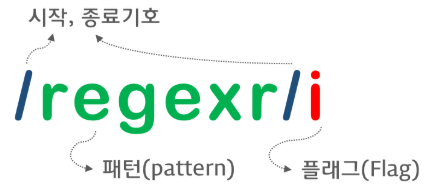

### 정규 표현식 (Regular Expression)

------

> 정규표현식은 문자열에서 특정 내용을 찾거나 대체 또는 발췌하는데 사용한다. 예를 들어 사용자로부터 입력 받는 전화번호가 유효한지 체크할 필요가 있다. 이 때 정규표현식을 사용하면 간단히 처리할 수 있다. 
>
> 예시는 다음과 같다.

```javascript
const tel = '0101234567팔';

// 정규 표현식 리터럴
const myRegExp = /^[0-9]+$/;

// 유효성 체크
console.log(myRegExp.test(tel)) // false
```


##### 정규표현식의 특징

> 반복문과 조건문을 사용한 복잡한 코드도 정규표현식을 이용하면 매우 간단하게 표현할 수 있다. 하지만 정규표현식은 주석이나 공백을 허용하지 않고 여러 기호를 혼합하여 사용하기 때문에 가독성이 좋지 않다는 문제가 있다.


#### 정규표현식 리터럴

------

> 정규표현식은 리터럴 표기법으로 생성이 가능하다. 리터럴의 표현은 다음과 같다.




##### 플래그

> 플래그는 다음과 같은 종류가 있다.

| Flag | Meaning     | Description                             |
| ---- | ----------- | --------------------------------------- |
| i    | Ignore Case | 대소문자를 구별하지 않고 검색한다.      |
| g    | Global      | 문자열 내의 모든 패턴을 검색한다.       |
| m    | Multi Line  | 문자열의 행이 바뀌어도 검색을 계속한다. |

> 플래그는 옵션이므로 선택적으로 사용한다. 예를 들어 g 플래그를 사용하지 않은 경우 문자열 내의 검색 매칭 대상이 1개 이상이더라도 처음 매칭된 대상만 검색하고 종료한다.
>
> 플래그의 유무에 따른 결과의 차이는 다음의 예시로 확인할 수 있다.

```javascript
const targetStr = 'Is this all there is?';

// 문자열 is를 대소문자를 구별하여 한번만 검색한다.
let regexr = /is/;

console.log(targetStr.match(regexr)); 
// [ 'is', index: 5, input: 'Is this all there is?' ]

// 문자열 is를 대소문자를 구별하지 않고 대상 문자열 끝까지 검색한다.
regexr = /is/ig;

console.log(targetStr.match(regexr)); 
// [ 'Is', 'is', 'is' ]
console.log(targetStr.match(regexr).length); // 3
```


#### 패턴

------

##### 패턴의 표현과 메타문자

> 패턴에는 검색하고 싶은 문자열을 지정한다. 이때 문자열의 따옴표는 생략한다. 만약 따옴표를 포함하면 따옴표 또한 검색의 대상이 된다.
>
> 그리고 패턴에서 자주 사용되는 것으로 **메타문자(Metacharacter)**가 있다. 이 메타문자는 특별한 의미를 갖고 있으며 기호로 표현이 가능하다.


##### 패턴의 표현과 검색 방식 지정 : 메타문자와 플래그의 활용

> ##### `.`로 임의의 길이를 갖는 문자 검색하기
>
> `.`는 임의의 문자 한 개를 의미한다. 문자의 내용은 무엇이든지 상관없다. 위 예제의 경우 `.`를 3개 연속하여 패턴을 생성하였으므로 3자리 문자를 추출한다. 예시는 다음과 같다.

```javascript
const targetStr = 'AA BB Aa Bb';
const regexr = /.../;

// AA 뒤의 공백도 문자로 취급한다.
console.log(targetStr.match(regexr)); 
// [ 'AA ', index: 0, input: 'AA BB Aa Bb' ]
```


> ##### g를 활용하여 매칭되는 패턴 모두 검색하기
>
> 위의 예시에서는 g 플래그를 사용하지 않았으므로 매칭이 되면 검색이 종료되는 것을 알 수 있다. 만약 g 플래그를 사용하였을 경우의 결과는 다음과 같다.

```javascript
const regexr = /.../g;

console.log(targetStr.match(regexr)); 
// [ 'AA ', 'BB ', 'Aa ' ]
```

> 이번에는 3개의 결과가 매칭된 것을 확인할 수 있다.


> ##### 모든 문자 선택하기
>
> `.`와 g를 다음과 같이 활용하여 문자열의 모든 문자를 선택할 수 있다.

```javascript
const targetStr = 'AA BB Aa Bb';
const regexr = /./g;

console.log(targetStr.match(regexr));
// [ 'A', 'A', ' ', 'B', 'B', ' ', 'A', 'a', ' ', 'B', 'b' ]
```


> ##### 특정 문자 또는 문자열 추출하기
>
> 패턴에 문자 또는 문자열을 지정하면 매칭되는 패턴을 찾아 추출한다.

```javascript
const targetStr = 'AA BB Aa Bb';
const regexr = /A/;

console.log(targetStr.match(regexr)); 
// ["A", index: 0, input: "AA BB Aa Bb", ...]
```


> ##### i와 g를 활용하여 대소문자 구별 없이 모든 패턴 조사하기
>
> i와 g를 같이 활용하면 대소문자를 구별하지 않으며, 일치하는 문자 또는 문자열을 전부 조사할 수 있다.

```javascript
const targetStr = 'AA BB Aa Bb';
const regexr = /A/ig;

console.log(targetStr.match(regexr)); 
// [ 'A', 'A', 'A', 'a' ]
```


> ##### `+`를 활용하여 반복되는 패턴 표현하기
>
> `+`는 반복되는 문자나 패턴을 표현할 때 사용한다. 예를 들어 A가 한 번 이상 반복되는 문자열을 검색하고자 할 때에는 `A+`와 같이 표현한다.

```javascript
const targetStr = 'AA AAA BB Aa Bb';
const regexr = /A+/g;

console.log(targetStr.match(regexr)); 
// [ 'AA', 'AAA', 'A' ]
```


> ##### `|`를 활용하여 OR의 의미 표현하기
>
> 만약 문자열 A나 B를 찾고자 할 때에는 어떻게 해야 할까? 이런 경우 `|`를 활용하여 OR의 의미를 표현할 수 있다.

```javascript
const targetStr = 'AA BB Aa Bb';
const regexr = /A|B/g;

console.log(targetStr.match(regexr)); 
// [ 'A', 'A', 'B', 'B', 'A', 'B' ]
```

> 위의 예시에서는 알파벳 단위로 탐색이 진행되었다. 만약 분해되지 않은 단어 단위로 하려면 어떻게 해야 할까? 위의 targetStr의 예시에 한정해서는 아래와 같이 패턴을 지정하여도 무방하다.

```javascript
const targetStr = 'AA AAA BB Aa Bb';
const regexr = /A+|B+/g;

console.log(targetStr.match(regexr));
// [ 'AA', 'AAA', 'BB', 'A', 'B' ]
```


> ##### `[]`를 활용하여 OR의 의미 표현하기
>
> 그러나 더욱 유연하게 검증하려면 다음과 같이 `[]`를 활용하여 작성하는 것이 좋다.

```javascript
const targetStr = 'AA BB Aa Bb AB';
const regexr = /[AB]+/ig;

console.log(targetStr.match(regexr)); 
// [ 'AA', 'BB', 'Aa', 'Bb', 'AB' ]
```


> ##### `-`를 활용하여 `[]`내에서 범위 지정하기
>
> 알파벳 전체, 또는 숫자 전체 등을 탐색 범위로 지정하고 싶은 경우 `-`를 활용하여 범위를 지정할 수 있다.

```javascript
const targetStr = 'AA BB ZZ Aa Bb';
const regexr = /[A-Z]+/ig;

console.log(targetStr.match(regexr)); 
// [ 'AA', 'BB', 'ZZ', 'Aa', 'Bb' ]
```

> 혹은 regexr을 `/[A-Za-z]+/ig`와 같이 지정하여도 무방하다.


> ##### 숫자 추출하기
>
> `[]`와 `-`을 사용하면 알파벳 뿐만 아니라 숫자도 쉽게 추출할 수 있다.

```javascript
const targetStr = 'AA BB Aa Bb 24,000';
const regexr = /[0-9]+/g;

console.log(targetStr.match(regexr)); // [ '24', '000' ]
```

> 만약 `,`도 포함시켜서 `24,000`을 추출하고 싶다면 다음과 같이 패턴을 변경하면 된다.

```javascript
const regexr = /[0-9,]+/g;

console.log(targetStr.match(regexr)); // [ '24,000' ]
```


> ##### `\d`, `\D`를 활용하기 : 숫자만, 혹은 숫자가 아닌 문자 추출
>
> `[0-9]`는 `[\d]`와 의미가 같다. `\D`는 숫자가 아닌 문자를 의미하며, `\d`와 반대로 동작한다.

```javascript
const targetStr = 'AA BB Aa Bb 24,000';
let regexr = /[\d,]+/g;

console.log(targetStr.match(regexr)); // [ '24,000' ]
```

```javascript
regexr = /[\D,]+/g;

console.log(targetStr.match(regexr)); 
// [ 'AA BB Aa Bb ', ',' ]
```


> ##### `\w`, `\W`를 활용하기 : 알파벳 또는 숫자만, 알파벳과 숫자가 아닌 문자만 탐색하기
>
> `\w`는 알파벳과 숫자를 의미한다. `\W`는 알파벳도, 숫자도 아닌 문자를 의미하며 `\w`와 반대로 동작한다.

```javascript
const targetStr = 'AaBb DeF123 560 $12 #$% [s2*]';
let regexr = /[\w]+/ig;

console.log(targetStr.match(regexr));
// ["AaBb", "DeF123", "560", "12", "s2"]
```

```javascript
regexr = /[\W]+/ig

console.log(targetStr.match(regexr));
// [" ", " ", " $", " #$% [", "*]"]
```


> ##### `^`, `$`를 활용하기 : 특정 문자로 시작하거나 끝나는지 확인하기
>
> `^`를 활용하면 특정 문자로 시작하는지 확인할 수 있다. `$`를 활용하면 특정 문자로 끝나는지 확인할 수 있다.

```javascript
const url = 'http://example.com';
const regexr = /^http/;

console.log(regexr.test(url)); // true
```

```javascript
const fileName = 'index.html';
const regexr = /html$/;

console.log(regexr.test(fileName)); // true
```


> ##### 특정 종류의 문자(알파벳, 숫자)로만 이루어져 있는지 확인하기
>
> 다음과 같이 `^`, `$`를 모두 활용하여 특정 종류의 문자로만 이루어져 있는지 확인할 수도 있다. 예를 들어 어떤 문자열이 숫자로만 이루어져 있는지 확인하는 경우는 다음과 같다.

```javascript
const targetStr = '12345';
const regexr = /^\d+$/;

console.log(regexr.test(targetStr)); // true
```


> ##### `[^]`를 활용하기 : 조건 부정(NOT)의 의미 나타내기
>
> `[^]`는 부정을 의미한다.

```javascript
var str1 = 'abc123';
var str2 = '123abc';
var regexr = /[^\d]$/

regexr.test(str1)	// false
regexr.test(str2)	// true
```

```javascript
var regexr = /[^a-z]$/

regexr.test(str1)	// true
regexr.test(str2)	// false
```


> ##### `\s`를 활용하여 공백 검사하기
>
> `\s`를 활용하면 여러 공백 문자(스페이스, 탭 등)를 확인할 수 있다.

```javascript
var str = " Hi!";
var regexr = /[\s]+/g;

regexr.test(str) 	// true
```


##### ※ 활용 : 형식 유효성 검증하기

> 정규표현식은 주로 다양한 사용자 입력 정보의 형식이 유효한지 검증하기 위해 사용된다. 아이디, 메일 주소, 연락처 번호, 특수 문자의 포함 여부 등이 대표적인 예이다.


> ##### 아이디 유효성 검증하기 (영문자, 숫자만 허용, 4~10자리)

```javascript
const id = 'abc123';

// 알파벳 대소문자 또는 숫자로 시작하고 끝나며 4~10자리인지 검사
// {4,10}: 4 ~ 10자리
const regexr = /^[A-Za-z0-9]{4,10}$/;

console.log(regexr.test(id)); // true
```


> ##### 메일 주소 형식 검증하기

```javascript
const email = 'ungmo2@gmail.com';

const regexr = /^[0-9a-zA-Z]([-_\.]?[0-9a-zA-Z])*@[0-9a-zA-Z]([-_\.]?[0-9a-zA-Z])*\.[a-zA-Z]{2,3}$/;

console.log(regexr.test(email)); // true
```


> ##### 연락처 번호 형식 검증하기

```javascript
const cellphone = '010-1234-5678';
const regexr = /^\d{3}-\d{3,4}-\d{4}$/;

console.log(regexr.test(cellphone)); // true
```


> ##### 특수 문자 포함 여부 검사하기

```javascript
// A-Za-z0-9 이외의 문자가 있는지 검사
const targetStr = 'abc#123';
let regexr = /[^A-Za-z0-9]/gi;

console.log(regexr.test(targetStr)); // true
```

```javascript
// 아래 방식도 동작한다. 이 방식의 장점은 특수 문자를 선택적으로 검사할 수 있다.
regexr = /[\{\}\[\]\/?.,;:|\)*~`!^\-_+<>@\#$%&\\\=\(\'\"]/gi;

console.log(regexr.test(targetStr)); // true
```


#### 정규표현식 생성자

------

> 자바스크립트는 정규표현식을 위해 RegExp라는 객체를 지원한다. RegExp 객체를 생성하기 위해서는 리터럴 방식과 RegExp의 생성자 함수를 사용할 수 있다. 일반적인 방식은 리터럴 방식이며 위의 예시에서 사용한 방식이다.
>
> 생성자를 활용하여 생성하는 방식은 다음과 같다.

```javascript
new RegExp(pattern[, flags])
```

> 위 사용형식에서 pattern은 정규표현식의 텍스트를 의미한다. flags는 정규표현식의 플래그(g, i, m, u, y)를 의미한다.
>
> 사용 예시는 다음과 같다.

```javascript
// 리터럴
/ab+c/i;

// 생성자를 통한 생성
new RegExp('ab+c', 'i');
new RegExp(/ab+c/, 'i');

// ES6
new RegExp(/ab+c/i); 
```


#### 정규표현식 메소드

------

> 정규표현식을 사용하는 자바스크립트 메소드는 다음과 같은 것들이 있다.


##### RegExp.prototype.exec(string)

> 문자열을 검색하며 매칭 결과를 반환한다. 매칭 결과가 있을 경우 배열의 형태로 반환되지만 매칭 결과가 없으면 null을 반환한다.

```javascript
const target = 'Is this all there is?';
const regExp = /is/ig;
const regExp2 = /is/
const regExp3 = /are/
```

```javascript
console.log(regExp.exec(target));
// ["Is", index: 0, input: "Is this all there is?", groups: undefined]
```

```javascript
console.log(regExp2.exec(target));
// ["is", index: 5, input: "Is this all there is?", groups: undefined]
```

```javascript
console.log(regExp3.exec(target));
// null
```

> exec() 메소드는 g 플래그를 지정하여도 첫 번째 매칭 결과만을 반환한다.

```javascript
const target = 'Is this all there is?';
const regExp = /is/ig;

console.log(regExp.exec(target));
// ["Is", index: 0, input: "Is this all there is?", groups: undefined]
```


##### RegExp.prototype.test(string)

> 문자열을 검색하여 매칭 결과를 반환한다. 매칭 결과가 있을 경우 true,  없을 경우 false를 반환한다.

```javascript
const target = 'Is this all there is?';
const regExp1 = /is/;
const regExp2 = /are/;
```

```javascript
const res1 = regExp1.test(target);
console.log(res1); 		// true

const res2 = regExp2.test(target);
console.log(res2);		// false
```


##### String.prototype.match(regExp)

> 문자열을 탐색하며 패턴과 일치하는 문자열을 추출한다는 점에서 exec()와 유사하게 동작한다. g 플래그를 사용하는 경우 패턴과 일치하는 문자열을 모두 배열로 반환한다는 점에서 exec()와 다르게 동작한다. 
>
> 위 **패턴** 항목에서의 예시를 참고하자.


##### String.prototype.replace(regExp, string)

> 패턴과 일치하는 문자 또는 문자열을 두 번째 인자의 문자열로 치환한다.


##### String.prototype.search(regExp)

> 패턴과 일치하는 문자 또는 문자열의 인덱스를 반환한다.

```javascript
var paragraph = 'The quick brown fox jumps over the lazy dog. If the dog barked, was it really lazy?';

// 공백, 알파벳, 숫자가 아닌 문자
var regex = /[^\w\s]/g;

console.log(paragraph.search(regex));
// 43

console.log(paragraph[paragraph.search(regex)]);
// .
```


##### String.prototype.split(regExp)

> 패턴과 일치하는 문자 또는 문자열을 기준으로 spilt 메소드를 실행한다.

```javascript
const email = 'abc123@naver.com';
const regexr = /@/;

console.log(email.split(regexr));
// ["abc123", "naver.com"]
```

