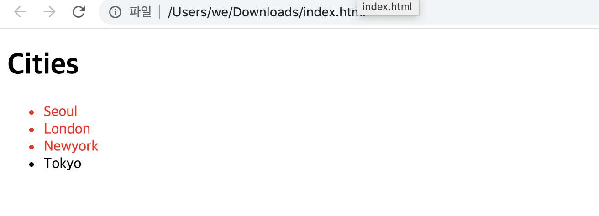
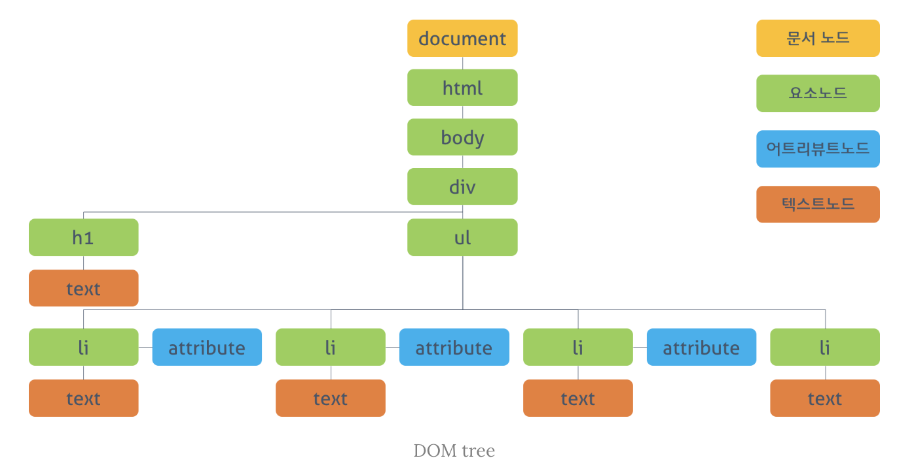
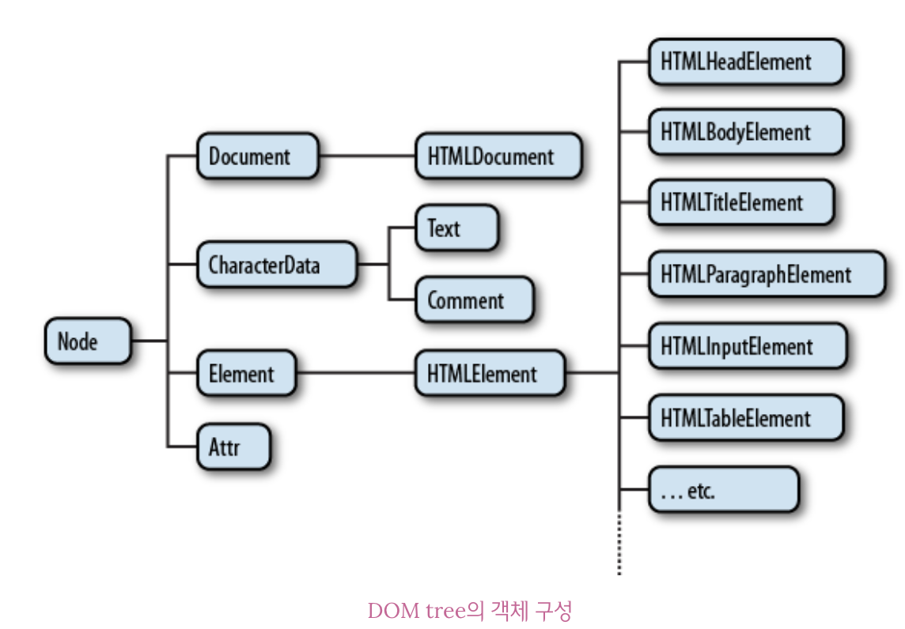

### 문서 객체 모델 (Document Obejct Model)

------

> 텍스트 파일로 만들어져 있는 웹 문서를 브라우저에 렌더링하려면 웹 문서를 브라우저가 이해할 수 있는 구조로 메모리에 올려야 한다. 브라우저의 렌더링 엔진은 웹 문서를 로드한 후, 파싱하여 웹 문서를 브라우저가 이해할 수 있는 구조로 구성하여 메모리에 적재하는데 이를 DOM이라 한다.
>
> 더 자세히 표현하면, 웹 문서의 모든 요소와 요소의 어트리뷰트, 텍스트를 각각의 객체로 만들고 이 객체들의 부모-자식 관계를 표현하는 트리 구조로 구성한 것이 DOM이다. DOM은 자바스크립트를 통해 동적으로 변경할 수 있으며 변경된 DOM은 렌더링에 반영된다.
>
> 브라우저가 웹 문서(HTML, XML, SVG)를 로드한 후, 파싱하여 DOM을 생성하는 과정을 설명하는 이미지는 다음과 같다.


##### DOM의 특징과 기능

> DOM은 W3C의 공식 표준이며, HTML, ECMAScript에서 정의한 표준이 아니므로 플랫폼과 프로그래밍 언어에 대해 중립적이다. DOM은 다음의 두 가지 기능을 담당한다.

* ##### HTML 문서에 대한 모델 구성

> 브라우저는 HTML 문서를 로드한 후 해당 문서에 대한 모델을 메모리에 생성한다. 이 떄 모델은 객체의 트리로 구성되는데 이를 **DOM tree**라 한다.

* ##### HTML 문서 내의 각 요소에 접근 / 수정

> DOM은 모델 내의 각 객체에 접근하고 수정할 수 있는 프로퍼티와 메소드를 제공한다. DOM이 수정되면 브라우저를 통해 사용자가 보게 될 내용 또한 변경된다.


##### DOM API

> 웹 문서는 자바스크립트에 의해 동적으로 변경된다. 자바스크립트와 같은 프로그래밍 언어가 웹 문서를 동적으로 변경할 수 있도록 DOM은 자신에게 접근하고 수정할 수 있는 방법을 제공한다. 그리고 이러한 방법은 일반적으로 프로퍼티와 메소드를 갖는 자바스크립트 객체로 제공되는데, 이를 **DOM API**라 한다. 
>
> 웹 페이지는 정적이며, 정적인 웹 페이지에 접근하여 동적으로 웹 페이지를 변경하기 위한 유일한 방법은 메모리 상에 존재하는 DOM을 변경하는 것이다. 이 DOM에 접근하고 변경하는 프로퍼티와 메소드의 집합이 DOM API이다.


#### DOM tree

------

> DOM tree는 브라우저가 HTML 문서를 로드한 후 파싱하여 생성하는 모델을 의미한다. 객체의 트리로 구조화되어 있기 때문에 DOM tree라 한다.
>
> 우선 다음의 예시를 보자.

```html
<!DOCTYPE html>
<html>
  <head>
    <style>
      .red  { color: #ff0000; }
      .blue { color: #0000ff; }
    </style>
  </head>
  <body>
    <div>
      <h1>Cities</h1>
      <ul>
        <li id="one" class="red">Seoul</li>
        <li id="two" class="red">London</li>
        <li id="three" class="red">Newyork</li>
        <li id="four">Tokyo</li>
      </ul>
    </div>
  </body>
</html>
```

> 예시의 웹 문서를 브라우저로 열어보면 다음과 같은 화면을 볼 수 있다.



##### DOM tree의 구성 요소 : 노드(Node)

> 예시의 웹 문서를 DOM tree로 표현하면 다음과 같다.



> DOM에서 모든 요소, 어트리뷰트, 텍스트는 노드라는 하나의 객체이다. 이 객체들의 관계는 트리 구조로 표현되며 root 노드는 Document 객체이다. 따라서 모든 요소들은 Document 객체의 자식이며, Document 객체는 DOM tree의 진입점(Entry Point)이다. 반면 최종점은 요소의 텍스트를 나타내는 객체이다.
>
> DOM tree는 다음의 네 종류의 노드로 구성된다.

* ##### 문서 노드 (Document Node)

> 트리의 최상위에 존재한다. 요소, 어트리뷰트, 텍스트 노드에 접근하려면 문서 노드를 통해야 하므로 DOM tree에 접근하기 위한 시작점이다.

* ##### 요소 노드 (Element Node)

> 요소 노드는 HTML 요소를 표현한다. HTML 요소는 중첩에 의해 부모-자식 관계를 갖는다. 이 관계를 통해 정보를 구조화한다. 따라서 요소 노드는 문서의 구조를 서술한다고 말 할 수 있다. 어트리뷰트, 텍스트 노드에 접근하려면 먼저 요소 노드를 찾아 접근해야 한다. 모든 요소 노드는 요소별 특성을 표현하기 위해 HTMLElement 객체를 상속한 객체로 구성된다.

* ##### 어트리뷰트 노드 (Attribute Node)

> 어트리뷰트 노드는 HTML 요소의 어트리뷰트를 표현한다. 어트리뷰트 노드느느 해당 어트리뷰트가 지정된 요소의 자식이 아니라 해당 요소의 일부로 표현된다. 따라서 해당 요소 노드를 찾아 접근하면 어트리뷰트를 참조, 수정할 수 있다.

* ##### 텍스트 노드 (Text Node)

> 텍스트 노드는 HTML 요소의 텍스트를 표현한다. 텍스트 노드는 요소 노드의 자식이며 자신의 자식 노드를 가질 수 없다. 즉, 텍스트 노드는 DOM tree의 최종단이다.

> 다음은 DOM tree를 구성하는 각 노드들의 상속 관계를 설명하는 이미지이다.



> DOM을 활용하여 웹 페이지를 조작하기 위해서는 먼저 조작하고자 하는 요소를 DOM tree를 순회함으로써 탐색한다. 선택된 요소의 콘텐츠 또는 어트리뷰트를 조작함으로써 조작이 이루어진다. 그리고 자바스크립트는 이러한 조작에 사용되는 방법(API)를 제공한다.


#### DOM Query / Traversing (요소에의 접근)

------


##### 하나의 요소 노드 선택

> ##### document.getElementById(id)
>
> id 어트리뷰트 값으로 요소 노드 하나를 선택한다. 복수 개가 선택된 경우, 첫 번째 요소만 반환한다. **HTMLElement를 상속받은 객체**를 반환한다. 모든 브라우저에서 동작한다.
>
> 예시는 다음과 같다.

```javascript
// id로 하나의 요소를 선택한다.
const elem = document.getElementById('one');
// 클래스 어트리뷰트의 값을 변경한다.
elem.className = 'blue';

console.log(elem); 	// <li id="one" class="blue">Seoul</li>
console.log(elem.__proto__);	// HTMLLIElement
console.log(elem.__proto__.__proto__); // HTMLElement
console.log(elem.__proto__.__proto__.__proto__); // Element
console.log(elem.__proto__.__proto__.__proto__.__proto__); // Node
```


> ##### document.querySelector(cssSelector)
>
> css 셀렉터를 사용하여 요소 노드를 한 개 선택한다. 복수개가 선택된 경우, 첫 번째 요소만 반환한다. 마찬가지로 **HTMLElement를 상속받은 객체**를 반환한다. IE8 이상의 브라우저에서 동작한다.

```javascript
// CSS 셀렉터를 이용해 요소를 선택한다.
const elem = document.querySelector('li.red');
// 클래스 어트리뷰트의 값을 변경한다.
elem.className = 'blue';
```


##### 여러 개의 요소 노드 선택

> ##### document.getElementsByClassName(class)
>
> class 어트리뷰트 값으로 일치하는 요소 노드를 모두 선택한다. 공백으로 구분하여 여러 개의 class 어트리뷰트를 지정할 수 있다. **HTMLCollection**를  반환한다. IE9 이상의 브라우저에서 동작한다.
>
> HTMLCOllection은 **live**하다는 특징이 있다. 이 의미에 대해서 파악하기 전에 먼저 다음의 예시를 보자.

```javascript
// HTMLCollection을 반환한다. HTMLCOllection은 live하다.
const elems = document.getElementsByClassName('red');

for (let i = 0; i < elems.length; i++) {
  // 클래스 어트리뷰트의 값을 변경한다.
  elems[i].className = 'blue';
}
```

> 위 예제를 실행하기 전에, 먼저 위 예제가 어떻게 동작할지 예상해보자. elems에는 class가 red인 node들이 반환될 것이다. 따라서 각 노드들을 순회하며 red 클래스가 blue 클래스로 변경될 것으로 예상할 수 있다. 
>
> 다음은 위 예시를 실행한 결과의 화면이다.


> 그러나 위 예제를 실행해보면 예상대로 동작하지 않을 것이다. 실행해보면 두 번째 요소가 클래스 변경이 되지 않는 것을 확인할 수 있다. 이렇게 동작하는 이유는 무엇일까?
>
> 먼저 HTMLCollection란 어떤 객체일까? 이 객체는 HTMLElement의 리스트를 담아 반환하기 위한 객체로 배열과 비슷한 사용법을 가지고 있으나 배열이 아닌 유사 배열(Array-like Object)이다. 그리고 HTMLCollection은 실시간으로 Node의 상태 변경을 반영하는데, 이러한 특성을 live하다고 표현한 것이다.
>
> 그렇다면, 이 live한 특성이 어떻게 위 예시처럼 동작하게 했는지 알아보자.

> ##### HTMLCollection의 live한 특성
>
> elems.length는 3이므로 총 3번의 loop가 실행된다. 
>
> i가 0일때, elems의 첫 요소의 class 어트리뷰트의 값이 className 프로퍼티에 의해 red에서 blue로 변경된다. 이 때 elems는 실시간으로 Node의 상태 변경을 반영하는 HTMLCollection 객체이다. elems의 첫 요소는 li#one.red에서 li#one.blue로 변경되었으므로 getElementsByClassName 메소드의 인자로 지정한 선택 조건(‘red’)과 더이상 부합하지 않게 되어 반환값에서 실시간으로 제거된다.
>
> i가 1일때, elems에서 첫째 요소는 제거되었으므로 elems[1]은 3번째 요소(li#three.red)가 된다. li#three.red의 class 어트리뷰트 값이 blue로 변경되고 마찬가지로 HTMLCollection에서 제외된다.
>
> i가 2일때, HTMLCollection의 1,3번째 요소가 실시간으로 제거되었으므로 2번째 요소(li#two.red)만 남았다. 이때 elems.length는 1이므로 for 문의 조건식 i < elems.length가 false로 평가되어 반복을 종료한다. 따라서 elems에 남아 있는 2번째 li 요소(li#two.red)의 class 값은 변경되지 않는다.
>
> 위와 같이 HTMLCollection은 실시간으로 노드의 상태 변경을 반영하기 때문에 loop가 필요한 경우 주의가 필요하다. 위와 같이 동작하는 것을 아래와 같은 방법들로 회피할 수 있다.

> ##### HTMLCollection의 반복문시 우회 방법

* 반복문을 역방향으로 진행한다.

```javascript
const elems = document.getElementsByClassName('red');

for (let i = elems.length - 1; i >= 0; i--) {
  elems[i].className = 'blue';
}
```

* While 반복문을 사용한다. 이 떄 elems에 요소가 남아있지 않을 때 까지 무한반보하기 위해 index는 0으로 고정한다.

```javascript
const elems = document.getElementsByClassName('red');

let i = 0;
while (elems.length > i) {
  elems[i].className = 'blue';
}
```

* HTMLCollection을 배열로 변경한다. 권장하는 방법이다.

```javascript
const elems = document.getElementsByClassName('red');

// 유사 배열 객체인 HTMLCollection을 배열로 변환한다.
// 배열로 변환된 HTMLCollection은 더 이상 live하지 않으므로 순회하면 된다.
[...elems].forEach(elem => elem.className = 'blue');
```

* querySelectorAll 메소드를 사용하여 NodeList를 반환하게 한다.


> ##### querySelectorAll(cssSelector)
>
> 마찬가지로 css Selector가 일치하는 요소 노드를 모두 선택한다. 그러나 **NodeList**를 반환한다는 특징이 있다. 이 NodeList는 non-live하다는 특징이 있어 일반적인 순회방법으로 노드의 어트리뷰트를 변경할 수 있다. IE8 이상의 브라우저에서 동작한다.
>
> 예시는 다음과 같다.

```javascript
// Nodelist를 반환한다.
const elems = document.querySelectorAll('li.red');

[...elems].forEach(elem => elem.className = 'blue');
```

