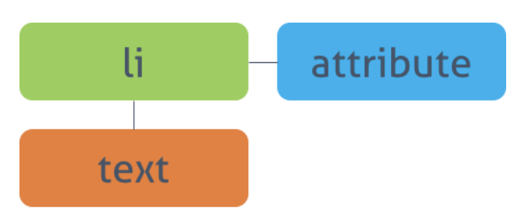
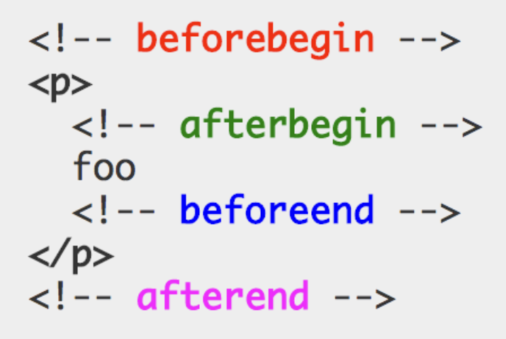

### 문서 객체 모델 (Document Obejct Model)

------

> 텍스트 파일로 만들어져 있는 웹 문서를 브라우저에 렌더링하려면 웹 문서를 브라우저가 이해할 수 있는 구조로 메모리에 올려야 한다. 브라우저의 렌더링 엔진은 웹 문서를 로드한 후, 파싱하여 웹 문서를 브라우저가 이해할 수 있는 구조로 구성하여 메모리에 적재하는데 이를 DOM이라 한다.
>
> 더 자세히 표현하면, 웹 문서의 모든 요소와 요소의 어트리뷰트, 텍스트를 각각의 객체로 만들고 이 객체들의 부모-자식 관계를 표현하는 트리 구조로 구성한 것이 DOM이다. DOM은 자바스크립트를 통해 동적으로 변경할 수 있으며 변경된 DOM은 렌더링에 반영된다.
>
> 브라우저가 웹 문서(HTML, XML, SVG)를 로드한 후, 파싱하여 DOM을 생성하는 과정을 설명하는 이미지는 다음과 같다.


##### DOM의 특징과 기능

> DOM은 W3C의 공식 표준이며, HTML, ECMAScript에서 정의한 표준이 아니므로 플랫폼과 프로그래밍 언어에 대해 중립적이다. DOM은 다음의 두 가지 기능을 담당한다.

* ##### HTML 문서에 대한 모델 구성

> 브라우저는 HTML 문서를 로드한 후 해당 문서에 대한 모델을 메모리에 생성한다. 이 떄 모델은 객체의 트리로 구성되는데 이를 **DOM tree**라 한다.

* ##### HTML 문서 내의 각 요소에 접근 / 수정

> DOM은 모델 내의 각 객체에 접근하고 수정할 수 있는 프로퍼티와 메소드를 제공한다. DOM이 수정되면 브라우저를 통해 사용자가 보게 될 내용 또한 변경된다.


##### DOM API

> 웹 문서는 자바스크립트에 의해 동적으로 변경된다. 자바스크립트와 같은 프로그래밍 언어가 웹 문서를 동적으로 변경할 수 있도록 DOM은 자신에게 접근하고 수정할 수 있는 방법을 제공한다. 그리고 이러한 방법은 일반적으로 프로퍼티와 메소드를 갖는 자바스크립트 객체로 제공되는데, 이를 **DOM API**라 한다. 
>
> 웹 페이지는 정적이며, 정적인 웹 페이지에 접근하여 동적으로 웹 페이지를 변경하기 위한 유일한 방법은 메모리 상에 존재하는 DOM을 변경하는 것이다. 이 DOM에 접근하고 변경하는 프로퍼티와 메소드의 집합이 DOM API이다.


#### DOM tree

------

> DOM tree는 브라우저가 HTML 문서를 로드한 후 파싱하여 생성하는 모델을 의미한다. 객체의 트리로 구조화되어 있기 때문에 DOM tree라 한다.
>
> 우선 다음의 예시를 보자.

```html
<!DOCTYPE html>
<html>
  <head>
    <style>
      .red  { color: #ff0000; }
      .blue { color: #0000ff; }
    </style>
  </head>
  <body>
    <div>
      <h1>Cities</h1>
      <ul>
        <li id="one" class="red">Seoul</li>
        <li id="two" class="red">London</li>
        <li id="three" class="red">Newyork</li>
        <li id="four">Tokyo</li>
      </ul>
    </div>
  </body>
</html>
```

> 예시의 웹 문서를 브라우저로 열어보면 다음과 같은 화면을 볼 수 있다.


##### DOM tree의 구성 요소 : 노드(Node)

> 예시의 웹 문서를 DOM tree로 표현하면 다음과 같다.


> DOM에서 모든 요소, 어트리뷰트, 텍스트는 노드라는 하나의 객체이다. 이 객체들의 관계는 트리 구조로 표현되며 root 노드는 Document 객체이다. 따라서 모든 요소들은 Document 객체의 자식이며, Document 객체는 DOM tree의 진입점(Entry Point)이다. 반면 최종점은 요소의 텍스트를 나타내는 객체이다.
>
> DOM tree는 다음의 네 종류의 노드로 구성된다.

* ##### 문서 노드 (Document Node)

> 트리의 최상위에 존재한다. 요소, 어트리뷰트, 텍스트 노드에 접근하려면 문서 노드를 통해야 하므로 DOM tree에 접근하기 위한 시작점이다.

* ##### 요소 노드 (Element Node)

> 요소 노드는 HTML 요소를 표현한다. HTML 요소는 중첩에 의해 부모-자식 관계를 갖는다. 이 관계를 통해 정보를 구조화한다. 따라서 요소 노드는 문서의 구조를 서술한다고 말 할 수 있다. 어트리뷰트, 텍스트 노드에 접근하려면 먼저 요소 노드를 찾아 접근해야 한다. 모든 요소 노드는 요소별 특성을 표현하기 위해 HTMLElement 객체를 상속한 객체로 구성된다.

* ##### 어트리뷰트 노드 (Attribute Node)

> 어트리뷰트 노드는 HTML 요소의 어트리뷰트를 표현한다. 어트리뷰트 노드느느 해당 어트리뷰트가 지정된 요소의 자식이 아니라 해당 요소의 일부로 표현된다. 따라서 해당 요소 노드를 찾아 접근하면 어트리뷰트를 참조, 수정할 수 있다.

* ##### 텍스트 노드 (Text Node)

> 텍스트 노드는 HTML 요소의 텍스트를 표현한다. 텍스트 노드는 요소 노드의 자식이며 자신의 자식 노드를 가질 수 없다. 즉, 텍스트 노드는 DOM tree의 최종단이다.

> 다음은 DOM tree를 구성하는 각 노드들의 상속 관계를 설명하는 이미지이다.


> DOM을 활용하여 웹 페이지를 조작하기 위해서는 먼저 조작하고자 하는 요소를 DOM tree를 순회함으로써 탐색한다. 선택된 요소의 콘텐츠 또는 어트리뷰트를 조작함으로써 조작이 이루어진다. 그리고 자바스크립트는 이러한 조작에 사용되는 방법(API)를 제공한다.


#### DOM Query / Traversing (요소에의 접근)

------

##### 하나의 요소 노드 선택

> ##### document.getElementById(id)
>
> id 어트리뷰트 값으로 요소 노드 하나를 선택한다. 복수 개가 선택된 경우, 첫 번째 요소만 반환한다. **HTMLElement를 상속받은 객체**를 반환한다. 모든 브라우저에서 동작한다.
>
> 예시는 다음과 같다.

```javascript
// id로 하나의 요소를 선택한다.
const elem = document.getElementById('one');
// 클래스 어트리뷰트의 값을 변경한다.
elem.className = 'blue';

console.log(elem); 	// <li id="one" class="blue">Seoul</li>
console.log(elem.__proto__);	// HTMLLIElement
console.log(elem.__proto__.__proto__); // HTMLElement
console.log(elem.__proto__.__proto__.__proto__); // Element
console.log(elem.__proto__.__proto__.__proto__.__proto__); // Node
```


> ##### document.querySelector(cssSelector)
>
> css 셀렉터를 사용하여 요소 노드를 한 개 선택한다. 복수개가 선택된 경우, 첫 번째 요소만 반환한다. 마찬가지로 **HTMLElement를 상속받은 객체**를 반환한다. IE8 이상의 브라우저에서 동작한다.

```javascript
// CSS 셀렉터를 이용해 요소를 선택한다.
const elem = document.querySelector('li.red');
// 클래스 어트리뷰트의 값을 변경한다.
elem.className = 'blue';
```


##### 여러 개의 요소 노드 선택

> ##### document.getElementsByClassName(class)
>
> class 어트리뷰트 값으로 일치하는 요소 노드를 모두 선택한다. 공백으로 구분하여 여러 개의 class 어트리뷰트를 지정할 수 있다. **HTMLCollection**를  반환한다. IE9 이상의 브라우저에서 동작한다.
>
> HTMLCOllection은 **live**하다는 특징이 있다. 이 의미에 대해서 파악하기 전에 먼저 다음의 예시를 보자.

```javascript
// HTMLCollection을 반환한다. HTMLCOllection은 live하다.
const elems = document.getElementsByClassName('red');

for (let i = 0; i < elems.length; i++) {
  // 클래스 어트리뷰트의 값을 변경한다.
  elems[i].className = 'blue';
}
```

> 위 예제를 실행하기 전에, 먼저 위 예제가 어떻게 동작할지 예상해보자. elems에는 class가 red인 node들이 반환될 것이다. 따라서 각 노드들을 순회하며 red 클래스가 blue 클래스로 변경될 것으로 예상할 수 있다. 
>
> 다음은 위 예시를 실행한 결과의 화면이다.


> 그러나 위 예제를 실행해보면 예상대로 동작하지 않을 것이다. 실행해보면 두 번째 요소가 클래스 변경이 되지 않는 것을 확인할 수 있다. 이렇게 동작하는 이유는 무엇일까?
>
> 먼저 HTMLCollection란 어떤 객체일까? 이 객체는 HTMLElement의 리스트를 담아 반환하기 위한 객체로 배열과 비슷한 사용법을 가지고 있으나 배열이 아닌 유사 배열(Array-like Object)이다. 그리고 HTMLCollection은 실시간으로 Node의 상태 변경을 반영하는데, 이러한 특성을 live하다고 표현한 것이다.
>
> 그렇다면, 이 live한 특성이 어떻게 위 예시처럼 동작하게 했는지 알아보자.


> ##### HTMLCollection의 live한 특성
>
> elems.length는 3이므로 총 3번의 loop가 실행된다. 
>
> i가 0일때, elems의 첫 요소의 class 어트리뷰트의 값이 className 프로퍼티에 의해 red에서 blue로 변경된다. 이 때 elems는 실시간으로 Node의 상태 변경을 반영하는 HTMLCollection 객체이다. elems의 첫 요소는 li#one.red에서 li#one.blue로 변경되었으므로 getElementsByClassName 메소드의 인자로 지정한 선택 조건(‘red’)과 더이상 부합하지 않게 되어 반환값에서 실시간으로 제거된다.
>
> i가 1일때, elems에서 첫째 요소는 제거되었으므로 elems[1]은 3번째 요소(li#three.red)가 된다. li#three.red의 class 어트리뷰트 값이 blue로 변경되고 마찬가지로 HTMLCollection에서 제외된다.
>
> i가 2일때, HTMLCollection의 1,3번째 요소가 실시간으로 제거되었으므로 2번째 요소(li#two.red)만 남았다. 이때 elems.length는 1이므로 for 문의 조건식 i < elems.length가 false로 평가되어 반복을 종료한다. 따라서 elems에 남아 있는 2번째 li 요소(li#two.red)의 class 값은 변경되지 않는다.
>
> 위와 같이 HTMLCollection은 실시간으로 노드의 상태 변경을 반영하기 때문에 loop가 필요한 경우 주의가 필요하다. 위와 같이 동작하는 것을 아래와 같은 방법들로 회피할 수 있다.


> ##### HTMLCollection의 반복문시 우회 방법

* 반복문을 역방향으로 진행한다.

```javascript
const elems = document.getElementsByClassName('red');

for (let i = elems.length - 1; i >= 0; i--) {
  elems[i].className = 'blue';
}
```

* While 반복문을 사용한다. 이 떄 elems에 요소가 남아있지 않을 때 까지 무한반보하기 위해 index는 0으로 고정한다.

```javascript
const elems = document.getElementsByClassName('red');

let i = 0;
while (elems.length > i) {
  elems[i].className = 'blue';
}
```

* HTMLCollection을 배열로 변경한다. 권장하는 방법이다.

```javascript
const elems = document.getElementsByClassName('red');

// 유사 배열 객체인 HTMLCollection을 배열로 변환한다.
// 배열로 변환된 HTMLCollection은 더 이상 live하지 않으므로 순회하면 된다.
[...elems].forEach(elem => elem.className = 'blue');
```

* querySelectorAll 메소드를 사용하여 NodeList를 반환하게 한다.


> ##### querySelectorAll(cssSelector)
>
> 마찬가지로 css Selector가 일치하는 요소 노드를 모두 선택한다. 그러나 **NodeList**를 반환한다는 특징이 있다. 이 NodeList는 non-live하다는 특징이 있어 일반적인 순회방법으로 노드의 어트리뷰트를 변경할 수 있다. IE8 이상의 브라우저에서 동작한다.
>
> 예시는 다음과 같다.

```javascript
// Nodelist를 반환한다.
const elems = document.querySelectorAll('li.red');

[...elems].forEach(elem => elem.className = 'blue');
```


##### DOM Traversing (탐색)

> ##### parentNode

* 부모 노드를 탐색한다. 

* HTMLElement를 상속받은 객체를 반환한다. 

* 모든 브라우저에서 동작한다.

```javascript
const elem = document.querySelector('#two');
elem.parentNode.className = 'blue';
```


> ##### firstChild, lastChild

* 자식 노드를 탐색한다. 

* HTMLElement를 상속받은 객체를 반환한다. 

* IE9 이상의 브라우저에서 동작한다. 

```javascript
const elem = document.querySelector('ul');

// 다음의 코드는 예상대로 동작하지 않는다.
elem.firstChild.className = 'blue';
elem.lastChild.className = 'blue';
```

> 위 예제를 보면 예상대로 동작하지 않는다. 그 이유는 IE를 제외한 대부분의 브라우저들은 요소 사이의 공백 또는 줄바꿈 문자를 텍스트 노드로 취급하기 때문이다. 따라서 위 예시의 elem.firstChild와 elem.lastChild를 콘솔에 출력해보면 `#text` 노드로 출력되는 것을 확인할 수 있다.
>
> 이를 방지하는 방법으로 다음과 같이 요소 사이의 공백을 제거하는 방법이 있다.

```javascript
<ul><li
  id='one' class='red'>Seoul</li><li
  id='two' class='red'>London</li><li
  id='three' class='red'>Newyork</li><li
  id='four'>Tokyo</li></ul>
```

> 그러나 이 방법은 가독성을 떨어뜨리므로 권장할 만한 방법은 아니다. 더 좋은 방법으로는 firstElementChild, lastElementChild를 사용하는 방법이 있다. 이 프로퍼티들은 IE9 이상에서 정상적으로 동작한다.

```javascript
const elem = document.querySelector('ul');

elem.firstElementChild.className = 'blue';
elem.lastElementChild.className = 'blue';
```


> ##### hasChildNodes()

* 자식 노드가 있는지 확인한다.
* 자식 노드의 여부에 따라 boolean을 반환한다.
* 모든 브라우저에서 동작한다.


> ##### childNodes

* 자식 노드의 컬렉션을 반환한다. 텍스트 요소를 포함한 모든 자식 요소를 반환한다.
* NodeList (non-live)의 형태로 반환한다.
* 모든 브라우저에서 동작한다.


> ##### children

* 자식 노드의 컬렉션을 반환한다. 자식 요소 중에서 Element type 요소만을 반환한다.
* HTMLCollection (live)의 형태로 반환한다.
* IE9 이상의 브라우저에서 동작한다.


> 위 세 API에 대한 예시는 다음과 같다.

```javascript
const elem = document.querySelector('ul');

if (elem.hasChildNodes()) {
  console.log(elem.childNodes);
  console.log(elem.children);
  
  [...elem.children].forEach(elem => console.log(elem.nodeType));
}
```

```javascript
console.log(elem.childNodes);
// NodeList(9) [text, li#one.red, text, li#two.red, text, li#three.red, text, li#four, text]
// 텍스트 요소를 포함한 모든 자식 요소를 반환한다.
```

```javascript
console.log(elem.children);
// HTMLCollection(4) [li#one.red, li#two.red, li#three.red, li#four, one: li#one.red, two: li#two.red, three: li#three.red, four: li#four]
// 자식 요소 중에서 Element type 요소만을 반환한다.
```

```javascript
[...elem.children].forEach(elem => console.log(elem.nodeType));
// 1이 총 네 번 반환된다. (1은 nodeType중 Element node를 의미한다.)
```


> ##### previousSibling, nextSibling

* 형제 노드를 탐색한다. 텍스트 노드를 포함한 모든 형제 노드를 탐색한다.
* HTMLElement를 상속받은 객체를 반환한다.
* 모든 브라우저에서 동작한다.


> ##### previousElementSibling, nexeElementSibling

* 형제 노드를 탐색한다. 형제 노드 중에서 Element type 요소만을 탐색한다.
* HTMLElement를 상속받은 객체를 반환한다.
* IE9 이상의 브라우저에서 동작한다.


> 위의 API에 대한 예시는 다음과 같다.

```javascript
const elem = document.querySelector('ul');

elem.firstElementChild.nextElementSibling.className = 'blue';
elem.lastElementChild.previousElementSibling.className = 'blue';
```


#### DOM Manipulation (조작)

------

##### 텍스트 노드에의 접근 / 수정



> 요소의 텍스트는 텍스트 노드에 저장되어 있다. 텍스트 노드에 접근하려면 다음과 같은 수순이 필요하다.

* 해당 텍스트 노드의 부모 노드인 요소 노드를 선택한다.
* firstChild 프로퍼티를 사용하여 텍스트 노드를 탐색한다.
* 텍스트 노드의 유일한 프로퍼티인 nodeValue를 이용하여 텍스트를 취득한다.
* nodeValue를 이용하여 텍스트를 수정한다.

> nodeValue 프로퍼티에 대한 설명은 다음과 같다.


> ##### nodeValue

* 노드의 값을 반환한다.
* 텍스트 노드의 경우 문자열, 요소 노드의 경우 null을 반환한다.
* IE6 이상의 브라우저에서 동작한다.


> nodeValue 외에도 **nodeName, nodeType**을 통해 노드의 정보를 취득할 수 있다. 이 세 API에 대한 예시는 다음과 같다.

```javascript
// 해당 텍스트 노드의 부모 요소 노드를 선택한다.
const one = document.getElementById('one');
console.dir(one); // HTMLLIElement: li#one.red

// nodeName, nodeType을 통해 노드의 정보를 취득할 수 있다.
console.log(one.nodeName); // LI
console.log(one.nodeType); // 1: Element node

// firstChild 프로퍼티를 사용하여 텍스트 노드를 탐색한다.
const textNode = one.firstChild;

// nodeName, nodeType을 통해 노드의 정보를 취득할 수 있다.
console.log(textNode.nodeName); // #text
console.log(textNode.nodeType); // 3: Text node

// nodeValue 프로퍼티를 사용하여 노드의 값을 취득한다.
console.log(textNode.nodeValue); // Seoul

// nodeValue 프로퍼티를 이용하여 텍스트를 수정한다.
textNode.nodeValue = 'Pusan';
```


##### 어트리뷰트 노드에의 접근 / 수정

> 어트리뷰트 노드를 조작할 때 다음 프로퍼티 또는 메소드를 사용할 수 있다.


> ##### className

* class 어트리뷰트의 값을 취득 또는 변경한다. 
* className 프로퍼티에 값을 할당하는 경우, class 어트리뷰트가 존재하지 않으면 class 어트리뷰트를 생성하고 지정된 값을 설정한다. 
* class 어트리뷰트의 값이 여러 개일 경우, 공백으로 구분된 문자열이 반환되므로 String 메소드 `split(' ')`을 사용하여 배열로 변경하여 사용하면 된다.
* 모든 브라우저에서 동작한다.

```javascript
const ul = document.querySelector('ul');

const first = ul.firstElementChild;
console.log(first.className); 	// red;

first.className = 'blue';
console.log(first.className); 	// blue;

ul.lastElementChild.className = 'blue red';
console.log(ul.lastElementChild.className)	// blue red
```


> ##### classList

* 요소의 클래스 어트리뷰트들을 반환한다.
* DOMTokenList의 형태로 반환한다.

* Add, remove, item, toggle, contains, replace 메소드를 제공한다.
* IE10 이상의 브라우저에서 동작한다.

```javascript
const seoul = document.querySelector('ul').firstElementChild;
seoul.className = "red blue green yellow black white";

console.log(seoul.classList);
// DOMTokenList(6) ["red", "blue", "green", "yellow", "black", "white", value: "red blue green yellow black white"]

seoul.classList.add('purple');
console.log(seoul.classList);
// DOMTokenList(7) ["red", "blue", "green", "yellow", "black", "white", "purple", value: "red blue green yellow black white purple"]

seoul.classList.remove('red');
console.log(seoul.classList);
// DOMTokenList(6) ["blue", "green", "yellow", "black", "white", "purple", value: "blue green yellow black white purple"]

seoul.classList.replace("blue", "red");
// true : replace 성공 여부에 따라 boolean 반환
console.log(seoul.classList);
// DOMTokenList(6) ["red", "green", "yellow", "black", "white", "purple", value: "red green yellow black white purple"]

seoul.classList.contains("blue")
// false : 클래스 어트리뷰트에 포함되었는지 여부에 따라 boolean 반환
```


> ##### id

* id 어트리뷰트의 값을 취득 또는 변경한다. 
* id 프로퍼티에 값을 할당하는 경우, id 어트리뷰트가 존재하지 않으면 id 어트리뷰트를 생성하고 지정된 값을 설정한다.
* 모든 브라우저에서 동작한다.

```javascript
// h1 태그 요소 중 첫번째 요소를 취득
const h1 = document.querySelector('h1');

console.dir(h1); // HTMLHeadingElement: h1
console.log(h1.firstChild.nodeValue); // Cities

// id 어트리뷰트의 값을 변경.
// id 어트리뷰트가 존재하지 않으면 id 어트리뷰트를 생성하고 지정된 값을 설정
h1.id = 'heading';
console.log(h1.id); // heading
```


> ##### hasAttribute(attribute)

* 지정한 어트리뷰트를 가지고 있는지 검사한다.
* 갖고 있는지 여부에 따라 boolean을 반환한다.
* IE8 이상의 브라우저에서 동작한다.


> ##### getAttribute(attribute)

* 어트리뷰트의 값을 취득한다.
* 문자열을 반환한다.
* 모든 브라우저에서 동작한다.


> ##### setAttribute(attribute, value)

* 어트리뷰트와 어트리뷰트의 값을 설정한다.
* 반환값은 없으며(undefined), 모든 브라우저에서 동작한다.


> ##### removeAttribute(attribute)

* 지정한 어트리뷰트를 제거한다.
* 반환값은 없으며(undefined), 모든 브라우저에서 동작한다.


> 이 네 가지 API에 대한 예시는 다음과 같다.

```javascript
// input 요소의 생성 및 div의 자식 요소로 추가
const input = document.createElement('input');
const div = document.querySelector('div');
div.appendChild(input);

input.setAttribute('value', 'hello');	// undefined, 'value' 요소 추가
input.hasAttribute('value');					// true
input.getAttribute('value');					// hello
input.removeAttribute('value'); 			// undefined, 'value' 요소 제거
```


##### HTML 컨텐츠 조작 (Manipulation)

> 자바스크립트에는 HTML 컨텐츠를 조작하기 위해 다음의 프로퍼티나 메소드를 사용할 수도 있다. 그런데 마크업이 포함된 컨텐츠를 추가하는 행위는 **크로스 스크립팅 공격(XSS: Cross-Site Scripting Attacks)**에 취약하므로 주의가 필요하다.


> ##### textContent

* 요소의 텍스트 컨텐츠를 취득 또는 변경한다. 이때 마크업은 무시된다. 
* textContent를 통해 요소에 새로운 텍스트를 할당하면 텍스트를 변경할 수 있다. 이 때 순수한 텍스트만 지정해야 하며 마크업을 포함시키면 문자열로 인식되어 화면에 그대로 출력된다.
* IE9 이상의 브라우저에서 동작한다.

```javascript
const ul = document.querySelector('ul');
console.log(ul.textContent);
/* 
	Seoul
	London
	Newyork
	Tokyo
*/

const one = document.getElementById('one');
console.log(one.textContent);		// Seoul

one.textContent += ", Korea";
console.log(one.textContent);		// Seoul, Korea

one.textContent = '<h1>Heading</h1>';
console.log(one.textContent);		// <h1>Heading</h1>
```


> ##### innerText

* textContent 처럼 요소의 텍스트 컨텐츠에 접근할 수 있다. 그러나 다음과 같은 이유로 사용하지 않는 것이 좋다.
* 비표준이다.
* CSS에 영향을 받는다. 요소의 CSS중 `visibility: hidden`이 있다면 텍스트가 반환되지 않는다. 추가로 CSS를 고려해야 하므로 textContent보다 느리다.


> ##### innerHTML

* 해당 요소의 모든 자식 요소를 포함하는 모든 컨텐츠를 하나의 문자열로 취득할 수 있다. 이 문자열은 마크업을 포함한다.

```javascript
const ul = document.querySelector('ul');
console.log(ul.innerHTML);
/*
	<li id="one" class="red">Seoul</li>
	<li id="two" class="red">London</li>
	<li id="three" class="red">Newyork</li>
	<li id="four">Tokyo</li>
*/
```

* innerHTML 프로퍼티를 사용하여 마크업이 포함된 새로운 컨텐츠를 지정하면 새로운 요소를 DOM에 추가할 수 있다.

```javascript
const one = document.getElementById('one');
console.log(one.innerHTML);		// Seoul

one.innerHTML += '<em class="blue">, Korea</em>';
console.log(one.innerHTML);
// Seoul<em class="blue">, Korea</em>
```


> ##### innerHTML을 활용한 XSS 예시
>
> 위에서도 언급하였듯, 위와 같이 마크업이 포함된 컨텐츠를 추가하는 것은 크로스 스크립팅 공격(XSS)에 취약하다. XSS의 예시를 보자.

```javascript
// 스크립트 태그를 추가하여 자바스크립트 코드가 실행되도록 한다.
const one = document.getElementById('one');
one.innerHTML = '<script>alert("XSS!")</script>';
```

> 그러나 위의 코드는 동작하지 않을 수 있다. HTML5에서는 innerHTML로 삽입된 `<script>` 코드는 실행되지 않는다. 이외에도 크롬, 파이어폭스 등의 브라우저나 최신 브라우저 환경에서는 동작하지 않을 수 있다.
>
> 그러나 다음의 코드는 크롬에서도 동작한다.

```javascript
// 에러 이벤트를 발생시킴으로써 자바스크립트 코드가 실행된다.
one.innerHTML = '';
```


##### DOM 조작 방식

> innerHTML 프로퍼티를 사용하지 않고 새로운 컨텐츠를 추가할 수 있는 방법은 DOM을 직접 조작하는 것이다. 하나의 요소를 추가하는 경우 사용한다. DOM을 직접 조작하는 방법은 다음의 순서로 진행한다.

> ##### 새로운 요소의 생성

* 요소 노드 생성 createElement() 메소드를 사용하여 새로운 요소 노드를 생성한다. createElement() 메소드의 인자로 태그 이름을 전달한다.
* 텍스트 노드 생성 createTextNode() 메소드를 사용하여 새로운 텍스트 노드를 생성한다. 경우에 따라 생략될 수 있지만 생략하는 경우, 컨텐츠가 비어있는 요소가 된다.
* 생성된 요소를 DOM에 추가한다. appendChild() 메소드를 사용하여 생성된 노드를 DOM tree에 추가한다.

> ##### 기존 요소의 제거

* removeChild() 메소드를 사용하여 DOM tree에서 노드를 삭제할 수 있다.


> 위에서 언급한, DOM 조작에 사용되는 메소드들은 다음과 같다.

> ##### createElement(tagName)

* 태그명을 인자로 전달하여 요소를 생성한다. 태그명이 아닌 경우 에러가 발생한다.
* HTMLElement를 상속받은 객체를 반환한다.
* 모든 브라우저에서 동작한다.

```javascript
// createElement의 인자는 태그명이어야 한다.
const elem = document.createElement('<li>test</li>');
// Uncaught DOMException: Failed to execute 'createElement' on 'Document': The tag name provided ('<li>test</li>') is not a valid name.
```


> ##### createTextNode(text)

* 텍스트를 인자로 전달하여 텍스트 노드를 생성한다.
* Text 객체를 반환한다.
* 모든 브라우저에서 동작한다.


> ##### appendChild(Node)

* 인자로 전달한 노드를 마지막 자식 요소로 DOM 트리에 추가한다.
* 새로 추가한 노드를 반환한다.
* 모든 브라우저에서 동작한다.


> ##### removeChild(Node)

* 인자로 전달한 노드를 DOM 트리에서 제거한다.
* 제거된 노드를 반환한다.
* 모든 브라우저에서 동작한다.


> 위의 API들을 사용하여 DOM을 조작하는 예시는 다음과 같다.

```javascript
// li 태그 생성
const li = document.createElement('li');

// 텍스트 노드 생성 및 li 태그의 자식 노드로 추가
const textNode = document.createTextNode('Beijing');
li.appendChild(textNode);

// li 태그를 ul 태그의 자식 요소로 추가
const ul = document.querySelector('ul');
ul.appendChild(li);

// <li>seoul</li> 태그를 제거
const seoul = document.getElementById('one');
ul.removeChild(seoul);
```


##### insertAdjacentHTML()

> 모든 브라우저에서 동작하는 메소드이다. 인자로 전달한 텍스트를 HTML로 파싱하고 그 결과로 생성된 노드를 DOM 트리의 지정된 위치에 삽입한다. 사용 형식은 다음과 같다.

```javascript
insertAdjacentHTML(position, string)
```

> 인자로 삽입 위치를 결정하는 position, 삽입할 요소를 표현한 문자열인 string이 필요하다. position의 인자로 사용되는 값은 다음과 같다.

* beforebegin
* afterbegin
* beforeend
* afterend

> 이 인자들이 의미하는 위치는 다음과 같다.



```javascript
const seoul = document.getElementById('one');
const london = document.getElementById('two');

seoul.insertAdjacentHTML('afterbegin', '<span>Gangnam, </span>');
london.insertAdjacentHTML('beforeend', '<span>, UK</span>');
```


##### innerHTML, DOM 조작, insertAdjacentHTML의 비교

> 각 조작 방식의 장단점은 다음과 같다.


> ##### innerHTML

* 장점
  * DOM 조작 방식에 비해 빠르고 간편하다.
  * 간편하게 문자열로 정의한 여러 요소를 DOM에 추가할 수 있다.
  * 컨텐츠를 취득할 수 있다.
* 단점
  * XSS 공격에 취약하므로 사용자로부터 받은 입력값(untrusted data : 댓글, 사용자 이름 등)을 추가할 때 주의해야 한다.
  * 해당 요소의 내용을 덮어쓴다. 즉, HTML을 다시 파싱하는데 이는 비효율적이다.


> ##### DOM 조작

* 장점
  * 특정 노드 한 개(노드, 텍스트, 데이터 등)를 추가할 때 적합하다.
* 단점
  * innerHTML보다 느리며, 더 많은 코드가 필요하다.


> ##### insertAdjacentHTML()

* 장점
  * 간편하게 문자열로 정의된 여러 요소를 DOM에 추가할 수 있다.
  * 삽입될 위치를 선정할 수 있다.
* 단점
  * XSS 공격에 취약하므로 사용자로부터 받은 입력값(untrusted data : 댓글, 사용자 이름 등)을 추가할 때 주의해야 한다.


> 위의 내용을 정리하자면, innerHTML과 insertAdjacentHTML()은 XSS에 취약하다. 따라서 untrusted data를 추가하는 경우에는 주의하여야 한다. 텍스트를 추가하거나 변경할 때에는 textContent를, 새로운 요소를 추가하거나 제거할 때에는 DOM 조작 방식을 사용하는 것을 권장한다.


#### Style

------

> style 프로퍼티를 사용하면 inline 스타일 선언을 생성한다. 특정 요소에 inline 스타일을 지정하는 경우에 사용한다.

```javascript
const four = document.getElementById('four');

four.style.color = 'blue';		// 폰트 색상이 푸른색으로 변경된다.
four.style.fontSize = '2em';	// 폰트 크기가 변경된다.
```

> CSS 프로퍼티 중 `font-size` 와 같이 `-` 로 구분되는 프로퍼티는 camelCase로 변환하여 사용한다.


##### window.getComputedStyle()

> 인자로 주어진 요소의 모든 CSS 프로퍼티 값을 **CSSStyleDeclaration**이라는 객체에 담아 반환한다.

```javascript
window.getComputedStyle(four);

/*
CSSStyleDeclaration {0: "animation-delay", 1: "animation-direction", 2: "animation-duration", 3: "animation-fill-mode", 4: "animation-iteration-count", 5: "animation-name", 6: "animation-play-state", 7: "animation-timing-function", 8: "background-attachment", 9: "background-blend-mode", 10: "background-clip", 11: "background-color", 12: "background-image", 13: "background-origin", 14: "background-position", 15: "background-repeat", 16: "background-size", 17: "border-bottom-color", 18: "border-bottom-left-radius", 19: "border-bottom-right-radius", 20: "border-bottom-style", 21: "border-bottom-width", 22: "border-collapse", 23: "border-image-outset", 24: "border-image-repeat", 25: "border-image-slice", 26: "border-image-source", 27: "border-image-width", 28: "border-left-color", 29: "border-left-style", 30: "border-left-width", 31: "border-right-color", 32: "border-right-style", 33: "border-right-width", 34: "border-top-color", 35: "border-top-left-radius", 36: "border-top-right-radius", 37: "border-top-style", 38: "border-top-width", 39: "bottom", 40: "box-shadow", 41: "box-sizing", 42: "break-after", 43: "break-before", 44: "break-inside", 45: "caption-side", 46: "clear", 47: "clip", 48: "color", 49: "content", 50: "cursor", 51: "direction", 52: "display", 53: "empty-cells", 54: "float", 55: "font-family", 56: "font-kerning", 57: "font-optical-sizing", 58: "font-size", 59: "font-stretch", 60: "font-style", 61: "font-variant", 62: "font-variant-ligatures", 63: "font-variant-caps", 64: "font-variant-numeric", 65: "font-variant-east-asian", 66: "font-weight", 67: "height", 68: "image-rendering", 69: "isolation", 70: "justify-items", 71: "justify-self", 72: "left", 73: "letter-spacing", 74: "line-height", 75: "list-style-image", 76: "list-style-position", 77: "list-style-type", 78: "margin-bottom", 79: "margin-left", 80: "margin-right", 81: "margin-top", 82: "max-height", 83: "max-width", 84: "min-height", 85: "min-width", 86: "mix-blend-mode", 87: "object-fit", 88: "object-position", 89: "offset-distance", 90: "offset-path", 91: "offset-rotate", 92: "opacity", 93: "orphans", 94: "outline-color", 95: "outline-offset", 96: "outline-style", 97: "outline-width", 98: "overflow-anchor", 99: "overflow-wrap", …}
*/
```

