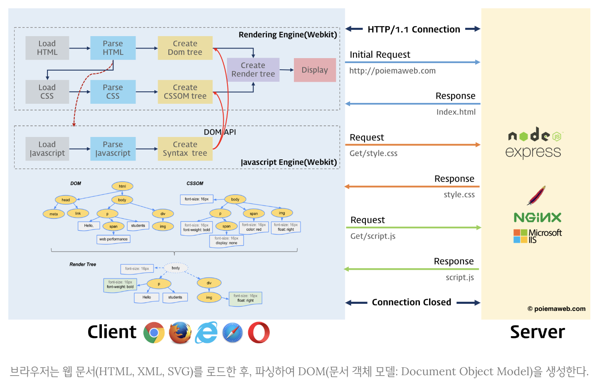

### 문서 객체 모델 (Document Obejct Model)

------

> 텍스트 파일로 만들어져 있는 웹 문서를 브라우저에 렌더링하려면 웹 문서를 브라우저가 이해할 수 있는 구조로 메모리에 올려야 한다. 브라우저의 렌더링 엔진은 웹 문서를 로드한 후, 파싱하여 웹 문서를 브라우저가 이해할 수 있는 구조로 구성하여 메모리에 적재하는데 이를 DOM이라 한다.
>
> 더 자세히 표현하면, 웹 문서의 모든 요소와 요소의 어트리뷰트, 텍스트를 각각의 객체로 만들고 이 객체들의 부모-자식 관계를 표현하는 트리 구조로 구성한 것이 DOM이다. DOM은 자바스크립트를 통해 동적으로 변경할 수 있으며 변경된 DOM은 렌더링에 반영된다.
>
> 브라우저가 웹 문서(HTML, XML, SVG)를 로드한 후, 파싱하여 DOM을 생성하는 과정을 설명하는 이미지는 다음과 같다.




##### DOM의 특징과 기능

> DOM은 W3C의 공식 표준이며, HTML, ECMAScript에서 정의한 표준이 아니므로 플랫폼과 프로그래밍 언어에 대해 중립적이다. DOM은 다음의 두 가지 기능을 담당한다.

* ##### HTML 문서에 대한 모델 구성

> 브라우저는 HTML 문서를 로드한 후 해당 문서에 대한 모델을 메모리에 생성한다. 이 떄 모델은 객체의 트리로 구성되는데 이를 **DOM tree**라 한다.

* ##### HTML 문서 내의 각 요소에 접근 / 수정

> DOM은 모델 내의 각 객체에 접근하고 수정할 수 있는 프로퍼티와 메소드를 제공한다. DOM이 수정되면 브라우저를 통해 사용자가 보게 될 내용 또한 변경된다.


##### DOM API

> 웹 문서는 자바스크립트에 의해 동적으로 변경된다. 자바스크립트와 같은 프로그래밍 언어가 웹 문서를 동적으로 변경할 수 있도록 DOM은 자신에게 접근하고 수정할 수 있는 방법을 제공한다. 그리고 이러한 방법은 일반적으로 프로퍼티와 메소드를 갖는 자바스크립트 객체로 제공되는데, 이를 **DOM API**라 한다. 
>
> 웹 페이지는 정적이며, 정적인 웹 페이지에 접근하여 동적으로 웹 페이지를 변경하기 위한 유일한 방법은 메모리 상에 존재하는 DOM을 변경하는 것이다. 이 DOM에 접근하고 변경하는 프로퍼티와 메소드의 집합이 DOM API이다.


#### DOM tree

------

> DOM tree는 브라우저가 HTML 문서를 로드한 후 파싱하여 생성하는 모델을 의미한다. 객체의 트리로 구조화되어 있기 때문에 DOM tree라 한다.
>
> 우선 다음의 예시를 보자.

```html
<!DOCTYPE html>
<html>
  <head>
    <style>
      .red  { color: #ff0000; }
      .blue { color: #0000ff; }
    </style>
  </head>
  <body>
    <div>
      <h1>Cities</h1>
      <ul>
        <li id="one" class="red">Seoul</li>
        <li id="two" class="red">London</li>
        <li id="three" class="red">Newyork</li>
        <li id="four">Tokyo</li>
      </ul>
    </div>
  </body>
</html>
```

> 예시의 웹 문서를 브라우저로 열어보면 다음과 같은 화면을 볼 수 있다.


##### DOM tree의 구성 요소 : 노드(Node)

> 예시의 웹 문서를 DOM tree로 표현하면 다음과 같다.


> DOM에서 모든 요소, 어트리뷰트, 텍스트는 노드라는 하나의 객체이다. 이 객체들의 관계는 트리 구조로 표현되며 root 노드는 Document 객체이다. 따라서 모든 요소들은 Document 객체의 자식이며, Document 객체는 DOM tree의 진입점(Entry Point)이다. 반면 최종점은 요소의 텍스트를 나타내는 객체이다.
>
> DOM tree는 다음의 네 종류의 노드로 구성된다.

* ##### 문서 노드 (Document Node)

> 트리의 최상위에 존재한다. 요소, 어트리뷰트, 텍스트 노드에 접근하려면 문서 노드를 통해야 하므로 DOM tree에 접근하기 위한 시작점이다.

* ##### 요소 노드 (Element Node)

> 요소 노드는 HTML 요소를 표현한다. HTML 요소는 중첩에 의해 부모-자식 관계를 갖는다. 이 관계를 통해 정보를 구조화한다. 따라서 요소 노드는 문서의 구조를 서술한다고 말 할 수 있다. 어트리뷰트, 텍스트 노드에 접근하려면 먼저 요소 노드를 찾아 접근해야 한다. 모든 요소 노드는 요소별 특성을 표현하기 위해 HTMLElement 객체를 상속한 객체로 구성된다.

* ##### 어트리뷰트 노드 (Attribute Node)

> 어트리뷰트 노드는 HTML 요소의 어트리뷰트를 표현한다. 어트리뷰트 노드느느 해당 어트리뷰트가 지정된 요소의 자식이 아니라 해당 요소의 일부로 표현된다. 따라서 해당 요소 노드를 찾아 접근하면 어트리뷰트를 참조, 수정할 수 있다.

* ##### 텍스트 노드 (Text Node)

> 텍스트 노드는 HTML 요소의 텍스트를 표현한다. 텍스트 노드는 요소 노드의 자식이며 자신의 자식 노드를 가질 수 없다. 즉, 텍스트 노드는 DOM tree의 최종단이다.

> 다음은 DOM tree를 구성하는 각 노드들의 상속 관계를 설명하는 이미지이다.


> DOM을 활용하여 웹 페이지를 조작하기 위해서는 먼저 조작하고자 하는 요소를 DOM tree를 순회함으로써 탐색한다. 선택된 요소의 콘텐츠 또는 어트리뷰트를 조작함으로써 조작이 이루어진다. 그리고 자바스크립트는 이러한 조작에 사용되는 방법(API)를 제공한다.