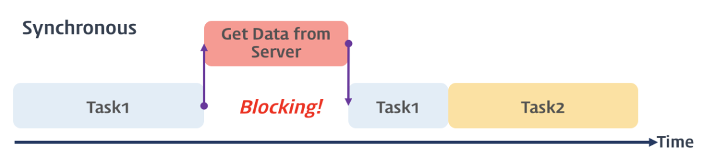

### 비동기식 처리 모델 (Asynchronous Processing Model)

------

> 비동기식 처리 모델을 이해하기 위해서는 먼저 동기식 처리 모델을 이해할 필요가 있다.


#### 동기식 처리 모델 (Synchronous Processing Model)

------

> 동기식 처리 모델은 직렬적으로 작업을 수행한다. 작업은 순차적으로 실행되며 어떤 작업이 수행 중이면 다음 작업은 수행 중인 작업이 끝날 때 까지 대기하게 된다. 
>
> 예를 들어 서버에서 데이터를 가져와서 화면에 표시하는 작업을 수행할 때, 서버에 데이터를 요청하고 데이터가 응답될 때 까지는 작업이 블로킹된다.  이를 설명하는 이미지는 다음과 같다.



> 다음은 동기식으로 동작하는 코드의 예이다. 출력된 결과를 통해 코드가 순차적으로 실행되는 것을 확인할 수 있다.

```javascript
function func1() {
  console.log('func1');
  func2();
}

function func2() {
  console.log('func2');
  func3();
}

function func3() {
  console.log('func3');
}

func1();

/*
func1
func2
func3
*/
```


#### 비동기식 처리 모델 (Asynchronous Processing Model)

------

> 비동기식 처리 모델 (Asynchronous Processing Model 또는 Non-Blocking Processing Model)은 병렬적으로 태스크를 수행한다. 즉, 태스크가 종료되지 않은 상태라 하더라도 대기하지 않고 다음 태스크를 실행한다. 
>
> (동기식 처리 모델에서 예시로 든)서버에서 데이터를 가져와 화면에 표시하는 작업을 수행하는 상황을 다시 예시로 들어보자. 동기식 처리 모델에서는 서버로 데이터를 요청하고, 요청한 데이터를 응답받을 때 까지 작업이 블로킹되었다. 그러나 비동기식 처리 모델에서는 서버에 데이터를 요청하고, 요청한 데이터를 응답받을 때까지 다음 작업을 수행한다. 이후 서버로부터 데이터가 응답되면 이벤트가 발생하고, 이벤트 핸들러가 데이터를 가지고 수행할 작업을 수행한다. 이를 설명하는 이미지는 다음과 같다.


> 자바스크립트의 대부분의 DOM 이벤트 핸들러와 Timer 함수(setTimeout, setInterval), Ajax 요청은 비동기식 처리 모델로 동작한다.
>
> 이 중 Timer 함수를 활용한 예시를 보자. 다음의 예시는 비동기적으로 동작하는 코드이다. 출력된 결과를 통해 코드가 순차적으로 실행되지 않음을 확인 할 수 있다.

```javascript
function func1() {
  console.log('func1');
  func2();
}

function func2() {
  setTimeout(function() {
    console.log('func2');
  }, 0);
  func3();
}

function func3() {
  console.log('func3');
}

func1();

/*
func1
func3
func2
*/
```

> 위의 코드가 순차적으로 실행되지 않는 이유는 `setTimeout`이 존재하기 때문이다. 그런데 setTimeout 메소드의 두 번째 인자를 0초로 설정하여도 콘솔에는 func2가 가장 나중에 출력되는 것을 확인할 수 있다. 이는 setTimeout이 비동기 함수이기 때문이다.
>
> 다음은 위 코드의 동작 과정을 나타낸 이미지이다.


> setTimeout 콜백함수는 즉시 실행되지 않으며 콜 스택에 쌓이자마자 바로 종료된다. 이후 지정 대기시간 만큼 대기하다가 tick 이벤트가 발생하면 이벤트 큐로 이동하여 콜 스택이 완전히 비어있을 때 까지 대기한다. 콜 스택이 완전히 비었을 때 콜 스택으로 이동하여 실행된다.
>
> 다음은 setTimeout 콜백함수가 동작하는 과정을 설명하는 이미지이다.


