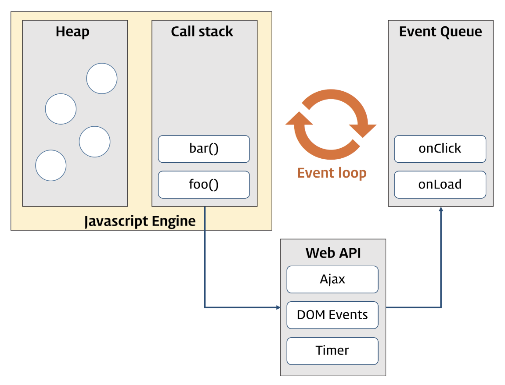

### 이벤트 (Event)

------

##### 이벤트와 이벤트 핸들러

> 브라우저에서 이벤트란 예를 들어 사용자가 버튼을 클릭하거나, 웹 페이지가 로드되는 등의 사건을 말한다. 이벤트는 발생하는 시점이나 순서를 사전에 인지할 수 없으므로 일반적인 제어 흐름과는 다른 접근 방식이 필요하다. 이벤트가 발생하면 이를 감지하여 그에 대응하는 처리 로직을 호출해주어야 한다. 브라우저는 이벤트를 감지할 수 있으며 이벤트 발생 시에는 통지해준다. 이 과정을 통해 사용자와 웹 페이지는 상호작용이 가능하게 된다.
>
> 다음의 이벤트 예시를 보자.

```html
<!DOCTYPE html>
<html>
<body>
  <button class="myButton">Click me!</button>
  <script>
    document.querySelector('.myButton').addEventListener('click', function () {
      alert('Clicked!');
    });
  </script>
</body>
</html>
```

> 위의 예시에서는 버튼을 클릭할 경우 이를 감지하여 이에 대응하는 로직을 호출하도록 기술되어 있다. 앞서 언급하였듯이 이벤트는 사전에 인지할 수 없으므로 발생 시에 이를 감지하여 대응하는 로직을 호출함으로써 제어해야 한다. 
>
> 이렇게 제어하기 위해, 이벤트는 일반적으로 함수에 연결된다. 이 함수는 이벤트가 발생하기 전에는 실행되지 않다가 이벤트가 발생되면 실행된다. 이 함수를 **이벤트 핸들러**라 하며, 이벤트에 대응하는 처리가 기술되어 있다.


#### 이벤트 루프(Event Loop)와 동시성(Concurrency)

------

> 브라우저는 단일 스레드(single-thread)에서 이벤트 드리븐 방식으로 동작한다. 단일 스레드이므로 동시에 하나의 작업만을 처리할 수 있다. 그런데 실제 웹 애플리케이션을 사용하면 많은 작업이 동시에 처리되는 것 처럼 느껴지는데, 이러한 자바스크립트의 동시성을 지원하는 것이 이벤트 루프이다.
>
> 다음은 브라우저의 환경과 이벤트 루프를 이미지로 표현한 것이다.




##### 자바스크립트 엔진

> 구글의 V8을 비롯한 대부분의 자바스크립트 엔진은 크게 두 개의 영역으로 나뉜다. 

> ##### 콜 스택 (Call Stack)
>
> 함수가 호출되면 호출된 함수는 순차적으로 콜 스택에 쌓이게 되고 순차적으로 실행된다. 자바스크립트는 하나의 콜 스택만을 사용하기 때문에 해당 작업이 종료되기 전 까지는 다른 어떤 작업도 수행될 수 없다.

> ##### 힙 (Heap)
>
> 동적으로 생성된 객체 인스턴스가 할당되는 영역이다.


##### 이벤트 루프와 이벤트 큐

> 이와 같이 자바스크립트 엔진은 단순히 작업이 요청되면 콜 스택을 사용하여 요청된 작업을 순차적으로 실행한다. 동시성을 지원하기 위해 필요한 비동기 요청(이벤트 포함)에 대한 처리는 자바스크립트 엔진을 구동하는 환경(브라우저, Node.js)에서 담당한다.

> ##### 이벤트 루프
>
> 콜 스택 내에서 현재 실행중인 작업이 있는 지, 그리고 이벤트 큐에 작업이 있는지 반복하여 확인한다. 만약 콜 스택이 비어있다면 이벤트 큐 내의 작업이 콜 스택으로 이동하고 실행된다.

> ##### 이벤트 큐
>
> 비동기 처리 함수의 콜백 함수, 비동기식 이벤트 핸들러, Timer 함수(setTimeout, setInterval)의 콜백함수가 보관되는 영역으로 이 함수들은 이벤트 루프에 의해 콜 스택이 비어있을 때 순차적으로 콜스택으로 이동되어 실행된다.


> 이제 다음의 예시가 어떻게 동작하는 지 알 수 있다.

```javascript
function func1() {
  console.log('func1');
  func2();
}

function func2() {
  setTimeout(function () {
    console.log('func2');
  }, 0);

  func3();
}

function func3() {
  console.log('func3');
}

func1();

/*
func1
func3
func2
*/
```

> 함수 func1이 호출되면 함수 func1은 콜 스택에 쌓인다. 함수 func1은 함수 func2를 호출하므로 함수 func2가 콜 스택에 쌓이고 setTimeout이 호출된다. setTimeout의 콜백함수는 지정된 시간만큼 대기하다 tick 이벤트가 발생하면 이벤트 큐로 이동한다. 이후 콜 스택이 비어졌을 때 콜 스택으로 이동되어 실행된다.
>
> 이 과정을 이미지로 표현하면 다음과 같다.


#### 이벤트의 종류

------

> 이벤트의 종류와 대표적인 예는 다음과 같다.

##### UI Event

| Event  | Description                                                  |
| ------ | ------------------------------------------------------------ |
| load   | 웹페이지의 로드가 완료되었을 때                              |
| unload | 웹페이지가 언로드될 때 (주로 새로운 페이지를 요청한 경우)    |
| error  | 브라우저가 자바스크립트 오류를 만났거나 요청한 자원이 존재하지 않는 경우 |
| resize | 브라우저 창의 크기를 조절했을 때                             |
| scroll | 사용자가 페이지를 위아래로 스크롤할 때                       |
| select | 텍스트를 선택했을 때                                         |


##### Keyboard Event

| Event    | Description            |
| -------- | ---------------------- |
| keydown  | 키를 누르고 있을 때    |
| keyup    | 누르고 있던 키를 뗄 때 |
| keypress | 키를 누르고 떼었을 때  |


##### Mouse Event

| Event     | Description                                                  |
| --------- | ------------------------------------------------------------ |
| click     | 마우스 버튼을 클릭했을 때                                    |
| dbclick   | 마우스 버튼을 더블 클릭했을 때                               |
| mousedown | 마우스 버튼을 누르고 있을 때                                 |
| mouseup   | 누르고 있던 마우스 버튼을 뗄 때                              |
| mousemove | 마우스를 움직일 때 (터치스크린에서 동작하지 않는다)          |
| mouseover | 마우스를 요소 위로 움직일 때 (터치스크린에서 동작하지 않는다) |
| mouseout  | 마우스를 요소 밖으로 움직였을 때 (터치스크린에서 동작하지 않는다) |


##### Focus Event

| Event           | Description               |
| --------------- | ------------------------- |
| focus / focusin | 요소가 포커스를 얻었을 때 |
| blur / focusout | 요소가 포커스를 잃었을 때 |


##### Form Event

| Event  | Description                                                 |
| ------ | ----------------------------------------------------------- |
| input  | input 또는 textarea 요소 값이 변경되었을 때                 |
| change | select box, checkbox, radio button의 상태가 변경되었을 때   |
| submit | form을 submit할 때 (버튼 또는 키)                           |
| reset  | reset 버튼을 클릭할 때 (최근에는 사용하지 않음)             |
|        | contenteditable 어트리뷰트를 가진 요소의 값이 변경되었을 때 |


##### Clipboard Event

| Event | Description             |
| ----- | ----------------------- |
| cut   | 컨텐츠를 잘라내기 할 때 |
| copy  | 컨텐츠를 복사할 때      |
| paste | 컨텐츠를 붙여넣기 할 때 |


#### 이벤트 핸들러 등록

------

> 이벤트가 발생했을 때 동작할 이벤트 핸들러를 이벤트에 등록하는 방법은 다음과 같이 세 가지가 있다.


##### 인라인 이벤트 핸들러

> HTML 요소의 이벤트 핸들러 어트리뷰트에 이벤트 핸들러를 등록하는 방법이다.

```html
<!DOCTYPE html>
<html>
<body>
  <button onclick="myHandler()">Click me</button>
  <script>
    function myHandler() {
      alert('Button clicked!');
    }
  </script>
</body>
</html>
```

> 사실 이러한 방식은 더 이상 사용되지 않으며, 사용을 권장하지 않는다. HTML과 자바스크립트는 가급적 분리시키는 것이 좋다. 그럼에도 오래된 코드에서는 인라인 이벤트 핸들러 방식을 사용한 코드가 있을 수 있으므로 알아만 두자.
>
> 그럼에도 불구하고, CBD(Component Based Development) 방식의 프론트엔드 프레임워크/라이브러리인 Angular, React, Vue 등에서는 인라인 이벤트 핸들러 방식으로 이벤트를 처리한다.
>
> 주의할 점은 onclick과 같이 on으로 시작하는 이벤트 어트리뷰트의 값으로 함수 호출을 전달한다는 것이다. 반면 아래에서 살펴볼 이벤트 핸들러 프로퍼티 방식은 DOM 요소의 이벤트 핸들러 프로퍼티에 함수 호출이 아닌 함수를 전달한다.
>
> 이 때 이벤트 어트리뷰트의 값으로 전달한 함수 호출이 즉시 호출되는 것은 아니다. 사실은 이벤트 어트리뷰트 키를 이름으로 갖는 함수를 암묵적으로 정의하고 그 함수의 몸체에 이벤트 어트리뷰트의 값으로 전달한 함수 호출을 문으로 갖는다. 위 예시의 경우 button 요소의  onclick 프로퍼티에 `function onclick(event) { foo(); }`가 할당된다.
>
> 즉, 이벤트 어트리뷰트의 값은 암묵적으로 정의도는 이벤트 핸들러의 문이다. 따라서 아래와 같이 여러 개의 문을 전달할 수 있다.

```html
<!DOCTYPE html>
<html>
<body>
  <button onclick="myHandler1(); myHandler2();">Click me</button>
  <script>
    function myHandler1() {
      alert('myHandler1');
    }
    function myHandler2() {
      alert('myHandler2');
    }
  </script>
</body>
</html>
```

> 위 예시의 버튼을 클릭하면, Alert 창이 두 번 팝업되는 것을 확인할 수 있다.


##### 이벤트 핸들러 프로퍼티

> 인라인 이벤트 핸들러 방식에서는 HTML과 Javascript가 뒤섞이는 문제가 있었다. 이벤트 핸들러 프로퍼티는 이러한 문제를 해결할 수 있는 방식이다. 그러나 이벤트 핸들러 프로퍼티에는 하나의 이벤트 핸들러만을 바인딩할 수 있다는 단점이 있다.
>
> 또한 앞서 언급하였지만, 이벤트 핸들러 프로퍼티에는 함수 호출이 아닌 함수를 전달한다.

```html
<!DOCTYPE html>
<html>
<body>
  <button class="btn">Click me</button>
  <script>
    const btn = document.querySelector('.btn');

    // 이벤트 핸들러 프로퍼티 방식 => 하나의 프로퍼티에 하나의 이벤트 핸들러만을 바인딩할 수 있다.
    // 첫번째 바인딩된 이벤트 핸들러 (실행되지 않음)
    btn.onclick = function () {
      alert('① Button clicked 1');
    };

    // 두번째 바인딩된 이벤트 핸들러
    btn.onclick = function () {
      alert('① Button clicked 2');
    };

    // addEventListener 메소드 방식 => 하나 이상의 이벤트 핸들러의 바인딩이 가능하다.
    // 첫번째 바인딩된 이벤트 핸들러
    btn.addEventListener('click', function () {
      alert('② Button clicked 1');
    });

    // 두번째 바인딩된 이벤트 핸들러
    btn.addEventListener('click', function () {
      alert('② Button clicked 2');
    });
  </script>
</body>
</html>
```


##### addEventListener 메소드 방식

> `addEventListener` 메소드를 이용하여 대상 DOM 요소에 이벤트를 바인딩하고 해당 이벤트가 발생했을 때 실행될 콜백 함수(이벤트 핸들러)를 지정한다. 사용 형식은 다음과 같다.

```javascript
EventTarget.addEventListener('eventType', function, [, useCapture])
```

> addEventListener의 첫 인자인 `eventType`은 필수 인자로써 이벤트의 종류를 의미하며, 이벤트를 발생시킬 트리거를 지정할 수 있다. `function` 또한 필수 인자로, 이벤트 발생 시에 호출될 함수명을 지정하거나 호출될 함수 자체를 정의한다. `useCapture`는 capture 사용 여부를 나타내며, boolean 타입의 값을 지정한다. true인 경우, capturing이 지정되며, false 인경우 bubbling이 지정된다. 기본값은 false이다.


> ##### 장점
>
> addEventListener 함수 방식은 이전 방식에 비교하여 다음과 같은 장점을 갖는다.

* 하나의 이벤트에 대해 하나 이상의 이벤트 핸들러를 추가할 수 있다.
* 캡처링과 버블링을 지원한다.
* HTML 요소 뿐만아니라 모든 DOM 요소(HTML, XML, SVG)에 대해 동작한다. 


> ##### attachEvent (~ IE8)
>
> 단, addEventListener 메소드는 IE9 이상에서 동작한다. IE8 이하에서는 attachEvent 메소드를 사용한다. 두 메소드의 사용 형식을 비교하기 위해 다음과 같은 예시를 들 수 있다.

```javascript
elem.addEventListener('click', func);			// IE9 ~
elem.attachEvent('onclick', func);				// ~ IE8
```


> addEventListener 메소드의 대상이 되는 element를 지정하지 않으면 전역 객체인 window를 대상으로 한다. 따라서 DOM 문서를 포함한 브라우저의 윈도우에서 발생하는 이벤트에 이벤트 핸들러를 바인딩하게 된다.
>
> 다음의 예시의 경우 브라우저 윈도우 어디를 클릭하여도 이벤트 핸들러가 동작한다.

```html
<!DOCTYPE html>
<html>
<body>
  <script>
    addEventListener('click', function () {
      alert('Clicked!');
    });
  </script>
</body>
</html>
```

> 대상이 될 element를 지정해야, 해당 요소에 대해서만 이벤트가 발생한다. 다음은 input 요소에 blur 이벤트를 바인딩하여 입력값의 유효성을 검증하는 예시이다. input 요소에서 focus가 해제될 떄 입력값의 길이를 기준으로 유효성을 검증하는 이벤트 핸들러가 호출된다.

```html
<!DOCTYPE html>
<html>
<body>
  <label>User name<input type='text'></label>
  <em class="message"></em>

  <script>
    const input = document.querySelector('input[type=text]');
    const msg = document.querySelector('.message');

    input.addEventListener('blur', function() {
      if (input.value.length < 2) {
        msg.innerHTML = '이름은 2자 이상 입력해 주세요';
      } else {
        msg.innerHTML = '';
      }
    });
  </script>
</body>
</html>
```

> 그런데 위의 예시에서 '입력값은 2자 이상'이라는 규칙이 바뀌어서 코드를 수정하는 상황이 온다고 가정하자. 위의 예시에서는 유효성 규칙을 규정하는 부분인 이벤트 핸들러 함수 전체를 수정해야 하는데, 이런 방식의 코딩은 바람직한 방법은 아니다. 예시의 경우 코드가 단순하고 양이 적으므로 상관 없으나, 코드의 양이 많고 복잡한 큰 규모의 프로그램에선 코드의 수정과 테스트에 많은 비용이 소요되기 때문이다.
>
> 만약 '입력값은 2자 이상'이라는 규칙을 상수화하고 이를 함수의 인수로 전달하도록 수정한다면 규칙이 변경되어도 함수 자체를 수정하지는 않아도 되므로, 더 효율적일 것이다. 그러나 여기에도 약간의 문제가 있다. addEventListener 메소드의 두 번째 매개변수인 이벤트 핸들러에는 함수 자체를 지정해야 한다. 따라서 함수 호출을 직접적으로 할 수 없고, 함수의 인자를 지정할 수 없다. 다음의 예시가 이를 잘 나타낸다.

```javascript
function foo(strMsg) {
  alert(strMsg);
}

elem.addEventListener('click', foo(strMsg)); 
// 인자를 지정할 수 있으나, 이벤트 발생 시까지 대기하지 않고 바로 실행된다.

elem.addEventListener('click', foo);      
// 이벤트 발생 시까지 대기한다. 그러나 인자(strMsg)를 지정할 수 없다.
```

> 다행이 이를 우회할 수 있는 방법이 있다. 이벤트 핸들러 함수의 인자를 지정하면서, 이벤트 발생 시까지 대기시키기 위해서는 다음 예시와 같이 이벤트 핸들러 함수 내부에 실행할 함수를 호출하면 된다. 

```html
<!DOCTYPE html>
<html>
<body>
  <label>User name <input type='text'></label>
  <em class="message"></em>

  <script>
    const MIN_USER_NAME_LENGTH = 2; // 이름 최소 길이

    const input = document.querySelector('input[type=text]');
    const msg = document.querySelector('.message');

    function checkUserNameLength(n) {
      if (input.value.length < n) {
        msg.innerHTML = '이름은 ' + n + '자 이상이어야 합니다';
      } else {
        msg.innerHTML = '';
      }
    }

    input.addEventListener('blur', function () {
      // 이벤트 핸들러 내부에서 함수를 호출하면서 인수를 전달한다.
      checkUserNameLength(MIN_USER_NAME_LENGTH);
    });
  </script>
</body>
</html>
```

> 이벤트 핸들러 프로퍼티 방식으로도 위와 동일한 방식으로 우회할 수 있다.

```javascript
input.onblur = function () {
   // 이벤트 핸들러 내부에서 함수를 호출하면서 인수를 전달한다.
   checkUserNameLength(MIN_USER_NAME_LENGTH);
};
```

> 이제 규칙이 변경되어도 인자만 변경하면 되므로, 수정 및 테스트에 소요되는 비용이 전보다 줄어든다.


#### 이벤트 핸들러 함수 내부의 this

------

##### 인라인 이벤트 핸들러

> 인라인 이벤트 핸들러 방식의 경우, 이벤트 핸들러는 일반 함수로서 호출되므로 이벤트 핸들러 내부의 this는 전역 객체 window를 가리킨다.

```javascript
<!DOCTYPE html>
<html>
<body>
  <button onclick="foo()">Button</button>
  <script>
    function foo () {
      console.log(this); // window
    }
  </script>
</body>
</html>
```


##### 이벤트 핸들러 프로퍼티

> 이벤트 핸들러 프로퍼티 방식에서 이벤트 핸들러는 메소드이므로 이벤트 핸들러 내부의 this는 이벤트에 바인딩된 요소를 가리킨다. 이것은 이벤트 객체의 `currentTarget` 프로퍼티와 같다.

```javascript
<!DOCTYPE html>
<html>
<body>
  <button class="btn">Button</button>
  <script>
    const btn = document.querySelector('.btn');

    btn.onclick = function (e) {
      console.log(this); // <button id="btn">Button</button>
      console.log(e.currentTarget); // <button id="btn">Button</button>
      console.log(this === e.currentTarget); // true
    };
  </script>
</body>
</html>
```


##### addEventListener 메소드

> addEventListener 메소드에서 지정한 이벤트 핸들러는 콜백함수이지만 이벤트 핸들러 내부의 this는 이벤트 리스너에 바인딩된 요소인 currentTarget을 가리킨다. 이것은 이벤트 객체의 currentTarget 프로퍼티와 같다.

```javascript
<!DOCTYPE html>
<html>
<body>
  <button class="btn">Button</button>
  <script>
    const btn = document.querySelector('.btn');

    btn.addEventListener('click', function (e) {
      console.log(this); // <button id="btn">Button</button>
      console.log(e.currentTarget); // <button id="btn">Button</button>
      console.log(this === e.currentTarget); // true
    });
  </script>
</body>
</html>
```

