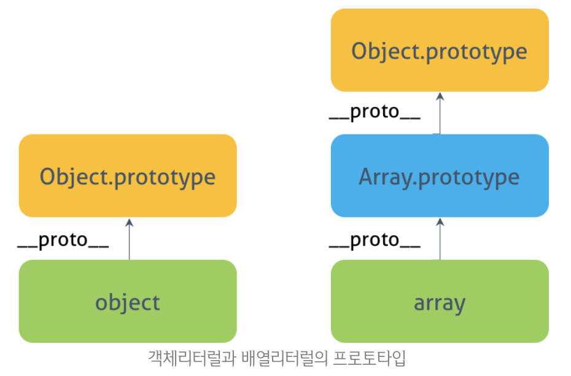
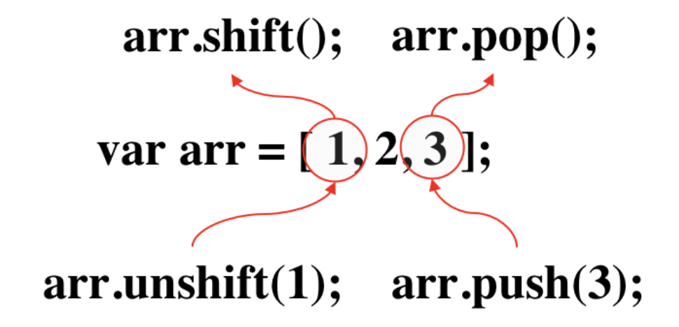
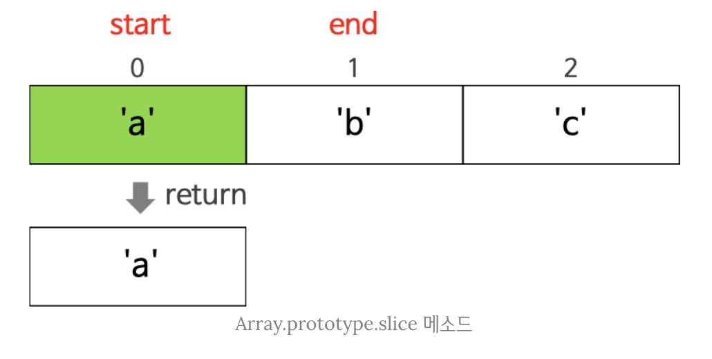

### Array

------

> 배열은 1개의 변수에 여러 개의 값을 순차적으로 저장할 때 사용한다. 자바스크립트의 배열도 객체에 속하며 배열을 다루기 위한 다양한 메소드를 갖는다.

```js
var arr = [1, 2, 3, 4, 5];

console.log(arr[1]); // 2
```


#### 유사 배열 객체 (array-like object)

------

> 유사 배열 객체란 length 프로퍼티를 갖는 객체로 문자열, arguments, HTMLCollection, NodeList 등은 유사 배열에 속한다. 유사 배열 객체는 length 프로퍼티가 있으므로 순회 가능하며 call, apply 함수를 사용하여 배열의 메소드를 사용할 수도 있다.
>
> 어떤 객체가 유사 배열 객체에 해당하는지 체크하기 위해서는 해당 객체가 length 프로퍼티를 갖는지, length 프로퍼티의 값이 정상적인 값인지를 체크한다. 
>
> 어떤 객체가 유사 배열에 해당하는 지 체크하는 함수의 예는 다음과 같다.

```javascript
const isArrayLike = function(collection) {
    // 배열 인덱스 : 32bit 정수(2의 32제곱 - 1)
    // 유사 배열 인덱스 : 자바스크립트로 표현 가능한 양의 정수 (2의 53제곱 - 1)
    const MAX_ARRAY_INDEX = Math.pow(2, 53) - 1;
    // 빈문자열도 유사배열에 속한다.
    const length = collection == null ? undefined : collection.length;
    return typeof (length === 'number' && length >= 0 && length <= MAX_ARRAY_INDEX);
}

// 반환값은 boolean으로 이 값을 통해 인자로 사용된 객체가 유사 배열 객체에 속하는 지의 여부를 알 수 있다.
```


#### 배열의 생성

------

##### 배열 리터럴

> 0개 이상의 값을 쉼표로 구분하여 대괄호([])로 묶는다. 첫 번째 값은 인덱스 0으로 읽을 수 있다. 존재하지 않는 요소에 접근하면 `undefined`를 반환한다.
>
> 예시는 다음과 같다.

```javascript
var emptyArr = [];

console.log(emptyArr[1]); // undefined
console.log(emptyArr.length); // 0

var arr = [
  'zero', 'one', 'two', 'three', 'four',
  'five', 'six', 'seven', 'eight', 'nine'
];

console.log(arr[1]);      // 'one'
console.log(arr.length);  // 10
```


> ##### 배열 리터럴과 객체 리터럴과의 차이
>
> 배열 리터럴은 객체 리터럴과 다르게 프로퍼티명이 없고 각 요소의 값만이 존재한다. 객체의 경우 프로퍼티 값에 접근하기 위해 프로퍼티를 표기할 때 대괄호 표기법 또는 마침표 표기법을 사용한다. 그러나 배열의 경우에는 인덱스를 대괄호 표기법만으로 사용하여 표기한다.


> ##### 배열과 객체의 차이 : 프로토타입 객체
>
> 또한 배열의 경우 객체에 속함에도 불구하고 배열 객체의 프로토타입 객체는 `Array.prototype`이다. 객체의 프로토타입 객체와 다르다.

```javascript
console.log(typeof arr);  // object
console.log(arr.__proto__ === Array.prototype);		// true
```

> 이를 이미지로 나타내면 다음과 같다.




##### 자바스크립트 배열의 특징

> 대부분의 프로그래밍 언어에서는 배열의 요소들은 모두 동일한 데이터타입을 가져야 한다. 그러나 자바스크립트의 배열에서는 각 요소들이 서로 다른 데이터타입을 가져도 상관없다.

```javascript
var misc = [
  'string',
  10,
  true,
  null,
  undefined,
  NaN,
  Infinity,
  ['nested array'],
  { object: true },
  function () {}
];
```

```javascript
console.log(misc[0]);		// string
console.log(misc[3]);		// null
console.log(misc[7]);		// ["nested array"]
```


##### Array() 생성자 함수

> 배열은 일반적으로 배열 리터럴 방식으로 생성하지만 배열 리터럴 방식도 결국 내장 함수 Array() 생성자 함수로 배열을 생성하는 것을 단순화시킨 것이다. Array() 생성자 함수는 `Array.prototype.constructor` 프로퍼티로 접근할 수 있다. 
>
> 만일 매개변수가 1개이면서 숫자인 경우에는 매개변수로 전달된 숫자를 length 값으로 갖는 빈 배열을 생성한다. 그 외의 경우에는 매개변수로 전달된 값들을 요소로 갖는 배열을 생성한다.
>
> 예시는 다음과 같다.

```javascript
var arr = new Array(2);
console.log(arr); // (2) [empty × 2]

var arr = new Array(1, 2, 3);
console.log(arr); // [1, 2, 3]
```


#### 배열 요소의 추가와 삭제

------

##### 배열 요소의 추가

> 객체가 동적으로 프로퍼티를 추가할 수 있는 것처럼 배열도 동적으로 요소를 추가하는 것이 가능하다. 이때 배열의 길이 또는 순서에 맞추어 값을 할당할 필요는 없다. 인덱스를 사용하여 필요한 위치에 값을 할당할 수 있다. 동적으로 할당되므로 인덱스의 값이 배열의 길이를 초과하여도 상관없다.
>
> 예시는 다음과 같다.

```javascript
var arr = [];
console.log(arr[0]); // undefined

arr[1] = 1;
arr[3] = 3;

console.log(arr); // (4) [empty, 1, empty, 3]
console.log(arr.lenth); // 4
```


##### 배열 요소의 삭제

> 배열은 객체이기 때문에 배열의 요소를 삭제하기 위해 `delete` 연산자를 사용할 수 있다. 이때 배열의 길이에는 변함이 없다. 해당 요소를 완전히 삭제하여 배열의 length에도 반영되게 하기 위해서는 `Array.prototype.splice()` 메소드를 사용한다.
>
> 예시는 다음과 같다.

```javascript
var numbersArr = ['zero', 'one', 'two', 'three'];

// 요소의 값만 삭제된다
delete numbersArr[2]; 
console.log(numbersArr);	// (4) ["zero", "one", empty, "three"]

// 요소 값만이 아니라 요소를 완전히 삭제한다
// splice(시작 인덱스, 삭제할 요소의 수)
numbersArr.splice(2, 1); 
console.log(numbersArr); 	// (3) ["zero", "one", "three"]
```


#### 배열의 순회

------

> 객체의 프로퍼티를 순회할 때에는 **for...in** 문을 사용한다. 배열 역시 객체이므로 for...in 문을 사용할 수 있다. 그러나 배열은 객체이므로 프로퍼티를 가질 수 있다. for..in 문은 불필요한 프로퍼티까지 순회하고, 각 요소의 순서를 보장하지 않으므로 배열의 순회에는 적합하지 않다.
>
> 대신 배열을 순회할 때에는 **forEach, for 문, for...of 문** 등이 적합하다.

```javascript
var arr = [0, 1, 2, 3];
arr.foo = 10;	// 불필요한 프로퍼티
```

```javascript
/*  forEach  */
arr.forEach(elem => console.log(elem));
// 0 1 2 3
```

```javascript
/*  for  */	
for (var i =0; i< arr.length; i++) {
    console.log(arr[i]); 
}
// 0 1 2 3
```

```javascript
/*  for...of  */
for (var item of arr) { console.log(item); }
// 0 1 2 3
```

```javascript
/*  for...in : 불필요한 프로퍼티도 순회한다.  */
for (var key in arr) { console.log(arr[key]); }
// 0 1 2 3 10
```


#### 배열 프로퍼티

------

##### Array.length

> length **프로퍼티**는 요소의 개수(배열의 길이)를 나타낸다. 배열 인덱스는 32bit 양의 정수로 처리된다. 따라서 length 프로퍼티의 값은 양의 정수이며 `2^32-1` 미만이다.

```
var arr = [1, 2, 3, 4, 5];
console.log(arr.length);	// 5
```

> 주의할 것은 배열 요소의 개수와 length 프로퍼티의 값이 반드시 일치하지는 않는 것이다. 다음과 같은 배열이 예시에 해당한다.

```javascript
var arr = [];
arr[5] = 1;

console.log(arr);						// [empty × 5, 1]
console.log(arr.length);		// 6
```

> 예시처럼 배열 요소의 개수와 length 프로퍼티의 값이 일치하지 않는 배열을 **희소 배열(sparce array)**이라 한다. 희소 배열은 배열의 요소가 연속적이지 않은 배열을 의미한다. 희소 배열이 아닌 일반 배열은 배열의 요소 개수와 length 프로퍼티의 값이 언제나 일치하지만 희소 배열은 배열의 요소 개수보다 length 프로퍼티의 값이 언제나 크다. 이러한 이유로 희소배열은 일반 배열보다 느리며 메모리를 낭비한다.
>
> 현재 length 프로퍼티 값보다 더 큰 인덱스로 요소를 추가하면 자동으로 length 프로퍼티의 값이 늘어난다. 이 때 length 프로퍼티의 값은 요소의 인덱스 중 가장 큰 값에 1을 더한 값이다.

```javascript
var arr = [1, 2, 3, 4, 5];
arr.length = 3;
console.log(arr);
// [1, 2, 3]
```

> length 프로퍼티의 값은 명시적으로 변경 가능하다. 만약 length 프로퍼티의 값을 현재보다 작게 변경하면 변경된 length 프로퍼티의 값보다 크거나 같은 인덱스에 해당하는 요소는 모두 삭제된다.


#### 배열 메소드

------

> this에 해당하는 원본 배열을 변경하는 메소드와 변경하지 않는 메소드가 있다.


##### Array.isArray()

> 객체가 배열이면 true, 아니면 false를 반환한다.

```javascript
// true
Array.isArray([]);
Array.isArray([1, 2]);
Array.isArray(new Array());
```

```javascript
// false
Array.isArray();
Array.isArray({});
Array.isArray(null);
Array.isArray(undefined);
Array.isArray(1);
Array.isArray('Array');
Array.isArray(true);
Array.isArray(false);
```


##### Array.from()

> 이터러블 객체를 배열로 변환하여 반환한다. 사용 형식은 다음과 같다.

```javascript
Array.from(arrayLike[, mapFn[, thisArg]])
```

> 사용 예시는 다음과 같다.

```javascript
console.log(Array.from('hello')); // [ 'h', 'e', 'l', 'l', 'o' ]
console.log(Array.from([1, 2, 3], x => x + x)); // [ 2, 4, 6 ]
```

```javascript
(function() {
	console.log(Array.from(arguments));		// [1, 2, 3]
  console.log([... arguments]);					// [1, 2, 3]
}(1, 2, 3));
```


##### Array.of()

> 주어진 인수로 새로운 배열을 생성하여 반환한다. 사용 형식은 다음과 같다.

```javascript
Array.of(elem1, elem2, ...)
```

> 사용 예시는 다음과 같다.

```javascript
Array.of(1);
Array.of(1, 2, 3);
```


##### Array.prototype.indexOf()

> indexOf 메소드의 인자로 지정된 요소를 배열에서 검새갛여 인덱스를 반환한다. 중복되는. 요소가 있는 경우 첫번째 인덱스만 반환한다. 해당하는 요소가 없는 경우 -1을 반환한다.

```javascript
var arr = [1, 2, 3, 4];
console.log(arr.indexOf(2));		// 1
console.log(arr.indexOf(4));		// 3
console.log(arr.indexOf(5)); 		// -1
console.log(arr.indexOf(2, 2));	// -1, 2번 인덱스 부터 탐색을 시작.
```

> 다음과 같이 특정 요소가 존재하는지 확인하는 용도로 사용할 수 있다.

```javascript
var foods = ['apple', 'banana', 'orange'];

// foods 배열에 'apple' 요소가 존재하는지 확인
if (foods.indexOf('apple') !== -1) {
	// foods 배열에 'apple'이 포함되어 있는 경우의 처리
}
```

> ES7 부터는 includes 메소드를 대신 사용해도 된다.

```javascript
// ES7: Array.prototype.includes
if (foods.includes('apple')) {
  // foods 배열에 'apple'이 포함되어 있는 경우의 처리
}
```


##### Array.prototype.concat()

> concat 메소드의 인수로 넘어온 값들을 자신의 복사본에 요소로 추가하고 반환한다. 이때 원본 배열은 변경되지 않는다.

```javascript
var a = ['a', 'b', 'c'];
var b = ['x', 'y', 'z'];

/* 배열과 배열의 연결 */
var c = a.concat(b);
console.log(c); // ['a', 'b', 'c', 'x', 'y', 'z']

/* 문자열과의 연결 */
var d = a.concat('String');
console.log(d); // ['a', 'b', 'c', 'String']

/* 둘 이상의 요소와 연결 */
var e = a.concat(b, true);
console.log(e); // ['a', 'b', 'c', 'x', 'y', 'z', true]

/* 원본 배열은 변하지 않는다 */
console.log(a); // [ 'a', 'b', 'c' ]
```


##### Array.prototype.join()

> 배열 요소 전체를 연결하여 생성한 문자열을 반환한다. 구분자는 생략 가능하며 기본 구분자는 `,`이다. Array.prototype.join() 메소드는 `+` 연산자보다 빠르다.

```javascript
var arr = ['a', 'b', 'c', 'd'];

var x = arr.join();
console.log(x);  // 'a,b,c,d';

var y = arr.join('');
console.log(y);  // 'abcd'

var z = arr.join(':');
console.log(z);  // 'a:b:c:d'
```


##### Array.prototype.pop() / Array.prototype.shift()

> **Array.prototype.pop** 메소드는 배열에서 마지막 요소를 제거하고 제거한 요소를 반환한다. 만약 빈 배열일 경우 `undefined` 를 반환한다. pop 메소드는 대상 배열 자체를 변경한다.

```javascript
var a = ['a', 'b', 'c'];
var c = a.pop();

// 원본 배열이 변경된다.
console.log(a); // a --> ['a', 'b']
console.log(c); // c --> 'c'
```

> **Array.prototype.shift** 메소드는 배열의 선두 요소를 제거하고 제거한 요소를 반환한다. 만약 빈 배열일 경우 `undefined` 를 반환한다. shift 메소드도 대상 배열을 변경한다.

```javascript
var a = ['a', 'b', 'c'];
var c = a.shift();

// 원본 배열이 변경된다.
console.log(a); // a --> [ 'b', 'c' ]
console.log(c); // c --> 'a'
```


##### Array.prototype.push() / Array.prototype.unshift()

> **Array.prototype.push** 메소드는  인자를 배열의 마지막 요소로 추가한다. 갱신된 배열의 length 값을 반환한다. push 메소드 역시 대상 배열 자체를 변경한다.

```javascript
var a = ['a', 'b', 'c'];

// push는 원본 배열을 직접 변경하고 변경된 배열의 length를 반환한다.
var d = a.push('d');

console.log(a);		// ['a', 'b', 'c', 'd']
console.log(d);		// 4
```

> 배열의 선두에 값을 추가하고자 할 경우에는 **Array.prototype.unshift** 메소드를 사용하면 된다.
>
> push, unshift 메소드는 사용하기 간편하다. 그러나 성능 면에서는 좋은 방법은 아니다.

```javascript
var arr = [1, 2, 3, 4, 5];

arr.push(6);
arr[arr.length] = 6; // 43% faster in Chrome 47.0.2526.106 on Mac OS X 10.11.1

arr.unshift(0);
[0].concat(arr); // 98% faster in Chrome 47.0.2526.106 on Mac OS X 10.11.1
```

> pop, shift, push, unshift 메소드의 동작 과정을 표현하면 다음과 같다.




> ##### pop, push를 활용한 스택 구현
>
> `pop` 와 `push` 를 함께 사용하여 배열을 스택(LIFO: Last In First Out)처럼 동작하게 할 수 있다.

```javascript
var arr = [];

arr.push(1); // [1]
arr.push(2); // [1, 2]
arr.push(3); // [1, 2, 3]

arr.pop(); // [1, 2]
arr.pop(); // [1]
arr.pop(); // []
```


> ##### shift, push를 활용한 큐 구현
>
> `shift` 와 `push` 를 함께 사용하여 배열을 큐(FIFO: First In First Out)처럼 동작하게 할 수 있다.

```javascript
var arr = [];

arr.push(1); // [1]
arr.push(2); // [1, 2]
arr.push(3); // [1, 2, 3]

arr.shift(); // [2, 3]
arr.shift(); // [3]
arr.shift(); // []
```


##### Array.prototype.reverse()

> 배열 요소의 순서를 반대로 변경한다. 이 때 원본 배열 자체를 변경하며,  변경된 원본 배열을 반환한다.

```javascript
var a = ['a', 'b', 'c'];
var b = a.reverse();

// 원본 배열이 변경된다
console.log(a); // [ 'c', 'b', 'a' ]
console.log(b); // [ 'c', 'b', 'a' ]
```


##### Array.prototype.slice()

> 인자로 지정된 배열의 부분을 복사하여 반환한다. 원본 배열은 변경되지 않는다. 첫 번째 매개변수는 start 인덱스를 지정하고, 두 번째 매개변수는 end 인덱스를 지정한다. 
>
> 사용 형식은 다음과 같다.

```javascript
Array.slice(start, end);
```

> start 매개변수는 복사를 시작할 인덱스를 지정한다. 음수인 경우 배열의 끝에서의 인덱스를 나타낸다. 예를 들어 `-2` 로 지정하면 배열의 마지막 두 개 요소를 반환한다. 기본값은 `0`이다.
>
> end 매개변수는 복사를 끝낼 인덱스를 지정한다. 지정한 인덱스의 바로 직전 인덱스의 값까지 복사된다. 예를 들어 end의 값을 `3` 으로 지정하면, 2번 인덱스의 값까지만 복사된다. 기본값은 배열의 length 값이다.
>
> 사용 예시는 다음과 같다.

```javascript
const items = ['a', 'b', 'c'];

// items[0]부터 items[1] 이전(items[1] 미포함)까지 반환
let res = items.slice(0, 1);
console.log(res);  // [ 'a' ]

// items[1]부터 items[2] 이전(items[2] 미포함)까지 반환
res = items.slice(1, 2);
console.log(res);  // [ 'b' ]

// items[1]부터 이후의 모든 요소 반환
res = items.slice(1);
console.log(res);  // [ 'b', 'c' ]

// 인자가 음수인 경우 배열의 끝에서 요소를 반환
res = items.slice(-1);
console.log(res);  // [ 'c' ]

res = items.slice(-2);
console.log(res);  // [ 'b', 'c' ]

// 모든 요소를 반환 (= 복사본(shallow copy) 생성)
res = items.slice();
console.log(res);  // [ 'a', 'b', 'c' ]

// 원본은 변경되지 않는다.
console.log(items); // [ 'a', 'b', 'c' ]
```

> 동작 방식은 다음과 같다. start ~ (end-1) 까지의 요소가 복사되어 반환된다.




> ##### Array.prototype.slice와 shallow copy
>
> **Array.prototype.slice** 에 인자를 전달하지 않으면 원본 배열의 복사본을 생성하여 반환한다. 이 때 복사는 얕은 복사를 통해 복사본을 생성한다. 이는 다음의 예시를 통해 확인할 수 있다.

```javascript
var arr = [1, 2, 3];

// 원본 배열 arr의 새로운 복사본을 생성한다.
var copy = arr.slice();
console.log(copy === arr); // false, 두 배열은 다른 배열이다.
```

```javascript
const todos = [
  { id: 1, content: 'HTML', completed: false },
  { id: 2, content: 'CSS', completed: true },
  { id: 3, content: 'Javascript', completed: false }
];

// shallow copy
const _todos = todos.slice();

// const _todos = [...todos];
console.log(_todos === todos); // false, 두 배열은 다른 배열이다.

// 그러나 배열의 요소들은 같다. 즉, 얕은 복사되었다.
console.log(_todos[0] === todos[0]); // true
```

> 배열의 얕은 복사를 하는 다른 방법으로는 Spread Operator를 활용하는 방법과, Object.assign을 사용하는 방법 등이 있다. 깊은 복사를 하는 방법으로는 lodash의 deepClone을 사용하는 것을 추천한다.


> ##### Array.prototype.slice, Function.prototype.call을 활용한 유사 배열 객체의 배열 변환
>
> arguements, HTMLCollection, NodeList와 같은 유사배열 객체를 배열로 변환하는 것이 가능하다. 다음 예시는 가변 길이의 인자를 받아 총합은 계산하는 함수이다. 

```javascript
function sum() {
  // Array-like Object -> Array
  var arr = Array.prototype.slice.call(arguments);
  console.log(arr);	// [1, 2, 3, 4, 5]
  
  return arr.reduce(function(pre, cur) {
    return pre + cur;
  });
}

console.log(sum(1, 2, 3, 4, 5)); 	// 15
```

> ES6 에서는 **Spread Operaotor, Array.from() ** 등을 사용하여 간단하게 유사 배열 객체를 배열로 변환할 수 있다.

```javascript
function sum() {
  ...
  // Spread 문법을 활용한 배열 변환
  var arr = [...arguments];
  
  // Array.from 메소드는 유사 배열 객체를 복사하여 배열을 생성한다.
  var arr = Array.from(arguments);
  ...
}
```


##### Array.prototype.splice()

> 기존의 배열 요소를 제거하고 그 위치에 새로운 요소를 추가한다. 배열 중간에 새로운 요소를 추가할 때 주로 사용된다. 대상 배열을 변경하는 메소드이며, 제거된 요소가 배열의 형태로 반환된다. 사용 형식은 다음과 같다.

```javascript
Array.prototype.splice(start, deleteCount, items)
```

> start는 요소의 제거, 새로운 요소를 추가할 시작 위치를 의미한다. 만약 start 만을 지정하면 배열의 start부터 모든 요소를 제거한다.
>
> deleteCount는 시작 위치인 start 부터 제거할 요소의 수를 의미한다. deleteCount를 0으로 지정하면, 어떤 요소도 제거되지 않는다.
>
> items는 삭제한 위치에 추가될 요소들이다. 만약 아무런 요소도 지정하지 않으면 추가할 요소가 없으르모 기존 요소의 삭제만 일어나게 된다.
>
> 사용 예시는 다음과 같다.

```javascript
const items1 = [1, 2, 3, 4];

// items[1]부터 2개의 요소를 제거하고 제거된 요소를 배열로 반환
const res1 = items1.splice(1, 2);

// 원본 배열이 변경된다.
console.log(items1); // [ 1, 4 ]
// 제거한 요소가 배열로 반환된다.
console.log(res1);   // [ 2, 3 ]
```

```javascript
const items2 = [1, 2, 3, 4];

// items[1]부터 모든 요소를 제거하고 제거된 요소를 배열로 반환
const res2 = items2.splice(1);

// 원본 배열이 변경된다.
console.log(items2); // [ 1 ]
// 제거한 요소가 배열로 반환된다.
console.log(res2);   // [ 2, 3, 4 ]
```

```javascript
const items3 = [1, 2, 3, 4];

// items[1]부터 0개의 요소를 제거하고 그자리(items[1])에 새로운 요소를 추가한다. 제거된 요소가 반환된다.
var res3 = items3.splice(1, 0, 100);

// 원본 배열이 변경된다.
console.log(items3); // [ 1, 100, 2, 3, 4 ]
// 제거한 요소가 배열로 반환된다.
console.log(res3);   // [ ]
```

