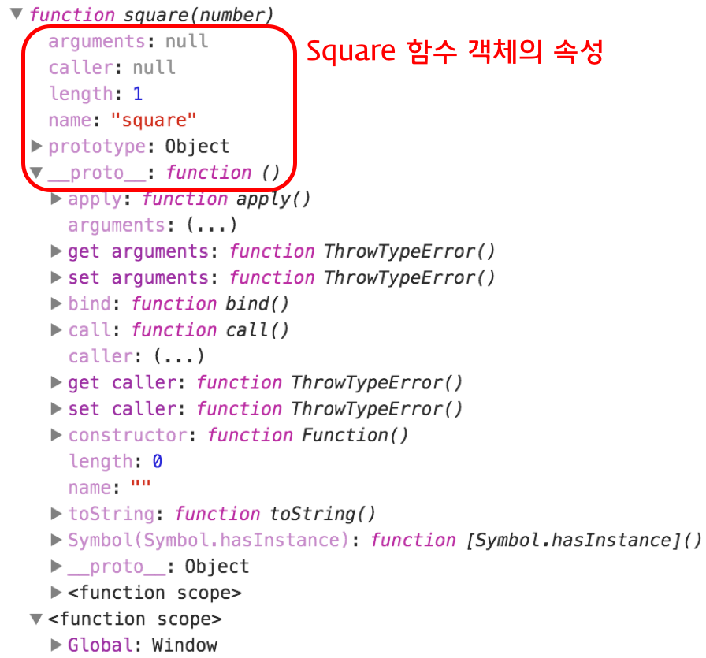

#### Function

------

> 함수란 어떤 작업을 수행하기 위해 필요한 문의 집합을 정의한 코드 블록이다. 함수는 이름과 매개변수를 갖으며 필요한 때에 호출하여 코드 블록에 담긴 문들을 일괄적으로 실행할 수 있다.
>
> 함수의 호출 횟수는 제한이 없으므로, 동일한 작업을 반복적으로 수행하고자 할 때에 함수를 정의하고 호출하는 것이 효율적이다.
>
> 함수의 선언과 호출의 예시는 다음과 같다.

```js
// 함수의 정의(함수 선언문)
function square(number) {
  return number * number;
}

// 함수의 호출
square(2); // 4
```

> 이렇듯 함수의 정의와 호출은 코드의 재사용성이라는 측면에서 매우 유용하다. 함수의 일반적인 기능과 목적 또한 코드의 재사용성을 증가시키는 것에 있다. 함수의 기능은 이외에도 객체 생성, 객체의 행위 정의, 정보 은닉, 클로저, 모듈화 등의 기능이 있다.
>
> 자바스크립트의 함수는 일급 객체이다. 다른 객체와 구분될 수 있는 특징은 호출할 수 있다는 점이다. 함수도 객체이므로 다른 값들처럼 사용할 수 있다. 즉, 변수나 객체, 배열 등에 저장할 수 있고 다른 함수에 전달되는 인수로도 사용할 수 있으며 함수의 반환값이 될 수도 있다.


##### ※ 일급 객체의 특징

* 무명의 리터럴로 표현이 가능하다.
* 변수나 자료 구조(객체, 배열 등)에 저장할 수 있다.
* 함수의 파라미터로 전달할 수 있다.
* 반환값으로 사용할 수 있다.


##### 함수의 정의

> 함수를 정의하는 방식은 3가지가 있다.

* 함수 선언문
* 함수 표현식
* Function


> ##### 함수 선언문
>
> function 키워드와 함수명을 사용하여 정의하는 방식이다. 예시는 다음과 같다.

```js
// 함수 선언문
function square(number) {
  return number * number;
}
```

> 함수 선언문은 함수명, 매개변수 목록, 함수 몸체로 구분된다. 함수명은 해당 함수를 구분할 수 있는 식별자이다. 매개변수 목록은 괄호 안에 콤마로 각각 구분되어 전달된다. 다른 언어와의 차이점은 매개변수의 타입을 기술하지 않다는 것이다. 따라서 함수 몸체 내에서 매개변수의 타입 체크가 필요할 수도 있다. 함수 몸체는 함수가 호출되었을 때 실행되는 문들의 집합이다. 중괄호{}로 문들을 감싸고 return 문으로 결과값을 반환할 수 있다. 


> ##### 함수 표현식
>
> 앞서 함수는 일급 객체임을 설명하였다. 일급 객체이므로 함수를 리터럴 방식으로 정의하고 변수에 할당할 수 있는데 이를 함수 표현식이라 한다.
>
> 예시는 다음과 같다.

```js
// 함수 표현식
var square = function(number) {
  return number * number;
};
```

> 함수 표현식으로 정의할 경우 function 키워드 뒤의 함수명을 생략할 수 있다. 대신 할당된 변수가 식별자의 역할을 한다. 이러한 함수를 익명함수라 한다. 함수 표현식에서는 함수명을 생략하는 것이 일반적이다.
>
> 함수 또한 객체이므로 함수가 할당된 변수에는 함수를 가리키는 참조값을 저장한다. 따라서 다음과 같이 여러 식별자가 동일한 함수를 참조하도록 할 수 있다.

```js
var foo = function(a, b) {
  return a * b;
};

var bar = foo;

console.log(foo(10, 10)); // 100
console.log(bar(10, 10)); // 100
```

> 그렇다면 함수 표현식으로 정의한 함수를 함수명과 할당된 변수명을 통해 호출할 수 있을까? 다음의 예시를 보자.

```js
// 기명 함수 표현식(named function expression)
var foo = function multiply(a, b) {
  return a * b;
};

console.log(foo(10, 5)); // 50
console.log(multiply(10, 5)); // Uncaught ReferenceError: multiply is not defined
```

> 예시를 통해 알 수 있듯, 함수 표현식으로 정의한 함수는 반드시 할당한 변수명을 통해 호출해야 한다. 함수명으로 호출할 경우 에러가 발생한다. 이는 함수 표현식에서 사용한 함수명은 외부코드에서 접근이 불가능하기 때문이다.
>
> 그렇다면 함수 선언문에서 함수명을 통해 함수를 호출할 수 있었던 이유는 무엇일까? 사실 함수 선언문을 통해 정의한 함수는 자바스크립트 엔진에 의해 함수 표현식으로 형태가 변경된다. 

```js
function square(number) {
  return number * number;
};

// 위의 함수 선언문은 아래의 함수 표현식으로 변환된다.

var square = function square(number) {
  return number * number;
};
```

> 즉, 함수 선언문으로 정의한 함수는 함수명으로 호출되는 듯 보이지만 사실은 동일한 이름의 변수를 통해 호출된 것이다. 따라서 함수 선언문도 함수 표현식과 동일하게 함수 리터럴 방식으로 정의된다.


> ##### Function 생성자 함수
>
> 함수 표현식과 함수 선언문을 정의할 때 사용되는 함수 리터럴 방식은 내장 함수 Function 생성자 함수로 함수를 생성하는 것을 단순화시킨 short-hand-expression이다.
>
> Function 생성자 함수는 Function.prototype.constructor 프로퍼티로 접근할 수 있다.
>
> Function 생성자 함수로 함수를 생성하는 문법은 다음과 같다.

```js
new Function(arg1, arg2, ... argN, functionBody)
```

> 사용 예시는 다음과 같다.

```js
var square = new Function('number', 'return number * number');
console.log(square(10)); // 100
```

> 그러나 Function 생성자 함수로 함수를 생성하는 방식은 일반적으로 사용하지 않는다.


##### 함수 호이스팅

> 세 가지 함수 정의 방식은 모두 Function 생성자 함수를 통해 함수를 생성하는 방식으로 작동하는 것을 확인할 수 있었다. 그렇다면 세 가지 방식은 정의 방식만 다를 뿐 내부의 동작은 동일한 것일까? 사실은 세 가지 함수의 정의 방식은 동작에도 약간의 차이가 있다. 그 차이를 확인할 수 있는 것이 호이스팅이다.
>
> 차이를 확인하기 위해 함수 선언문의 호이스팅 예시를 보자.

```js
var res = square(5); // 25

function square(number) {
  return number * number;
}
```

> 위의 예시에서는 함수 선언문으로 함수가 정의되기 전에 함수 호출이 가능하다. 이를 함수 호이스팅이라 한다. 함수 호이스팅에 의해 함수 선언문으로 정의된 함수는 함수 선언의 위치와 상관 없이 코드 내 어느 위치에서도 함수 호출이 가능하다.
>
> 함수 선언문으로 정의된 함수는 자바스크립트 엔진이 스크립트가 로딩되는 시점에 바로 함수를 초기화하고 이를 VO(Variable Object)에 저장한다. 따라서 함수의 선언, 초기화, 할당이 한번에 이루어진다. 그렇기 대문에 함수 선언의 위치와는 상관 없이 소스내 어는 곳에서든 호출이 가능하다.
>
> 그렇다면 함수 표현식의 경우는 어떨까? 다음의 예시를 보자.

```js
var res = square(5); // TypeError: square is not a function

var square = function(number) {
  return number * number;
}
```

> 함수 선언문과 달리 이번에는 호출이 되지 않고 에러가 발생한다. 함수 표현식에서는 변수 호이스팅이 발생하기 때문이다. 변수 호이스팅은 변수의 선언, 초기화, 할당이 분리되어 진행된다. 먼저 undefined로 초기화가 이루어진 후, 값의 할당은 할당문에서 이루어진다.
>
> 따라서 함수 선언문과 다르게 함수 표현식에서는 스크립트 로딩 시점에 변수 객체(VO)에 함수를 할당하지 않는다. runtime에 해석되고 실행되므로 다르게 동작한다.
>
> 이런 차이로 인해 자바스크립트의 권위자인 더글러스 크락포드는 함수 표현식만 사용할 것을 권고하고 있다. 그는 함수 호이스팅이 함수 호출 전 반드시 함수를 선언하여야 한다는 규칙을 무시하므로 코드의 구조를 엉성하게 만들 수 있다고 지적한다. 이외에도 함수 선언문으로 함수를 정의하면 사용하기 쉽지만 인터프리터가 많은 코드를 변수 객체에 저장하므로 애플리케이션의 응답속도가 떨어질 수 있다는 문제가 있다.


##### 함수와 일급 객체

> 함수는 일급 객체에 속하므로 다음과 같이 활용할 수 있다.

```js
// 1. 무명의 리터럴로 표현이 가능하다.
// 2. 변수나 자료 구조에 저장할 수 있다.
var increase = function (num) {
  return ++num;
};

var decrease = function (num) {
  return --num;
};

var predicates = { increase, decrease };


// 3. 함수의 매개변수에 전달할 수 있다.
// 4. 반환값으로 사용할 수 있다.
function makeCounter(predicate) {
  var num = 0;

  return function () {
    num = predicate(num);
    return num;
  };
}

var increaser = makeCounter(predicates.increase);
console.log(increaser()); // 1
console.log(increaser()); // 2

var decreaser = makeCounter(predicates.decrease);
console.log(decreaser()); // -1
console.log(decreaser()); // -2
```


##### 매개변수와 인수

> 매개변수는 함수 내에서 변수와 동일하게 메모리 공간을 확보하며 동작한다. 함수에 전달한 인수는 매개변수에 할당된다. 만약 인수를 전달하지 않으면 매개변수는 undefined로 초기화된다.

```js
var foo = function (p1, p2) {
  console.log(p1, p2);
};

foo(1); // 1 undefined
```


##### Call By Value / Call By Reference

> 원시 타입인 변수와 객체 타입인 변수가 다르게 동작하였듯이, 원시 타입인 인수와 객체 타입인 인수도 다르게 동작한다. 
>
> 원시 타입 인수는 값에 의한 호출로 동작한다. 함수 호출 시에 원시 타입 인수를 함수에 매개변수로 전달할 때 매개변수에 값을 복사하여 함수로 전달한다. 따라서 함수 내에서 매개변수를 통해 값이 변경되어도 원본 값은 변경되지 않는다.

```js
// Call By Value

function foo(primitive) {
  primitive += 1;
  return primitive;
}

var x = 0;

console.log(foo(x)); // 1
console.log(x);      // 0
```

> 그러나 객체 타입의 인수는 참조에 의한 호출로 동작한다. 함수 호출 시에 참조 타입 인수를 함수에 매개변수로 전달할 때에는 매개변수에 참조값이 저장되어 함수로 전달된다. 따라서 함수 내에서 매개변수의 참조값을 이용하여 객체를 변경하는 것이 가능하다.

```js
function changeVal(primitive, obj) {
  primitive += 100;
  obj.name = 'Kim';
  obj.gender = 'female';
}

var num = 100;
var obj = {
  name: 'Lee',
  gender: 'male'
};

console.log(num); // 100
console.log(obj); // Object {name: 'Lee', gender: 'male'}

changeVal(num, obj);

console.log(num); // 100
console.log(obj); // Object {name: 'Kim', gender: 'female'}
```


##### Pure Function / Impure Function

> 원시 타입 인수의 경우 값을 복사하여 매개변수에 전달하므로 함수 몸체에서 그 값을 변경하여도 어떠한 부수효과도 발생시키지 않는다. 그러나 객체 타입 인수는 참조값을 매개변수에 전달하므로 함수 몸체에서 그 값을 변경할 경우 원본 객체가 변경되는 부수효과가 발생한다.
>
> 부수효과를 발생시키지 않는 함수를 순수 함수, 발생시키는 함수를 비순수 함수라 한다. 비순수 함수는 복잡성을 증가시키며, 비순수 함수를 최대한 줄임으로써 부수 효과를 줄이는 것이 디버깅 작업을 쉽게 만든다.


##### return

```js
function calculateArea(width, height) {
  var area = width * height;
  return area; // 단일 값의 반환
}
console.log(calculateArea(3, 5)); // 15
console.log(calculateArea(8, 5)); // 40

function getSize(width, height, depth) {
  var area = width * height;
  var volume = width * height * depth;
  return [area, volume]; // 복수 값의 반환
}

console.log('area is ' + getSize(3, 2, 3)[0]);   // area is 6
console.log('volume is ' + getSize(3, 2, 3)[1]); // volume is 18
```

> 함수는 자신을 호출한 코드에게 수행한 결과를 반환할 수 있다. 반환하고자 할 때 `return`을 사용한다. return에 대한 특징은 다음과 같다.

* return 키워드는 함수를 호출한 코드에게 값을 반환할 때 사용한다.
* 함수는 배열이나 객체를 활용하여 한 번에 여러 값을 반환할 수 있다.
* 함수는 반환을 생략할 수 있으며, 이 때에는 암묵적으로 undefined를 반환한다.
* 자바스크립트 해석기는 return 키워드를 만나면 함수의 실행을 중단한 후, 함수를 호출한 코드로 되돌아간다. 만일 return 키워드 이후에 다른 구문이 존재하면 그 구문은 실행되지 않는다.


##### 함수 프로퍼티

> 함수도 객체에 속하므로 프로퍼티를 가질 수 있다.

```js
function square(number) {
  return number * number;
}

square.x = 10;
square.y = 20;

console.log(square.x, square.y);
```

> 함수는 일반 객체와는 다른 함수만의 프로퍼티를 갖는다. 다음을 브라우저 콘솔에 입력하여 확인할 수 있다.

```js
console.dir(square);
```

> 위 입력에 대한 결과는 다음과 같다.




##### arguments 프로퍼티

> arguments 객체는 함수 호출 시 전달된 인수(argument)들의 정보를 담고 있는 순회가능한(iterable) 유사 배열 객체(array-like object)이며 함수 내부에서 지역변수처럼 사용된다. 즉, 함수 외부에서는 사용할 수 없다.
>
> arguments의 사용 예시는 다음과 같다.

```js
function multiply(x, y) {
  console.log(arguments);
  return x * y;
}

multiply();        // {}
multiply(1);       // { '0': 1 }
multiply(1, 2);    // { '0': 1, '1': 2 }
multiply(1, 2, 3); // { '0': 1, '1': 2, '2': 3 }
```

> 위 입력에 대한 결과는 다음과 같다. 


> 위의 예시에서 multiply 함수는 인자를 두 개 까지 받는 것으로 정의되었다. 그러나 인자가 없거나, 하나의 인자를 전달하거나 세 개의 인자를 전달하여도 함수 호출 시에러가 발생하지 않는 것을 확인할 수 있다. 게다가 arguments 객체에서도 인자가 출력되는 것을 확인할 수 있다.
>
> 자바스크립트에서 매개변수는 인수로 초기화된다. 매개변수의 갯수보다 인수를 적게 전달했을 때 인수가 전달되지 않은 매개변수는 undefined로 초기화된다. 만약 매개변수의 갯수보다 인수를 더 많이 전달한 경우, 초과된 인수는 무시된다.
>
> 이러한 자바스크립트의 특성 때문에 런타임 시에 호출된 함수의 인자 갯수를 확인하고 이에 따라 동작을 달리 정의할 필요가 있을 수 있다. 이때 유용하게 사용되는 것이 arguments 객체이다. arguments 객체를 활용하여 매개변수가의 갯수가 확정되지 않은 가변 인자 함수를 구현할 때 유용하게 사용된다.
>
> 다음은 arguments 객체를 활용하여 가변 인자의 합을 반환하는 함수를 구현한 예시이다.

```js
function sum() {
  var res = 0;

  for (var i = 0; i < arguments.length; i++) {
    res += arguments[i];
  }

  return res;
}

console.log(sum());        // 0
console.log(sum(1, 2));    // 3
console.log(sum(1, 2, 3)); // 6
```

> 자바스크립트는 함수를 호출할 때 인수들과 함께 암묵적으로 arguments 객체가 함수 내부로 전달된다. arguments 객체는 배열의 형태로 인자값 정보를 담고 있지만 실제 배열이 아닌 유사배열객체(array-like object)이다.
>
> 유사배열 객체란 배열처럼 length 프로퍼티를 가진 객체를 말한다. 그러나 유사배열객체는 배열이 아니므로 배열 메소드를 사용하는 경우 에러가 발생한다. 따라서 배열 메소드를 사용하기 위해서는 Function.prototype.call, Function.prototype.apply를 사용하여야 하는 번거로움이 있다.
>
> 다만 ES6에서는 `...`연산자를 활용하여 쉽게 구현할 수 있다. 예시는 다음과 같다.

```js
function sum() {
  if (!arguments.length) return 0;

  // arguments 객체를 배열로 변환
  var array = Array.prototype.slice.call(arguments);
  return array.reduce(function (pre, cur) {
    return pre + cur;
  });
}

// ES6
function sum(...args) {
   if (!args.length) return 0;
   return args.reduce((pre, cur) => pre + cur);
}

console.log(sum(1, 2, 3, 4, 5)); // 15
```


##### caller 프로퍼티

> caller 프로퍼티는 자신을 호출한 함수를 의미한다.

```js
function foo(func) {
  var res = func();
  return res;
}

function bar() {
  return 'caller : ' + bar.caller;
}

console.log(foo(bar)); // function foo(func) {...}
console.log(bar());    // null (browser에서의 실행 결과)
```

> 실행 결과는 다음과 같다.


##### length 프로퍼티

> length 프로퍼티는 함수 정의 시 작성된 매개변수 갯수를 의미한다. arguments.length의 값과는 다를 수 있으므로 주의하여야 한다. arguments.length의 값은 함수 호출 시 인자의 갯수이다.

```js
function foo() {}
console.log(foo.length); // 0

function bar(x) {
  return x;
}
console.log(bar.length); // 1

function baz(x, y) {
  return x * y;
}
console.log(baz.length); // 2
```


##### name 프로퍼티

> 함수명을 나타낸다. 기명함수의 경우 함수명을 값으로 갖고 익명함수의 경우 빈 문자열을 값으로 갖는다.

```js
// 기명 함수 표현식(named function expression)
var namedFunc = function multiply(a, b) {
  return a * b;
};
// 익명 함수 표현식(anonymous function expression)
var anonymousFunc = function(a, b) {
  return a * b;
};

console.log(namedFunc.name);     // multiply
console.log(anonymousFunc.name); // ''
```


##### `__proto__` 접근자 프로퍼티

> 모든 객체는 Prototype이라는 내부 슬롯이 있다. Prototype 내부 슬롯은 프로토타입 객체를 가리킨다. 프로토타입 객체란 프로토타입 기반 객체지향 프로그래밍의 근간을 이루는 객체로서 객체간의 상속을 구현하기 위해 사용된다. 즉, 프로토타입 객체는 다른 객체에 공유 프로퍼티를 제공하는 객체를 말한다.
>
> `__proto__` 프로퍼티는 Prototype 내부 슬롯이 가리키는 프로토타입 객체에 접근하기 위해 사용하는 접근자 프로퍼티이다. 내부 슬롯에는 직접 접근할 수 없고 간접적인 접근 방법을 제공하는 경우에 한하여 접근할 수 있다. Prototype 내부 슬롯에도 직접 접근할 수 없으며 `__proto__ `접근자를 통해 간접적으로 프로토타입 객체에 접근할 수 있다.

```js
// __proto__ 접근자 프로퍼티를 통해 자신의 프로토타입 객체에 접근할 수 있다.
console.log({}.__proto__ === Object.prototype); // true
```

> 위 예시에서도 확인할 수 있듯, 객체 리터럴로 셍성한 객체의 프로토타입 객체는 Object.prototype이다. `__proto__` 프로퍼티는 객체가 직접 소유하는 프로퍼티가 아니라 모든 객체의 프로토타입 객체인 Object.prototype 객체의 프로퍼티이다. 모든 객체는 상속을 통해 `__proto__` 접근자 프로퍼티를 사용할 수 있다.

```js
// 객체는 __proto__ 프로퍼티를 소유하지 않는다.
console.log(Object.getOwnPropertyDescriptor({}, '__proto__'));
// undefined

// __proto__ 프로퍼티는 모든 객체의 프로토타입 객체인 Object.prototype의 접근자 프로퍼티이다.
console.log(Object.getOwnPropertyDescriptor(Object.prototype, '__proto__'));
// {get: ƒ, set: ƒ, enumerable: false, configurable: true}

// 모든 객체는 Object.prototype의 접근자 프로퍼티 __proto__를 상속받아 사용할 수 있다.
console.log({}.__proto__ === Object.prototype); // true
```

> 함수도 객체이므로 `__proto__` 접근자 프로퍼티를 통해 프로토타입 객체에 접근할 수 있다.

```js
// 함수 객체의 프로토타입 객체는 Function.prototype이다.
console.log((function() {}).__proto__ === Function.prototype); // true
```


##### prototype 프로퍼티

> prototype 프로퍼티는 함수 객체만이 소유하는 프로퍼티이다. 즉 일반 객체에는 prototype 프로퍼티가 없다. prototype 프로퍼티는 함수가 객체를 생성하는 생성자 함수로 사용될 때, 생성자 함수가 생성한 인스턴스의 프로토타입 객체를 가리킨다.

```js
// 함수 객체는 prototype 프로퍼티를 소유한다.
console.log(Object.getOwnPropertyDescriptor(function() {}, 'prototype'));
// {value: {…}, writable: true, enumerable: false, configurable: false}

// 일반 객체는 prototype 프로퍼티를 소유하지 않는다.
console.log(Object.getOwnPropertyDescriptor({}, 'prototype'));
// undefined
```


##### 즉시실행함수 (IIFE, Immediately Invoke Function Expression)

> 함수의 정의와 동시에 실행되는 함수를 즉시실행함수(IIFE)라고 한다. 최초 한번만 호출되며 다시 호출할 수는 없다. 이러한 특징을 이용하여 최초 한번만 실행이 필요한 초기화 처리 등에 사용할 수 있다.
>
> 예시는 다음과 같으며, 즉시실행함수는 소괄호로 감싸준다. 즉시실행함수에는 함수명이 있는 기명과 없는 익명의 형태가 있다.

```javascript
// 기명 즉시실행함수
(function myFunction() {
    var a = 3;
    var b = 5;
    return a*b;
}());

// 익명 즉시실행함수
(function() {
    var a = 3;
    var b = 5;
    return a*b;
}());
```

> ##### 즉시실행함수와 이름 충돌 방지
>
> 자바스크립트의 가장 큰 문제점 중의 하나는 파일이 분리되어 있다 하더라도 글로벌 스코프가 하나이며 글로벌 스코프에 선언된 변수나 함수는 코드 내의 어디서든지 접근이 가능하다는 것이다.
>
> 따라서 다른 스크립트 파일 내에서 동일한 이름으로 명명된 변수나 함수가 같은 스코프 내에 존재할 경우 원치 않는 결과를 가져올 수 있다.
>
> 이런 경우 즉시실행함수 내에 처리 로직을 모아두면 혹시 있을 수도 있는 변수명이나 함수명의 충돌을 방지할 수 있어 이를 위한 목적으로 즉시실행함수를 사용하기도 한다.
>
> 특히 jQuery와 같은 라이브러리의 경우, 코드를 즉시 실행함수 내에 정의해두면 라이브러리의 변수들이 독립된 영역 내에 있게 되므로 여러 라이브러리들은 동시에 사용되더라도 변수명 충돌과 같은 문제를 방지할 수 있다.
>
> 사용 예시는 다음과 같다.

```javascript
(function() {
    var foo = 1;
    console.log(foo);
}());

var foo = 100;
console.log(foo);

// 각각 1, 100이 출력된다.
```


##### 내부 함수 (Inner Function)

> 함수 내부에 정의된 함수를 내부 함수 또는 자식함수라고 한다.
>
> 내부 함수는 자신을 포함한 부모 함수의 변수에 접근하는 것이 가능하다. 그러나 부모함수는 내부함수의 변수에 접근할 수 없다.

```javascript
function parent(param) {
    var parentVar = param;
    function child() {
        var childVar = 'lee';
        console.log(parentVar + ' ' + childVar);
        // Hello lee 출력
    }
    child();
    console.log(parentVar + ' ' + childVar);
    // Uncaught ReferenceError: childVar is not defined
}
parent('Hello');
```

> 부모함수의 외부에서는 내부함수에 접근하는 것 조차 불가능하다.

```javascript
function sayHello(name) {
    var text = 'Hello' + name;
    var logHello = function(){ console.log(text); }
    logHello();
}

sayHello('lee'); // Hellolee 출력
logHello('lee'); // logHello is not defined
```


##### 재귀 함수 (Recursive Function)

> 재귀 함수는 자기 자신을 호출하는 함수를 말한다. 대표적인 예로 피보나치 혹은 팩토리얼 함수 등이 있다.
>
> 팩토리얼 함수의 예시를 보자.

```javascript
// 팩토리얼 : 1부터 자신까지의 모든 양의 정수의 곱이다.
// n! = 1 * 2 * ... * (n-1) * n

function factorial(n) {
    if (n < 2) return 1;
    return factorial(n-1) * n;
}
```

> 재귀 함수를 정의할 때 유의할 점은 자신을 무한히 연쇄 호출하므로 호출을 멈출 수 있는 탈출 조건을 반드시 만들어야 한다는 점이다. 탈출 조건이 없는 경우, 함수가 무한 호출되어 stackoverflow 에러가 발생한다. 
>
> 무한 반복 또는 무한 호출이 단점이라면, 재귀 호출은 반복 연산을 직관적이고 쉽게 구현할 수 있다는 장점이 있다. 그런데 대부분의 재귀 함수는 for나 while을 사용한 반복문의 형태로 구현이 가능하다. 재귀 호출을 사용한 구현이 더 직관적이며 이해하기 쉽지만 성능 면에서는 반복문의 형태로 구현하는 것이 좋다.


##### 콜백 함수 (Callback Function)

> 콜백 함수란 함수를 명시적으로 호출하는 방식이 아니라 특정 이벤트가 발생했을 때 시스템에 의해 호출되는 함수를 말한다.
>
> 콜백 함수가 자주 사용되는 대표적인 예는 이벤트 핸들러 처리이다.

```html
<body>
    <button id="myButton">
         Click Me
    </button>
    <script>
        var button = document.getElementById('myButton')
        button.addEventListener('click', function() {
            console.log('button clicked!')
        })
    </script>
</body>
```

> 자바스크립트의 함수는 일급 객체이다. 따라서 자바스크립트의 함수는 흡사 변수와 같이 사용될 수 있다. 콜백함수는 매개변수를 통해 전달되고 전달받은 함수 내부의 어느 특정시점에서 실행된다.
>
> 대표적으로 콜백 함수의 예시에 사용되는 setTimeout을 사용한 예를 살펴보면 다음과 같다.

```javascript
function myFunc(text) {
    console.log(text);
}

function doSomething(func, params) {
    setTimeout(function() {
        func(params);
    }, 3000);
}

doSomething(myFunc, 'Lee');
// 3초 뒤에 Lee가 출력된다.
```

